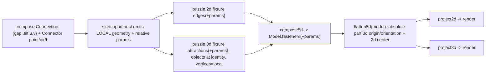

# Flatten Params Across Puzzles

## Goal

1. Attractions (puzzle 3d), fasteners (puzzle 5d), and edges (puzzle 2d) carry the same params as compose `Connection`: `gap, shift, rise, rotation, turn, tilt` (+ `u, v` for the 2d diagram, which the rs flatten also uses).
2. The flatten algorithm is reimplemented **independently but identically** in puzzle 2d, puzzle 3d, and puzzle 5d (the UI), matching the existing reference in [compose/client/lib/rs/lib.rs](compose/client/lib/rs/lib.rs) L1167-1548. No cross-technology imports (per repo rules).
3. The compose host stops feeding rs-precomputed `flatPosition` into the scene/diagram fixtures; instead it emits **type-local grip geometry + relative params**, and the puzzle 5d `flatten` computes absolute placement.

## Reference math (the contract every copy must reproduce)

From [compute_child_plane](compose/client/lib/rs/lib.rs) L1328-1380 and [flatten_design_positions](compose/client/lib/rs/lib.rs) L1413-1547:

- 3d plane: `gap` along parent-port +Y, `shift` along +X, `rise` along +Z (axes from `quaternionFromUnitVectors(Y, parentDir)`); `rotation` about `parentDir` (negated), then `turn` about transformed +Z, then `tilt` about transformed +X; child centered by `-childPoint`, aligned `reverse(childDir) -> parentDir`, translated by `+parentPoint`, composed onto `parentPlane` matrix. Degrees -> radians; `TOLERANCE 0.01`.
- 2d center (diagram): constants `DIAGRAM_RADIUS 2.697`, `DIAGRAM_VERTICAL_V_EXTRA 1.0`, `DIAGRAM_HORIZONTAL_SCALE 3.0633`. If parent center is origin: `angle = 2*pi*parent_t; (R*sin, R*cos)`. Else if `|parentDir.z| > 0.5`: vertical `(u+cu, v+cv+extra)`. Else: horizontal `(u + cu*scale, v + cv*scale)`. `parent_t` = port `t` param.
- Traversal: build undirected adjacency from connections; BFS per connected component; root plane = identity (stored plane only if "fixed"), root center = stored center or 0.

## Data flow after change

## Workstreams

### A. Data model: add params (`gap, shift, rise, rotation, turn, tilt, u, v`)

- Puzzle 2d edge [Puzzle2dFixtureEdge](puzzle/2d/react/index.tsx) L918-928: add the 8 optional numeric fields; read them in the edge parser; include in any edge appearance fingerprint.
- Puzzle 3d [AttractionProps](puzzle/3d/react/index.tsx) L378-383: add the 8 fields; read in [parseFixture](puzzle/3d/react/index.tsx) L1744-1756; add to `fixtureAppearanceFingerprint` attraction key (L2523-2527).
- Puzzle 5d [Fastener](puzzle/5d/react/index.tsx) L206-211: add the 8 fields; pass them through in [compose5d](puzzle/5d/react/index.tsx) edge->fastener (L586-595) and attraction->fastener (L596-605), and in [project2d](puzzle/5d/react/index.tsx) L679-684 and [project3d](puzzle/5d/react/index.tsx) L722-727; validate in `parseModel`.
- Grip geometry for flatten: 3d already has `position` + `direction` ([Grip3dAspect](puzzle/5d/react/index.tsx) L158-164 / puzzle3d vortex). Add an optional `t` param to the 2d grip/handle aspect (mapping the rs port `t`); derive from existing `angle` when absent (`t = angle/360`).

### B. Flatten algorithm (independent copies, matching the reference)

Each lives in that technology's `react/index.tsx` as a pure exported function with its own private matrix/quaternion helpers (no shared import):

- Puzzle 3d `flatten3d(fixture): Fixture` in [puzzle/3d/react/index.tsx](puzzle/3d/react/index.tsx): BFS over attractions; resolve endpoints via `parseVortexFullId`; use vortex `position`/`direction` as port point/dir; compute each object `origin` + `orientation` (quat from plane axes) from `compute_child_plane`; root anchored to its existing pose (or identity).
- Puzzle 2d `flatten2d(fixture): Puzzle2dFixture` in [puzzle/2d/react/index.tsx](puzzle/2d/react/index.tsx): BFS over edges; compute node `x,y` via the diagram-center math using edge `u,v` and handle-angle-derived `t` (2d-only variant; no z, so radial/grid branch).
- Puzzle 5d `flatten5d(model): Model` in [puzzle/5d/react/index.tsx](puzzle/5d/react/index.tsx): full version - computes part `3d.origin/orientation` (from 3d grips) AND `2d.x/y` center (uses 3d grip `direction.z` for the vertical/horizontal branch, exactly like rs). Returns a new `Model` with updated part aspects; pure, idempotent on already-relative input.
- compose rs [lib.rs](compose/client/lib/rs/lib.rs) L1167-1548 stays as the canonical reference; align constants/edge-cases if any drift is found while porting.

### C. Compose host rewire (decouple from rs flatPosition)

In [compose/client/lib/sketchpad/js/index.ts](compose/client/lib/sketchpad/js/index.ts):

- `sketchpadDesignVolumeFixtureFromDesign` (L13017-13051): emit objects at **identity** origin/orientation and populate `vortices` with **type-local** connector `position`/`direction` (from the type's connectors), instead of `sketchpadPieceSceneOrigin/Orientation` (L12838-12886, which read `flatPosition`). Put the 8 params on each attraction (read from the connection DTO already fetched in `SKETCHPAD_KIT_READ_INNER`).
- `sketchpadDesignPuzzle2dFixtureFromDesign` (L12977-13014): put the 8 params on each edge; stop using `sketchpadPieceDiagramUv` from `flatPosition`.
- Ensure `SKETCHPAD_KIT_READ_INNER` also fetches type connector local `point/direction/t` so the host can emit local vortices (verify the connector-geometry fields added in the prior ticket are selected).
- Apply `flatten5d` in the FiveD render path ([framework/product/platform/renderer/react/index.tsx](framework/product/platform/renderer/react/index.tsx)) so the model is flattened before `project2d`/`project3d`. Remove `sketchpadPiece*Scene*`/`DiagramUv` flatPosition consumers once flatten owns placement.

### D. Fixtures

- Puzzle standalone fixtures (`puzzle/3d/fixture/nakagin-capsule-tower.3d.json`, `puzzle/5d/fixture/nakagin-capsule-tower.5d.json`) are projections of the compose kit; regenerate them via [compose/fixture/script.ts](compose/fixture/script.ts) so attractions/fasteners carry the params and objects/parts use local grip geometry. No hand-migration; regenerate from the compose source of truth.

### E. Tests & validation

- Extend the in-file test suites (no new files) in each `react/index.tsx` (puzzle 2d/3d/5d) with a small connected fixture asserting flatten output matches the rs reference values.
- Extend the existing rs flatten test (`flatten_design_resolves_linked_piece_absolute_pose`) if constants change.
- Run the Nakagin design e2e at the design URL with `[DEBUG]` logs to confirm 180 pieces / 179 connections render correctly from flatten (not flatPosition).

## Notes / decisions

- Work under a repo MCP ticket (read `repo://goals`, reopen the relevant sketchpad/flatten ticket or open a new one) before editing.
- `u,v` are added alongside the 6 transform params because the rs flatten requires them for the 2d diagram; the headline remains the 6 transform params.
- Independent per-technology copies (with duplicated helpers) are intentional and match the existing Go/Python/rs duplication and the repo's no-cross-technology rule.
