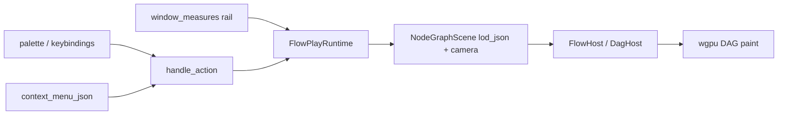

# Complete Flow Actions and Window Options

## Problem

Flow’s play app ([flow/plugin/rs/lib.rs](flow/plugin/rs/lib.rs)) is missing the chrome other board apps already expose:

| Surface                | Flow today                                                                                             | Reference                                                          |
| ---------------------- | ------------------------------------------------------------------------------------------------------ | ------------------------------------------------------------------ |
| Actions rail / palette | Internal handlers only (`reorganize`, `deleteSelection`, …); no **Select All** / **Zoom to Selection** | Puzzle2d `selectAll`, `focusSelection`                             |
| Context menu           | Delete only                                                                                            | Puzzle2d empty → Select all; selection → Zoom to selection, Delete |
| Window options rail    | Empty (`DocumentApp::window_measures` default)                                                         | Note / Puzzle3d measure groups                                     |
| LOD + proximity        | Buried in inspector when nothing is selected; proximity default `0.0` disables connect                 | Should live on the window options rail; proximity default enabled  |
| Grid                   | Not in DAG/flow engine at all                                                                          | Normal board port has LOD-tiered grid draw + snap                  |

Proximity is already implemented end-to-end in `DagHost` / `lod_json.proximityDistance` (see [flow/core/rs/lib.rs](flow/core/rs/lib.rs) `flow_backed_node_graph_extras` and wgpu `sync_flow_host`). It is only mis-surfaced.

## Approach

Mirror Puzzle2d/Note patterns entirely inside existing files (regions), with grid support added at the DAG engine root so the option is real, not a dead control.

### 1. Window options rail

Implement `DocumentApp::window_measures` on `FlowPlayApp`, keyed by window **instance** id (same helper pattern as [puzzle/plugin/rs/lib.rs](puzzle/plugin/rs/lib.rs) `window_instance_ids`).

For `flow-main` only, emit untagged general measures:

- **LOD** — `WindowMeasure::Select` (`automatic` + `dag_lod_scale_json()` tiers) → `setLodMode`
- **Proximity** — `WindowMeasure::Slider` (0…240, step 4) → `setProximityDistance` (0 disables)
- **Grid** — group:
  - Visible toggle → `setGridVisible`
  - Snap toggle → `setGridSnapEnabled`
  - Factor/spacing slider → `setGridFactor`

Remove LOD/proximity from the empty-selection inspector (`canvas_settings_field_group`); inspector stays widget-only when something is selected, and a simple “no selection” placeholder otherwise.

Default `proximity_distance` to `48.0` (not `0.0`) so proximity connect works out of the box.

### 2. Palette actions and keybindings

Register user-facing view actions (in palette):

- `selectAll` — all widget ids; keybinding `mod+a`
- `focusSelection` — frame camera on selection bounds (label “Zoom to Selection”); no-op when empty

Keep document ops in palette: `deleteSelection`, `reorganize`, `addWidget`, `evaluate`.

Mark every internal/config action `in_palette: false` via `action_with(ActionDefinition { in_palette: false, … })` (Puzzle2d’s `puzzle2d_internal_action` pattern): viewport, hover, measures onChange targets (`setLodMode`, `setProximityDistance`, `setGrid*`), generation internals, media graph plumbing, etc.

Handlers (runtime-only, no ops):

- `selectAll` / `clearSelection` — update `runtime.selected_node_ids`
- `focusSelection` — union bounds from selected DAG nodes (position + width/height from host fixture), center camera, zoom to fit with padding and existing flow zoom clamps

Extend context menu JSON:

- no selection → Select all
- selection → Zoom to selection, Delete selection

### 3. Grid in the DAG engine (root fix)

Grid exists only on the normal board ([infinite/board/port/directed/normal/rs/lib.rs](infinite/board/port/directed/normal/rs/lib.rs)). Port the same model into DAG:

In [infinite/board/port/directed/dag/rs/lib.rs](infinite/board/port/directed/dag/rs/lib.rs) / shared directed engine as needed:

- State: `grid_visible`, `grid_snap_enabled`, `grid_factor`
- Draw LOD-tiered world grids during canvas paint (reuse normal’s step constants / `stroke_world_step_grid` logic)
- Snap node drag positions when snap is enabled (finest visible LOD step)
- Host API: `set_grid_visible`, `set_grid_snap_enabled`, `set_grid_factor`

Thread through [flow/core/rs/lib.rs](flow/core/rs/lib.rs):

- `FlowHost` setters
- Extend `flow_backed_node_graph_extras` / `lod_json` with `gridVisible`, `gridSnapEnabled`, `gridFactor`
- WGPU `sync_flow_host` already applies proximity from `lod_json`; extend it to apply the new grid fields to `FlowHost`

Plugin runtime stores grid fields, applies them in `apply_lod_and_proximity` (rename to `apply_canvas_options`), and includes them in `window_measures`.

### 4. Tests (extend existing only)

- Flow plugin: `window_measures` non-empty for main window; measure onChange actions update runtime; `selectAll` / `focusSelection` move selection/camera; proximity default > 0; inspector no longer owns LOD/proximity
- DAG host: grid visible paints lines; snap moves nodes to step; `grid_factor` scales steps
- Existing proximity tests remain valid with new default

## Ticket / goal

- Goal: **Running Sketchpad** (MVP app chrome completeness)
- Open ticket: `FLOW-ACTIONS-AND-WINDOW-OPTIONS` on implement (not in plan-only phase)
- Temp logs/scripts only under the ticket folder

## Out of scope

- Puzzle-style hide/lock/duplicate/select-same-kind (flow widgets lack those flags)
- Procedural/other apps’ flows (only `flow` technology)
- Migrating normal-board grid to a shared crate (optional follow-up; DAG gets its own complete copy for now so flow works without a normal-board refactor)

