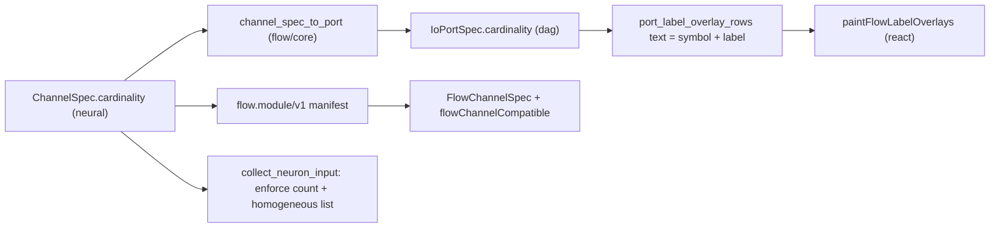

# Flow Channel Cardinality

Add a first-class `Cardinality` to every channel. It is the source of truth in `ChannelSpec` (neural engine), flows through `IoPortSpec` (dag) for rendering, is shown in front of every port label, and—for collection cardinalities (`*`, `+`, exact `n>1`)—the channel value is a homogeneous `list` dictionary, enforced at runtime evaluation and at connection time.

## Model (symbols)

- `!` ExactlyOne (default), `?` ZeroOrOne, `*` ZeroOrMore, `+` OneOrMore, `<n>` Exactly(n)
- Collection = `*`, `+`, and `Exactly(n)` with `n != 1`. These carry a `list` dictionary (`schema: "list"`, numeric keys) whose items all share one dictionary schema.
- Accepted-count predicate: `!`→`==1`, `?`→`<=1`, `*`→ any, `+`→`>=1`, `Exactly(n)`→`==n`.

## 1. Neural engine — source of truth

In [neural/engine/lib.rs](neural/engine/lib.rs), in a new `#region 🔖️Cardinality`:

- Add `enum Cardinality { ExactlyOne, ZeroOrOne, ZeroOrMore, OneOrMore, Exactly(usize) }` with `Serialize`/`Deserialize` as the compact symbol string (`"!"`,`"?"`,`"*"`,`"+"`, or the number as a string). Methods: `symbol() -> String`, `is_collection() -> bool`, `accepts(count: usize) -> bool`, `count_range() -> (usize, Option<usize>)`.
- Add `cardinality: Cardinality` to `ChannelSpec` (`#[serde(default)]` = `ExactlyOne`) and a `with_cardinality(...)` builder. Update `ChannelSpec::list(...)` (line ~516) to default to `ZeroOrMore`.
- Runtime enforcement in `collect_neuron_input` (line ~1151): after routing, for each declared input channel validate the routed value against its cardinality — collection channels must be a `list` dictionary, item count must satisfy `accepts`, and all item dictionaries must share one `schema()`. Validate operator outputs against output-channel cardinality in the dispatch/evaluate path.
- Add `EvalError` variants `CardinalityViolation(String)` and `HeterogeneousList(String)`.

## 2. DAG port — rendering carrier

In [mathematical/graph/port/directed/dag/lib.rs](mathematical/graph/port/directed/dag/lib.rs):

- Add `cardinality: String` to `IoPortSpec` (default `"!"`, serialized as `"cardinality"`); set in `IoPortSpec::named`.
- Add helper `label_with_cardinality(lod) -> String` returning `"{symbol} {label}"`.
- Use it for the rendered `"text"` in `port_label_overlay_rows` (line ~3329/3354, both input left-aligned and output right-aligned rows) and include the prefix width in `io_port_column_width` / `display_label_layout_width` (line ~1624) so layout stays correct. If the GPU label paint path also draws port text, prefix there too.

## 3. Flow bridge

In [flow/core/lib.rs](flow/core/lib.rs), `channel_spec_to_output_port` and `input_spec_to_port` (lines ~415-432) copy `spec.cardinality.symbol()` into `port.cardinality`. No change needed in `paintFlowLabelOverlays` since Rust supplies the prefixed `text`.

## 4. TypeScript layer

In [flow/react/index.tsx](flow/react/index.tsx):

- Add `readonly cardinality: string` to `FlowChannelSpec` (line ~90).
- Extend `flowChannelCompatible` (line ~100) so the output's `count_range` is contained in the input's accepted range (e.g. `!`→`+` ok, `*`→`!` rejected), in addition to the existing operator-capability check.

## 5. Module channels

Audit every operator declaration in `flow/module/*/lib.rs` (`core`, `math`, `text`, `logic`, `dictionary`, [list](flow/module/list/lib.rs), `brep`, `bim`) and set collection cardinalities where a channel carries a list (list module list channels → `*`); all others keep the `!` default.

## 6. Fixtures & manifests

- Manifest builder already serializes `ChannelSpec`, so `cardinality` propagates automatically.
- Hand-update any committed dag/flow fixtures that pin port JSON (e.g. `mathematical/graph/port/directed/dag/fixture/demo.dag.json`) to include `cardinality` per the greenfield "fix all assets at once" rule.

## 7. Tests (extend existing files only)

- neural engine tests: cardinality serde round-trip, `accepts`, runtime cardinality + homogeneity errors.
- dag lib tests: `label_with_cardinality` prefix.
- list module tests: heterogeneous list rejected.
- flow/react test region: `flowChannelCompatible` cardinality cases and prefixed overlay text.

## Workflow

Implementation begins by reading `repo://goals`, then opening a ticket (`ticket_open`) under the most appropriate flow goal; all temporary artifacts go inside the ticket folder; close with `ticket_close` listing touched files.

## Data flow

