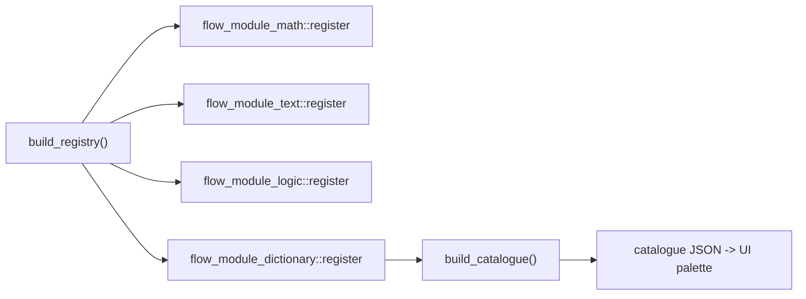

## Flow Dictionary Module

Extend `flow` with a dictionary module that follows the exact pattern of the existing modules in [flow/modules/math/lib.rs](flow/modules/math/lib.rs), [flow/modules/text/lib.rs](flow/modules/text/lib.rs), and [flow/modules/logic/lib.rs](flow/modules/logic/lib.rs).

### Operating model

Each neuron kind is a `Function` (dictionary in -> dictionary out). Following the existing convention, config and data are read from top-level keys of the merged input (`input.merge(&neuron.params)` in [neural/engine/lib.rs](neural/engine/lib.rs)). The module treats nested `Value::Dictionary` values as first-class:

- Convention: a dictionary value travels under key `dictionary`; a string key selector under `key`; a generic value under `value`; merge operands under `a`/`b`.
- Output dictionaries are placed under `dictionary` so kinds chain naturally; scalar results use `number`/`text` (matching other modules and the slider/note/preview widgets).

The `Dictionary` public API ([neural/engine/lib.rs](neural/engine/lib.rs): `new`, `insert`, `get`, `keys`, `len`, `merge`) is sufficient. `remove` is implemented by rebuilding via `keys()`/`get()` excluding the dropped key (no struct internals needed).

### New files (mirror existing module crate layout)

- `flow/modules/dictionary/Cargo.toml` — crate `flow_module_dictionary`, identical shape to [flow/modules/math/Cargo.toml](flow/modules/math/Cargo.toml) (only dep: `neural_engine`).
- `flow/modules/dictionary/lib.rs` — module doc comment, one `#region` per neuron kind, shared `read_dict`/`read_text`/`remove_key` helpers, a `register(&mut Registry)`, and a `#[cfg(test)]` `tests` region (extend within this single module file; no separate test files).

### Neuron kinds (in `register`)

- `dictionary.pack` — wrap entire input as `{ dictionary: <input> }` (flat -> nested bridge).
- `dictionary.unpack` — output the pairs of the nested dict at `dictionary` at top level (nested -> flat bridge).
- `dictionary.get` — output `{ value: <dict[key]> }` from dict at `dictionary` using string `key`.
- `dictionary.set` — output `{ dictionary: dict.insert(key, value) }`.
- `dictionary.remove` — output `{ dictionary: dict without key }`.
- `dictionary.has` — output `{ number: 1.0|0.0 }` whether `key` exists.
- `dictionary.keys` — output `{ text: keys joined by "," }`.
- `dictionary.size` — output `{ number: len }`.
- `dictionary.merge` — output `{ dictionary: a.merge(b) }` from nested dicts at `a` and `b`.

Each registered with a `NeuronKindInfo { id, module: "dictionary", name, summary, inputs, outputs }`, starting docstrings with a unique emoji per the repo rules.

### Wiring

- [Cargo.toml](Cargo.toml): add `"flow/modules/dictionary"` to `members` (after the logic entry).
- [flow/core/Cargo.toml](flow/core/Cargo.toml): add `flow_module_dictionary = { path = "../modules/dictionary" }`.
- [flow/core/lib.rs](flow/core/lib.rs):
  - add `pub use flow_module_dictionary;` (top re-export block).
  - in `build_registry()` add `flow_module_dictionary::register(&mut registry);`.
  - extend the `catalogue_has_module_sections` test to also assert `json.contains("dictionary")`.

The catalogue/palette is generated from the registry (`build_catalogue()` in [flow/core/lib.rs](flow/core/lib.rs)) and fetched dynamically by the UI ([flow/play/index.ts](flow/play/index.ts)), so the new "Dictionary" section appears with no TS changes.

### Repo ticket workflow

- Open/associate a repo MCP ticket (`ticket_open`, or `ticket_reopen` if one already covers this) after reading `repo://goals`; the MCP server was not ready during planning, so this is the first execution step. Put any temporary logs/scripts inside the ticket folder; close it with a summary and file list when done.

### Validation

- Run the workspace Rust tests for the new crate and `flow_core` (module unit tests + updated catalogue test) and confirm they pass before reporting done.

