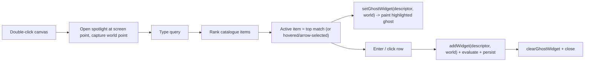

# Flow Double-Click Add Node

## Goal

Double-clicking empty flow canvas opens an inline search ("spotlight") at the cursor. Typing filters function suggestions; the active suggestion is previewed live on the canvas as a highlighted ghost node; Enter (or click) inserts it at the cursor; a chevron expands the full list and hovering any row previews that candidate.

## Behavior summary

## Where it lives

The overlay goes inside [flow/react/index.tsx](flow/react/index.tsx) `FlowCanvas`, so both Flow play and the Procedural editor (both render `FlowCanvas`) get it for free. The ghost preview is painted in Rust so it matches real node styling and uses the theme highlight color.

## 1. Rust: highlighted ghost preview (WASM)

### DAG host paint helper - [mathematical/graph/port/directed/dag/lib.rs](mathematical/graph/port/directed/dag/lib.rs)

Add a public `paint_ghost_node(&self, scene, node: &DagNodeSpec, viewport_w, viewport_h, dpr)` in the `DagHost` impl (near `paint_scene`). It paints the node rectangle with a translucent accent fill plus accent stroke and the node name, reusing existing helpers (`vello_color_with_alpha`, `paint_node_name`, `theme.wire_stroke_highlighted`). It ignores LOD gating so the preview is always visible.

### Flow host ghost state - [flow/core/lib.rs](flow/core/lib.rs)

- Add `ghost_node: Option<DagNodeSpec>` to `FlowHost` (init `None` in `from_fixture`).
- Factor a `widget_from_descriptor(descriptor, id)` helper out of the `add_widget` match (single source of truth), then reuse it in `add_widget`.
- `set_ghost_widget(&mut self, descriptor_json, world_x, world_y)`: parse `WidgetDescriptor`, build a `Widget` via the helper, build a `DagNodeSpec` via `widget_to_dag_node` with a one-entry layout at `(world_x, world_y)`, store it.
- `clear_ghost_widget(&mut self)`.
- In `paint_scene`, after `self.dag.paint_scene(...)`, if `ghost_node` is set call `self.dag.paint_ghost_node(...)`.

### WASM bindings - `FlowSession` in [flow/core/lib.rs](flow/core/lib.rs)

Add `#[wasm_bindgen(js_name = setGhostWidget)] set_ghost_widget(descriptor_json, world_x, world_y)` and `#[wasm_bindgen(js_name = clearGhostWidget)] clear_ghost_widget()`.

### Rebuild WASM

Run the `@semio-tech/flow-core` wasm build (`bun ./flow/core/script.ts wasm` via nx) so `flow/core/pkg` picks up the new bindings (the `dag` crate compiles into `flow_core`, so no separate dag pkg rebuild is needed for Flow). Verify the new methods appear in `flow/core/pkg/flow_core.d.ts`.

## 2. React: spotlight overlay - [flow/react/index.tsx](flow/react/index.tsx)

### Suggestion ranking (pure, testable)

Add `flowRankCatalogueSuggestions(sections, query): CatalogueItem[]` in the `Catalogue` region: flatten section items, fuzzy/substring match on `name` + `neuronKind`, rank exact/prefix/substring, neurons first. Empty query returns a sensible default ordering.

### FlowCanvas wiring

- Store sections in a `catalogueSectionsRef` updated inside `syncExtensionSurface` (already parses sections).
- Add `onDoubleClick` on the `<canvas>`: compute `screen` (via `clientToCanvas`) and `world` (via `session.worldFromScreen`), set spotlight state `{ screen, world }`.
- Render a new internal `FlowSpotlight` overlay (absolutely positioned in `containerRef` at `screen`) when open.

### FlowSpotlight component

- Autofocused text input; list of ranked suggestions.
- Collapsed by default showing the top suggestion plus a chevron button; expanded shows the full ranked list.
- `activeIndex` driven by ArrowUp/Down and row hover; default 0 (top).
- On query/active change call `session.setGhostWidget(descriptor, world.x, world.y)` then `renderFrame()` (descriptor via existing `flowCatalogueItemDescriptor`).
- Enter or row click commits via the existing `commitWidgetDrop({ descriptor, screen, world })` path, then `clearGhostWidget()` + `renderFrame()` + close.
- Escape / outside-click / blur clears the ghost and closes.

## 3. Tests (extend existing files only)

- [flow/core/lib.rs](flow/core/lib.rs) `#[cfg(test)]`: add a test that `set_ghost_widget` populates `ghost_node` with the right kind/position and `clear_ghost_widget` resets it, and that `paint_scene` runs with a ghost set (smoke).
- [flow/react/index.tsx](flow/react/index.tsx) `import.meta.vitest`: add tests for `flowRankCatalogueSuggestions` (top match for a query, neurons ranked first, empty-query default).

## 4. Repo ticket

Per repo rules, before editing: read `repo://goals`, then `ticket_open` a new ticket (e.g. "Flow Double-Click Add Node") since no open ticket covers this; keep any temp logs under the ticket folder; `ticket_close` with a summary and touched files when done.

## Decisions (no blocking questions)

- Double-click anywhere on the canvas opens the spotlight; the node is placed at the cursor world point (mirrors drag-drop). No auto-connect.
- Highlight color = theme `wire_stroke_highlighted` at reduced fill alpha.
- Top match is auto-active so Enter immediately adds it.
