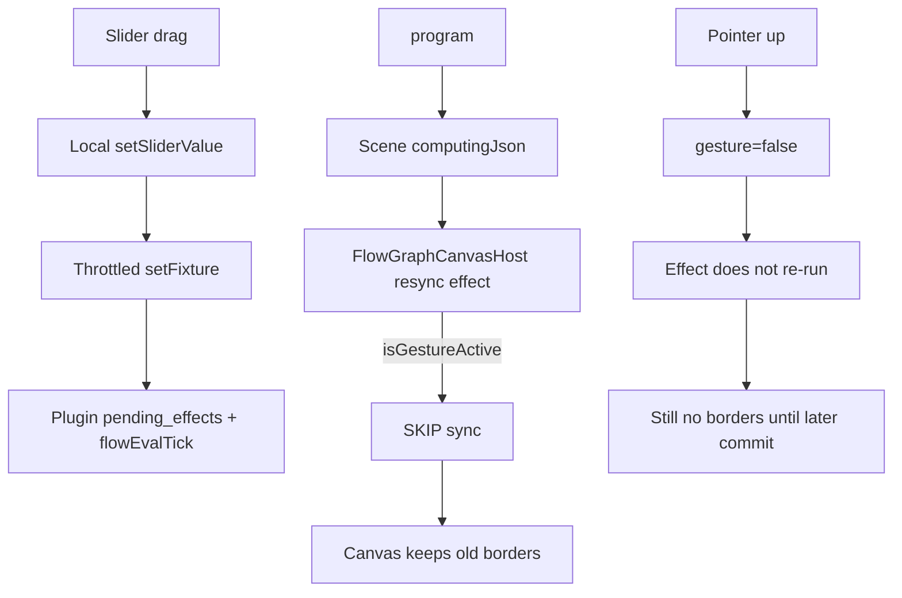

# Fix Flow Input Invalidation And Computing Borders

## Verdict

Invalidation and `computingJson` already exist in Rust (`compute_dirty_set` + `FlowEvalDriver`), and DAG painting already has active/stale arcs. The sphere-cut slider looks dead because the React canvas **never applies** that chrome while the gesture is active, and **does not re-apply** it when the gesture ends unless a new scene signature arrives.

## Root Causes

1. **Gesture suppresses all scene sync** in `[framework/renderer/react/index.tsx](framework/renderer/react/index.tsx)` (`isGestureActiveRef` early-return). That blocks `setComputingProgress` / `applyEvalOutputsJson`, not only fixture reload.
2. **Pointer-up never forces a catch-up sync** from `sceneRef`, so chrome that arrived mid-drag stays unapplied.
3. **Local input mutations never mark chrome** — `[FlowHost::set_slider_value](flow/core/rs/lib.rs)` only updates the value; optimistic invalidation chrome is missing.
4. **Ephemeral plugin hosts drop eval baseline** — `host_from_fixture` always builds a host with `previous_snapshot: None`, so dirty tracking relies on cache luck instead of a durable baseline on `FlowEvalDriver`.
5. **Budgeted `remaining` over-includes** topo-later nodes (`[evaluate_channels_budgeted](neural/engine/rs/lib.rs)` returns `order[index..]`), so stale chrome can light unrelated branches once baseline persistence is fixed.

Canonical repro: Procedural 3D example `sphere-cut-with-torus` (`slider_2` → sphere → cut → measure → preview).

## Chosen Approach

Make chrome authoritative from the plugin scene **and** instantly optimistic on the local canvas; keep fixture reload suppressed only while dragging.

### 1. Split scene sync in `FlowGraphCanvasHost`

In `[framework/renderer/react/index.tsx](framework/renderer/react/index.tsx)`:

- Split `syncFlowSessionFromScene` into:
  - **structure sync**: `operatorsJson`, `fixtureJson`, selection/hover/preview/catalogue/lod/camera
  - **eval sync**: `evalJson` then `computingJson` (order preserved — eval clears chrome)
- While gesture active: skip structure sync only; **always** apply eval/computing.
- On pointer-up: clear gesture flag, then immediately `syncFlowSessionFromScene(session, sceneRef.current, false)` before the final commit.
- Keep throttle for `setFixture`; remove temporary `[DEBUG]` logs once verified.

### 2. Immediate local invalidation chrome on input change

In `[flow/core/rs/lib.rs](flow/core/rs/lib.rs)`:

- Add `FlowHost::refresh_computing_chrome_from_pending()` that probes `pending_eval_widget_ids()` and calls `dag.set_computing_progress(active, stale)`.
- Call it from `set_slider_value`, `set_note_text`, and `set_image_src` after widget mutation.
- Preserve local eval baseline across scene fixture reloads used for display: stop wiping `previous_snapshot` / `previous_channels` on every `replace_fixture` when the reload is a scene resync carrying the same logical tree (prefer: only reset baseline on true document replace / explicit evaluate reset; scene resync path should restore baseline after applying `evalJson`).

Practical rule:

- `apply_eval_outputs_json` must also advance/rebuild `previous_snapshot` + `previous_channels` from the applied outputs so subsequent local probes dirty only dependents.
- `loadFixtureJson` used by the canvas remains camera-preserving; baseline is refreshed from applied eval, not cleared blindly.

### 3. Durable eval baseline on `FlowEvalDriver`

In `[flow/core/rs/lib.rs](flow/core/rs/lib.rs)` + procedural/flow plugins:

- Store `previous_snapshot` / `previous_channels` on `FlowEvalDriver` (serde-skip fine if non-persistent).
- `host_from_fixture` installs that baseline onto the ephemeral host before `sync`/`tick`.
- After each successful `tick`/`sync` completion path, write the host baseline back onto the driver.
- Result: slider seed changes dirty only the sphere→cut→measure→preview branch, not the whole graph.

### 4. Computing progress = dirty unfinished nodes only

In `[neural/engine/rs/lib.rs](neural/engine/rs/lib.rs)` (or when building `flow_eval_computing_progress_json`):

- Ensure `remaining` used for chrome is unfinished **dirty** ids in topo order, not every later topo id.
- Active = first remaining; stale = rest — matches existing DAG paint (`paint_computing_active_border` / `paint_computing_stale_border` in `[infinite/board/port/directed/dag/rs/lib.rs](infinite/board/port/directed/dag/rs/lib.rs)`).

### 5. Flow play parity for input-driven recompute

In `[flow/plugin/rs/lib.rs](flow/plugin/rs/lib.rs)`:

- Arm `flowEvalTick` on pending work after input/seed mutations even when the `auto-evaluate` extension is off **or** default `auto-evaluate` on for seed changes. Chosen default: **always arm when `pending_eval_widget_ids` is non-empty** (same as procedural). Keep the explicit Evaluate action; remove the gate that hides invalidation chrome/recompute after slider edits.

### 6. Preview + styling consistency

- Keep `statusJson: {"computing":true}` on the 3D preview while `eval_driver.pending()` (already in procedural 3D render).
- Confirm GPU active/stale arcs remain the node-graph loading/waiting mechanism (not DOM `border-loading` / `border-waiting`); no second competing border system on DAG nodes.

### 7. Tests / verification

Extend existing tests (no new test files):

- `[flow/core/rs/lib.rs](flow/core/rs/lib.rs)`: slider change → `pending_eval_widget_ids` only downstream; `set_slider_value` sets computing active/stale; `apply_eval_outputs_json` establishes baseline for next probe.
- `[procedural/plugin/rs/lib.rs](procedural/plugin/rs/lib.rs)`: extend `sphere_cut_example_computing_chrome_clears_once_ticks_converge` with a mid-chain slider mutate asserting recomputed `computing_json` targets the cut branch.
- `[neural/engine/rs/lib.rs](neural/engine/rs/lib.rs)`: budgeted remaining filtered to dirty set.
- Runtime check on Procedural 3D `sphere-cut-with-torus`: drag `slider_2` → sphere/cut/measure/preview show active then stale arcs immediately; preview spinner while pending; chrome clears when ticks converge.

## Ticket / Goal

- Goal: `🎯️r2602/🎯️runningsketchpad`
- Open a new ticket (no open ticket covers this gap; prior `FLOW-OFF-MAIN-THREAD-NODE-COMPUTATION-WITH-LOADING-CHROME` closed and left this UX hole).
- Temp logs/artifacts only under the new `.repo/🎫️/...` folder.

## Out of Scope

- wgpu `flowEvalTick` self-dispatch parity (already deferred); React path is the sphere-cut verification surface.

