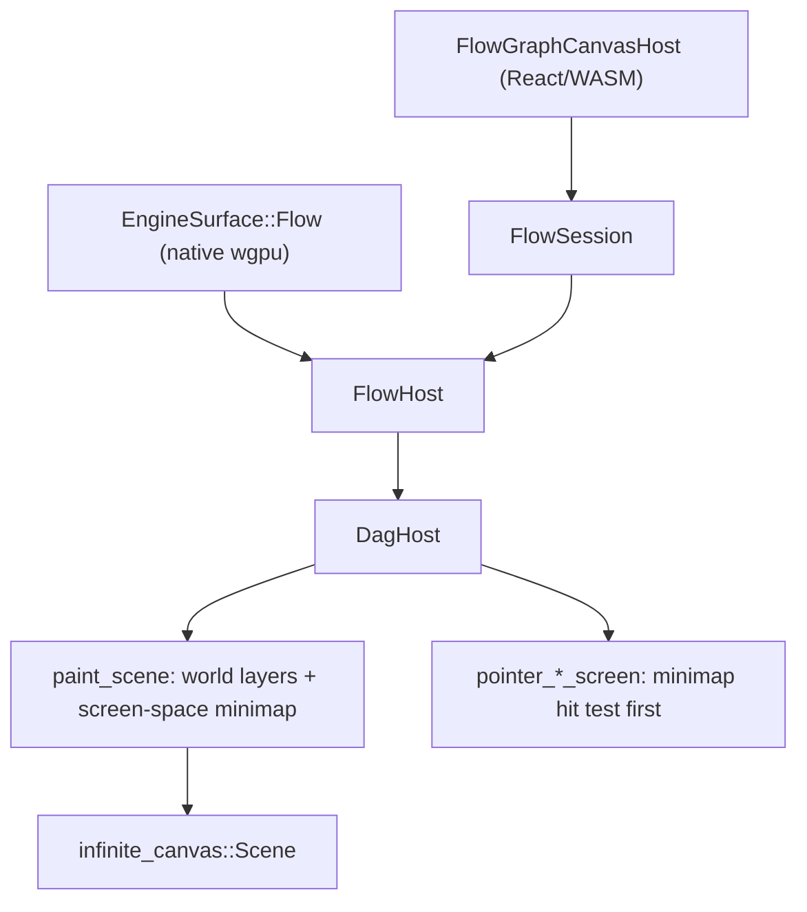

# Flow Minimap Widget

## Why this layer

Flow canvases are painted entirely in Rust: `FlowHost::paint_scene` delegates to `DagHost::paint_scene`, and both renderers forward pointer events into `DagHost::pointer_{down,move,up}_screen`. Adding the widget there means one implementation serves both hosts.

`paint_scene` already receives `viewport_w/h` in logical pixels and builds its world transform with `camera_content_affine`; device-pixel scaling happens afterwards in `scale_scene_for_device_pixel_ratio`. So the minimap is drawn with `Affine::IDENTITY` in the same logical pixel space, anchored to `(viewport_w - margin - width, viewport_h - margin - height)`.

Naming note: `DagDrawLod::Minimap` already exists and means "zoomed-far-out silhouette LOD". To avoid confusion the new code uses `MinimapWidget` throughout.

## Core work: new region in the DAG crate

All in [🧰️framework/🛍️product/💻️os/🔨️module/♾️infinite/🎲️board/🔌️port/➡️directed/🕸️dag/⚡️implementation/🦀️rust/📦️lib.rs](🧰️framework/🛍️product/💻️os/🔨️module/♾️infinite/🎲️board/🔌️port/➡️directed/🕸️dag/⚡️implementation/🦀️rust/📦️lib.rs), as a new `// #region 🔖️MinimapWidget` inside the existing `🔖️DagHost` region.

- New `DagHost` fields: `minimap_widget_visible: bool` (default `false`), `minimap_widget_hovered: bool`, `minimap_widget_drag: Option<(f64, f64)>` (pointer-to-viewport-center offset in minimap space).
- `pub fn set_minimap_widget_visible(&mut self, visible: bool)` so the widget is opt-in per canvas.
- `fn minimap_widget_content_bounds(&self) -> Option<WorldBox>`: union of `Self::dag_node_world_bounds` over `self.fixture.nodes` (the same helper the selection-align code at line ~2218 uses), padded.
- `fn minimap_widget_layout(&self, viewport_w, viewport_h) -> Option<MinimapWidgetLayout>`: returns the panel rect (bottom-right anchored), the world→minimap scale (fit content bbox, preserve aspect, clamp), and the viewport rectangle in minimap coordinates derived from `self.fixture.camera` plus the viewport size. Returns `None` when the graph is empty or when the current camera already shows the whole content bbox, so the widget disappears at fit-all zoom.

### Painting

- `fn paint_minimap_widget(&self, scene, viewport_w, viewport_h)`: rounded panel background + border, one small filled rect per node (reusing the existing `DagDrawLod::Minimap` fill selection via `dag_node_paint_fill` so selected/hovered/dimmed nodes keep their chrome), then the viewport rectangle stroked on top, brighter while `minimap_widget_hovered` or dragging.
- `paint_scene` currently early-`return`s inside the `if lod == DagDrawLod::Minimap` branch (line ~4688). Convert that branch so the minimap-LOD node loops sit in a block instead of returning, then call `self.paint_minimap_widget(...)` once at the very end of `paint_scene`, guaranteeing the widget paints in every LOD band.

### Interaction

- `fn minimap_widget_pointer_hit(&self, sx, sy) -> Option<MinimapWidgetHit>`: panel-rect test plus whether the point is inside the viewport rectangle.
- `pointer_down_screen`: insert a minimap check at the very top, before the `if pan` branch. Inside the viewport rect starts a drag preserving the grab offset; elsewhere in the panel jumps the camera center to that point and starts a drag centered on the pointer. Both call `self.set_camera(...)` (which already clamps and syncs) and `return` so no node/edge/marquee interaction fires.
- `pointer_move_screen`: handle `minimap_widget_drag` before the `pan_anchor` branch (pan camera from minimap coords); otherwise update `minimap_widget_hovered` and, when hovered, `return` early so canvas hover/marquee state is not polluted by pointer positions over the widget.
- `pointer_up_screen`: clear `minimap_widget_drag` alongside `pan_anchor`.

## Enabling it for flow

In [🧰️framework/🛍️product/💻️os/🔨️module/🌊️flow/🫀️core/⚡️implementation/🦀️rust/📦️lib.rs](🧰️framework/🛍️product/💻️os/🔨️module/🌊️flow/🫀️core/⚡️implementation/🦀️rust/📦️lib.rs), set `dag.set_minimap_widget_visible(true)` where `FlowHost` builds its `DagHost` (constructor around line 1785). Other DAG consumers stay unaffected because the flag defaults to `false`.

## Styling tokens

Tokens are code-generated, so hand-edit only the sources and regenerate.

- [🧰️framework/🔨️module/🖱️ui/🎨️styling/⚡️implementation/🦀️rust/🔣️tokens.json](🧰️framework/🔨️module/🖱️ui/🎨️styling/⚡️implementation/🦀️rust/🔣️tokens.json): add `metrics.dag.minimapWidget` (`width`, `height`, `margin`, `radius`, `nodeMinSize`, `maxContentRatio`), `strokes.dagMinimapWidgetPanel` / `dagMinimapWidgetViewport`, and `appearances.{light,dark}.board.minimapWidget{PanelFill,PanelStroke,ViewportFill,ViewportStroke,ViewportStrokeHovered}`.
- [🧰️framework/🔨️module/🖱️ui/🎨️styling/⚡️implementation/🦀️rust/🎨️theme/🔣️mono.theme.json](🧰️framework/🔨️module/🖱️ui/🎨️styling/⚡️implementation/🦀️rust/🎨️theme/🔣️mono.theme.json): matching mono-theme entries.
- Regenerate with the styling crate's `📜️script.ts generate`, which rewrites `🤖️generated.rs`, `🤖️generated.py`, the CSS and the TS tokens.
- Extend `CanvasPalette` (fields plus `from_board_palette`) in [🧰️framework/🛍️product/💻️os/🔨️module/♾️infinite/🎲️board/🔌️port/➡️directed/⚡️implementation/🦀️rust/📦️lib.rs](🧰️framework/🛍️product/💻️os/🔨️module/♾️infinite/🎲️board/🔌️port/➡️directed/⚡️implementation/🦀️rust/📦️lib.rs) (struct at line 372) with the new colours, and add them to its JSON merge so runtime theme switching keeps working.

## Renderer-side follow-through

The DOM overlays in [🧰️framework/🛍️product/💻️os/🔨️module/📺️renderer/🧑️‍🎨️engine/⚛️react/⚡️implementation/🟦️typescript/📦️index.tsx](🧰️framework/🛍️product/💻️os/🔨️module/📺️renderer/🧑️‍🎨️engine/⚛️react/⚡️implementation/🟦️typescript/📦️index.tsx) stack above the GPU canvas (labels `z-40`, sliders `z-45`), so a node parked in the bottom-right corner would draw its label over the minimap.

- Include the minimap panel rect and a `cursor` hint in `label_overlay_paint_state_json` (DAG crate) and surface it through the existing `FlowSession` getter, which React already polls each frame at line ~17307.
- Cull labels inside that rect in `paintDagLabelOverlays`, and hide sliders whose screen position falls inside it in `GraphSliderOverlays` (both in the `//#region 🔖️graph-canvas-overlays`).
- Apply the cursor hint (`grab` / `grabbing` / `pointer`) to the flow canvas element in `FlowGraphCanvasHost`. The native wgpu path gets painted hover feedback only; no cursor plumbing exists there and none is added.

No changes are needed in [🧰️framework/🛍️product/💻️os/🔨️module/📺️renderer/🧑️‍🎨️engine/🧊️wgpu/⚡️implementation/🦀️rust/📦️lib.rs](🧰️framework/🛍️product/💻️os/🔨️module/📺️renderer/🧑️‍🎨️engine/🧊️wgpu/⚡️implementation/🦀️rust/📦️lib.rs) — it already forwards to `pointer_*_screen` (lines ~3631-3694) and composites whatever `paint_scene` produces.

## Verification

- Extend the existing `// #region 🔖️Tests` in the DAG crate (no new test files): layout math at several viewport sizes, hidden when empty or fully fit, click-to-jump recentres the camera, drag pans proportionally, and a pointer-down inside the panel does not start a marquee or node drag.
- Extend the `FlowHost` paint smoke tests in flow_core (near `paint_scene_dark_theme_paints_edges_and_nodes`, line ~5867) to assert the widget is enabled and paints.
- Run `bun run dev:flow` and confirm at runtime with `[DEBUG]`-prefixed logs from the minimap hit test and camera updates, in both the React target (port 6016) and the wgpu target (port 6116), per the `🛠️dev🌊️flow⚛️react` and `🛠️dev🌊️flow🧊️wgpu🖥️native` launch configs.

## Blocker to resolve first

The repo MCP server (`project-0-semio-repo`) currently fails tool discovery, so no ticket could be opened during planning. Before editing, retry `mcp_auth` / discovery, read `repo://goals`, and open (or reopen) a ticket so all scratch files land in its folder.