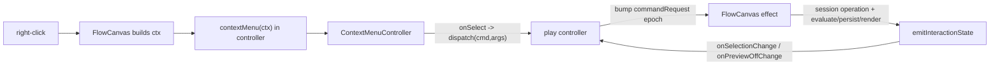

## Goal

Right-clicking the flow canvas (in both flow play and procedural play) opens a menu whose entries adapt to context: empty background vs a hovered/selected node vs an image-input widget. The menu definition + dispatch live in the play controllers (per your choice); FlowCanvas computes the click context, displays the menu, and executes the session/graph actions.

## Current state

- `FlowCanvas` already renders a `ContextMenuController` from `surfaceContextMenu` state, but `contextMenu?: readonly ContextMenuItem[]` is a static prop no consumer fills, and `onCanvasContextMenu` builds nothing context-aware ([flow/react/index.tsx](flow/react/index.tsx) ~L1080, L1758, L1921).
- `ContextMenuController`/`renderFixedContextMenuItems` already invoke `item.onSelect(nativeEvent)` and support `separator`, `checked`, `destructive`, `icon`, `disabled`, `children` ([ui/react/index.tsx](ui/react/index.tsx) L1238).
- `ProceduralFlowEditor` does NOT forward any context-menu props ([procedural/react/index.tsx](procedural/react/index.tsx) L1548).
- Session operations available: `add_widget`, `select_all`, `delete_selection`, `set_preview_off`, `reorganize` ([flow/core/lib.rs](flow/core/lib.rs)). FlowCanvas already drives these for keyboard shortcuts and exposes `openImagePicker(widgetId)`.
- Flow play controller is minimal (no selection/preview state); procedural play controller is rich (selection, previewOff, showMode) ([flow/play/index.ts](flow/play/index.ts), [procedural/play/index.ts](procedural/play/index.ts)).

## Design

Selection/graph live in the canvas `FlowSession`. So the controller owns the menu _definition + dispatch_, while FlowCanvas executes via two new props:

- `contextMenu?: (ctx: FlowCanvasContextMenuContext) => readonly ContextMenuItem[]` — builder invoked at right-click; FlowCanvas supplies the context.
- `commandRequest?: { epoch: number; command: string; argsJson?: string }` — epoch-bumped imperative channel (same pattern as existing `reorganize`) that FlowCanvas runs against the session.

`FlowCanvasContextMenuContext = { hoveredNodeId, selectedNodeIds, isImageWidget, isBackground, previewOffNodeIds, screen, world, clientX, clientY }`.

## Changes

### 1. `flow/react/index.tsx` (FlowCanvas)

- Export `FlowCanvasContextMenuContext` type. Change `contextMenu` prop to the builder signature above; add `commandRequest` and `onPreviewOffChange` props.
- In `onCanvasContextMenu`: read `hoveredWidgetId`, `selectedWidgetIds`, `previewOffWidgetIds`, derive `isImageWidget` from the fixture widget kind, compute `world` via `worldFromScreen`. If a node is right-clicked but not selected, select it first (standard UX) then `emitInteractionState`. Call `contextMenu(ctx)`; if items returned, `setSurfaceContextMenu`.
- Add a `commandRequest` effect (mirror the existing `reorganize` effect at ~L1377) handling canvas commands: `openSpotlight` (set spotlight at screen/world), `selectAll`, `clearSelection` (`setSelection("[]")`), `deleteSelection`, `togglePreview` (toggle ids in the preview-off set via `setPreviewOff`), `replaceImage` (`openImagePicker(id)`), `reorganize`. Each runs `evaluate`/`persistFixture`/`renderFrame`/`emitInteractionState`.
- Extend `emitInteractionState` to also read `previewOffWidgetIds` and call `onPreviewOffChange`.
- Add a shared pure helper `buildFlowContextMenuItems(ctx, dispatch)` returning the common `ContextMenuItem[]` (Add node…, Delete [destructive, count-aware], Toggle preview [checked], Replace image… [only when `isImageWidget`], Select all, Clear selection [when selection non-empty], Reorganize), with `onSelect: () => dispatch(command, args)`.
- Extend the `#region 🧪Tests` with cases for `buildFlowContextMenuItems` (background vs node vs image variants).

### 2. `flow/play/index.ts`

- Add `commandRequestEpoch`/`commandRequestPayload` state + `getCommandRequest()`; add a `canvasCommand` controller command that records `{command, argsJson}` and bumps the epoch (reuse existing `reorganize`).
- Add `buildFlowPlayCanvasContextMenu(ctx, dispatch)` delegating to `buildFlowContextMenuItems`.
- Extend `#region 🧪Tests`.

### 3. `procedural/play/index.ts`

- Same `commandRequest` epoch + `canvasCommand` dispatcher; store previewOff from `onPreviewOffChange` into existing `previewOffNodeIds` so the 3D preview reacts.
- Add `buildProceduralPlayCanvasContextMenu(ctx, dispatch)` = `buildFlowContextMenuItems` plus preview-specific items (e.g. "Isolate in preview" → `setShowMode selected` + select node).
- Extend `#region 🧪Tests`.

### 4. `procedural/react/index.tsx` (ProceduralFlowEditor)

- Add `contextMenu`, `commandRequest`, `onPreviewOffChange` to `ProceduralFlowEditorProps` and forward them to `FlowCanvas` (L1548).

### 5. `framework/product/playground/renderer/react/index.tsx`

- `FlowPlayPaneSurfaceHost` (L6110): pass `commandRequest={ctrl?.getCommandRequest()}` and `contextMenu={(ctx) => buildFlowPlayCanvasContextMenu(ctx, (c, a) => ctrl?.run(c, a))}`.
- `ProceduralPlayPaneSurfaceHost` (L6470): same, using `buildProceduralPlayCanvasContextMenu`, plus `onPreviewOffChange={(ids) => ctrl?.run("setPreviewOff", { ids })}`.

## Conventions / workflow

- Open a repo-mcp ticket (e.g. `FLOW-PROCEDURAL-RICH-CONTEXT-MENU`) after reading `repo://goals`; keep temp files in the ticket folder; close with a summary when done.
- All additions go inside existing `#region`/`//#region` blocks of the existing files (no new files), concise code, emoji docstrings, `[DEBUG]` logs for any temporary logging.

## Verification

- `nx test` for `@semio-tech/flow-react`, `@semio-tech/flow-play`, `@semio-tech/procedural-react`, `@semio-tech/procedural-play`.
- Manual: in flow + procedural playgrounds, right-click background and a node; confirm context-appropriate items and that Delete/Add/Toggle preview/Reorganize/Select all actually mutate the graph (confirmed via `[DEBUG]` logs).
