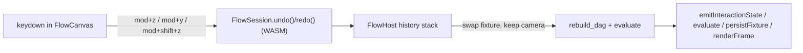

# Flow Undo/Redo (Ctrl+Z / Ctrl+Y)

Implement undo/redo at the root in the Rust core so every mutation path is covered, then wire keyboard shortcuts in React.

## Architecture



State of record is `FlowHost.fixture` (`FlowFixture`: widgets, synapses, layout, camera). Snapshots clone the fixture; comparison/undo ignore `camera` so zoom/pan never creates or is affected by undo steps. Selection/hover/preview-visibility live in the dag (ephemeral) and are intentionally not part of history.

## Ticket (repo MCP, first step)

- Read `repo://goals`, then `ticket_open` (or `ticket_reopen` if a matching open ticket exists) for "Flow Undo and Redo Shortcuts". Put any temp logs under the ticket folder. `ticket_close` with summary + touched files when done.

## Rust core: [flow/core/lib.rs](flow/core/lib.rs)

Add a `// #region History` inside the `FlowHost` impl area (struct field + methods), keeping a single source of truth for history.

- Add field to `FlowHost` struct (line ~627): `history: FlowHistory` and initialize in `from_fixture` (line ~651). New private struct:

```rust
#[derive(Default)]
struct FlowHistory {
    past: Vec<FlowFixture>,
    future: Vec<FlowFixture>,
    pending: Option<FlowFixture>, // pre-gesture snapshot
}
```

- Helpers on `FlowHost`:
  - `fn content_changed(a: &FlowFixture, b: &FlowFixture) -> bool` → `a.widgets != b.widgets || a.synapses != b.synapses || a.layout != b.layout` (camera ignored; all derive `PartialEq`).
  - `fn begin_change(&mut self)`: if `history.pending.is_none()` (not in a gesture), push `self.fixture.clone()` onto `past` and clear `future`. No-operation during a gesture so a drag = one undo step.
  - `fn undo(&mut self) -> bool` / `redo(&mut self) -> bool`: pop from `past`/`future`, push current onto the other stack, set `self.fixture = snapshot` but preserve current `camera`, then `rebuild_dag()` + `evaluate_internal()`.
  - `fn can_undo(&self)` / `can_redo(&self)`.
- Call `self.begin_change()` at the start of each discrete (non-gesture) mutation: `add_widget` (775), `remove_widget` (787), `connect_ports` (813), `add_input_port` (849), `remove_input_port` (892), `disconnect` (937), `reorganize` (949), `delete_selection` (1034), `align_selection` (1196), `set_slider_value` (1344), `set_note_text` (1356), `set_image_src` (1369). The `pending` guard makes these no-operation when triggered inside a pointer gesture (e.g. port-insert from `pointer_down`).
- Gesture coalescing in pointer handlers:
  - `pointer_down_screen` (963): in the non-`pan` branch, set `history.pending = Some(self.fixture.clone())` before delegating to the dag.
  - `pointer_up_screen` (998): after `sync_from_dag()`, `if let Some(pre) = history.pending.take()` and `content_changed(&pre, &self.fixture)`, push `pre` to `past` and clear `future`. This captures widget drags, slider drags, wiring, disconnects, and port inserts as single steps.
- `select_all`, `set_selection`, `set_hover`, `toggle_preview`, `set_camera`, `wheel_*` do NOT record history (ephemeral/view-only).

## WASM bindings: [flow/core/lib.rs](flow/core/lib.rs) (`#[wasm_bindgen] impl FlowSession`, near `disconnect` at line ~1662)

```rust
#[wasm_bindgen(js_name = undo)]
pub fn undo(&self) -> bool { self.state.borrow_mut().host.undo() }
#[wasm_bindgen(js_name = redo)]
pub fn redo(&self) -> bool { self.state.borrow_mut().host.redo() }
#[wasm_bindgen(js_name = canUndo)]
pub fn can_undo(&self) -> bool { self.state.borrow().host.can_undo() }
#[wasm_bindgen(js_name = canRedo)]
pub fn can_redo(&self) -> bool { self.state.borrow().host.can_redo() }
```

## React keyboard handler: [flow/react/index.tsx](flow/react/index.tsx) `onKeyDown` (line ~1855)

Extend the existing handler (alongside `mod+a` select-all). `mod = event.metaKey || event.ctrlKey` already exists, giving native keys on every platform (Cmd on macOS, Ctrl on Windows/Linux):

- Undo: `mod && key === "z" && !shiftKey` → `session.undo()`.
- Redo: `(mod && key === "y") || (mod && shiftKey && key === "z")` → `session.redo()`.

On a true result: `event.preventDefault()`, then `emitInteractionState(session); evaluate(); persistFixture(); renderFrame();` (same commit sequence used by `deleteSelection`). Note `persistFixture` updates the store and `onFixtureChange`, keeping localStorage in sync after undo/redo.

## Tests (extend existing files only)

- Rust unit test in `mod tests` of [flow/core/lib.rs](flow/core/lib.rs) (uses `host_with_test_bridge()` at line ~1902): add a widget, assert `undo()` removes it and `redo()` restores it; verify a `set_camera`/wheel change does not add an undo step and is preserved across undo.
- Vitest in [flow/react/index.tsx](flow/react/index.tsx) `FlowSession wasm` describe block (line ~2674): after `loadFixtureJson`, mutate (e.g. `alignSelection`), then assert `session.undo()` reverts the layout and `session.redo()` re-applies it.

## Build / verify

- Rebuild WASM so JS picks up new methods: `nx run @semio-tech/flow-core:wasm` (the launch.json "flow core wasm" task) — required before the vitest test passes.
- Run core Rust tests and the flow/react vitest suite to confirm runtime behavior.

## Notes

- No new executable command, so no `launch.json` entry needed.
- Camera is preserved across undo/redo (no viewport jump); selection is reset after undo/redo (acceptable for v1).
