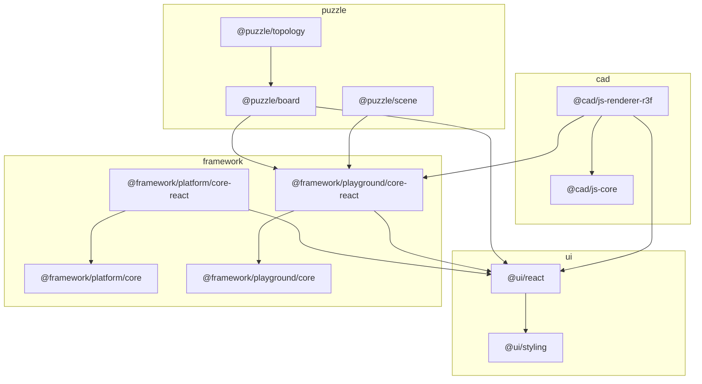

# Folder Structure Migration

## Context

The new top-level technology folders already exist and hold the real code, but every wiring layer still points at the old `elements/lib/*` and `spatial/js` paths, and package scopes are inconsistent. This migration makes folder = technology = scope and rewires tooling. Per decision, `semio` and `coda` are out of scope and will be left with dangling `@elements/*` imports (acceptable: "ok to break for now").

Work happens inside repo MCP tickets under the `AI-optimized Repo` goal (folder/structure cleanup), one ticket per technology plus a consolidating root-rewire ticket.

## Target scope renames (folder = scope)

- ui
  - `@elements/ui` (`ui/react`) -> `@ui/react`
  - `@elements/styling` (`ui/styling/js`) -> `@ui/styling`
  - Nx `@elements/styling-core` (`ui/styling/project.json`) -> `@ui/styling-tokens`
- framework
  - `@elements/framework` (`framework/platform/core`) -> `@framework/platform/core`
  - `@elements/framework-react` (`framework/platform/renderer/react`) -> `@framework/platform/core-react`
  - `@elements/playground` (`framework/playground/core`) -> `@framework/playground/core`
  - new `@framework/playground/core-react` package at `framework/playground/renderer/react` (currently a broken `./react` export off core)
- puzzle
  - `@elements/board` (`puzzle/2d`) -> `@puzzle/board`; crate `elements_board` (`puzzle/2d/rs`) -> `puzzle_board`; `@elements/board-wasm` -> `@puzzle/board-wasm`
  - `@elements/scene` (`puzzle/3d`) -> `@puzzle/scene`
  - `@elements/topology` (`puzzle/combined`) -> `@puzzle/topology`
- cad (folder `cad`, all packages currently `@spatial/js-*`)
  - `@spatial/js-workspace|core|kernel-brepjs|query|machine-stately|renderer-r3f` -> `@cad/js-workspace|js-core|js-kernel-brepjs|js-query|js-machine-stately|js-renderer-r3f`

## Tooling to rewire

- Root [package.json](package.json): replace `workspaces` entries (lines 7-15) `elements/lib/*` + `spatial/js` with `ui/react`, `ui/styling/js`, `framework/platform/core`, `framework/platform/renderer/react`, `framework/playground/core`, `framework/playground/renderer/react`, `puzzle/2d`, `puzzle/3d`, `puzzle/combined`, `cad/js`; rename scripts `dev:spatial`->`dev:cad`, `dev:storybook:elements*`->`dev:storybook:ui` / `:puzzle`.
- Root [script.ts](script.ts): update `dev` subcommand mapping (`spatial`/`board`/`scene`) and any `@spatial/*` / `@elements/*` references and storybook project ids.
- Every `project.json` under `ui/`, `framework/`, `puzzle/`, `cad/js/`: fix `cwd` (still `elements/lib/...` / `spatial/js/...`) and Nx project `name`.
- Every package's `package.json` `name`, `repository.directory`, and intra-repo `dependencies` (the `@elements/*` / `@spatial/*` deps between these packages).
- Per-package `vite.config.ts` aliases (notably `cad/js/renderer-r3f` aliasing `@elements/playground` -> `@framework/playground/core`, `@elements/ui` -> `@ui/react`).
- Fix `framework/playground/core/package.json` `./react` export and implement/export `renderPlayground` in `framework/playground/renderer/react/index.tsx` (referenced by `puzzle/3d/play/main.ts`).
- [.storybook/main.ts](.storybook/main.ts) + stories under `.storybook/stories/elements/**`: update `@elements/*` imports and story paths.
- [.vscode/launch.json](.vscode/launch.json): rename launch configs referencing spatial/elements/board/scene per existing grouping.
- Regenerate `bun.lock` via `bun install`; sanity-check `nx.json`, `eslint.config.mjs`, `Monorepo.sln` for stale paths.

## Sequencing

Per-technology renames (ui, framework, puzzle, cad) are largely independent and can run as parallel generalist tickets, each owning its own folder's `package.json`/`project.json`/imports. The shared root files (`package.json`, `script.ts`, `bun.lock`, `launch.json`, `.storybook`) are edited last in a single consolidating ticket to avoid write conflicts, followed by `bun install` and per-package `nx build`/`test` verification.

## Known breakage (accepted, deferred)

- `semio` (`@semio/sketchpad` imports `@elements/ui`, `@elements/framework-react`, `@elements/board`, `@elements/scene`) and `coda` (`@coda/desktop` imports `@elements/ui`) will have dangling imports. Their workspace entries stay; fixing their import specifiers is deferred to the future semio/coda migration ticket.

## Target dependency graph

## Verification

- `bun install` resolves with no `@elements/*` / `@spatial/*` workspace references remaining (grep to confirm) for the four in-scope technologies.
- `bun nx build` / `bun nx test` for each renamed package passes (confirm by running, not assuming).
- `bun run dev:cad`, `dev:board`, `dev:scene`, `dev:storybook:ui` start without module-resolution errors.