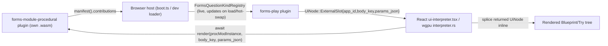

## Context (confirmed by research)

- `git tag premigration` points at commit `f8376e848650...125`, the last commit before the repo-wide play-host deletion/Rust-only migration. At that point forms was `forms/core`+`forms/react` (TS), with an already-built extension mechanism: `FormsQuestionKindContribution` + `FormsExtensionHost` (registry, `activate`/`listQuestionKinds`), and inline `Flow3dQuestionControl` rendering (nested param sub-form + live 3D preview side-by-side) directly inside **both** Edit and Try surfaces — confirmed by `usesFlow3dQuestionSurface(question, "edit"|"try")` at `/tmp/premigration_forms_index.tsx:525-530` and the shared `Flow3dQuestionControl` at lines 532-614. This answers "check how premigrated forms handled preview placement": **inline, in both windows, not a separate dedicated preview surface.**
- The whole repo has since migrated to Rust/wgpu-only plugins: `forms/react`/`forms/core`/`forms/play` are gone; `forms/rs` (domain) + `forms/plugin/rs` (app) are the only forms code left. `forms/rs/lib.rs` already carries the full pre-migration field set (`FormQuestion` with all fields, `FormExpr`, `eval_form_expr`, validation) plus `is_extension_question_kind`/`FORM_BUILTIN_KINDS` — domain-model parity is done.
- `forms/plugin/rs/lib.rs` currently has **3 windows** (`forms-edit`/"Edit", `forms-try`/"Try", `forms-preview`/"Preview" — [forms/plugin/rs/lib.rs:44-46,2136-2160](forms/plugin/rs/lib.rs)) and hardcodes the one extension kind (`buildingComponent`) directly: it depends on `flow_core`, `flow_module_brep`, `kernel_3d_brepkit`, `kernel_3d_engine` in [forms/plugin/rs/Cargo.toml](forms/plugin/rs/Cargo.toml), and `evaluated_preview_payload`/`apply_flow_params`/`render_preview_body` ([forms/plugin/rs/lib.rs:766-865](forms/plugin/rs/lib.rs)) bake in flow-fixture evaluation + tessellation. This is a "mixing technologies" violation and the opposite of a module mechanism.
- Every technology plugin is compiled to its **own separate `.wasm` file**, loaded independently by the browser host in a Web Worker ([framework/plugin/registry/script.ts](framework/plugin/registry/script.ts), [framework/renderer/wgpu/js/boot.ts:142-212](framework/renderer/wgpu/js/boot.ts)). Plugins do **not** share Rust statics, so `flow`'s compile-time `flow_registry()` pattern ([flow/plugin/rs/lib.rs:1350-1367](flow/plugin/rs/lib.rs), used by `flow_module_`* crates) is structurally incompatible with a *runtime\*-loadable mechanism — confirming the dev's explicit choice of runtime over compile-time modules. The only place that can compose across independently-loaded plugin workers is the trusted JS host, which already parses each plugin's `manifest()` JSON at load time ([framework/renderer/wgpu/js/boot.ts:195](framework/renderer/wgpu/js/boot.ts)) and already calls `render(instanceId, bodyKey, viewState)` per app instance asynchronously.
- There's an in-flight, unrelated `.repo/🎫/26/07/07/PLUGIN-OS-ARCHITECTURE-REFACTOR` (sandboxing/capability/hot-swap unification) — this plan does **not** depend on its still-pending phases (wasmtime sandbox, ABI unification); it only reuses the parts already real today (`PluginManifest`, `PluginHost` load/hot-swap tracking, per-plugin worker `render`).

## Architecture decision: runtime "Contribution" mechanism

Add a closed, host-mediated contribution system (new, generic — not forms-specific — so any future cross-plugin extension point can reuse it):

- `framework/core/rs`: new closed `pub enum Contribution { FormsQuestionKind { kind, label, icon, default_value_json, params_body_key, preview_body_key } }` + `PluginManifest.contributions: Vec<Contribution>` (mirrors the existing `Capability`/`capabilities` pattern at [framework/core/rs/lib.rs:2986-2994](framework/core/rs/lib.rs)). New `UiNode::ExternalSlot(UiExternalSlotNode { app_id, body_key, params_json })` variant next to `ComponentScene` ([framework/core/rs/lib.rs:2481-2528](framework/core/rs/lib.rs)) — a generic "render this app's own body here, inline" node.
- `framework/plugin/rs`: `PluginBundle::contributes(mut self, Contribution) -> Self` builder (mirrors `.capability(...)` at [framework/plugin/rs/lib.rs:436-441](framework/plugin/rs/lib.rs)).
- `framework/product/os/core/rs`: `PluginHost` (already diffs `added_apps`/`removed_apps` on load/hot-swap at [framework/product/os/core/rs/lib.rs:100-198](framework/product/os/core/rs/lib.rs)) gains `fn contributions(&self) -> Vec<(String /* app_id */, Contribution)>` derived live from all loaded manifests — extend the existing in-file tests for load/hot-swap to also assert contribution add/remove.
- Both renderers become able to resolve `ExternalSlot` by calling the contributing app's own `render(instanceId, body_key, params_json)` and splicing the result in place, recursively:
  - `framework/renderer/wgpu/js/boot.ts` / dev loader: maintain the live contribution registry from loaded plugin manifests; wherever the OS-level tree-walker encounters `ExternalSlot`, resolve the target app instance (creating a hidden/background instance of that app if not already open) and await its `render`.
  - `framework/renderer/react/ui-interpreter.tsx` and `framework/renderer/wgpu/rs/interpreter.rs`: add an `ExternalSlot` branch that recurses into the resolved sub-tree (same recursion fix already needed for nested `ComponentScene` per [.cursor/plans/forms_premigration_parity_both_renderers_b3d29b3a.plan.md](.cursor/plans/forms_premigration_parity_both_renderers_b3d29b3a.plan.md) Phase 2 — do that nested-recursion fix as a prerequisite here too, since `ExternalSlot` will itself often be nested inside a `Field`/`Stack`).
  - Graceful fallback: if the contributing plugin isn't loaded, render a muted "Extension unavailable: " text node instead of erroring.

## Phase 1 — Window consolidation: Blueprint + Try only

In [forms/plugin/rs/lib.rs](forms/plugin/rs/lib.rs):

- Rename `FORMS_PLAY_WINDOW_EDIT`/"Edit" → `FORMS_PLAY_WINDOW_BLUEPRINT`/"Blueprint" (const `"forms-blueprint"`), rename `.mode("edit", "Edit")` → `.mode("blueprint", "Blueprint")`, `default_mode_id("blueprint")`.
- Delete `FORMS_PLAY_WINDOW_PREVIEW`/`FORMS_PLAY_BODY_PREVIEW`/`FORMS_PLAY_SURFACE_PREVIEW` and the `.window_kind(...Preview...)` registration; update `create_default_layout` to a 2-way split (`["Blueprint", "Try"]`, e.g. `[50.0, 50.0]`).
- Delete `render_preview_body`, `evaluated_preview_payload`, `apply_flow_params`, `mesh_from_tessellation_json`, `geometry_handle_for_widget`, `collect_geometry_handles_from_eval`, `is_brep_geometry_handle`, `widget_id`, `fixture_json_for_slug`/flow-fixture bundling (`BUILDING_COMPONENT` fixture-eval-only parts) — this logic **moves** to the new module plugin in Phase 3, not duplicated.
- Update `render(body_key, ...)` match arm list accordingly (drop `FORMS_PLAY_BODY_PREVIEW`).

## Phase 2 — Registry-driven extension rendering in forms-plugin

- Replace the hardcoded `buildingComponent` special-casing (`first_building_component_question`, `building_component_params`, inspector's fixture-slug-specific fields) with generic lookups against the live contribution registry passed into `render`/`handle_command_patch_ops` (via `ViewState` or a new render-input field carrying the resolved `Vec<Contribution::FormsQuestionKind>` for the current OS session — extend `ViewState` in `semio-framework-core` minimally, or thread it through a new `PluginApp` method `fn set_contributions(&mut self, ...)` called by the host before `render`).
- Wherever a question's `kind` matches a registered extension (`is_extension_question_kind` + registry lookup), emit `UiNode::ExternalSlot { app_id: contribution.app_id, body_key: contribution.params_body_key, params_json: question.params }` for the **params/edit** control and a second `ExternalSlot` with `preview_body_key` for the **preview**, laid out side-by-side (`Stack`/grid), in both:
  - `build_inspector_tree`'s per-question editor (Blueprint) — this is the "edit" surface parity point from premigration.
  - `render_try_question` (Try) — matches premigration's `Flow3dQuestionControl` usage in `questionControl`.
- Catalogue (`build_catalogue_tree`) becomes registry-driven too: list built-ins from `FORM_BUILTIN_KINDS` plus one draggable entry per registered `Contribution::FormsQuestionKind`, using its `label`/`icon`.
- Update `forms/plugin/rs/Cargo.toml`: remove `flow_core`, `flow_module_brep`, `kernel_3d_brepkit`, `kernel_3d_engine` — forms-plugin no longer touches flow/procedural technology at all.

## Phase 3 — New `forms/module/procedural/rs` plugin (the reference runtime module)

- New crate `forms-module-procedural` (package `semio:forms-module-procedural`), depending on `flow_core`, `flow_module_brep`, `kernel_3d_brepkit`, `kernel_3d_engine`, `semio-framework-plugin`, `semio-framework-core` — i.e. exactly the deps removed from forms-plugin in Phase 2.
- Move `evaluated_preview_payload`/`apply_flow_params`/tessellation helpers here verbatim; add an app (`forms-module-procedural`) with two `PluginApp::render` body keys: `"params"` (nested form built via the existing `flow_fixture_to_form_spec`-equivalent, reusing `forms` crate types for the sub-form) and `"preview"` (the moved `build_world_3d_scene` pipeline).
- `PluginBundle::new("forms-module-procedural", ...)....contributes(Contribution::FormsQuestionKind { kind: "buildingComponent", label: "Building Component", icon: "...", default_value_json: "{}", params_body_key: "params", preview_body_key: "preview" })`.
- Bundle the hexagonal-column fixture here (`include_str!`) instead of in forms-plugin.

## Phase 4 — Build/registry wiring

- Add `forms/module/procedural/rs` to workspace [Cargo.toml](Cargo.toml) members.
- Regenerate the plugin registry ([framework/plugin/registry/script.ts](framework/plugin/registry/script.ts) `generate`), and add the new plugin id to both `framework/product/os/dev/js/index.ts`'s target list and `framework/renderer/wgpu/js/boot.ts`'s `PLUGIN_TARGETS` (until Phase F of the separate OS-architecture ticket unifies these — don't block on that ticket).
- Ensure the OS loads `forms-module-procedural` as a background/always-on contributor plugin (not a user-visible app in the launcher) alongside any plugin that declares an app — confirm how "contributor-only, no visible app" plugins should surface in the launcher (likely: manifest apps list can be empty, only `contributions` populated).

## Phase 5 — Fixtures & tests

- Keep existing `empty`/`default`/`onboarding`/`building-component` examples as-is (already restored).
- Extend `forms/plugin/rs/lib.rs`'s existing `#[cfg(test)]` module (no new test files) to cover: Blueprint+Try are the only two window kinds/modes, `ExternalSlot` emission for `buildingComponent` questions in both Blueprint and Try, and graceful fallback text when no contribution is registered.
- Extend `forms/module/procedural/rs`'s test module for its `params`/`preview` render outputs.
- Extend `framework/product/os/core/rs` tests for contribution add/remove on load/hot-swap.
- Extend `framework/renderer/react/index.test.ts` / wgpu vitest for `ExternalSlot` resolution + recursion.

## Phase 6 — Verification

- `cargo check`/`cargo test` for `forms-plugin`, new `forms-module-procedural`, `semio-framework-core`, `semio-framework-plugin`, `framework-product-os-core`, `semio-framework-renderer-wgpu`.
- `cargo build --target wasm32-unknown-unknown` for touched/new crates; regenerate wasm bindings + plugin registry.
- `bun nx run @semio-tech/framework-renderer-react:test`.
- Re-run/extend the WGPU playground E2E harness ([.repo/🎫/26/07/04/WGPU-PLAYGROUND-E2E/verify-wgpu-playgrounds-e2e.ts](.repo/🎫/26/07/04/WGPU-PLAYGROUND-E2E/verify-wgpu-playgrounds-e2e.ts)) for `forms`, screenshot-diffing wgpu vs React for Blueprint/Try with and without `forms-module-procedural` loaded.
- Manual runtime pass with `[DEBUG]` logs: open Building Component form, confirm exactly 2 windows named Blueprint/Try, confirm the procedural params+mesh preview render inline in both, edit params and see the mesh update live, then simulate the module plugin not being loaded and confirm graceful fallback text.
- Read `repo://goals`, open/reopen the appropriate ticket before implementation, close it with the full touched-files summary when done.
