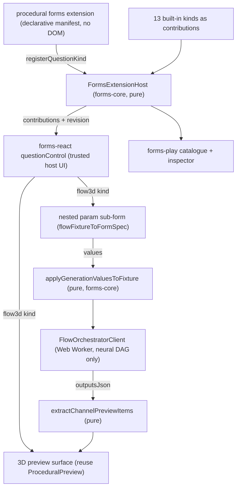

## Forms Extensions and Flow-Backed Question Kinds

### Goal

Make forms extensible by controlled, DOM-free extensions; let a procedural 3D flow (hexagonal column) become a question kind whose value is the flow's input parameters and whose preview is computed headlessly via the neural DAG only. Reduce forms fixtures to one `Building Component` form and demonstrate it end-to-end.

### Architecture

Key principle: when a form uses a flow it touches only the headless neural DAG (`FlowOrchestratorClient`) plus pure helpers and the preview render component. It never imports the flow editor (`FlowCanvas`/`ProceduralFlowEditor`).

### 1. forms-core: extension host + registry (DOM-free)

In [forms/core/index.ts](forms/core/index.ts):

- Add a `🧩Extensions` region with:
  - `FormsQuestionKindContribution` manifest: `{ kind: string; label; iconId; group?; defaults; value: "scalar" | "list" | "record"; validate?: declarative; preview?: { surface: "flow3d"; fixtureSlug: string }; controls?: { source: "flowFixture"; fixtureSlug: string } }`. Purely declarative, no functions returning DOM.
  - `FormsExtensionEntry` `{ id; manifest; active }` and `FormsExtensionHost` mirroring flow's host: loader map, `activate`/`deactivate`/`setActive`/`activateDefaults`, `subscribe`/`getRevision`/`notify`, `listEntries`, `listQuestionKinds()`, `catalogueEntries()`. Export singleton `formsExtensionHost`.
- Relax kinds: keep the 13 typed built-ins, add `FormQuestionExtension` `{ kind: string; ...; fixtureSlug?: string }` and widen the parser so unknown kinds resolve against `formsExtensionHost.listQuestionKinds()` instead of `throw` at [forms/core/index.ts](forms/core/index.ts) (the `default: throw` in `parseFormQuestion`).
- Widen `FormValue` (line 149) to allow nested records: `... | FormValues | null` so a flow3d question stores its parameter map.
- Register the 13 built-ins from `QUESTION_KIND_CATALOGUE` as the default `builtin` extension entry so the catalogue is registry-driven (single source of truth); `defaultQuestionForKind` / `questionKindCatalogueEntry` resolve through the host.
- Update `defaultValueForQuestion`, `FormRuntime` validation/submit to handle `record` values (default from contribution; required = non-empty record).
- Move the pure flow bridge here: relocate `flowFixtureToFormSpec` and `applyGenerationValuesToFixture` from `forms/react` into forms-core (they are pure JSON transforms, no DOM) so logic is detached from UI.
- Extend the in-file vitest: parsing extension kinds, registry activation/revision, nested record default/validate, fixture↔form round-trip.

### 2. forms-react: controlled rendering of the flow kind

In [forms/react/index.tsx](forms/react/index.tsx):

- Re-export the bridge helpers from forms-core (no behavior change for existing callers).
- Extend `questionControl` (lines 93-197) with a branch for extension kinds whose contribution declares `preview.surface === "flow3d"`:
  - Render a nested `FormRenderer` for the param sub-form built from `flowFixtureToFormSpec(<fixture>)`; its values are the question's nested record; `onChange` updates the parent value.
  - Render a live preview: debounced, non-blocking eval via a single shared `FlowOrchestratorClient`; `applyGenerationValuesToFixture` -> `loadFixtureJson` -> `evaluate` -> `extractChannelPreviewItems`; feed into `ProceduralPreview` (reused from `@semio-tech/procedural-3d-react`) with the brep kernel via `ensureProceduralBrepBridge`.
- Drive the drag palette/`QUESTION_KIND_CATALOGUE` consumers from `formsExtensionHost` so contributed kinds appear.
- Add `@semio-tech/procedural-3d-react` + flow worker client to `forms/react` deps (this is the intended tight integration; only the headless DAG + preview render are used, never the editor).
- Extend in-file vitest for the new control branch resolution.

### 3. procedural forms extension (the flow-backed kind)

- Add a declarative `procedural` forms extension contribution (a manifest object, registered into `formsExtensionHost` default loaders) that contributes kind `buildingComponent` with `preview/controls` pointing at the existing flow fixture [procedural/3d/fixture/hexagonal-mushroom-column.procedural.json](procedural/3d/fixture/hexagonal-mushroom-column.procedural.json) (resolved by slug). No DOM, no executable UI; computation is delegated to the neural DAG.
- Confirm forms never imports `FlowCanvas`/`ProceduralFlowEditor`; only `FlowOrchestratorClient` (from [flow/worker-client.ts](flow/worker-client.ts)) and the pure `extractChannelPreviewItems` / `ProceduralPreview` from [procedural/3d/react/index.tsx](procedural/3d/react/index.tsx).

### 4. forms-play + framework renderer wiring

- In [forms/play/index.ts](forms/play/index.ts): activate `formsExtensionHost` defaults on controller boot; build the catalogue tree and inspector from the registry (so `buildingComponent` is draggable); expose `getExtensionRevision()`.
- In [framework/product/playground/renderer/react/index.tsx](framework/product/playground/renderer/react/index.tsx): subscribe to forms extension revision (same `useSyncExternalStore` pattern as flow) so the catalogue/inspector refresh; ensure Try mode renders the interactive flow3d control + preview.

### 5. Fixtures: one Building Component form

- Delete [forms/fixture/default.forms.json](forms/fixture/default.forms.json) and [forms/fixture/onboarding.forms.json](forms/fixture/onboarding.forms.json).
- Add `forms/fixture/building-component.forms.json`: a couple of normal questions (e.g. component name, material `single`) plus a `buildingComponent` flow-backed question referencing the hexagonal column flow.
- Update [forms/play/fixture-slugs.ts](forms/play/fixture-slugs.ts): default id -> `building-component`, single entry; remove `default`/`onboarding` slugs.

### 6. Verify (no new test files)

- Extend existing in-file vitest in forms/core, forms/react, forms/play only.
- Run `nx` test targets via `script.ts` for the touched packages; run the forms play dev server and confirm in-browser: building-component loads, the flow3d question edits parameters, the 3D preview updates non-blockingly, Edit/Try modes both work. Confirm runtime via console logs before claiming success.

### Constraints honored

- Extensions are declarative/manifest-only with no DOM access; all rendering is trusted host code (controlled surfaces).
- Flow usage = neural DAG only, evaluated off the main thread (non-blocking).
- Single forms fixture; no migration/adapter cruft; edits to existing files using regions; work continues under the reopened forms ticket.
