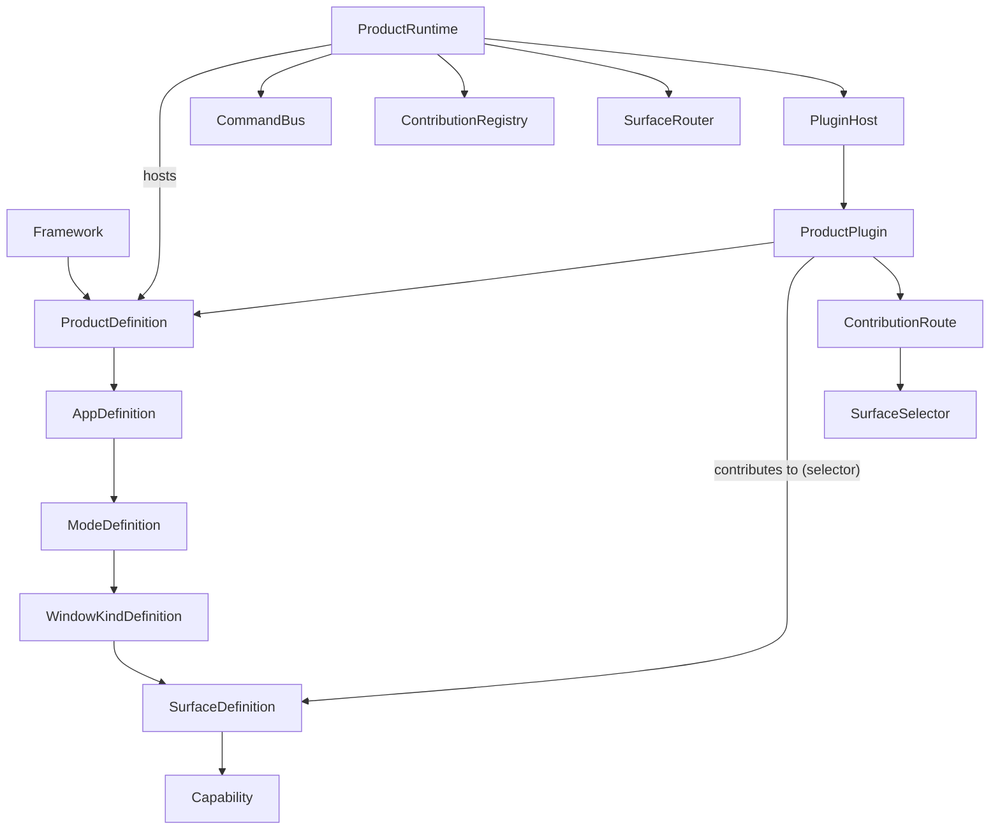

## 1. Goal

Turn `elements/lib/framework` into a generic, product-agnostic framework so that any product (Sketchpad, future products) can be built on top of it and grow its own plugin ecosystem. No business logic in the framework, no Sketchpad-specific names, no legacy.

The framework defines abstractions and a runtime. Products (e.g. `sketchpadProduct`) live outside the framework and instantiate it. Plugins target a specific product and contribute to its `Surface`s.

## 2. New conceptual model (replaces the old `Workbench*` model)



Term map (old -> new), nothing left behind:

- `Workbench` -> `ProductRuntime` (runtime root; per active product instance)
- `WorkbenchApp` -> `AppRuntime` (runtime mount of an `AppDefinition`)
- `WorkbenchMode` -> `ModeRuntime`
- `WorkbenchWindowKind` -> `WindowKindRuntime`
- `ShellExtension` / `ShellExtensionHost` -> `ProductPlugin` / `PluginHost`
- `ShellExtensionContext` -> `PluginContext` (+ new `SurfaceContext`)
- `ShellExtensionAppContribute` -> `AppDefinition` (now the canonical, typed app spec - no separate "contribute" type)
- `ShellExtensionContributes` -> `ProductContributions<TSurfaceMap>` (typed per product)
- `ShellExtensionManifest` -> `PluginManifest`
- `registerDeclarativeWindowBody/SidePanelBody` -> `SurfaceDefinition.applyContribution` driven by typed contributions; declarative window bodies become a built-in `window` `SurfaceKind`.

The framework keeps no `Workbench*` symbol.

## 3. File layout in `elements/lib/framework`

Stay framework-only - no new top-level folders. Edit existing files in place:

- [elements/lib/framework/core/index.ts](elements/lib/framework/core/index.ts) - replace contents with the new abstractions; tests in the existing `if (import.meta.vitest)` block.
- [elements/lib/framework/renderer/react/index.tsx](elements/lib/framework/renderer/react/index.tsx) - reorient renderer onto `ProductRuntime` / `SurfaceRouter`; rename internal symbols (`WorkbenchView` -> `ProductView`, `WorkbenchAppView` -> `AppView`, etc.).
- [elements/lib/framework/AGENTS.md](elements/lib/framework/AGENTS.md) - update vocabulary line (terms listed: Product, App, Mode, WindowKind, Surface, Capability, Plugin, Contribution).

Region structure inside `core/index.ts`:

- `#region 🧱Header`
- `#region 🔖JsonValue`
- `#region 🔖Disposable`
- `#region 🔖CommandBus` (`CommandBus`, `Controller`)
- `#region 🔖ContextKeys` (typed context for `when` expressions)
- `#region 🔖Capability` (`Capability = string` alias + helpers)
- `#region 🔖UiNode` (kept; renderer-agnostic descriptors)
- `#region 🔖SurfaceDefinition`
- `#region 🔖WindowKindDefinition`
- `#region 🔖ModeDefinition`
- `#region 🔖AppDefinition`
- `#region 🔖ProductDefinition`
- `#region 🔖SurfaceSelector` (matcher: product/app/mode/windowKind/surface/kind/capabilities/when)
- `#region 🔖ContributionRoute`
- `#region 🔖ContributionRegistry`
- `#region 🔖SurfaceRouter`
- `#region 🔖ProductPlugin` (manifest + module + `PluginContext` + `SurfaceContext` + `defineProductPlugin`)
- `#region 🔖PluginHost`
- `#region 🔖ProductRuntime` (replaces `Workbench`; owns runtime state, command bus, observable subscriptions)
- `#region 🧪Tests`

## 4. Core types (essentials, not exhaustive)

```ts
export type Capability = string;

export interface Disposable {
 dispose(): void;
}

export interface SurfaceDefinition<TApi = unknown, TContrib = unknown> {
 readonly id: string;
 readonly appId: string;
 readonly modeId: string;
 readonly windowKindId: string;
 readonly kind: "window" | "toolbar" | "panel" | "overlay" | "tool" | "menu" | "inspector" | "analysis" | string;
 readonly capabilities: readonly Capability[];
 createApi(ctx: SurfaceContext): TApi;
 applyContribution(contribution: TContrib, ctx: SurfaceContext, api: TApi): Disposable;
}

export interface WindowKindDefinition {
 readonly id: string;
 readonly appId: string;
 readonly modeId: string;
 readonly kind: "table" | "diagram" | "scene" | string;
 readonly label: string;
 readonly capabilities: readonly Capability[];
 readonly surfaces: readonly SurfaceDefinition[];
 readonly bodyKey?: string; // for window-kind built-in surface
 readonly measures?: readonly ShellWindowMeasure[];
}

export interface ModeDefinition {
 readonly id: string;
 readonly label: string;
 readonly iconId?: string;
 readonly windowKinds: readonly WindowKindDefinition[];
 readonly defaultLayout?: WindowLayout;
 readonly tools?: AppTools;
 readonly leftTabs?: readonly SideTabSpec[];
 readonly rightTabs?: readonly SideTabSpec[];
}

export interface AppDefinition {
 readonly id: string;
 readonly label: string;
 readonly iconId?: string;
 readonly controllerId: string;
 readonly modes: readonly ModeDefinition[];
 readonly defaultModeId?: string;
}

export interface ProductDefinition<TProductApi = unknown, TSurfaceMap extends Record<string, SurfaceBinding<any, any>> = Record<string, SurfaceBinding<any, any>>> {
 readonly id: string;
 readonly name: string;
 readonly apiVersion: string;
 readonly apps: readonly AppDefinition[];
 createProductApi(ctx: PluginContext): TProductApi;
}

export interface SurfaceBinding<TApi, TContrib> {
 readonly api: TApi;
 readonly contributions: TContrib;
}

export interface SurfaceSelector {
 product?: string;
 app?: string;
 mode?: string;
 windowKind?: string;
 surface?: string;
 kind?: string;
 capabilities?: readonly Capability[];
 when?: string;
}

export interface ProductPlugin<TProductApi = unknown, TSurfaceMap extends Record<string, SurfaceBinding<any, any>> = Record<string, SurfaceBinding<any, any>>> {
 readonly id: string;
 readonly target: { product: string; api: string };
 readonly manifest?: PluginManifest;
 activate?(ctx: PluginContext, product: TProductApi): void | Promise<void>;
 deactivate?(): void | Promise<void>;
 surfaces?: { [K in keyof TSurfaceMap]?: (ctx: SurfaceContext<K & string>, surface: TSurfaceMap[K]["api"]) => Disposable | Promise<Disposable> };
 contributes?: { selectors?: readonly ContributionRoute[] };
}
```

`defineProductPlugin<TProductApi, TSurfaceMap>()` is the typed authoring helper, mirroring section #22 of the sketch.

## 5. Routing

`SurfaceRouter` walks `ProductDefinition` apps -> modes -> windowKinds -> surfaces, and for each registered `ContributionRoute` applies `matchesSurface(selector, surface)` (the exact matcher from section #11 of the sketch) and invokes `surface.applyContribution`. Capability matching is set-inclusion on `surface.capabilities`. `when` expressions resolve against `ContextKeys`.

`PluginHost.activateAll(product, productApi)`:

1. Per plugin: build `PluginContext`, call `plugin.activate(ctx, productApi)`.
2. For every surface in product: if any `plugin.surfaces[surface.id]` matches, build `SurfaceContext`, call it, collect `Disposable`.
3. Apply declarative `contributes.selectors` via `SurfaceRouter`.

Lifecycles (section #19):

- Product lifecycle: `activate` / `deactivate` once per plugin.
- Surface lifecycle: per matching surface; disposed when the surface unmounts or the plugin deactivates.

## 6. Renderer

[elements/lib/framework/renderer/react/index.tsx](elements/lib/framework/renderer/react/index.tsx) currently renders a `Workbench`. Changes:

- Top-level component renamed: `WorkbenchView` -> `ProductView`, props `{ runtime: ProductRuntime }`.
- Active app/mode resolution moves from `Workbench.getActiveApp().resolve(modeId)` to `ProductRuntime.getActiveApp().resolve(modeId)` returning a `ResolvedAppState` shaped from `AppDefinition` + `ModeDefinition` merge (same merge semantics as today, just typed against new defs).
- Declarative window bodies become `kind: "window"` surfaces: `SurfaceDefinition` whose `applyContribution` registers a `(ctx) => UiNode` builder keyed by `surface.id`. The current `registerDeclarativeWindowBody` indirection collapses into a built-in framework surface called `framework.window` exposed by every `WindowKindDefinition`.
- Side-panel bodies become `kind: "panel"` surfaces analogously (`framework.panel`).
- `CommandBus` and `Controller` keep their shapes; only owner is now `ProductRuntime`.

Out of scope here: `elements/lib/react/*` play hosts still import a couple of framework symbols; they get a small symbol-rename pass so the test/build matrix stays green (e.g. `Workbench` import -> `ProductRuntime`, `WorkbenchApp` -> `AppRuntime`). No behavioural change.

## 7. Sketchpad / compose impact

Out of scope for this ticket. `compose/client/lib/sketchpad/js/index.ts` does not import framework symbols directly (verified - sketchpad has its own `DesignApp`/`KitApp` type names that are unrelated to the framework's `WorkbenchApp`). A follow-up ticket `SKETCHPAD-ON-FRAMEWORK-PRODUCT` will define `sketchpadProduct: ProductDefinition` and migrate Home/Kit/Design.

## 8. Tests (extend existing `#region 🧪Tests` in `core/index.ts`)

- `defineProductPlugin` + `PluginHost.activateAll` registers a typed surface contribution and disposes on deactivate.
- `SurfaceRouter.matchesSurface` honours app/mode/windowKind/kind/capabilities (positive + negative cases).
- Capability-only routing: a plugin with `{ capabilities: ["foo.overlay"] }` matches every surface declaring `foo.overlay`, none others.
- Declarative window body via built-in `framework.window` surface still produces a `UiNode` tree (asserts `isCanvasOnlyWindowBody` on built-in window surface).
- Lifecycle: product activation runs once; surface activation runs once per matching surface; both dispose cleanly.

## 9. Ticket bookkeeping

- Reuse `.repo/🎫/26/05/24/REACT-CORE-PURE-ARCHITECTURE/` if it already covers framework rebuild (verify via `ticket_reopen`), otherwise `ticket_open FRAMEWORK-PRODUCT-PLUGINS`.
- Read `repo://goals` to associate with the right goal before opening.
- All temporary scripts/notes inside the ticket folder.
- Close ticket with summary listing edited files (`core/index.ts`, `renderer/react/index.tsx`, `AGENTS.md`, any minimal play-host symbol renames).

## 10. Non-goals (explicitly excluded here)

- No marketplace, no plugin discovery, no permissions enforcement (manifests carry the fields but the host doesn't yet gate on them).
- No `when` expression DSL parser - `when` is a string carried through and evaluated by an injected `ContextKeyResolver` (defaults to "match"). Real expressions land with the first product that needs them.
- No Sketchpad migration, no Energy/Structure plugin implementations.
