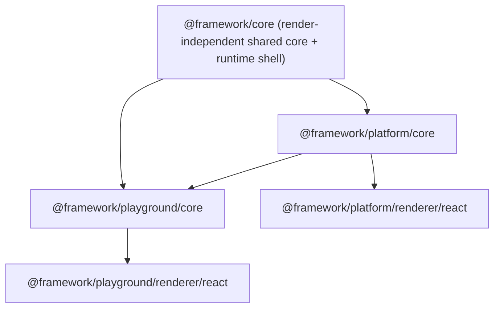

# Framework Core Abstraction

## Context

`framework/core/index.ts` and `framework/core/AGENTS.md` are empty placeholders; there is no package scaffolding for `@framework/core` yet. The two product cores duplicate a large render-independent surface:

- [framework/product/platform/core/index.ts](framework/product/platform/core/index.ts) (`@framework/platform/core`)
- [framework/product/playground/core/core.ts](framework/product/playground/core/core.ts) (`@framework/playground/core`)

Both core files are already React/DOM-free; React lives only in `renderer/react/*`. The move into `framework/product/...` is mid-flight and inconsistent: root [package.json](package.json) `workspaces` still list `framework/platform/...`, the `node_modules/@framework` symlinks are broken, and moved files carry stale relative paths.

Per [AGENTS.md](AGENTS.md): work inside one ticket, structure with `//#region` blocks, extend the in-source `🧪Tests` regions (no new test files), keep everything render-independent, no legacy/back-compat. `AGENTS.md` files must not be edited (the empty `framework/core/AGENTS.md` stays as-is). The `repo` MCP is not connected in this session, so the ticket is created on disk following convention: `.repo/🎫/26/05/30/FRAMEWORK-CORE-ABSTRACTION/` under goal `AI-OPTIMIZED-REPO`.

## Target dependency shape

## What moves into `@framework/core`

Render-independent primitives + the shared runtime shell:

- Primitives: `JsonPrimitive`/`JsonValue`, `Disposable`, `CommandDescriptor`, `StyleSpec`.
- Base UI nodes: `UiStackNode`, `UiTextNode`, `UiButtonNode`, `UiSeparatorNode` and a `UiPrimitiveNode` union that products extend with their own surface nodes.
- `WindowMeasure*`.
- Layout types + factories (`createWindowLayout`, `createStackLayout`, `createDefaultLayout`, `createTabStackLayout`).
- `Expertise`.
- Toolbar block (`AppToolCategory`, `APP_TOOL_CATEGORY_ORDER`, `ToolItem`, `AppTools`, `mergeAppTools`, `countAppTools`, `listPopulatedToolCategories`).
- `SideTabSpec`, `FooterItem` (base includes optional `content`), `SearchItemSpec` + `mergeSearchItems`, `FindItem`.
- `ObservableCell` + subscriber type, `CommandBus`, `Controller`.
- `mergeById`, `resolveMode`.
- Runtime shell as specializable base classes: `WindowKindRuntime` (common `id/label/bodyKey/iconId/measures`), `ModeRuntime` (common fields), `AppRuntime` (generic over mode/window-kind with `addMode/getActiveModeId/setActiveModeId/resolve` + a `resolveBaseAppState` helper), `ResolvedAppState` base, and the `Platform` shell (apps, active app, generation, subscribe/notify, panel visibility, uri/navigation, `commandBus`).
- Generic declarative body registry: `createBodyRegistry<Ctx>()` + a `BodyViewContext` base; each product instantiates its own window/side-panel registry with its own context shape (`platform:` vs `runtime:`).

## What stays product-specific

- Platform: component host surface nodes (`table`/`puzzle2d`/`puzzle3d`/`puzzle5d`/`cad`/`panel`) + builders + canvas-only assertions + `ComponentKind`; `Capability`, `SurfaceDefinition`/`SurfaceRouter`/`ContributionRegistry`, `PlatformDefinition`, `PluginHost`/`PluginContext`/`PluginManifest`, `PlatformPlugin*`, `resolveCommandPaletteItems`, context keys; platform subclasses of `WindowKindRuntime`/`ModeRuntime`/`AppRuntime`/`ResolvedAppState` adding `capabilities/surfaces/commands/findItems/selection/hover/options`.
- Playground: its declarative node union (`section`/`field`/`input`/`select`/`toggle`/`vec3`/`keyValue`/`tree` + table/scene hosts), `WindowEngagement*`, `PlaygroundController` and all `buildPlayground*`/`bootstrapPlaygroundWorkbench` helpers, persisted-theme parsers; playground subclass of `WindowKindRuntime` adding `engagement`. Playground re-exports `Platform` and the puzzle/cad surface builders/nodes (now `Platform` from core, surface nodes from `@framework/platform/core`).

Both product cores `export * from "@framework/core"` (plus their specializations), so existing import sites under `@framework/platform/core` / `@framework/playground/core` and the renderers keep working unchanged.

## Wiring fixes (restructure cleanup)

- Root [package.json](package.json) `workspaces`: replace the four `framework/platform/*` + `framework/playground/*` entries with `framework/core`, `framework/product/platform/core`, `framework/product/platform/renderer/react`, `framework/product/playground/core`, `framework/product/playground/renderer/react`.
- Create `framework/core/{package.json,project.json,script.ts,vitest.config.ts}` mirroring [framework/product/platform/core](framework/product/platform/core) but at depth 2 (`../../node_modules`, `../../repo/lib/js/src/index.ts`, `include: ["index.ts"]`); name `@framework/core`.
- Fix stale relative paths in the moved product files (now at depth 4): `project.json` `cwd` (`framework/platform/core` -> `framework/product/platform/core`, same for the other three), `script.ts` repo import (`../../../repo/...` -> `../../../../repo/...`), `package.json` `repository.directory`, and `playground/core/vitest.config.ts` `@ui/react` alias depth (`../../../ui` -> `../../../../ui`).
- Add `@framework/core: "workspace:*"` to platform/core and playground/core `package.json`; drop the unused React/`@ui` deps from `playground/core/package.json` (its core is React-free); keep playground's `@framework/platform/core` dep.
- Register the framework test commands in [.vscode/launch.json](.vscode/launch.json) following existing grouping/order (none exist yet for framework).
- Reinstall with `bun install` to regenerate correct `node_modules/@framework/{core,platform,playground}` symlinks and remove the broken ones.

## Validation

- `bun nx run @framework/core:test`, `@framework/platform/core:test`, `@framework/playground/core:test` (in-source vitest) all green.
- Typecheck the renderers so the re-exported types still resolve from the React layer, confirming render-independence is intact.
- Grep the two product core files to confirm zero React/DOM imports remain.