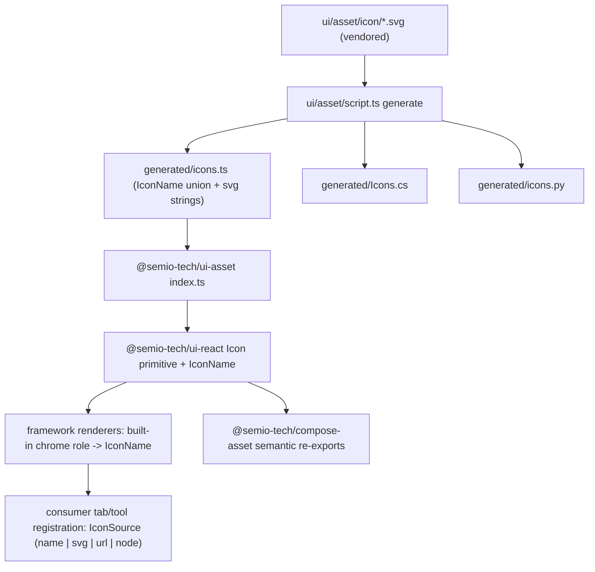

## Context (current state)

- The **platform** and **playground** React renderers import `lucide-react` directly; the **presentation** renderer uses Unicode glyphs (`↺`, `⤢`). See [framework/product/platform/renderer/react/index.tsx](framework/product/platform/renderer/react/index.tsx) (lucide import block ~118-143, `PANEL_KIND_LUCIDE`, `registerTabIcon`, `registerElementIcon`, `resolveTabIconNode`) and [framework/product/playground/renderer/react/index.tsx](framework/product/playground/renderer/react/index.tsx) (duplicate `shellTabIcons`/`registerTabIcon`).
- Core layers ([framework/core/index.ts](framework/core/index.ts)) carry opaque `iconId` strings (`ToolItem.iconId`, `SideTabSpec.iconId`, `FooterItem.iconId`); two **duplicate registries** resolve them in renderers, with inconsistent sizing (`size-tiny`, `size-small`, `size={16}`, `size-10`).
- [ui/react/index.tsx](ui/react/index.tsx) imports lucide directly (`components.json` `iconLibrary: "lucide"`) and types props as `LucideIcon` (`ContextMenuItem.icon`, `Card.icon`, VFS map, `IconSelector`). [compose/asset/index.ts](compose/asset/index.ts) re-exports ~80 lucide symbols under compose names.
- [ui/asset](ui/asset) is today only a static-asset folder (cursors/font/lists) served by `uiAssetsVitePlugin` in [ui/styling/vite-elements-assets.ts](ui/styling/vite-elements-assets.ts); it has no `package.json`/`project.json`/`script.ts`/`index.ts`.

## Decisions (confirmed)

- Vendor SVGs (initial set copied from lucide), with a README notice listing vendored icons + lucide (ISC) attribution.
- New general UI asset package lives at `ui/asset`; the JS `Icon` interface lives in `@semio-tech/ui-react`.
- `ui/asset/script.ts` codegen emits bindings for **JS/TS, .NET (C#), and Python** from the SVG source of truth.
- Remove direct lucide from **framework + `@semio-tech/ui-react` + `@semio-tech/compose-asset`** (full migration).

## Architecture

## 1. New `@semio-tech/ui-asset` package (source of truth + codegen)

- Add [ui/asset/package.json](ui/asset/package.json) (`@semio-tech/ui-asset`, library, no lucide dep), [ui/asset/project.json](ui/asset/project.json) with `build`/`dev` targets calling `bun ./script.ts generate ...` (mirror [compose/asset/logo/project.json](compose/asset/logo/project.json)), and a single [ui/asset/script.ts](ui/asset/script.ts) using `BundleScript`/`ScriptRouter`/`runBundleScriptMain` from `repo/lib/js/index.ts` (mirror [compose/asset/logo/script.ts](compose/asset/logo/script.ts)).
- `script.ts generate {js|net|py|all}` reads `ui/asset/icon/*.svg`, normalizes (strip fixed width/height, force `stroke="currentColor"`/`fill` conventions), and writes into `ui/asset/icon/generated/`:
  - `icons.ts`: `export const ICONS = { ... } as const; export type IconName = keyof typeof ICONS;`
  - `Icons.cs`: static class with name constants + `IReadOnlyDictionary<string,string>`.
  - `icons.py`: `ICONS: dict[str,str]` + `IconName` literal.
- Add [ui/asset/index.ts](ui/asset/index.ts) barrel re-exporting `ICONS`/`IconName` from generated JS.
- Vendor SVGs into `ui/asset/icon/*.svg` for the union of icon names currently used (chrome roles + compose-named set). Add `ui/asset/README.md` listing every vendored-from-lucide icon and the lucide ISC attribution.
- Register `@semio-tech/ui-asset` in root [package.json](package.json) `workspaces` and add a `📦build👤ui🏪assets` entry in [.vscode/launch.json](.vscode/launch.json) following the existing `4_build` group ordering/naming.

## 2. `Icon` interface in `@semio-tech/ui-react` (library-agnostic primitive)

In [ui/react/index.tsx](ui/react/index.tsx), add a `#region 🔖Icon`:

- `export type { IconName } from "@semio-tech/ui-asset"`.
- `export type IconSource = IconName | { name: IconName } | { svg: string } | { url: string } | { node: React.ReactNode }` — the abstraction by which registrants "provide an asset or link to an existing one".
- `export interface IconProps { icon: IconSource; size?: number | "tiny" | "small" | "base" | "large"; className?; title? }` and `export function Icon(props)` rendering vendored inline SVG via a sized wrapper using `currentColor` and the existing size tokens. No lucide.
- Migrate internal lucide usages to `Icon`/`IconName`: remove the lucide import block, switch `ContextMenuItem.icon`, `Card.icon`, `renderContextMenuIcon`, `IconSelector`, and the VFS `VIRTUAL_FILE_SYSTEM_ICON_BY_ID`/`virtualFileSystemKindIcon` map to `IconName`/`IconSource`. Keep `Cursor`/`Spinner` (already custom SVG).
- Remove `lucide-react` from [ui/react/package.json](ui/react/package.json) and set `components.json` `iconLibrary` accordingly.

## 3. Framework: framework-chosen static icons + unified registry

- In [framework/product/platform/renderer/react/index.tsx](framework/product/platform/renderer/react/index.tsx): delete the lucide import block; replace `PANEL_KIND_LUCIDE` with `PANEL_KIND_ICON: Record<PanelKind, IconName>` (framework owns this mapping). Replace all inline lucide usages (navbar back/forward/up, search/find, footer minimize, toolbar category icons, window measure check) with `<Icon name=... size=...>` at consistent sizes. Unify the icon registry into one `registerIcon(iconId, IconSource)` / `resolveIcon(iconId)` mechanism (replacing `registerTabIcon`+`registerElementIcon`).
- In [framework/product/playground/renderer/react/index.tsx](framework/product/playground/renderer/react/index.tsx): remove the duplicate `shellTabIcons`/`registerTabIcon`/lucide imports and consume the shared registry + `Icon`. Panel toggle icon strategy made consistent with platform (use first tab icon, falling back to framework default).
- In [framework/product/presentation/renderer/react/index.tsx](framework/product/presentation/renderer/react/index.tsx): replace `↺`/`⤢` glyphs with `<Icon name="reset">` / `<Icon name="maximize">`.
- Built-in chrome `iconId`s (e.g. `workbench`, `details`, `settings`, `chat`, `windows`, `overview`) resolve to framework defaults; consumer-registered tabs/tool/footer items must supply an `IconSource` via the registration API / `SidePanelTabConfig.icon` / `augmentPanelTabs`, otherwise a visible missing-icon placeholder is shown.
- Sizing: route every framework icon through `Icon` size tokens; drop ad-hoc `size-tiny`/`size-small`/`size={16}`/`size-10`.
- Remove `lucide-react` from [framework/product/platform/renderer/react/package.json](framework/product/platform/renderer/react/package.json) and [framework/product/playground/renderer/react/package.json](framework/product/playground/renderer/react/package.json).

## 4. `@semio-tech/compose-asset` migration

- In [compose/asset/index.ts](compose/asset/index.ts): replace the lucide re-export block with compose-named exports backed by `@semio-tech/ui-react` `Icon` / `@semio-tech/ui-asset` `IconName` (keep names like `WorkbenchIcon`, `DetailsIcon`, etc.). Drop `lucide-react` from [compose/asset/package.json](compose/asset/package.json). Repurpose/zero the `@semio-tech/compose-icon` placeholder ([compose/asset/icon/project.json](compose/asset/icon/project.json)) to delegate to `@semio-tech/ui-asset` or note it as superseded.

## 5. Tests (extend existing only)

- Update the inline vitest blocks in the renderer `index.tsx` files (they currently assert lucide CSS classes) to assert vendored-svg/`data-icon` output.
- Extend `@semio-tech/ui-react` tests for the new `Icon` primitive and add inline tests in `ui/asset/script.ts` for SVG normalization + generated-name stability.

## 6. Remaining direct lucide consumers (same ticket, after core waves)

- [puzzle/2d/react](puzzle/2d/react), [puzzle/3d/react](puzzle/3d/react), [puzzle/5d/react](puzzle/5d/react), and [cad/js/renderer/play/index.tsx](cad/js/renderer/play/index.tsx) also import lucide directly; migrate them to `@semio-tech/ui-react` `Icon` / `@semio-tech/compose-asset`. Storybook stories under `.storybook/story/ui/*` that import lucide are updated to use `Icon`.

## Notes

- All work happens inside a repo MCP ticket (open first, associate with the most appropriate goal from `repo://goals`, close with summary at the end). Code is added via regions/subregions; no new script/test/example files beyond the package's single `script.ts`.

[{"id": "ticket", "content": "Open repo MCP ticket, read repo://goals and associate with the best goal."}, {"id": "assets-pkg", "content": "Create @semio-tech/ui-asset package: package.json, project.json, script.ts (js/net/py codegen), index.ts; vendor lucide SVGs into ui/asset/icon/*.svg; add README notice; register in root workspaces + launch.json."}, {"id": "icon-primitive", "content": "Add library-agnostic Icon primitive + IconName/IconSource to @semio-tech/ui-react; migrate @semio-tech/ui-react internals off lucide; drop lucide dep."}, {"id": "framework-chrome", "content": "Framework renderers: replace lucide/glyphs with Icon, framework-owned chrome icon mapping, unified single icon registry, consistent sizing; drop lucide deps."}, {"id": "compose-assets", "content": "Migrate @semio-tech/compose-asset semantic re-exports onto @semio-tech/ui-asset/@semio-tech/ui-react; drop lucide dep."}, {"id": "tests", "content": "Extend existing vitest blocks (renderers, @semio-tech/ui-react, ui/asset script) to cover new icon rendering and codegen."}, {"id": "remaining-lucide", "content": "Migrate remaining direct lucide consumers (puzzle 2d/3d/5d react, cad play, storybook stories)."}, {"id": "close", "content": "Run builds/tests, then close ticket with summary and file list."}]
