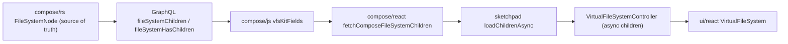

# Full Virtual File System for compose

Make `compose/rs` `FileSystemNode` the single source of truth and have sketchpad lazily fetch children over GraphQL. Document: `Kit -> Folders/Files/Designs/Types/Families` (nested by folder), `Type -> Representations/Ports/Connectors`, `Design -> Pieces/Connections`, everything else is a leaf.

Per repo rules, open a ticket via repo MCP first; associate to goal `compose` (ticket `VIRTUAL-FILE-SYSTEM-ROW-SELECTION` is selection-only, so create a new ticket e.g. `FULL-VIRTUAL-FILE-SYSTEM`). Extend existing files/tests only (no new files outside the ticket folder). No legacy/back-compat.

## 1. compose/rs (`compose/client/lib/rs/lib.rs`) - source of truth

- Add `Representation`, `Port`, `Connector` to `FileSystemNodeKind` enum (around line 13110) and to `FileSystemNodeInterface` enum (`pub enum FileSystemNodeInterface`, ~~13199), plus `matches_id` arms (~~13212).
- Extend `file_system_vfs::children_nodes` (~13398): add a `Type` arm yielding its `representations`, `ports`, `connectors` (currently `_ => Vec::new()`); keep `Design -> pieces + connections`. Representation/Port/Connector/Piece/Connection/File/Family stay leaves.
- Extend `file_system_vfs::parent` (~~13350), `path_inner` (~~13483), `name` (~13562), and `file_system_kind` macro arms (lines 268-277 and 351-376) for the three new variants. Parent of a representation/port/connector resolves to its `owner_type` `Type` (each struct has `owner_type: Weak<Type>`, lines 2807/2882/2998).
- Add `node_for_representation/port/connector` resolvers mirroring `node_for_type` (~13258), looking up the live entity from `owner_type` -> kit types.
- Add computed `fileSystemHasChildren: Boolean!` to the interface: new `field(...)` in the `#[graphql(name = "FileSystemNode", ...)]` block (~13186), a `file_system_vfs::has_children(node)` helper (non-empty `children_nodes`), and `file_system_has_children` methods in both `file_system_node_complex_methods!` (line 206) and `file_system_node_vfs_complex_ctx!` (line 284) macros.
- Make `Representation`, `Port`, `Connector` implement the interface: invoke `file_system_node_vfs_complex_ctx!(Type, node_for_x)`-style impls for them (they are hand-written `#[Object]` types with manual `owner`/`owns`), so they expose `fileSystem*` fields.
- Regenerate/update the golden + working schema below to match (rs emits the schema).

## 2. GraphQL schema (`compose/client/schema/graphql/schema.golden.graphql` + `schema.graphql`)

- `enum FileSystemNodeKind` (line 123): add `REPRESENTATION`, `PORT`, `CONNECTOR`.
- `interface FileSystemNode` (line 134): add `fileSystemHasChildren: Boolean! # computed`.
- Add `& FileSystemNode` to the `implements` lists of `Representation`, `Port`, `Connector` type definitions; add the interface fields to each.

## 3. compose/js (`compose/client/lib/js/index.ts`)

- `vfsKitFields` (~1419): add a `fileSystemHasChildren` field entry; include `fileSystemHasChildren` in the `fileSystemChildren` child selection (`node { id fileSystemKind fileSystemName fileSystemPath fileSystemHasChildren }`) so each child carries name/path/hasChildren in one query.
- `resolveFileSystemNode` (~1390): add `REPRESENTATION`/`PORT`/`CONNECTOR` cases returning the right entity classes.
- Ensure `Representation`, `Port`, `Connector` entity classes spread `vfsKitFields(...)` into their field defs (verify where `Type`/`Design` attach them and add the same).

## 4. compose/react (`compose/client/lib/react/index.ts`)

- Expose an imperative helper (e.g. `fetchComposeFileSystemChildren(store, nodeId, kind)` and `fetchComposeFileSystemRoot`) that runs the `fileSystemChildren` query via the js store and returns `{ id, kind, name, path, hasChildren }[]`. Sketchpad must consume VFS only through react, never `@semio-tech/compose-js` directly.

## 5. framework/product/platform/core (`framework/product/platform/core/index.ts`) - async children

- `VirtualFileSystemController` (~~650): add async children support. Add an overridable `protected loadChildrenAsync(parentId, scope): Promise<readonly VirtualFileSystemNodeRecord[]> | undefined` (default `undefined`). In `ensureChildrenLoaded` (~~706): if `loadChildrenAsync` is provided and the parent isn't cached/in-flight, mark in-flight (new `requestedChildrenByScope` set), call it, then `childrenStore.setChildren` + `this.emit()`; otherwise fall back to sync `loadChildren`. Keeps demo/home controllers working unchanged.

## 6. compose/sketchpad (`compose/client/lib/sketchpad/js/index.ts`) - rewire kit/design VFS

- Extend `SKETCHPAD_KIT_VIRTUAL_FILE_SYSTEM_SCHEMA_MODEL` (~12187): add `representation`, `port`, `connector` fileNodeKinds and give every kind a distinct `icon` (kit/folder/file/design/type/family/piece/connection/representation/port/connector).
- Add a kind map `rs FileSystemNodeKind -> sketchpad fileNodeKindId`, and a builder turning fetched child refs into `VirtualFileSystemNodeRecord` (name, path, `hasChildren`, `navigateUri`, `descriptorValues`). `navigateUri` per kind: type `/kits/{kit}/type/{id}`, design `/kits/{kit}/design/{id}`, representation -> `sketchpadTypeRepresentationSurfaceId`-based route, folder `?folder=`, file `?file=`, piece/connection -> design route-selection query.
- In `SketchpadShellController` (~13115): for `SKETCHPAD_KIT_APP_ID` and `SKETCHPAD_DESIGN_APP_ID`, override `loadChildrenAsync` to call the react helper against `getKitStore(kitId)` (the `ComposeJsKitStore`); remove the kit/design branches from the sync `sketchpadKitVfsChildren` path. Keep `SKETCHPAD_HOME_APP_ID` client-side (open kits + Documentation are sketchpad concepts, not kit entities).
- Map node ids consistently with rs entity ids so expand/selection/route state keep working; root remains the kit/design node.

## 7. ui/react (`ui/react/index.tsx`)

- `virtualFileSystemKindIcon` (~13404): add fallback icons for `design/type/family/piece/connection/representation/port/connector` (schema-provided icons still take precedence via `VirtualFileSystemNodeGlyph`).

## 8. Tests + story (extend existing only)

- rs `lib.rs` test region: assert `Type.fileSystemChildren` yields representations/ports/connectors, `fileSystemHasChildren`, parent/path for new kinds.
- js test region: `fileSystemChildren` resolves new kinds + `fileSystemHasChildren`.
- framework core test region: async `loadChildrenAsync` populates children + emits.
- sketchpad test region: kit/design VFS builds rs-driven rows (folder nesting, type->representations).
- Update `.storybook/story/ui/VirtualFileSystem.stories.tsx` demo to show the richer kind set/icons.

## Validation

- `cargo test` (rs) for the VFS region; bun/nx test for js, react, framework core, sketchpad via existing `launch.json`/`project.json` targets; regenerate golden schema and confirm it is committed/clean. Confirm runtime by expanding a kit in sketchpad (folders nest, types expand to representations) with temporary `[DEBUG]` logs, then remove them. Close the ticket with summary + touched files.

