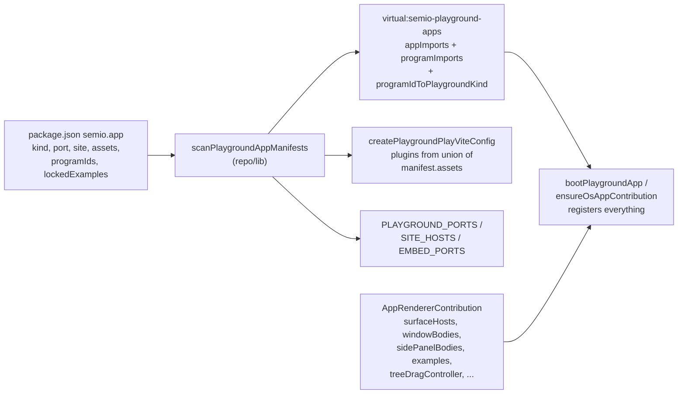

# Fully Derived Playground Infrastructure

## Goal

An app is fully defined by exactly three things it owns:

1. a `semio.app` manifest in its own `package.json`
2. a `PlaygroundAppDefinition` export from its core (`definitionExport`)
3. an `AppRendererContribution` (+ optional `OsProgramContribution`, `programExport`)

The framework derives everything else — ports, dev CLI aliases, site hosts, Vite asset plugins, window/panel body registration, OS program routing. No central per-app table, switch, or special-case remains.



## Part 1 — Manifest schema extension ([repo/lib/js/index.ts](repo/lib/js/index.ts))

Extend `PlaygroundAppManifest` (lines 1175-1187) with optional fields so apps can declare what the central tables currently hardcode:

- `site?: { readonly embedKind: string; readonly host: string }` — replaces `PLAYGROUND_SITE_HOSTS` (1153-1159), `PlaygroundEmbedSiteKind` (1107), and `resolvePlaygroundEmbedSiteDevPorts`'s hardcoded kind→hostKind map (1113-1118). Add to compose-sketchpad, cad, puzzle 2d/3d/5d manifests (`embedKind: "compose" | "cad" | "2d" | "3d" | "5d"`, hosts `play.*.semio-tech.com`).
- `assets?: readonly ("puzzle3d-meshes" | "gis-tiles" | "sketchpad-mdx")[]` — names of framework-provided Vite program factories the app needs (Part 4).
- `programIds?: readonly string[]` — extra program-id aliases routing to this app (replaces `PROGRAM_ID_RESIDUAL`, Part 5).
- `lockedExampleFixtures?: Readonly<Record<string, readonly string[]>>` — replaces `PUZZLE_3D_LOCKED_FIXTURE_JSON_REL` in [ui/styling/vite-elements-assets.ts](ui/styling/vite-elements-assets.ts) (422-431); declared on puzzle 3d/5d manifests.
- `optimizeDepsExclude?: readonly string[]` — replaces `FLOW_WASM_MODULE_OPTIMIZE_DEPS_EXCLUDE` (1177-1186); declared on flow manifest.

Derive the remaining port seeds from manifests: give `s/core`, compose-sketchpad, and projektetage packages their own `semio.app` manifests carrying their ports (6066/6067, 4000, 6050); only `storybook` (pure tooling, no app package) stays as a framework seed in `buildPlaygroundPortsFromManifests` (1018-1022). Generalize `devServerPlayEntry` (1303-1314) to stop regex-matching puzzle-specific env output.

## Part 2 — Declarative body registration (framework + ~24 apps)

Add to `AppRendererContribution` ([framework/product/platform/core/js/index.ts](framework/product/platform/core/js/index.ts) 2384-2393):

```ts
readonly windowBodies?: Readonly<Record<string, WindowBodyFactory>>;
readonly sidePanelBodies?: Readonly<Record<string, SidePanelBodyFactory>>;
```

- `applyAppRendererContribution` ([framework/product/playground/renderer/react/index.tsx](framework/product/playground/renderer/react/index.tsx) 1606-1616) registers them via existing `registerWindowBody` / `registerSidePanelBody`.
- Remove `registerBodies` / `registerSurfaceHosts` from the `createPlaygroundApp` config shape ([framework/product/playground/core/js/index.ts](framework/product/playground/core/js/index.ts) 611-617) and from `bootPlaygroundApp` (1619-1639); the contribution is the single registration source.
- Migrate all ~24 apps: move each app's imperative `registerWindowBody(...)` / surface-host calls into its contribution's `windowBodies` / `surfaceHosts` maps (draw, note, writer, forms, raster, flow, gis, procedural-2d/3d, shooting, trinity-jack/rewrite, puzzle-2d/3d/5d, presentation, sequence, layout, imperative, lowpoly, vcs, cad, s, reasoning.mindmap).

## Part 3 — compose.sketchpad becomes a real manifest app

- Add a full `semio.app` manifest to the sketchpad package (`kind: "sketchpad"`, `port: { dev: 4000 }`, `programId: "compose.sketchpad"`, `programExport: "sketchpadProgramContribution"`, `definitionExport`, `instanceHost` in its renderer contribution wrapping the current `SSketchpadHost` mount).
- Delete the 2 special-case branches in [s/react/play-host.tsx](s/react/play-host.tsx) (100-105, 128-135) — sketchpad resolves through `ensureOsAppContribution` like every other app.
- Delete the hardcoded `sketchpadProgramContribution` import in `bootstrapSPlayExtensions` ([s/core/js/index.ts](s/core/js/index.ts) 115-124) and its twin in [s/core/js/internal.ts](s/core/js/internal.ts) (396-405) — it now loads via `loadAllOsProgramContributions()`.
- Remove the `compose.sketchpad` entry from `TECHNOLOGY_APP_RESOURCE_BY_PROGRAM` ([s/core/js/internal.ts](s/core/js/internal.ts) 255-257) in favor of the program contribution's own resources.
- Delete the dead [framework/product/playground/core/js/compose-sketchpad-stub.ts](framework/product/playground/core/js/compose-sketchpad-stub.ts) (verified unreferenced). Keep `playgroundComposeSketchpadStubPlugin` only if non-s bundles still need to exclude MDX weight — gate it by "sketchpad not in this build's asset set" instead of `playEntryKind === "s"`.

## Part 4 — Vite config derived from manifest `assets` ([ui/styling/vite-elements-assets.ts](ui/styling/vite-elements-assets.ts))

- Replace the `playEntryKind === "3d" | "5d" | "shooting"` / `=== "map"` / `=== "s"` dispatch in `createPlaygroundPlayViteConfig` (1417-1441) with: scan manifests, collect the union of `assets` declared by apps in the build, apply the matching framework program factories (`puzzle3d-meshes` → `puzzle3dMeshesVitePlugin`, `gis-tiles` → `gisMapTilesVitePlugins`, `sketchpad-mdx` → sketchpad MDX program). Fixes the stale `"map"` vs `"gis-2d"` kind mismatch (line 1437) at the root.
- Delete the closed `PlaygroundRendererPuzzleKind` union (line 694); `playEntryKind` becomes `string` validated against scanned manifest kinds.
- `puzzle3dLockedExampleMeshBasenames` (457-479) reads `lockedExampleFixtures` from puzzle manifests instead of `PUZZLE_3D_LOCKED_FIXTURE_JSON_REL`; also fixes the currently failing ui-styling test.
- Rename the misnamed `PUZZLE_PLAY_ENTRY` env/define to `PLAYGROUND_APP_KIND` everywhere (it is the generic app selector, not puzzle-specific).
- The s-host-only extras (playwright/vitest dev stubs, react include pattern) move behind the s manifest's own `assets` declaration.

## Part 5 — Program-id routing fully manifest-derived

- The virtual module ([ui/styling/vite-elements-assets.ts](ui/styling/vite-elements-assets.ts) 1210-1239) emits `programIdToPlaygroundKind` from `programId` plus new `programIds` aliases; delete its 2 inline residual entries.
- Delete `PROGRAM_ID_RESIDUAL` in [framework/product/os/renderer/react/app-contribution-registry.ts](framework/product/os/renderer/react/app-contribution-registry.ts) (9-19): give the reasoning.mindmap wires core its own `semio.app` manifest (`programId: "reasoning.mindmap"`, routing to the puzzle-2d host via `hostKind`), and add `programIds: ["presentation.deck"]` to the presentation manifest.

## Part 6 — Example-host contract tightening

`controllerBackedExampleContribution` ([framework/product/playground/renderer/react/index.tsx](framework/product/playground/renderer/react/index.tsx) 1042-1054) still silently duck-detects `getExampleCatalog` at runtime. Since every app now explicitly opts in via `examples:`, make `resolvePlaygroundExampleCatalog` throw a clear error when the active controller does not implement `PlaygroundExampleHost` (misconfiguration is a bug, not a fallback case). Keep the interface as the typed contract.

## Verification

- Tests for touched packages: `repo-lib`, `ui-styling`, `framework-platform-core`, `framework-playground-core`, `framework-playground-renderer-react`, `framework-os-core`, `framework-os-renderer-react`, `s-core`, `s-react`, plus every migrated app core/react.
- dependency-cruiser via `bunx dependency-cruiser --config .dependency-cruiser.cjs` on framework + s.
- Boot representative dev entries (draw, puzzle 2d, cad, gis 2d for tiles, S/OS studio incl. opening a sketchpad instance) with `[DEBUG]` logs to confirm derived ports, asset plugins, example dropdowns, and body registration.

## Work tracking

Reopen the `APP-ISOLATION-ENFORCED-BOUNDARIES` ticket (`.repo/🎫/26/07/03/`); all temp scripts/logs go into its folder.
