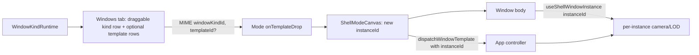

## Problems

- CAD play registers 4 window kinds with no `templates`, so the Display "Windows" tab renders empty sections ("window tabs with no windows").
- Puzzle 2D templates use wrong arg names/tokens (`{ paneId, mode: "auto"|"manual" }` vs handler `{ pane, value: "automatic"|<DrawLodKind> }`), and bodies key state by pane (not instance), so a drop is a silent no-operation and duplicates collide.
- Puzzle 3D works because its body scopes camera by `useShellWindowInstance().instanceId` and its template command takes `instanceId`. We make that the general rule.

## Part 1 - General mechanism: draggable kinds + optional templateId

Make every window KIND draggable (spawns a new instance, no command); templates become optional child rows that also dispatch a preset with `instanceId`.

- `[ui/react/index.tsx](ui/react/index.tsx)`
  - `WindowTemplateDropPayload` (~15870): make `templateId?: string` optional.
  - `handleExternalTemplateDrop` (~17062): drop the `typeof payload.templateId !== "string"` requirement; only `windowKindId` is required.
- `[framework/product/platform/renderer/react/index.tsx](framework/product/platform/renderer/react/index.tsx)`
  - `buildDisplayWindowsTree` (~~1137-1177): for each kind emit a draggable parent row (payload `{ windowKindId }`, no `templateId`) and keep template child rows (`{ windowKindId, templateId }`). Relax `onDragStart` validation (~~1157) to allow a missing `templateId`.
  - `dispatchWindowTemplate` (~~778) and `handleTemplateDrop` (~~1419): already guard `if (!templateId) return`; confirm a missing templateId just creates the instance (title falls back to the kind label). `WindowTemplateDropPayload` import stays.

## Part 2 - Per-instance scoping helper (general)

Per-window state must key off the shell instance so duplicates are independent.

- Rule: window bodies read `useShellWindowInstance()?.instanceId ?? <windowKindId fallback>` and use it as the key for camera/LOD/view state. Default-layout windows get `instanceId === windowKindId` (via `bootstrapShellInstances`), so existing single-window behavior is unchanged; only dropped duplicates diverge.
- Template command handlers accept `instanceId` (already merged into args by `dispatchWindowTemplate`) and scope their mutation to that instance, falling back to shared state when absent.

## Part 3 - Puzzle 2D play

- `[puzzle/2d/play/index.ts](puzzle/2d/play/index.ts)`
  - Fix `PUZZLE_2D_PANE_TEMPLATES` (~115-126): use real tokens. Keep them as presets of the LOD command but make the command instance-aware (see below). Map labels to valid values (`"automatic"` or a `Puzzle2dDrawLodKind` like `"detail"`).
  - `setLodModeForPane` handler (~968-976): accept `{ instanceId?, value }` (and keep `pane` for the existing measure UI). Store LOD mode keyed by instance id, not just pane.
- `[framework/product/playground/renderer/react/index.tsx](framework/product/playground/renderer/react/index.tsx)`
  - `Puzzle2dPlayPaneSurfaceHost` (~2805): read `useShellWindowInstance()` and pass `instanceId` (fallback `paneId`) into `Puzzle2dPlayPaneCanvas`.
  - Re-key `camerasByPane` and `getLodModeByPane()` consumers (~2232, ~2706, ~3565) to a `Record<string, ...>` keyed by instance id, defaulting lazily from the pane baseline so the 3 default windows behave as today.
  - `onPuzzle2dPlayActiveWindowChange` (~3604): resolve the window kind / pane from the instance id instead of requiring the id to equal a pane id, so dropped windows still sync the active pane.

## Part 4 - CAD play

- `[cad/js/renderer/play/index.tsx](cad/js/renderer/play/index.tsx)`
  - The empty-rows bug is fixed for free by Part 1 (each of the 4 kinds becomes draggable). No templates strictly required.
  - For full per-instance independence (scope_all): `CadPlaySurfaceHost` / `CadPlayInteractionPane` (~~2147-2159) read `useShellWindowInstance()` and scope camera/interaction state by instance id (model-definition stays keyed by pane). `onActiveWindowChange` (~~743) resolves the pane from the instance id.
  - Optionally add orbit-style view templates per scene using the shared `createOrbitCameraViewTemplates({ controllerId: CAD_PLAY_CONTROLLER_ID })` from `@semio-tech/infinite-world-r3f` if CAD scenes expose an orbit camera; otherwise leave templates empty (kind row still draggable).

## Part 5 - Tests (extend existing files only)

- `[framework/product/platform/renderer/react/index.tsx](framework/product/platform/renderer/react/index.tsx)` vitest: kind row without `templateId` produces a drop payload and creates an instance; template child still dispatches with `instanceId`.
- `[puzzle/2d/play/index.ts](puzzle/2d/play/index.ts)` vitest: `setLodModeForPane` with `{ instanceId, value }` updates per-instance LOD; legacy `{ pane, value }` still works.
- `[cad/js/renderer/play/index.tsx](cad/js/renderer/play/index.tsx)` vitest: each window kind yields a draggable Windows-tab row.
- Re-run `@semio-tech/infinite-world-r3f`, `@semio-tech/puzzle-3d-play`, `@semio-tech/puzzle-2d-play`, `@framework/...` suites.

## Flow

## Notes / decisions

- Drag preview chrome is fully generic in `Mode`; no per-product preview work needed.
- Default single-window behavior is preserved because default instance ids equal the window kind id.
- Sticking to existing files and regions per repo rules; no new files.
