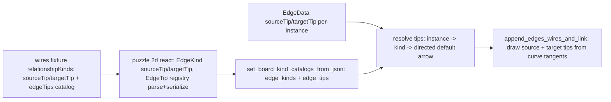

# General Edge Tips Across the Graph Board

## Root causes of "no edge tips"

1. Stale WASM. `[puzzle/2d/react/script.ts](puzzle/2d/react/script.ts)` sets `PUZZLE_2D_RS_SKIP_WASM_BUILD: existsSync(wasmJs) ? "1" : "0"`, and the canvas loads the prebuilt `../rs/pkg/puzzle_2d_bg.wasm`. All prior Rust marker code never entered the running binary.
2. Narrow + leaky design. `EdgeEndMarker` (`[puzzle/2d/rs/lib.rs](puzzle/2d/rs/lib.rs)` ~~519) supports only a single target-end marker and falls back to `EdgeEndMarker::from_wires_edge_kind` (~~538), hardcoding `wires.is`/`wires.has`/`wires.owns`/`wires.references` inside puzzle 2d core. This violates the no-technology-leak rule and cannot express both-ends tips.

## Target architecture

- Tips are board-level and apply to every edge (and reuse the same drawing for wires later).
- Both ends: independent `source_tip` and `target_tip`.
- Extensible registry: tips referenced by string id, resolved against `edge_tips` map seeded with built-ins (`arrow`, `fine-arrow`, `filled-diamond`, `open-diamond`) and extendable from catalog `edgeTips`.
- Directed specialization: board is `GraphEngine<Ported, Directed>`; directed edge kinds default `target_tip = arrow` when nothing explicit is set. `targetTip: "none"` or `directed: false` opts out.

## Rust: `[puzzle/2d/rs/lib.rs](puzzle/2d/rs/lib.rs)`

- Replace `EdgeEndMarker` with `EdgeTipDef { geometry: EdgeTipGeometry, filled: bool, scale: f64 }` and `EdgeTipGeometry { Arrow, FineArrow, Diamond, Circle, Bar }`. Remove `from_wires_edge_kind` entirely (kill the technology leak).
- Add `edge_tips: BTreeMap<String, EdgeTipDef>` on `BoardHost`, seeded with built-ins; parse optional `edgeTips` array from `meta.kindCatalogs` in `set_board_kind_catalogs_from_json` (~1324 region).
- `EdgeKindDef`: replace `marker: EdgeEndMarker` with `source_tip: Option<String>`, `target_tip: Option<String>`, `directed: bool` (default true). Parse `sourceTip`/`targetTip`/`directed` instead of `marker` (~1348).
- `EdgeData` (~594): add `source_tip: Option<String>`, `target_tip: Option<String>`; parse from descriptor `sourceTip`/`targetTip`.
- Resolution helper `resolve_edge_tips(e) -> (Option<&EdgeTipDef>, Option<&EdgeTipDef>)`: instance override -> kind default -> if `directed` and no target tip, use `arrow` built-in.
- Generalize `append_edge_end_marker` -> `append_edge_tip(scene, point, dir, color, stroke_w, tip_def)`; in `append_edges_wires_and_link` (~4636) draw target tip from `p2->p3` tangent and source tip from `p1->p0` tangent, both inset along their tangents.
- Update `host_tests` (~6270, ~7635): assert resolved tips per WIRES kind instead of `marker`.

## TS plumbing: `[puzzle/2d/react/index.tsx](puzzle/2d/react/index.tsx)`

- `EdgeKind`: replace `marker` with `sourceTip?`/`targetTip?`/`directed?`.
- Add `EdgeTip` catalog type; parse `edgeTips` in `fixtureMetaKindCatalogBundle`; serialize `edgeTips` + edge `sourceTip`/`targetTip`/`directed` in `serializeKindCatalogBundle`.
- Edge descriptor type: optional `sourceTip`/`targetTip` per-instance.
- Update existing edge-kind parse tests for the new fields.

## WIRES: `[reasoning/mindmap/wires/react/index.ts](reasoning/mindmap/wires/react/index.ts)` + fixture

- Drop `RelationshipKindMarker`/`relationshipKindToMarker` single-marker; add `relationshipKindTips(kind) -> { sourceTip?, targetTip? }`: is -> target `filled-arrow`; references -> target `fine-arrow` (+ dashed, already set); owns -> target `filled-diamond`; has -> target `open-diamond`.
- `WiresRelationshipKindCatalogRow` + `wiresKindCatalogsToPuzzle2d`: emit `sourceTip`/`targetTip` (and `directed: true`) per relationship kind.
- `[reasoning/mindmap/wires/fixture/metabolism.wires.json](reasoning/mindmap/wires/fixture/metabolism.wires.json)`: replace each `relationshipKinds[].marker` with `targetTip` (e.g. `wires.owns` -> `"targetTip": "filled-diamond"`), keep `pattern`/`stroke`.
- Update wires vitest expectations to the new tip fields.

## Validation

- Force WASM rebuild: remove `puzzle/2d/rs/pkg` (or run the rs `wasm` script with `PUZZLE_2D_RS_SKIP_WASM_BUILD=0`) so the new paint code ships, then rebuild the wires play bundle.
- `cargo test` in `puzzle/2d/rs` and `reasoning/mindmap/wires`; `vitest run` for puzzle 2d react and wires.
- Runtime: open the wires play canvas and confirm distinct, visible tips (filled arrow / fine arrow + dashed / filled diamond / open diamond) at the correct ends; capture a screenshot for confirmation.
- Close the working ticket via repo MCP with the touched files.

## Notes / decisions

- Diamonds/arrows are placed at the target end by default (consistent direction reading); source tips remain available for any edge but unused by current WIRES kinds.
- Removing `from_wires_edge_kind` means WIRES visuals now flow entirely through the catalog, satisfying the no-leak rule.

