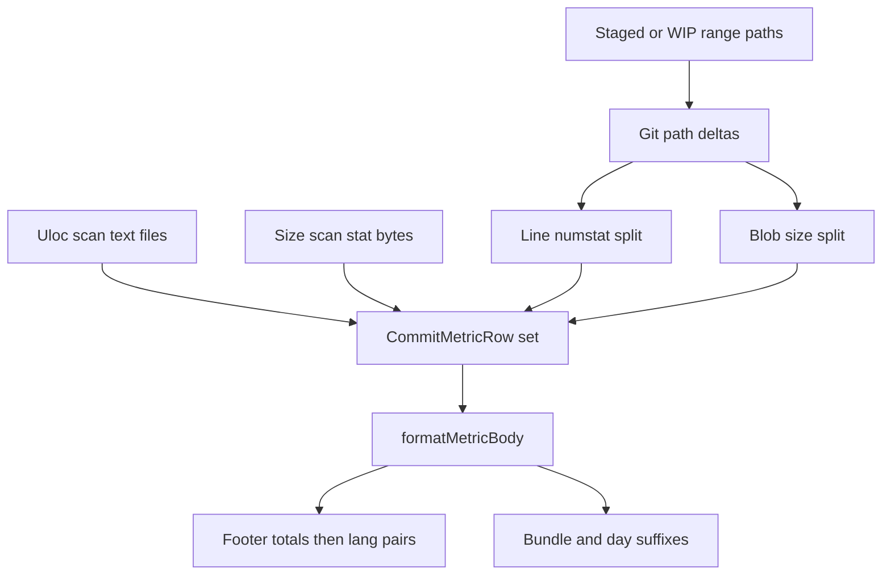

# Generalize Commit Metrics

## Goal / ticket

- Goal: `[AI-OPTIMIZED-REPO/CONSISTENT-REPO-HISTORY](.🧬semio/🦑️repo/🎯️goals/AI-OPTIMIZED-REPO/CONSISTENT-REPO-HISTORY)` (commit-message history consistency).
- On execute: open a new ticket via repo MCP (`ticket_open`) — no open ticket covers this; prior related work is closed `[EXPLICIT-COMMIT-ULOC-METRICS](.🧬semio/🦑️repo/🎫️tickets/🎆️26/� combos07/☀️31/EXPLICIT-COMMIT-ULOC-METRICS)`. Repo MCP was unavailable during planning; authenticate/start it first if needed.
- Keep research notes and scratch checks under the ticket folder; refer to those markdown files in chat (do not dump research into chat).

## Target format (chosen)

Implement the **second** layout from `[.🧬semio/🦑️repo/💬️prompts/🐙️ueli.md](.🧬semio/🦑️repo/💬️prompts/🐙️ueli.md)` (language-first). Do **not** ship the intermediate type-then-language layout.

```
📊️metric📃uloc💯️…          # repo total, kind first
📊️metric💾size💯️…
📊️metric🦀️rust📃uloc💯️…   # language before kind
📊️metric🦀️rust💾size💯️…
…
```

Footer assembly rules:

1. Repo totals for each registered kind (`📃uloc`, then `💾size`).
2. Languages sorted by **uloc** bloc descending (same as today).
3. For each language: emit that language’s rows for every kind that has a non-zero bloc or non-zero deltas (`uloc` then `size`).
4. Segment omit-empty / net / ratio / `🟰️` semantics stay identical to today’s uloc rules.

Line template:

```
📊️metric[{langEmoji}{langSlug}]{kindToken}[💯️{bloc}][📈️|📉️{net}➗️{ratio}][➕️][✏️][➖️][🟰️]
```

## Size semantics (chosen)


| Concern      | Rule                                                                                                                                                                                                                     |
| ------------ | ------------------------------------------------------------------------------------------------------------------------------------------------------------------------------------------------------------------------ |
| Path filters | Same `shouldSkipPathForUloc` / language classification as uloc                                                                                                                                                           |
| File set     | **Include binaries and files > 8MB** via `stat.size` (no content read). Uloc keeps its text/`MAX_METRICS_FILE_BYTES` rules. This is what makes `💾size` a distinct metric rather than a second unit on the same LOC set. |
| Deltas       | Per changed path: `oldBytes` / `newBytes` from git blobs / worktree; treat as numstat pair `(added=new, removed=old)` then reuse `splitGitNumstatDelta` → `✏️`/`➕️`/`➖️`                                                 |
| Formatting   | New `formatMetricSizeCount`: `B` / `KB` / `MB` / `GB` with the same 3-sig-fig style as loc (`10.4GB`, `788KB`, `82MB`)                                                                                                   |
| Ratio        | Same `formatMetricRatio` (percent)                                                                                                                                                                                       |


## Implementation locus

Primary file: `[📦️index.ts](🧰️framework/🛍️products/🦑️repo/🔨️modules/📚️library/📦️packages/🟦️typescript/📦️index.ts)` region `🔖️uloc-metrics` (~2617–3398). Rename/restructure that region to `🔖️commit-metrics` with subregions for kinds, scan, deltas, format, validate.

### 1. Metric-kind registry (extensible)

Introduce a small registry so new kinds are additive:

```ts
type MetricKindId = "uloc" | "size";
type MetricKind = {
  id: MetricKindId;
  token: string; // "📃uloc" | "💾size"
  formatCount: (n: number) => string;
};
```

Constants:

- `COMMIT_METRIC_HEADER = "📊️metric"` (replaces `MICRO_COMMIT_ULOC_HEADER = "📊️uloc"`)
- Kind tokens: `📃uloc`, `💾size`

No backwards compatibility / dual formats — greenfield replace.

### 2. Data model

Generalize rows:

```ts
type CommitMetricRow = {
  kind: MetricKindId;
  lang: string;      // "" for repo total
  emoji: string;
  code: number;      // bloc (LOC or bytes)
  added: number;
  edited: number;
  removed: number;
};
```

Keep `MicroCommitLangMetrics` only if still needed as a thin uloc alias during refactor; prefer one row type used by builders and formatters.

### 3. Scan + cache

- Keep existing uloc scan; add `scanRepoSizeByLanguage` (stat-based, no max-size skip, no binary skip).
- Extend cache to store both maps; bump cache version to **5** and rename file to `.git/compose-metrics-cache.json` (handcraft; old `compose-uloc-cache.json` simply stops being read — no migration).
- Bundle-scoped size: mirror `countUnifiedLocUnderPathPrefixes` with `countBytesUnderPathPrefixes`.

### 4. Formatting

Replace `formatUlocMetricsBody` with `formatMetricBody({ kind, langEmoji?, langSlug?, code, added, edited, removed })`:

- Always starts with `📊️metric`
- If language present: `{emoji}{slug}` **then** `{kindToken}`
- Else: `{kindToken}` only
- Then existing `💯️` / net / ratio / deltas using the kind’s `formatCount`

`formatMicroCommitMetricsLines` becomes multi-kind:

1. Build uloc rows + size rows from the same path/delta set.
2. Emit totals for each kind.
3. Emit per-language pairs sorted by uloc bloc.

Bundle/day suffixes: append **both** kinds on the same line (`…📊️metric📃uloc…📊️metric💾size…`) via a shared `formatBundleMetricSuffixes`.

### 5. Validation / detectors

Update every hard-coded `📊️uloc` guard:

- `MICRO_COMMIT_ULOC_ROW_RE` → `^📊️metric`
- `isMicroCommitUlocLine` → `isCommitMetricLine`
- Bundle stdin reserved patterns, bullet reserved leads, history compare skip
- Delta-sum validation **per kind** (language uloc sums to total uloc; language size sums to total size)
- Bundle attribution constraints that mention footer `📊️uloc` → `📊️metric`

### 6. Skills / agent docs

Update examples and wording in:

- `[.agents/skills/micro-commit/SKILL.md](.agents/skills/micro-commit/SKILL.md)`
- `[.agents/skills/commit/SKILL.md](.agents/skills/commit/SKILL.md)`

Footer is now a `📊️metric` block (uloc + size), not a lone `📊️uloc` block.

### 7. Tests

Extend `[index.test.ts](🧰️framework/🛍️products/🦑️repo/🔨️modules/📚️library/📦️packages/🟦️typescript/🧪️index.test.ts)` only (no new test files):

- `formatMetricSizeCount` (`1024→1KB`, `10.4GB`, omit-empty)
- `formatMetricBody` language-first vs total-kind-first
- Footer line order: totals then language pairs
- Size delta split via blob sizes
- Per-kind delta-sum validation
- Bundle/day suffixes include both kinds

Ticket scratch scripts (like the closed uloc format checks) for end-to-end `prepare` smoke on a tiny fixture if useful.

## Flow




## Out of scope

- Mermaid LOC diagrams / `.🧬semio/…/📊️metrics/` CI artifacts
- Go CLI changes (hooks already shell out to TypeScript)
- Keeping dual `📊️uloc` output for old commits

