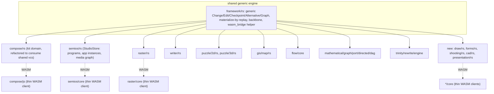

# Generalize Compose's Rust Architecture to All of Semios

## Direction change from the previous plan

The previous plan proposed porting compose's Rust engine into TypeScript and deleting `compose/client/lib/rs`. This plan reverses that: compose's Rust-owned architecture becomes the template, extracted into a shared engine, and every other technology (plus semios's own StudioStore) moves its state and materialization into Rust to match it. `compose/client/lib/rs` is kept as the reference implementation and refactored to consume the shared engine instead of owning a private copy of it.

## What already exists (found during research)

Most technologies already have a dedicated Rust crate compiling to WASM+native, following the same `runWasmPackWebBuild` tooling as compose:

- `raster/rs`, `writer/rs`, `puzzle/2d/rs`, `puzzle/3d/rs`, `gis/map/rs`, `flow/core` (+ `flow/module/*`), `mathematical/graph/port/directed/dag` (dag), `trinity/rewrite/engine` + `trinity/jack/lsp` (native `trinity/ram`, `trinity/jack/core`), `reasoning/mindmap/*`.

None of these implement compose's VCS pattern (`Change`/`Edit`/`Checkpoint`/`Alternative`/materialize-by-replay) — they own domain mutation and rendering in Rust, but undo/redo/checkpoint history is currently a TypeScript-side `DocumentVcsStore` wrapping whole-snapshot `JsonReplaceOp`s (see [framework/core/index.ts:1603-1725](framework/core/index.ts)). This is the gap to close.

Technologies with **no** Rust crate today and needing one created: `draw`, `forms`, `shooting`, `cad`, `presentation` (and `semios` itself for StudioStore).

## Target architecture

Every technology's `*/core/index.ts` becomes a thin client calling into its Rust/WASM session (create/dispatch-op/undo/redo/checkpoint/createAlternative/switchAlternative/subscribe/materialize), exactly mirroring how `compose/js` is a thin GraphQL client over `compose/rs` today. `framework/core`'s TypeScript `DocumentVcsStore`/`AppVcsRegistry`/`JsonReplaceOp` are retired once nothing depends on them.

## Phases

### Phase 0 — Test coverage baseline (do first, independent of the rest)

- Extend `"spawns every technology program id"` in [semios/core/index.ts](semios/core/index.ts) to materialize every spawned instance's projection (not just count), following the existing `flow`/`draw` pattern.
- Fix the `forms.dictionary/v1` vs `forms.form/v1` format mismatch found during the audit.
- This baseline of "does every technology actually materialize" gives a regression harness to validate against once each technology moves to Rust-backed materialization.

### Phase 1 — Extract the generic VCS engine from compose

- New crate `framework/rs` implementing a generic `vcs` module: `Change<Op>`, `Edit`, `Checkpoint`, `Alternative`, `Graph<TProjection, TOp>` with cached materialize-by-replay (generalizing `compose/client/lib/rs/lib.rs`'s `vcs` module, ~7233-8580), plus a generic dev/local/remote backbone persistence layer (generalizing `kit_backbone`, ~11254-13697).
- A `wasm_bridge` helper (trait or macro) that any technology crate uses to expose a typed `XxxStoreHandle` WASM struct with a uniform method surface: `create`, `dispatchOp`, `undo`, `redo`, `commitCheckpoint`, `createAlternative`, `switchAlternative`, `subscribe`, `materialize` — mirroring the existing TS `DocumentVcsStore` API shape ([framework/core/index.ts:1603-1700](framework/core/index.ts)) so it's a drop-in replacement from the TS caller's perspective.
- Refactor `compose/client/lib/rs` to depend on `framework/rs`'s generic `vcs` types instead of its private copy, proving the extraction against its most demanding consumer first.

### Phase 2 — Move semios's own StudioStore into Rust

- New crate `semios/rs` defining `StudioProjection`/`StudioOp` (programs, app instances, media graph, studio-level checkpoints/alternatives — mirroring [semios/core/index.ts](semios/core/index.ts)'s current `SemiosStudioProjection`/`SemiosStudioOperation`), built on `framework/rs`'s generic engine, exposing a WASM `StudioStoreHandle`.
- Replace `semios/core`'s TS `StudioStore` class with a thin WASM-client wrapper, preserving the existing `StudioCommand` dispatch surface so `semios/react` and `semios/play` need minimal changes.
- Port `DevJsonBackbone`/`LocalJsonBackbone`/`RemoteJsonBackbone` persistence into Rust.

### Phase 3 — Add VCS to technologies that already have a Rust crate

For each of `raster`, `writer`, `puzzle.2d`, `puzzle.3d`, `gis.map`, `flow`, `dag`, `trinity`, `reasoning.wires`:

- Define/confirm its typed `Op` enum + projection struct inside its existing crate.
- Wire in `framework/rs`'s generic VCS engine and extend its existing WASM session (reusing structs like `TrinitySession`, `DagSession` where present) with checkpoint/alternative/undo/redo/materialize methods.
- Replace the technology's TS `core/index.ts` reducer (`applyRasterEditOp`, etc.) and `materializeProjection` with a thin WASM-session client.

### Phase 4 — Create Rust crates for technologies that have none

For `draw`, `forms`, `shooting`, `cad`, `presentation`:

- Port the existing TS domain model and typed ops (e.g. `draw/core`'s `applyDrawEditOp`, `forms/core`'s `applyFormEditOp`) into a new Rust crate following the established per-technology convention (crate-type `["cdylib", "rlib"]`, `runWasmPackWebBuild` tooling).
- Wire in the shared VCS engine and a WASM session; replace the TS reducer with a thin client, same pattern as Phase 3.

### Phase 5 — Retire the TypeScript generic VCS layer

- Remove `framework/core`'s `DocumentVcsStore`/`materializeDocumentProjection`/`JsonReplaceOp`/`AppVcsRegistry` TypeScript implementations once every technology and StudioStore are Rust-backed.
- `semios/core`'s app-operation dispatch routes directly to each technology's WASM session instead of a TS reducer map.

### Phase 6 — Regression and verification

- `cargo test` across every Rust crate; rebuild every WASM pkg.
- Re-run the Phase 0 per-technology projection tests against the new Rust-backed materialization to confirm parity.
- Boot `dev:semios` and manually verify undo/redo/checkpoint/alternatives across every technology and the studio itself.

## Execution note

This is a large, multi-phase migration (new shared Rust crate, five-plus new/expanded per-technology Rust crates, a new semios Rust crate, and retirement of an entire TypeScript subsystem). It will be executed phase by phase with tests run after each phase, not as one atomic change.