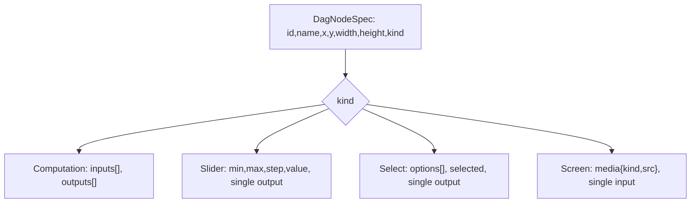

## Generalize DAG Nodes to Input/Output Kinds

### Goal & boundary

Today every DAG node is one kind: `IoNodeSpec` (a computation rectangle with input/output port channels), painted uniformly in `paint_scene` ([mathematical/graph/port/directed/dag/lib.rs](mathematical/graph/port/directed/dag/lib.rs)). Generalize the node model to support input/output node kinds described in [dag/AGENTS.md](mathematical/graph/port/directed/dag/AGENTS.md): **Computation**, **Slider**, **Select**, **Screen**.

The DAG stays pure structure + presentation + local interaction. **No computation/propagation** (Flow adds that later — `flow/core/lib.rs` already builds `IoNodeSpec` from its own widgets and delegates painting to `DagHost`). Editing a slider value or cycling a select is treated as "general DAG functionality" (like dragging a node); it mutates only that node's own stored value in the fixture and is never propagated across edges.

### Node-kind model

- Input nodes (Slider, Select): one `Source` output handle, no inputs.
- Output node (Screen): one `Target` input handle, no outputs.
- Computation: existing left-inputs / right-outputs.

### 1. Rust data model — [dag/lib.rs](mathematical/graph/port/directed/dag/lib.rs) `#region IoNode`

- Replace `IoNodeSpec` with `DagNodeSpec { id, name, x, y, width, height, kind: DagNodeKind }`. Keep `IoPortSpec`.
- Add `#[serde(tag = "kind", rename_all = "camelCase")] enum DagNodeKind { Computation { inputs, outputs }, Slider { min, max, step, value, output: IoPortSpec }, Select { options: Vec<String>, selected: usize, output: IoPortSpec }, Screen { media: Option<DagMedia>, input: IoPortSpec } }` and `struct DagMedia { kind: DagMediaKind (Image|Svg|Pdf|Video), src: String }`.
- Add accessor methods `DagNodeSpec::inputs()/outputs()` returning the effective `&[IoPortSpec]` per kind, plus `DagNodeSpec::computation(...)` constructor (for Flow).
- Update `DagFixture.nodes: Vec<DagNodeSpec>` (line ~320).

### 2. Engine build & sync — same file, `rebuild_engine_with_layout` (~416-485), `sync_node_positions_from_engine`, `sync_edges_from_engine`

- Iterate `node.inputs()` / `node.outputs()` instead of `node.inputs` / `node.outputs` so handle creation, roles (Target/Source), and `nodeId:portId` keys stay generic across kinds. No engine (`mathematical/graph/lib.rs`) changes needed — all kinds are still rect nodes.

### 3. Per-kind rendering — `paint_scene` (~586-642)

- Refactor the node loop to `match node.kind`:
  - **Computation**: keep current (rect + in/out port labels + vertical centered name).
  - **Slider**: rect + name; horizontal track line + filled thumb circle positioned by `(value-min)/(max-min)`; value text; right output dot.
  - **Select**: rect + name + current option text + a small chevron glyph; right output dot.
  - **Screen**: framed rect (media drawn by the React overlay on top); left input dot; draw a faint media-kind label as fallback.
- Reuse `append_label`, `theme` colors (e.g. `wire_stroke_highlighted` for thumb/source).

### 4. Local widget interaction — `pointer_down/move/up` (~558-580)

- Add a `DagWidgetDrag { node_idx, kind }` field on `DagHost` (host-level, engine stays unaware).
- In `pointer_down`: world-space hit-test interactive regions **before** forwarding to engine:
  - Slider track hit → start widget drag; map cursor x → `value` (clamped, stepped); skip engine.
  - Select control hit → advance `selected = (selected+1) % options.len()`; mutate fixture; skip engine.
  - Otherwise forward to engine (node drag / edge draw) as today.
- `pointer_move`/`pointer_up`: if a widget drag is active, update/commit `value` and clear; else forward to engine.
- Emit `[DEBUG]` logs (`dag slider value`, `dag select option`) for runtime validation.

### 5. Screen media overlay (full media) — WASM export + React DOM

Vello can't render SVG/PDF/video, so Screen content renders as absolutely-positioned DOM over the canvas, synced each frame.

- **WASM** ([dag/lib.rs](mathematical/graph/port/directed/dag/lib.rs) `wasm_session`): add `DagSession.nodeOverlaysJson()` → `[{ id, mediaKind, src, rect:{x,y,w,h} }]` in CSS-pixel screen space (host already has camera + viewport via `world_to_screen`), one entry per Screen node with media.
- **React** ([dag/react/index.tsx](mathematical/graph/port/directed/dag/react/index.tsx)): inside the existing rAF `tick`, read `session.nodeOverlaysJson()` and imperatively sync an overlay container (a `Map<id, HTMLElement>` of `img` (image/svg), `object`/`embed` (pdf), `video`) positioned via `style.transform`/`left/top/width/height`, `pointer-events: none` so dragging the Screen node still works through the canvas. Add an overlay `
` sibling to the `<canvas>` in the same `containerRef`.

### 6. TS fixture types & default — [dag/react/index.tsx](mathematical/graph/port/directed/dag/react/index.tsx) `#region Fixture`

- Replace `DagIoNodeV1` with the tagged `DagNode` union mirroring `DagNodeKind` (computation/slider/select/screen).
- Rewrite `DAG_DEFAULT_FIXTURE` to showcase all kinds, e.g. `Slider -> Scale (computation)`, `Select -> Combine`, `Combine -> Screen`. Use an inline SVG data-URI for the demo Screen `src` (offline-safe).

### 7. Demo fixture — [dag/fixture/demo.dag.json](mathematical/graph/port/directed/dag/fixture/demo.dag.json)

- Rewrite to match the new `DAG_DEFAULT_FIXTURE` exactly (kept in sync), including slider/select/screen nodes.
- Update node/edge **count assertions** consistently: `dag_host_loads_demo_fixture` in [dag/lib.rs](mathematical/graph/port/directed/dag/lib.rs), the `default fixture` test in [dag/play/index.ts](mathematical/graph/port/directed/dag/play/index.ts), and the test in [dag/react/index.tsx](mathematical/graph/port/directed/dag/react/index.tsx).

### 8. Keep Flow compiling — [flow/core/lib.rs](flow/core/lib.rs)

- `widget_to_io_node` (~~114) and `build_dag_fixture_v1` (~~535) currently build `IoNodeSpec`. Switch to `DagNodeSpec::computation(...)` preserving the current inputs/outputs from `widget_io_ports`. Flow behavior unchanged; mapping Flow widgets to richer Slider/Screen kinds is left for a later Flow ticket (out of scope here).

### 9. Rust + TS tests (extend existing only)

- Extend `#region Tests` in [dag/lib.rs](mathematical/graph/port/directed/dag/lib.rs): serde round-trip of each kind; engine builds correct handle count/roles per kind; slider pointer-drag mutates `value`; select click advances `selected`; screen overlay rect export.
- Extend the vitest blocks in [dag/react/index.tsx](mathematical/graph/port/directed/dag/react/index.tsx) and [dag/play/index.ts](mathematical/graph/port/directed/dag/play/index.ts) for the new fixture shape/counts.

### 10. Ticket + runtime validation

- Read `repo://goals`, open a repo ticket (e.g. "Generalize DAG Nodes to Input and Output Kinds"); keep temp logs/scripts inside the ticket folder.
- Rebuild WASM (dag crate `bun ./script.ts wasm` via its `test` target) and run `cargo test -p mathematical_graph_port_directed_dag` + `@dag/`_ and `@flow/_` vitest.
- Extend [validate-dag-runtime.mjs](.repo/🎫/26/06/07/EXTRACT-GENERIC-GRAPH-CANVAS-FROM-PUZZLE-2D-AND-ADD-DAG/validate-dag-runtime.mjs): update the 6/6 count checks to the new counts; drag the slider thumb and assert the `[DEBUG] dag slider value` log + changed fixture value; assert a Screen media overlay element is present in the DOM.

### Decisions (opinionated)

- Schema string stays `dag.fixture/v1` (greenfield, structure replaced in place; no migration).
- Slider/Select painted + interacted in Vello (uniform dragging); only Screen uses a DOM overlay (read-only, `pointer-events: none`).
- DAG does no value propagation; widget edits mutate only the owning node's stored value.
