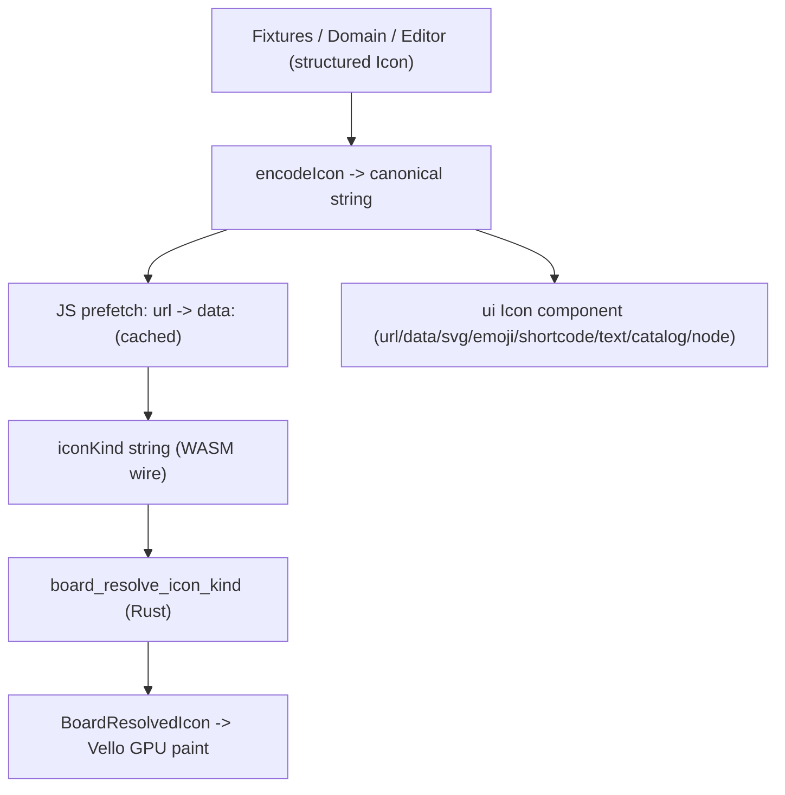

## Goal

A single `Icon` union usable by every canvas and the UI chrome, supporting: `url`, `shortcode` (`:smile:`), `data` image (png/jpeg/svg/webp/gif), `emoji`, `typst` (typist string), `text` (short text), plus the existing `svg` (inline) and `catalog` (themed/vendored key) kinds. Persisted/WASM form stays a single canonical string (`iconKind`) via a codec, so existing puzzle 2d fixtures resolve unchanged.

## Architecture

Canonical string grammar (superset of today's prefixes, so puzzle 2d is unaffected):

- `url:<u>` or bare `http(s)://...` -> url
- `:<code>:` -> shortcode
- `data:<mime>;base64,...` (legacy `image:` stripped) -> data
- `emoji:<e>` or bare pictographic -> emoji
- `typst:<src>` or leading `$` -> typst
- `text:<t>` -> text
- inline `<svg`/`<?xml` -> svg
- else ascii stem / `IconName` -> catalog

## Steps

### 1. Ticket

- Read `repo://goals`, then `ticket_open` a ticket (e.g. `Generalize Icon Union For All Canvases`) associated to the most fitting goal. Keep all temp artifacts in the ticket folder.

### 2. Canonical Rust Icon + codec — `[infinite/cavas/vello/icon_codec.rs](infinite/cavas/vello/icon_codec.rs)`

- Add a structured `Icon` enum with `#[serde(tag = "kind", rename_all = "camelCase")]` (variants: `Url`, `Shortcode`, `Data`, `Emoji`, `Typst`, `Text`, `Svg`, `Catalog`) inside a new `#[region]`.
- Add `encode_icon(&Icon) -> String` and `decode_icon(&str) -> Icon` implementing the grammar above (decode logic generalizes today's `classifyPuzzle2dIconSelectorMode`).
- Keep `board_resolve_icon_kind(encoded, themed_lookup)` as the string entry point (route via `decode_icon`), preserving all current branches.

### 3. Extend Rust resolution (new kinds) — same file + `[lib.rs](infinite/cavas/vello/lib.rs)`

- `text:` -> render via Typst with the default text font (new `board_typst_text_to_svg`, distinct from the emoji path), centered.
- `shortcode` `:code:` -> map to emoji via a shortcode->emoji table, then reuse the emoji Typst path. Generate the table at build time in `[infinite/cavas/vello](infinite/cavas/vello)` `build.rs` from a committed JSON asset under `infinite/cavas/vello/assets/` (no runtime external dep).
- `data:` -> broaden `decode_raster_icon_bytes` to png/jpeg/jpg/webp/gif; route `data:image/svg+xml...` to `SvgPlain` instead of raster.
- `url:` -> `BoardResolvedIcon::None` in the sync resolver (URLs are resolved to `data:` by the JS prefetch before reaching WASM).

### 4. JS url prefetch (async) — board bridges

- Add a small cached `resolveIconUrls(json)` helper (by URL) in the React renderer layer (`[puzzle/2d/react/index.tsx](puzzle/2d/react/index.tsx)` `Puzzle2dRenderer`, plus the Flow/Dag sessions in `[mathematical/graph/port/directed/dag/react/index.tsx](mathematical/graph/port/directed/dag/react/index.tsx)`) that fetches `url:`/`http(s)` icons, encodes to `data:` and substitutes into `iconKind` before the WASM JSON sync. Re-render frame once resolved.

### 5. Unify UI chrome — `[ui/react/index.tsx](ui/react/index.tsx)`

- Replace `IconSource` with the canonical `Icon` union (TS mirror of the Rust enum) plus a chrome-only `{ kind: "node" }` escape hatch; keep `IconName`/string shorthand accepted via `decodeIcon`.
- Extend the `Icon` component to render every kind: catalog->vendored `ICONS`, svg->inline, url/data->, emoji/shortcode-> with Noto Color Emoji, text->, typst->lazy Typst-wasm render helper exported from `infinite_cavas` (fallback to text). Export `encodeIcon`/`decodeIcon` from the TS side as the single source of truth.

### 6. Shared icon editor

- Generalize `IconSelector` (currently in `[ui/react/index.tsx](ui/react/index.tsx)`) and remove the puzzle-specific `Puzzle2dIconSelectorMode`/`classifyPuzzle2dIconSelectorMode` in `[puzzle/2d/react/index.tsx](puzzle/2d/react/index.tsx)` in favor of the shared `Icon` kinds (tabs: url, shortcode, data, emoji, math/typst, text, vector). Playground inspector patches the structured `Icon`.

### 7. Semio domain — `[semio/client/lib/rs/lib.rs](semio/client/lib/rs/lib.rs)`

- Keep `icon: Option<String>` columns but define them as the canonical icon-string grammar; add `infinite_cavas` dependency where needed and resolve via `decode_icon`/`board_resolve_icon_kind` when rendered on a canvas. No GraphQL schema change.

### 8. Wire/refactor remaining canvases

- Confirm `dag`/`flow`/`gis`/`reasoning` (all depend on `infinite_cavas`) route node icons through `board_resolve_icon_kind`; add `iconKind` support where a canvas only had text/media today, reusing the shared resolver.
- For 3D world `[infinite/world/r3f/index.tsx](infinite/world/r3f/index.tsx)`: reference/volume media keeps its texture path, but accept the same `Icon` union for any 2D marker/label icons (decode -> url/data -> texture; emoji/typst/text/svg -> rasterize via the shared resolver into a texture).

### 9. Tests (extend existing files only)

- Rust: extend `#[cfg(test)]` in `[puzzle/2d/rs/lib.rs](puzzle/2d/rs/lib.rs)` and `icon_codec.rs` to cover encode/decode round-trips and resolution for all 8 kinds (incl. shortcode table, text, svg data URL, webp/gif).
- TS: extend existing UI/puzzle test files for `encodeIcon`/`decodeIcon` round-trips and the `Icon` component rendering each kind.
- Validate runtime with `[DEBUG]`-prefixed logs that puzzle 2d fixtures resolve byte-identically before/after.

### 10. Close ticket

- `ticket_close` with summary and the full list of created/updated files.

## Notes / decisions taken

- Persisted + WASM wire form stays a single string (`iconKind`) via the codec, so no board JSON schema churn and puzzle 2d stays identical.
- URLs are resolved async in JS to `data:` (cached) since the Rust resolver is synchronous.
- Shortcode table is build-time generated from a committed JSON asset (no runtime external library), honoring the "no direct external dependency" rule.

