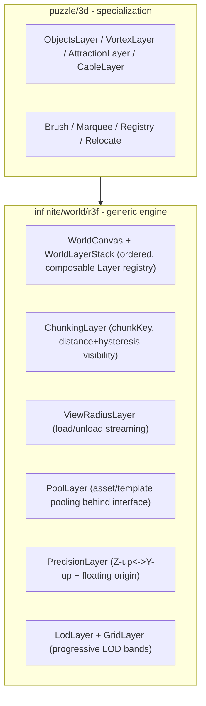

# Generalize Infinite World (mirror Infinite Map)

## Architecture goal

`infinite/canvas` is the generic 2D infinite-canvas engine; `infinite map` (`gis/map`) is a thin specialization that builds on it (`MapHost implements canvas::CanvasContent`, `@semio-tech/gis-map-react` builds on `@semio-tech/infinite-canvas-react-renderer`). Apply the exact same relationship in 3D: make `infinite/world` the generic r3f engine and turn `puzzle/3d` into a specialization composed of generic world layers.

`puzzle/3d` is pure three.js/r3f (no Rust), and its [puzzle/3d/react/index.tsx](puzzle/3d/react/index.tsx) (~10.6k lines) already contains generic 3D-world primitives inline — `Chunking` (4277), `Coordinates` (4335), `Pool` (3839), `Lod` (1066) — mixed with puzzle content (`Object`, `Vortex`, `Attraction`, `Cable`, `Brush`, `Registry`, `Viewport`). So `infinite/world` is a TS-only r3f library (no Rust), mirroring the [@semio-tech/infinite-canvas-react-renderer](infinite/canvas/react-renderer/index.tsx) packaging.

## Stage 1 - Scaffold `infinite/world/r3f` package

Mirror [infinite/canvas/react-renderer](infinite/canvas/react-renderer) packaging exactly:

- `infinite/world/r3f/index.tsx` (currently empty file): the engine module, organized with `#region` sections. Use `sceneHostPort`/`reactHostPort` from `@semio-tech/ui-react` (the existing r3f/three/drei interface — keeps "external libs behind an interface"; same pattern puzzle/3d uses at [puzzle/3d/react/index.tsx](puzzle/3d/react/index.tsx) lines 15-57).
- `infinite/world/r3f/package.json` (name `@semio-tech/infinite-world-r3f`, `bundleKind: library`, deps `@semio-tech/ui-react`, react, three, `@react-three/fiber`, `@react-three/drei`), `project.json` (nx `test` target), `script.ts` (BundleScript router -> `runVitest`), `vitest.config.ts` — copy shapes from canvas react-renderer.

## Stage 2 - First-class composable Layer system

In `infinite/world/r3f/index.tsx` add `#region LayerStack`:

- `WorldLayer` React component + `useWorldLayer` registration hook; a `WorldLayerStack` context that renders registered layers as ordered `<group>`s (analogous to map drawing tiles -> regions -> routes -> positions). Layers declare an `order` and optional `name`.
- `WorldCanvas` wrapper: the r3f `<Canvas>` + perspective camera + gated `OrbitControls` (generalized from `Canvas3D`/`OrbitGated` at [puzzle/3d/react/index.tsx](puzzle/3d/react/index.tsx) 8860/6247, dropping puzzle-specific brush/attraction gating into an injected `controlsGate` prop).

## Stage 3 - Generic capability layers (extract from puzzle/3d)

Move these regions out of [puzzle/3d/react/index.tsx](puzzle/3d/react/index.tsx) into `infinite/world/r3f/index.tsx` (generalize names, drop puzzle vocabulary), each its own `#region`:

- `Chunking` (4277-4333): `chunkKey`, `chunkBoundsRadius`, `chunkDistanceVisible`, `useVisibleChunkKeys`.
- `ViewRadius` (load/unload): formalize the enter/exit hysteresis from `chunkDistanceVisible` as the view-radius streaming layer.
- `Pool` (3839-3935): generalize `gltf`/`styledMesh` pools to a generic asset/template pool behind an `AssetPoolPort` interface (caller supplies the loader), keeping refcount acquire/release semantics.
- `Precision/Coordinates` (4335-4401): `cadToThreeMatrix`, `cad<->three` vec/quat helpers (Z-up<->Y-up); add a floating-origin rebasing helper to satisfy the world's "no floating point precision errors" mandate ([infinite/world/AGENTS.md](infinite/world/AGENTS.md)).
- `Lod` + `Grid` (1066-1390): `lodFromCameraDistance`, `lodProgressiveGridLayers`, `LodContext`/`useLod`, `LodGridHelper` -> generic `LodLayer` + `GridLayer`.

Extend `#region Tests` in the same file (port the existing `lodProgressiveGridLayers` tests at 8971 + add chunking/precision tests). No new test files.

## Stage 4 - Refactor `puzzle/3d` onto the engine

In [puzzle/3d/react/index.tsx](puzzle/3d/react/index.tsx):

- Add `@semio-tech/infinite-world-r3f` workspace dep ([puzzle/3d/react/package.json](puzzle/3d/react/package.json)); replace the inline `Chunking`, `Coordinates`, `Pool`, `Lod` regions with imports/re-exports from `@semio-tech/infinite-world-r3f` (puzzle keeps thin CAD-specific wrappers only where vocabulary differs).
- Recast content as layers on `WorldCanvas` + `WorldLayerStack`: `ObjectsLayer`, `VortexLayer`, `AttractionLayer`, `CableLayer`, `GridLayer`, `MarqueeLayer`, ordered explicitly. `Canvas3D`/`Inner`/`PlayCanvas` ([puzzle/3d/react/index.tsx](puzzle/3d/react/index.tsx) 8860/8777) compose `WorldCanvas` and register these layers instead of hand-rolled grouping; puzzle-specific `Registry`/`Brush`/`Relocate` inject their gates into the generic controls/streaming.
- Keep the public `PlayCanvas`/`Canvas3D` API stable so [puzzle/3d/play](puzzle/3d/play) is unchanged.

## Stage 5 - Wiring & validation

- Root [package.json](package.json) `workspaces`: add `infinite/world/r3f` (after `infinite/canvas/react-renderer`).
- Vite alias in [ui/styling/vite-elements-assets.ts](ui/styling/vite-elements-assets.ts) (~405): add `@semio-tech/infinite-world-r3f` -> `infinite/world/r3f/index.tsx`.
- [.vscode/launch.json](.vscode/launch.json): add `🛠️dev♾️world🧪️r3f` test entry next to the canvas entry (~678, order ~169.55), `bun nx run @semio-tech/infinite-world-r3f:test`.
- Validate: `bun nx run @semio-tech/infinite-world-r3f:test`, `bun nx run @semio-tech/puzzle-3d-react:test`, and a `@semio-tech/puzzle-3d-play` dev smoke confirming (with `[DEBUG]` console logs) chunk load/unload, grid/LOD bands, object pooling, selection/attraction still work.

## Workflow note (execution)

At execution start (agent mode): read MCP resource `repo://goals`, then `ticket_open` (or reopen) a ticket; keep temp logs/scripts under the ticket folder; `ticket_close` with a summary of all created/updated files when done.
