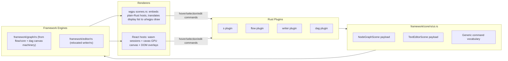

# Generalize Rich UI into Framework Engines

## Context

The previous migration deleted `flow/react`, `writer/react`, `dag/react` and replaced them with thin generic hosts, losing rich behavior (LOD, hover, marquee, align chrome, spotlight, param/variable/stepper overlays, note editing, clusters, evaluation progress, occurrence highlighting, multi-caret, rename preview, completions). The Rust engines behind them are intact: `flow/core/rs` (FlowHost, 5.4k lines), `writer/rs` (WriterHost, language-agnostic editor), `mathematical/graph/port/directed/dag/rs` (LOD/label/marquee machinery). `trinity/jack/core/rs` already has Rust `complete`/`lint`/`format`/`hover`/`semantic_tokens`. The deleted React code is recoverable from git HEAD as the behavioral spec.

Requirement: every app keeps the same behavior and near-identical UI; every deleted UI element becomes a general framework component, driven from Rust plugins via framework mechanisms (hover, selection, commands) — full FlowCanvas feature set included (user decision).

## Architecture

Two framework-owned generic Rust engines, each with a plain-Rust host (embedded by the wgpu renderer) and a wasm-bindgen session (used by the React renderer via `infinite/cavas` GPU canvas). Engines expose a renderer-agnostic display list so both renderers draw the same pixels.

## Phase 0 — Ticket

Reopen ticket `26/07/05/SUPPORT-REACT-AND-WGPU-RENDERERS-IN-PLAYGROUNDS` via `ticket_reopen` (read `repo://goals` first). All temp artifacts go in its folder.

## Phase 1 — Scene contract and command vocabulary ([framework/core/rs/ui.rs](framework/core/rs/ui.rs))

Extend `NodeGraphScene` (keep existing fields) with optional payloads covering the full FlowCanvas feature set:

- `selection_json`, `hover_json` (node + channel axes), `preview_off_json`, `lod_json` (mode automatic/forced + tier), `catalogue_json` (drives spotlight ranking, palette drag, ghost previews), `controls_json` (per-node params/variables/steppers/notes as generic node controls), `clusters_json`, `computing_json` (progress animation state), `capabilities_json` (spotlight/note-edit/clusters/preview toggles enabled per surface).

Extend `TextEditorScene` with: `occurrences_json` (hover + selection), `placeholders_json`, `extra_carets_json`, `selectable_spans_json`, `settings_json`, `camera_json`.

Standardize the renderer-to-plugin command vocabulary (mirroring the world-3d `worldSelect`/`worldHover` pattern): `nodeGraphSelect`, `nodeGraphHover`, `nodeGraphEdit` (batched ops = old `FlowGraphEditOp` set: addNode, connect, disconnect, insertBetween, move, makeSpace, setControlValue, setPreviewOff, collapse, explode, setNote…), `nodeGraphViewport`, `spotlightCommit`; `textEdit`, `textSelect`, `textHover`, `requestCompletions`, `commitRename`, `formatDocument`. Mirror all new fields in [framework/renderer/react/types.ts](framework/renderer/react/types.ts) and update `::base()` constructors plus [framework/plugin/rs/scaffold.rs](framework/plugin/rs/scaffold.rs).

## Phase 2 — Generic engines (framework-owned Rust)

`**framework/editor/rs**` — relocate `writer/rs` wholesale (crate `writer` becomes `framework_editor`; `WriterHost`/`WriterSession` become `EditorHost`/`EditorSession`). It is already language-agnostic (text, carets, selection, occurrences, diagnostics, placeholders, selectable spans, pick targets, dead-line chrome, camera). Keep `WriterDocumentVcs` with the writer app (move into `writer/plugin/rs`). Add a renderer-agnostic display-list output alongside the existing `build_scene`.

`**framework/graph/rs**` — new crate assembled from the generic canvas machinery of `flow/core/rs` FlowHost and `mathematical/graph/port/directed/dag/rs` (this is a relocation/generalization, not a rewrite): generic node/port/edge model matching `NodeGraphScene` payloads (ports carry name/code/abbreviation/cardinality as display+compatibility data), camera + wheel-zoom, six-tier LOD (`lodScaleJson`, automatic/forced), pointer state machine with 4px pick-defer and pick targets, marquee/lasso with crossing semantics, selection/hover/preselect (node + channel axes), selection union bounds + align/distribute chrome, ghost node, spotlight model (query ranking, slider/note query parsing), note editing with caret, generic node controls (param/variable/stepper overlay state), clusters (collapse/explode), computing-progress animation, preview-off dimming, label/param/stepper overlay paint-state JSONs, undo/redo, display list. Edits emit `nodeGraphEdit` op batches instead of mutating an app fixture — the plugin owns the document. `flow/core/rs` and `dag/rs` shrink to their app semantics (evaluation, channel operator compatibility, fixture schemas) layered on `framework_graph`.

## Phase 3 — React renderer hosts ([framework/renderer/react](framework/renderer/react))

Rewrite [node-graph-host.tsx](framework/renderer/react/components/node-graph-host.tsx) around the `framework_graph` wasm session + cavas GPU canvas, porting the deleted overlay/interaction code from git HEAD (`flow/react/index.tsx`, `dag/react/index.tsx`) in payload-driven generic form: label overlay (font clamping, hover/selected/preselect/dimmed fills), param/variable/stepper DOM overlays, selection-bounds + align chrome with capture-phase hit regions, marquee overlay, spotlight (LOD-adaptive, keyboard nav, ghost preview), palette drag-drop (HTML5 + pointer fallback + catalogue MIME), pick menu, context menu built from `context_menu_json` via `ContextMenuController` (replacing the current fire-first-item stub), keyboard (undo/redo/select-all/delete/escape), note editing keys, theme sync, caret blink, wheel-zoom quality hint. All interactions dispatch the Phase 1 commands.

Rewrite [text-editor-host.tsx](framework/renderer/react/components/text-editor-host.tsx) around the `framework_editor` wasm session, porting the deleted `writer/react/index.tsx` behavior: token coloring, diagnostics + badge, hover/selection occurrences + extra carets, selectable spans, completion popup at caret, inline rename with live preview (rename mapping computed by the plugin via `commitRename` round-trip), format shortcut, context menu, cut/copy/paste, hidden textarea mirror, dead-line chrome integration, vertical scroll camera. Update [index.test.ts](framework/renderer/react/index.test.ts) in place.

## Phase 4 — WGPU renderer parity ([framework/renderer/wgpu/rs](framework/renderer/wgpu/rs))

In [scenes.rs](framework/renderer/wgpu/rs/scenes.rs), replace the current hand-rolled node-graph/text-editor rendering: each scene surface embeds a plain-Rust `framework_graph` / `framework_editor` host, syncs it from the scene payload each frame, feeds pointer/wheel/keyboard events into it, translates its display list into `ui/wgpu` draw calls, and dispatches the same command vocabulary to plugins. Reuse the existing dead scaffolding (`ConnectPort`/`Marquee` drag modes, `selected_ids`) or delete it. Also fix the outstanding `cargo check` failures (missing `js-sys`/`web-sys` in the wgpu renderer Cargo.toml).

## Phase 5 — Plugins emit full payloads and handle commands

- **s plugin** ([s/plugin/rs/lib.rs](s/plugin/rs/lib.rs)): emit `selection_json`/`hover_json`/`context_menu_json` for the media graph (real items, not stub), handle `nodeGraphSelect`/`nodeGraphHover`/`nodeGraphEdit`; keep `openInstance`/`spawnApp` flows.
- **flow plugin** ([flow/plugin/rs/lib.rs](flow/plugin/rs/lib.rs)): emit the full payload — catalogue (spotlight + palette), controls, clusters, preview-off, computing progress; evaluate by linking the `flow/module/*/rs` crates directly (replacing the JS `FlowOrchestrator`/`FlowExtensionHost` worker path); handle the full `nodeGraphEdit` op set with undo/redo.
- **writer plugin** ([writer/plugin/rs/lib.rs](writer/plugin/rs/lib.rs)): compute everything in Rust via `trinity/jack/core/rs` (`complete`, `lint`, `format`, `semantic_tokens`, `hover`) plus ported occurrence/rename/placeholder logic; emit occurrences/placeholders/extra-carets/selectable-spans/completions/diagnostics; handle `textEdit`/`requestCompletions`/`commitRename`/`formatDocument`. Removes the need for the JS jack LSP worker on the runtime path.
- **dag plugin** and remaining playground plugins: adopt new `::base()` defaults; dag emits LOD payload.

## Phase 6 — Cleanup

Delete now-dead app JS made obsolete by Rust-side evaluation/LSP: `flow/worker.ts`, `flow/worker-client.ts`, `flow/compute.ts` (if unreferenced after Phase 5), and prune `trinity/jack/lsp/js` if nothing consumes it. Update root `package.json` workspaces, lockfile, vite/vitest aliases, and wasm build targets in the affected `script.ts` files (register new engine wasm builds where `writer/rs`/`flow/core/rs` were built; follow existing launch.json grouping if entries change).

## Phase 7 — Verify (no-regression gate)

- `cargo test` for `framework_graph`, `framework_editor`, all touched plugins; `cargo check` clean for the wgpu renderer.
- React renderer vitest suite; `bun install` clean; `bun ./script.ts build` for `framework/product/os/dev`.
- Re-run the e2e playground suite (`.repo/🎫/26/07/04/WGPU-PLAYGROUND-E2E/verify-wgpu-playgrounds-e2e.ts`) for all playgrounds on both renderers; capture screenshots into the ticket folder and compare against the existing baseline set; runtime-confirm interactions (hover, selection, marquee, spotlight, context menu, editing) with `[DEBUG]`-prefixed logs, then remove them.
- Close the ticket with summary and file list.

## Key risks to preserve explicitly

The 4px pick-defer ambiguity flow, gesture-scoped edit batching (snapshot at pointer-down, single `nodeGraphEdit` on pointer-up), dual drag-and-drop path with live ghost, capture-phase align-chrome hit regions, channel hover/selection as an axis separate from node selection, LOD-adaptive spotlight with slider/note query parsing, writer live rename preview with multi-caret, and dead-line/edgeless-scroll window chrome integration.
