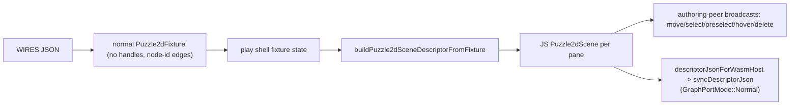

# Generalize Wires Cross-Window Sync

## Root cause

The wires/normal path bypasses the shared pipeline by pushing `wasmFixtureJson` straight to WASM via `parseFixtureJson`, leaving the JS `Puzzle2dScene` empty and the play-shell fixture untouched. Every cross-pane mechanism reads the JS scene or the shell `Puzzle2dFixture`:

- live drag: `nodeMove` drain -> `puzzle2dBroadcastNodeMove` -> peer `applyNodePositionSilent` reads `this.scene.nodes` (empty -> dropped) ([puzzle/2d/react/index.tsx](puzzle/2d/react/index.tsx) ~3716, ~5540)
- selection / preselect / structural / brush broadcasts all operate on `this.scene` ([puzzle/2d/react/index.tsx](puzzle/2d/react/index.tsx) ~10664-10708)
- drag-commit / re-fit / document / inspector use the shell `Puzzle2dFixture` + `sceneAuthoringEpoch` ([framework/product/playground/renderer/react/index.tsx](framework/product/playground/renderer/react/index.tsx) ~3470+)

The Rust host already supports normal graphs through the shared `sync_descriptor` path: `EdgeData.source/target` are plain string ids and geometry/hit-test branch on `GraphPortMode` ([puzzle/2d/rs/lib.rs](puzzle/2d/rs/lib.rs) ~3704). The only JS blocker is `Puzzle2dSceneEdge.source/target` being typed/resolved as handles only.

## Design principle (one core, clean layers)

Represent a mindmap board as a normal-shaped `Puzzle2dFixture`: nodes with `handles: []`, edges with `source`/`target` = node ids. The board flows through the existing shell unchanged; `graphPortMode: "normal"` (already added) only selects `BoardSession.newNormal()` and suppresses handle interactions/markers. Drop `wasmFixtureJson`, `setWasmFixtureJson`, and `pushNormalWasmFixtureToSession`.

## Phase 1 - Generalize JS scene edge endpoints (node-or-handle)

- `Puzzle2dSceneEdge.source/target` ([puzzle/2d/react/index.tsx](puzzle/2d/react/index.tsx) ~2776): widen from `Puzzle2dSceneHandle` to a position+center bearing anchor `Puzzle2dSceneNode | Puzzle2dSceneHandle`. Nodes already expose center `(x,y)`; add/confirm a `position`/`center` accessor so both satisfy one shape.
- `computeEdgeBezier` ([puzzle/2d/react/index.tsx](puzzle/2d/react/index.tsx) ~2499): accept anchors; for a node anchor `position == center == node center` (straight curve in JS; WASM still draws the node-rim curve in normal mode). Hit-test/overlay only.
- `syncPuzzle2dScene` edge resolution ([puzzle/2d/react/index.tsx](puzzle/2d/react/index.tsx) ~10897): resolve `source`/`target` by id to a node when not a handle, instead of `continue`-skipping non-handle endpoints.
- `descriptorJsonForWasmHost` ([puzzle/2d/react/index.tsx](puzzle/2d/react/index.tsx) ~5090): unchanged shape (`edge.source.id` already works for either anchor); emits empty `handles` for normal.

## Phase 2 - Route normal graphs through the shared WASM push

- Remove the normal-mode branch + `wasmFixtureJson`/`lastPushedWasmFixtureJson`/`setWasmFixtureJson`/`pushNormalWasmFixtureToSession` added earlier in `pushSceneToWasmDriver` and `pushAuthoritativeDescriptorToWasmSession` ([puzzle/2d/react/index.tsx](puzzle/2d/react/index.tsx) ~5279, ~5357). Normal now uses `descriptorJsonForWasmHost` -> `session.syncDescriptorJson` exactly like ported; the session is still `newNormal()` when `graphPortMode === "normal"`.
- Drop the `wasmFixtureJson` prop from `Puzzle2dCanvasProps` and the `Puzzle2dCanvas` body; keep `graphPortMode`.

## Phase 3 - Play shell holds the normal fixture (full parity)

- WIRES layer produces a normal-shaped `Puzzle2dFixture` board instead of a separate `MindmapFixture`: update [reasoning/mindmap/wires/react/index.ts](reasoning/mindmap/wires/react/index.ts) `wiresFixtureBoard` to emit `Puzzle2dFixture` (nodes `handles: []`, edges node-id). Keep `reasoning.mindmap.fixture/v1` as the external schema; `reasoning/mindmap/react` types alias to the puzzle 2d fixture ([reasoning/mindmap/react/index.tsx](reasoning/mindmap/react/index.tsx)).
- Framework wires entry ([framework/product/playground/renderer/react/index.tsx](framework/product/playground/renderer/react/index.tsx)):
  - `initialFixture`, `selectionSeedForFixture`, `triptychCamerasFromFixture`, `puzzle2dFixtureMergedKindCatalogs`, `buildPuzzle2dSceneDescriptorFromFixture`, `puzzle2dFixtureSceneMarkers` all already accept `Puzzle2dFixture` -> feed the wires board when `PUZZLE_PLAY_ENTRY === "wires"`. Remove the special `triptychCamerasFromMindmapBoard`/`mindmapBoardWorldBounds`/`PUZZLE_2D_PLAY_WIRES_WASM_FIXTURE_JSON` helpers added earlier.
  - In `Puzzle2dPlayPaneCanvas` pass `graphPortMode={isWires ? "normal" : undefined}` and the normal `declarativeSceneDescriptor` + `sceneMarkers` like the ported panes (re-enable `onFixtureDrop`/`sceneAuthoringEpoch`/`onDragEnd` -> `patchFixture`). Selection targets `{nodes:true, edges:true, handles:false}` for wires.

## Phase 4 - Document / inspector cleanliness for normal nodes

- `buildPuzzle2dPlayDocumentSections` ([puzzle/2d/play/index.ts](puzzle/2d/play/index.ts) ~278): omit the per-node `Handles` subfolder when `node.handles.length === 0` (so wires topics show as clean nodes, no empty Handles folder). Inspector already keys off node fields and works without handles.

## Phase 5 - Validation

- Rust: add a `sync_descriptor` + normal-mode test confirming node-id edges render/hit-test without handles ([puzzle/2d/rs/lib.rs](puzzle/2d/rs/lib.rs) host_tests).
- Vitest ([puzzle/2d/react/index.tsx](puzzle/2d/react/index.tsx) test region): node-id edge binds in `syncPuzzle2dScene`; `puzzle2dBroadcastNodeMove`/`applyNodePositionSilent` and `applySelectionFromPeerSilent`/`syncPreselectionSilent` mirror across two normal-mode peers.
- Runtime: wires play on :6015 - drag a topic in one pane, confirm live + committed move in the other two panes; confirm hover, selection, and preselect mirror; confirm document lists topics and inspector edits one.
- Keep temp logs under `.repo/🎫/26/06/03/WIRES-NORMAL-GRAPH/`; reopen that ticket; close with file summary.

