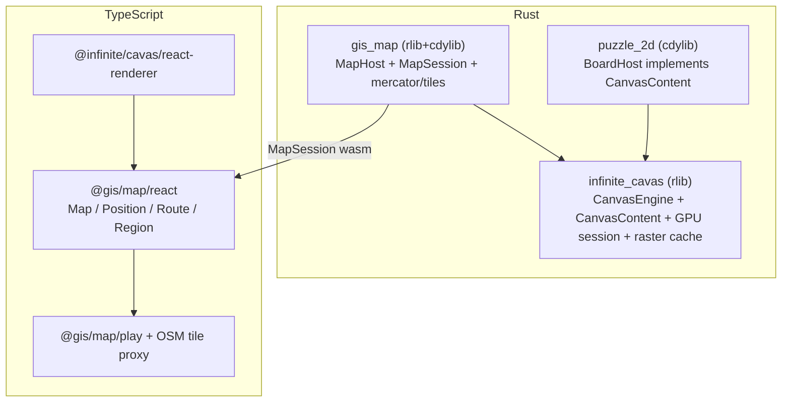

# Implement gis/map on a shared infinite-canvas engine (end-to-end)

## Goal

A `gis/map` Rust WASM crate that renders OpenStreetMap raster tiles on the infinite canvas with `Position`, `Route`, and `Region` overlays, plus a React renderer and an end-to-end playground. Default camera fits the whole world. The shared canvas engine is first extracted from `puzzle_2d` into `infinite_cavas` so the map builds on it cleanly.

Mirror the canonical `puzzle/2d` layout: restructure `gis/map` → `gis/map/rs` (cdylib), add `gis/map/react`, `gis/map/play`, `gis/map/fixture`.

## Current state (verified)

- The real engine lives in `[puzzle/2d/rs/lib.rs](puzzle/2d/rs/lib.rs)`: `Camera`/transforms (`screen_to_world`/`world_to_screen`), LOD, pan/zoom, `build_vector_scene`, raster `scene.draw_image(...)`, and the WASM `BoardSession` + `BoardSessionInner` GPU plumbing (`render_frame_gpu`, `attach_canvas`) wrapping `cavas::vello::util::{RenderContext, RenderSurface}` + `Renderer`.
- `[infinite/cavas/vello/lib.rs](infinite/cavas/vello/lib.rs)` is only geometry/scene-JSON utils + `CanvasExtension` today.
- `[gis/map/lib.rs](gis/map/lib.rs)` is a tiny rlib stub (`MapExtension`/`DefaultMapExtension`, CRS `EPSG:3857`) and is already a `puzzle_2d` dependency; workspace member `gis/map` in `[Cargo.toml](Cargo.toml)`.
- Playground renderer is a region-sliced monolith keyed to kinds `2d|3d|5d` in `[framework/product/playground/renderer/react/index.tsx](framework/product/playground/renderer/react/index.tsx)` with slicing/aliases in `[ui/styling/vite-elements-assets.ts](ui/styling/vite-elements-assets.ts)`; per-play boot via `bootPlayground` + `PlaygroundChromeBoot`, window bodies via `buildPuzzle2dWindowBody` in `[framework/product/playground/core/index.ts](framework/product/playground/core/index.ts)`.
- Tiles must be fetched from JS (browser WASM can't block on HTTP). Per decision, add a dev OSM tile proxy/cache in the play harness.

## Layering after the change

## Workflow note

At execution start (agent mode): read MCP resource `repo://goals`, then `ticket_open` (or reopen) a ticket for this task; keep temp logs/scripts under the ticket folder; `ticket_close` with a summary when done.

---

## Stage 1 — Extract shared canvas engine into `infinite_cavas`

In `[infinite/cavas/vello/lib.rs](infinite/cavas/vello/lib.rs)`, add new regions (no wasm-bindgen here; it stays rlib):

- `#region Camera`: move `Camera { x, y, zoom }`, zoom min/max consts, `world_to_screen`/`screen_to_world`, `wheel_screen` focal-zoom, and pan helpers from `puzzle_2d`.
- `#region Lod`: generic LOD tier enum + zoom-threshold resolution.
- `#region Raster`: raster image cache keyed by content hash + a `draw_image` helper (ports the `ImageBrush` usage at `puzzle/2d/rs/lib.rs` ~2269/4023).
- `#region GpuSession` (gated `#[cfg(target_arch = "wasm32")]` only for the surface bits, but pure-Rust struct): a generic `CanvasGpuSession` owning `RenderContext`/`Renderer`/`RenderSurface` + size/dpr, with `attach`, `resize`, and `render(scene, clear_color)` — generalized from `BoardSessionInner::{attach_canvas, set_logical_size_and_maybe_resize_surface, render_frame_gpu}`.
- `#region CanvasContent`: a trait `CanvasContent { fn build_scene(&self) -> Scene; fn clear_color(&self) -> Color; }` plus extend the existing `CanvasExtension`.
- Update `[infinite/cavas/vello/Cargo.toml](infinite/cavas/vello/Cargo.toml)` to add `vello` wgpu features and, under `cfg(wasm32)`, `web-sys`/`wasm-bindgen-futures`/`js-sys` as needed for the surface (no `#[wasm_bindgen]` exports).
- Extend the `#region Tests` in the same file (do not add new test files).

## Stage 2 — Refactor `puzzle_2d` onto the shared engine

In `[puzzle/2d/rs/lib.rs](puzzle/2d/rs/lib.rs)`:

- Replace local `Camera`/transforms/LOD/raster helpers with `infinite_cavas` re-exports; `BoardHost` implements `cavas::CanvasContent` (`build_scene` = existing `build_vector_scene`, `clear_color` = `vello_theme.raster_clear`).
- Reduce `BoardSessionInner` to wrap `cavas::CanvasGpuSession` + `BoardHost`; keep the public `BoardSession` wasm API identical so `[puzzle/2d/react/index.tsx](puzzle/2d/react/index.tsx)` is unchanged.
- Validate: `cargo test -p puzzle_2d -p infinite_cavas` and a `@puzzle/2d/play` dev smoke (confirm tiles/edges still render).

## Stage 3 — `gis/map/rs` Rust crate (cdylib `gis_map`)

Restructure `gis/map/lib.rs` + `Cargo.toml` into `gis/map/rs/` and update workspace member `gis/map` → `gis/map/rs` in `[Cargo.toml](Cargo.toml)`. New regions in `gis/map/rs/lib.rs`:

- `#region Projection`: Web Mercator (EPSG:3857) `lonlat <-> world` (normalized world square), `default_world_camera()` that fits the full mercator square to the viewport.
- `#region Tiles`: tile `z/x/y` math, visible-tile computation for the current camera/viewport, and a tile-raster store (raster bytes uploaded from JS) drawn via the shared raster helper at the correct world rect.
- `#region MapContent`: `MapHost` holding camera, tiles, and overlays:
  - `Position { id, lon, lat, label? }` → marker (filled disc + optional icon/label).
  - `Route { id, points: [lonlat], style }` → stroked polyline.
  - `Region { id, ring: [lonlat], fill, stroke }` → filled + stroked polygon.
  - implements `cavas::CanvasContent::build_scene` (tiles first, then regions, routes, positions) + pan/zoom/hit-test.
- `#region WasmSession` (`cfg(wasm32)`): `MapSession` mirroring `BoardSession` surface API — `new`, `attach_canvas`, `setSize`, `setCamera`, `wheelScreen`, `pointerDown/Move/Up`, `renderFrame`, `gpuReady`, `syncMapJson(json)`, `uploadTile(z,x,y,bytes)`, `drainEventsJson`.
- Cargo: `crate-type = ["rlib","cdylib"]`, deps `infinite_cavas`, `serde`, `serde_json`, `vello`, `image` (PNG decode), `cfg(wasm32)` wasm-bindgen stack — mirror `[puzzle/2d/rs/Cargo.toml](puzzle/2d/rs/Cargo.toml)`.
- Add `gis/map/rs/script.ts` using `runWasmPackWebBuild` (wasmBaseName `gis_map`, pkg `@gis/map/rs`) mirroring `[puzzle/2d/rs/script.ts](puzzle/2d/rs/script.ts)`.
- Extend the `#region Tests` (projection round-trip, tile math, world-fit camera).

## Stage 4 — `gis/map/react` React renderer (`@gis/map/react`)

New `gis/map/react/{index.tsx,package.json,project.json,script.ts,vitest.config.ts}` mirroring `[puzzle/2d/react](puzzle/2d/react)`:

- Load `../rs/pkg/gis_map.js`; `ensureGisMapWasmLoaded()`; export `MapSession`.
- `MapRenderer` owns one `MapSession`, RAF render loop, camera/event sync; a tile manager hook that computes needed tiles, fetches `/osm/{z}/{x}/{y}.png`, and calls `session.uploadTile(...)`.
- Declarative `@infinite/cavas/react-renderer` reconciler host kinds `gis.map/position|route|region` + components `<MapCanvas>`, `<Position>`, `<Route>`, `<Region>`; default camera = whole world.
- Depends on `@infinite/cavas/react-renderer`, `@gis/map/rs`, `@ui/react`, react stack.

## Stage 5 — `gis/map/play` playground + OSM tile proxy

New `gis/map/play/{index.ts,index.html,globals.css,vite.config.ts,package.json,project.json,script.ts,vitest.config.ts,public/}` mirroring `[puzzle/2d/play](puzzle/2d/play)`:

- `vite.config.ts` via `createPlaygroundPlayViteConfig({ playEntryKind: "map", extraAliases:[@gis/map/react] })`.
- Add `osmTileProxyVitePlugin` to `[ui/styling/vite-elements-assets.ts](ui/styling/vite-elements-assets.ts)` (mirrors `uiAssetsVitePlugin`): dev/preview middleware serving `/osm/:z/:x/:y.png` from `https://tile.openstreetmap.org/...` with a compliant `User-Agent` and a simple on-disk cache; wired in when `playEntryKind === "map"`.
- Extend the kind union `PlaygroundRendererPuzzleKind` (`2d|3d|5d` → add `map`), boot subpath map, and host markers in `[ui/styling/vite-elements-assets.ts](ui/styling/vite-elements-assets.ts)`.
- In `[framework/product/playground/renderer/react/index.tsx](framework/product/playground/renderer/react/index.tsx)` add a `#region MapPlayHost` with `registerMapPlaySurfaceHosts`, a `mapPlayChromeBoot`, and `bootMapPlay`; add `buildMapWindowBody` in `[framework/product/playground/core/index.ts](framework/product/playground/core/index.ts)`.
- `play/index.ts`: a `PlaygroundMap` (subclass of `Playground`) with a fixture seeding a few Positions/Routes/Regions and a toolbar to add each; browser boot gated on `import.meta.env.PUZZLE_PLAY_ENTRY === "map"`.
- `play/script.ts`: `dev`/`build`/`test` chaining `../rs/script.ts wasm` → vite/vitest, mirroring `[puzzle/2d/play/script.ts](puzzle/2d/play/script.ts)`.

## Stage 6 — Workspace wiring & validation

- Add nx targets for `@gis/map/play` (dev/build/test) and `@gis/map/react` (test) in their `project.json`/`package.json`; pick a free dev port (e.g. `GIS_MAP_PLAY_PORT=6040`).
- Register the new commands in `[.vscode/launch.json](.vscode/launch.json)` following existing order/grouping; the rust test target already includes `gis_map`.
- Validate end-to-end: `cargo test` for `infinite_cavas`/`gis_map`/`puzzle_2d`; `@gis/map/react` vitest; `@gis/map/play` dev → confirm (with console logs) tiles load through the proxy, the world fits by default, and Position/Route/Region render and pan/zoom.

