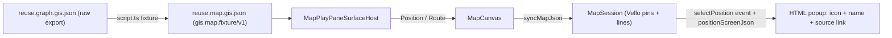

## Goal

Turn `gis/map/fixture/reuse.map.gis.json` (currently a raw `mit-bestand` graph export) into a proper map fixture and render it: donor + receiver pins with name/icon/clickable source link, connected by donor to receiver reuse relationship lines.

Mapping (confirmed): Pins = receiver projekte + donor bauwerke that have coordinates; Relationships = `reuse_chains` drawn as donor to receiver lines. Render scope (confirmed): convert fixture AND extend renderer so pins show icon + name + clickable source-link popup.

## Current state (verified)

- Raw fixture `gis/map/fixture/reuse.map.gis.json` has `nodes.{projekte,bauteilgruppen,bauwerke}`, flat `relationships`, and `reuse_chains` (each with `donor_coordinates[]`, `receiver_coordinates`, `donor_bauwerk_ids`, `receiver_projekt_id`, `bauteilgruppe_name`). ~360 chains have receiver coordinates.
- Map descriptor consumed by WASM (`gis/map/rs/lib.rs` `MapDescriptorJson` / `PositionData`) is minimal: `positions {id,lon,lat,label}`, `routes {id,points,stroke_width}`, `regions {id,ring}`. No `sourceUrl`/`icon`; pin clicks don't emit selection (`pointer_up_screen` only emits `camera`). No JS projection API.
- React `gis/map/react/index.tsx`: `MapPositionProps` is `{id,lon,lat,label}`; `mapDescriptorToJson` serializes only those; `MapCanvas` never consumes `drainEvents`.
- Play host `MapPlayPaneSurfaceHost` in `framework/product/playground/renderer/react/index.tsx` hardcodes Zürich/Bern; `MapPlayController.getFixtureCatalog()` returns empty options.
- Fixture pattern (from `[puzzle/2d/play/index.ts](puzzle/2d/play/index.ts)`): JSON imported as a module with a `schema` field, parsed to a typed fixture, listed in `FIXTURE_OPTIONS`, switched via `setActiveFixture`.
- Icons: `Icon` + `IconName` exported from `[ui/react/index.tsx](ui/react/index.tsx)` (`@semio-tech/ui-react`), backed by `@semio-tech/ui-asset` `ICONS`.

## Fixture schema `gis.map.fixture/v1`

Rewrite `gis/map/fixture/reuse.map.gis.json` to:

```json
{
  "schema": "gis.map.fixture",
  "name": "Reuse map",
  "positions": [
    { "id": "...", "lon": 0, "lat": 0, "label": "...", "name": "...", "kind": "receiver", "icon": "landmark", "sourceUrl": "https://..." }
  ],
  "routes": [
    { "id": "...", "points": [[lon,lat],[lon,lat]], "kind": "reuse", "label": "<bauteilgruppe_name>" }
  ],
  "regions": []
}
```

- Receiver pins: from `reuse_chains.receiver_coordinates` + `receiver_projekt_id` looked up in `nodes.projekte` for `name`/`geo.source_url`; `kind:"receiver"`, `icon:"landmark"`.
- Donor pins: from `reuse_chains.donor_coordinates[]` + `donor_bauwerk_ids` looked up in `nodes.bauwerke` for `name`/`geo.donor.source_url`; `kind:"donor"`, `icon:"package"`.
- Dedupe pins by id (rounded coord fallback). Routes only when both donor and receiver coordinates exist.

Keep the raw export reproducible: preserve it as input `gis/map/fixture/reuse.graph.gis.json` and add a permanent converter (no throwaway migration script).

## Steps

### 1. Converter command in `gis/map/play/script.ts`

Add a `FixtureScript` (registered as `fixture`) that reads `../fixture/reuse.graph.gis.json`, builds the `gis.map.fixture/v1` payload (pins + reuse routes per mapping above), and writes `../fixture/reuse.map.gis.json`. Register in `[.vscode/launch.json](.vscode/launch.json)` following the existing gis/map grouping. Run it once to regenerate the proper fixture.

### 2. WASM: rich pins + selection (`gis/map/rs/lib.rs`)

- Extend `PositionData` (region `🔖MapContent`) with `#[serde(default)]` `source_url: Option<String>`, `icon: Option<String>`, `kind: Option<String>`, `name: Option<String>`.
- Color pin fill by `kind` (donor vs receiver) in `append_positions` using existing theme accents.
- Add screen-space pin hit-test in `pointer_up_screen` (`🔖WasmSession` + `MapHost`): when the pointer did not pan (click), find the nearest pin within a radius and `push_event("selectPosition", {"id":...})`, else `push_event("selectPosition", {"id":null})`.
- Add wasm API `positionScreenJson(id)` returning `{x,y}` (logical px) or `null`, using `projection::lonlat_to_world` + `map_viewport::world_to_screen`, so the React popup can anchor and follow the camera.
- Extend the `#region Tests` (selection event on click, `positionScreenJson` round-trip, `source_url`/`icon` parse).

### 3. React renderer (`gis/map/react/index.tsx`)

- Extend `MapPositionProps` with `name?`, `icon?`, `sourceUrl?`, `kind?`; update `mapDescriptorToJson` to serialize `source_url`/`icon`/`kind`/`name`.
- `MapRenderer`: add `selectedPositionScreen(id)` wrapper over `positionScreenJson`; expose drained events.
- `MapCanvas`: in the render loop consume `drainEvents()`, track `selectedId`; render an absolutely-positioned popup `<div>` anchored at the projected screen coords (updated each frame via a ref + style mutation to avoid re-render storms) showing `<Icon icon={...}/>` + `name` + `<a href={sourceUrl} target="_blank" rel="noreferrer">`. Clicking empty space clears selection.
- Extend the `🧪Tests` region (descriptor serializes new fields; selection state).

### 4. Play host wiring

- `[gis/map/play/index.ts](gis/map/play/index.ts)`: import the converted fixture JSON, add a `parseGisMapFixture` + types, expose `GIS_MAP_PLAY_FIXTURE_OPTIONS` and a default fixture, and surface positions/routes through controller state (mirror puzzle2d's `getFixtureCatalog`/`setActiveFixture`). Provide the active descriptor to the surface host.
- `MapPlayPaneSurfaceHost` in `[framework/product/playground/renderer/react/index.tsx](framework/product/playground/renderer/react/index.tsx)`: replace the hardcoded Zürich/Bern demo with `<Position>`/`<Route>` mapped from the active fixture (name/icon/sourceUrl/kind passed through).
- Extend the play `🧪Tests` (fixture parse + catalog options).

### 5. Validate

- `cargo test -p gis_map`, `@semio-tech/gis-map-react` + `@semio-tech/gis-map-play` vitest.
- `@semio-tech/gis-map-play` dev: confirm with console logs that pins load from the fixture, donor/receiver lines render, clicking a pin opens the popup with name + icon + working source link, and the popup follows pan/zoom.

## Flow


