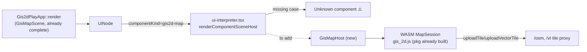

# GIS 2D Map Parity Restore

## Root cause

The Rust plugin side (`gis/plugin/rs/app_2d.rs`) is already nearly complete: `render_canvas` emits a fully-populated `GisMapScene` (fixture JSON, camera, render mode, vector style, LOD mode, tile URL templates, layer visibility/weights, selection, hover) via `build_gis_map_scene`, and `handle_command_patch_ops` already implements every interaction command (`setCamera`, `setRenderMode`, `setFeatureSelection`, `toggleLayerVisibility`, `fitWorld`, `focusFeature`, `openSource`, etc.). Two things are missing:

1. **No tiles show** — the React renderer has no component for `componentKind === "gis2d-map"` (`SurfaceKind::GisMap.as_str()` in `framework/core/rs/lib.rs:2169`). `ui-interpreter.tsx`'s `renderComponentSceneHost` switch (`framework/renderer/react/ui-interpreter.tsx:42-67`) falls through to "Unknown component", so the WASM `MapSession` (from `gis/2d/rs/pkg/gis_2d.js`, already built — see `gis/2d/rs/pkg/gis_2d.d.ts`) never gets attached to a canvas, tiles never get uploaded, and nothing renders.
2. **No window options** — `Gis2dPlayApp` never overrides `PluginApp::window_measures()` (default in `framework/plugin/rs/lib.rs:422-428` returns empty), so the window options rail is empty even though the Inspector tab already exposes equivalent controls via `map_view_field_group` (`gis/plugin/rs/app_2d.rs:442-526`).

## Part A — React `GisMapHost` (fixes missing tiles)

Reference implementation: the premigration `gis/2d/react/index.tsx` (`MapRenderer` class + `MapCanvas` component + `buildMapPlayContextMenuItems`), retrieved from the pre-migration git tag. Port this logic but source scene state from `UiComponentSceneNode.gisMap` (a `GisMapScene`) and dispatch interactions via `onCommand`, matching the pattern used by `framework/renderer/react/components/node-graph-host.tsx`'s `FlowGraphCanvasHost` (local WASM session drives 60fps interaction; `onCommand` syncs the authoritative Rust document).

1. `**framework/renderer/react/os-shell.tsx**`

- Add `GisMapScene` type mirroring the Rust struct at `framework/core/rs/lib.rs:2405-2432` (camelCase: `mapFixtureJson`, `cameraJson`, `renderMode`, `vectorStyle`, `lodMode`, `tileUrlTemplate`, `vectorTileUrlTemplate`, `layerVisibilityJson`, `layerStrokeScaleJson`, `selectionJson`, `hoverJson`, `selectionMethod`, `selectionMode`, `contextMenuJson?`).
- Add `readonly gisMap?: GisMapScene;` to `UiComponentSceneNode` (`os-shell.tsx:2212-2226`).
- Add a `MapWasmSession` type (mirroring the raw `MapSession` d.ts surface in `gis/2d/rs/pkg/gis_2d.d.ts`: `attachCanvas`, `setSize`, `renderFrame`, `setCamera`, `cameraJson`, `cameraLimitsJson`, `fitWorldCamera`, `reclampCamera`, `pointerDownScreen/Move/UpScreen`, `wheelScreen`, `syncMapJson`, `uploadTile`/`uploadVectorTile`, `visibleTilesJson`/`visibleVectorTilesJson`, `setRenderMode`/`setVectorStyle`/`setLodMode`, `setLayerVisibilityJson`/`setLayerStrokeScaleJson`, `setSelectionJson`/`setHoverJson`, `featuresInRectJson`/`featuresInPolygonJson`/`hitTestFeatureJson`/`featureScreenJson`/`positionScreenJson`, `lodScaleJson`/`currentLodJson`/`layerWeightSliderIdsJson`, `setMapThemeJson`, `gpuReady`, `free`) and a `createMapSession()` loader following the exact `createGraphSession`/`createFlowSession` pattern (`os-shell.tsx:2643-2734`), importing `@semio-tech/gis-2d-rs/pkg/gis_2d.js`.

2. `**gis/plugin/rs/../../2d/rs` dependency\*_: add `"@semio-tech/gis-2d-rs": "workspace:_"`to`framework/renderer/react/package.json`dependencies (pkg already exports`.`→`./pkg/gis_2d.js`, per `gis/2d/rs/package.json`).
3. **New file `framework/renderer/react/components/gis-map-host.tsx`** — port and adapt from the premigration file:

- Constants/helpers ported verbatim: `GIS_MAP_LAYER_IDS`, layer-weight bounds, `parseVisibleTilesJson`, `parseCameraJson`, `parseMapFeatureHit`, `parseMapHoveredFeature`, `screenRectFromPoints`, `serializeMapCanvasThemeJson` (theme sync from CSS custom properties), `MAP_MARQUEE_THRESHOLD_PX`.
- A `MapRenderer`-equivalent class/hook owning one `MapWasmSession`: `attach`/`setSize`/tile cache + debounced `scheduleRefreshTiles`/`refreshTiles` (raster via `uploadTile`, vector via `uploadVectorTile`, using `node.gisMap.tileUrlTemplate`/`vectorTileUrlTemplate`), a RAF loop calling `syncMapThemeFromDocument` + `pollVisibleTilesForRefresh` + `renderFrame` (ports `MapRenderer.startLoop`, `gis/2d/react` lines 597-928 of the premigration file).
- `GisMapHost({ node, onCommand })` component (signature matching every other host, e.g. `NodeGraphHost`) that:
  - Syncs `session.syncMapJson(node.gisMap.mapFixtureJson)`, `setRenderMode`, `setVectorStyle`, `setLodMode`, `setLayerVisibilityJson`, `setLayerStrokeScaleJson`, `setSelectionJson`, `setHoverJson` whenever the corresponding scene field changes.
  - Boots the canvas (`attachCanvas`, initial `fitWorldCamera` only if `node.gisMap.cameraJson` is the untouched default, else `setCamera` from it), mirroring premigration `boot()` (lines 1165-1203).
  - Wires pointer handlers (left-button marquee selection via `marqueeModeFromModifiers`/`marqueeCoverageFromGesture`/`SelectionMarquee` from `@semio-tech/ui-react`, middle-button pan via `pointerDownScreen`/`pointerMoveScreen`/`pointerUpScreen`, wheel zoom via `wheelScreen`) exactly as in premigration lines 1327-1504, but dispatch results via `onCommand({controllerId: node.controllerId, command: "setFeatureSelection", args: {surfaceId: node.surfaceId, positions, routes, mode}})` (mode from `marqueeModeFromModifiers`) instead of `ctrl.run(...)`.
  - Hover → dispatch `"setHover"` with `{hover: {kind,id} | null}`.
  - Camera pan/zoom applies to the WASM session immediately for 60fps feel (like `FlowGraphCanvasHost`'s pointer handlers) and also dispatches `"setCamera"` with `{camera: {x,y,zoom}}` so the Rust document persists it.
  - Right-click → build context menu items inline (port `buildMapPlayContextMenuItems`, premigration lines 1703-1761) reading selection from `node.gisMap.selectionJson` and dispatching `setFeatureSelection` / `deselect` / `focusFeature` / `openSource` / `selectAll` / `clearSelection` / `fitWorld`, rendered with `ContextMenuController` (already used identically in `node-graph-host.tsx`).
  - Renders `<canvas>` + `<SelectionMarquee>` + `<ContextMenuController>` + a hover tooltip populated from parsing `node.gisMap.mapFixtureJson` positions (id/label/name/icon/sourceUrl), matching premigration lines 1506-1551.
- No context-menu-building or camera state lives in a separate "controller" (that concept doesn't exist in the current architecture) — everything derives from `node.gisMap` + `onCommand`.

4. `**framework/renderer/react/ui-interpreter.tsx**`: add a lazy import `const GisMapHost = lazy(() => import("./components/gis-map-host.tsx").then((m) => ({ default: m.GisMapHost })));` and a `case "gis2d-map": return <GisMapHost node={node} onCommand={onCommand} />;` in the switch at `ui-interpreter.tsx:42-67`.

## Part B — Rust `window_measures()` (fixes missing window options)

In `gis/plugin/rs/app_2d.rs`:

1. Import `layout::MeasureSelectItem` and `WindowMeasure` from `semio_framework_plugin` (already used by `puzzle/plugin/rs/d2/mod.rs`).
2. Factor two small SSOT helpers out of existing duplicated logic so the Inspector tab and the new window-options rail share one source (per the "single source of truth" rule):

- `lod_select_entries() -> Vec<(String, String)>` — extracted from the LOD-items-building block in `map_view_field_group` (`app_2d.rs:443-457`), used by both the Inspector's `UiSelectItem` list and the new `MeasureSelectItem` list.
- `layer_weight_entries(play) -> Vec<(String, String, f64)>` (id, label, value) — extracted from `layer_weight_slider_fields` (`app_2d.rs:297-334`), reused by both the Inspector sliders and the new window-measure sliders.

3. Add `fn gis2d_window_measures(play: &Gis2dPlayEnvelope) -> Vec<WindowMeasure>` building, in order:

- `Select` "Render Mode" (`image`/`vector`/`combined`) → `on_change: gis2d_cmd("setRenderMode", None)`.
- `Select` "Vector Style" (`colored`/`figureGround`/`invertedFigure`) → `on_change: gis2d_cmd("setVectorStyle", None)`.
- `Select` "LOD Mode" from `lod_select_entries()` → `on_change: gis2d_cmd("setLodMode", None)`.
- `Select` "Selection Method" (`rectangle`/`lasso`) → `on_change: gis2d_cmd("setSelectionMethod", None)`.
- `Group` "Layers" containing one `Toggle` per `GIS_MAP_LAYER_IDS` (icon from the existing table, `pressed: layer_visible(...)`) → `on_change: gis2d_cmd("toggleLayerVisibility", Some(json!({"layerId": id})))`.
- `Group` "Layer Weights" containing one `Slider` per `layer_weight_entries(play)` (min 0.25, max 3.0, step 0.05) → `on_change: gis2d_cmd("setLayerStrokeScale", Some(json!({"layerId": layer_id})))`.
- These reuse commands already implemented in `handle_command_patch_ops` (all read `value`/`pressed` merged in by `renderWindowMeasure` in `os-shell.tsx:545-602`), so **no Rust command-handling changes are needed**.

4. Implement `fn window_measures(&self, document_json: &str, _view_state: &ViewState) -> HashMap<String, Vec<WindowMeasure>>` on `impl PluginApp for Gis2dPlayApp`, returning `{ GIS2D_PLAY_WINDOW_MAIN: gis2d_window_measures(&parse_envelope(document_json)) }`.
5. Extend the existing `#[cfg(test)] mod tests` block (do not add a new test file) with a test asserting `window_measures()` includes the render-mode select and a layers toggle group.

## Validation

- `cargo test -p gis-plugin` (Rust logic + new window-measures test).
- Rebuild the `gis` plugin WASM component via the existing dev pipeline (`framework/renderer/wgpu/js/boot.js` entry `{ pluginId: "gis", cratePath: "gis/plugin/rs", wasmOut: "gis_plugin.wasm" }`) and the `@semio-tech/gis-2d-rs` pkg if stale (`bun nx run @semio-tech/gis-2d-rs:wasm`).
- Browser smoke check on the GIS 2D window: confirm raster/vector tiles render, pan/zoom/marquee-select/hover/context-menu work, and the window options rail shows Render Mode / Vector Style / LOD Mode / Selection Method / Layers / Layer Weights — with `[DEBUG]`-prefixed console logs while verifying, removed before finishing.
- Per workspace rules: do this work inside a ticket (check `repo://goals` first, reopen `FIX-LOWPOLY-DEV-BOOT`-style existing ticket only if it truly covers this, otherwise open a new one), and close it with a summary of files touched.
