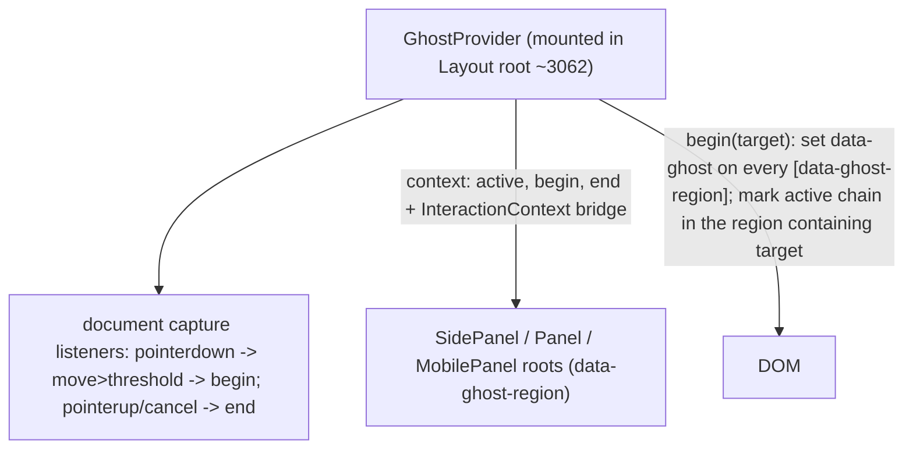

# Global Ghost Interaction

## Problem

The ghost effect currently lives per-panel. Each `PanelGhostRoot` in [ui/react/index.tsx](ui/react/index.tsx) owns its own `active` state plus its own pointer detector (`usePanelGhostController` ~2337, `usePanelGhostPointerRoot` ~2479), and dims only `[data-dim]` elements inside that same panel.

Draggable windows in the GIS map are rendered by `Mode` in the layout `canvas` slot, which is a sibling of the panels (see `Layout` ~3062: panels and `{canvas}` are peers). The window shell is never inside a `PanelGhostRoot`, so its drag never reaches any panel's detector. The same applies to any interaction that begins outside a panel (map pan, marquee, etc.).

## Goal

For ANY interaction (any pointer drag anywhere, plus tracked control/keyboard/DnD interactions):

- All panels (`SidePanel`, `BottomPanel`/generic `Panel`, `MobilePanel`) dim to 5% and become click-through.
- The actively-manipulated element stays at full opacity and interactive.
  - If the active element is inside a panel: that panel keeps the active element's chain bright, the rest of that panel and all other panels dim.
  - If the active element is outside panels (a GIS map window, the canvas): all panels dim; the window/canvas is unaffected because canvas content is not a ghost dim target.
- On pointer up / drag end / cancel, everything restores (150ms).

## Design: one global controller

Replace the per-panel controller with a single app-level controller mounted once, driven by document-level (capture-phase) listeners so it sees every interaction regardless of `stopPropagation` (the GIS `MapCanvas` calls `stopPropagation`, and `Mode` window drag uses `onPointerDownCapture`).

### 1. Single controller + provider (Interaction Context region ~2271-2477)

- Collapse `usePanelGhostController` + `usePanelGhostPointerRoot` into one `useGhostController()` owning: `active` boolean, `begin(target)`, `end()`, the `setActiveInteraction` bridge (`InteractionContext`), and global `document` listeners (`pointerdown`/`pointermove`/`pointerup`/`pointercancel`) registered in CAPTURE with the existing `PANEL_GHOST_MOVE_THRESHOLD_PX` (~4px).
- Add `GhostProvider` that mounts the controller once and provides `PanelGhostContext` + `InteractionContext` + `ActiveInteractionContext`.
- Mount `GhostProvider` inside `Layout` wrapping the root `
` (~3063) so it spans both panels and `{canvas}`. The document listeners are global, so window drags anywhere are caught.

### 2. begin/end now act on all panels

- Panel roots get a static marker attribute `data-ghost-region` (added to `PanelGhostRoot` root div ~2521+, which all panels render).
- `begin(target)`:
  - Set `data-ghost="true"` on every panel root (driven by the shared `active` state: each `PanelGhostRoot` reads `active` from context and sets its own `data-ghost`).
  - Find the closest `[data-ghost-region]` ancestor of `target`. If found, walk from `target` up to that region marking `[data-dim]` ancestors: nearest = `data-active-interaction` (the active leaf), the rest = `data-active-ancestor`. If `target` is outside all regions (window/canvas), mark nothing.
- `end()`: clear `active` and remove all `data-active-interaction` / `data-active-ancestor` marks.

### 3. CSS (separate opacity from pointer-events) in [ui/react/globals-ui.css](ui/react/globals-ui.css) (~117 region)

Current rules mark only the nearest dim node and conflate opacity with pointer-events. Replace with:

- `[data-ghost="true"] [data-dim]:not([data-active-interaction]):not([data-active-ancestor]) { opacity: 0.05; pointer-events: none; transition: opacity 150ms; }`
- `[data-ghost="true"] [data-dim][data-active-ancestor] { opacity: 1; }` (bright but click-through, so dimmed siblings stay click-through)
- `[data-ghost="true"] [data-active-interaction] { opacity: 1; pointer-events: auto; }` (the only interactive node)

This fixes the original opacity-stacking issue (ancestors stay bright via `data-active-ancestor`) while ensuring only the active leaf is interactive.

### 4. Panel roots: click-through driven by shared state

- `PanelGhostRoot` (~2521): stop owning state/detector; read `active` from context, set `data-ghost` + `pointer-events: none` on the root when `active` (so the whole panel is click-through during any interaction; the active leaf re-enables `pointer-events: auto` via CSS). Keep existing `data-dim` on chrome layer and content rows so the panel body visibly dims.
- Panels remain floating/`absolute` (unchanged from the recent fix).

### 5. Keep existing per-control hooks, now routed to the global controller

These resolve `usePanelGhost()` / `useInteractionCommands()` to the global provider, so no logic change is needed beyond the hoist:

- `Slider` / `Input` / `Stepper` `setActiveInteraction` bridge (covers focus/keyboard).
- `Ring` orb drag `begin/end` (~6524+).
- Tree HTML5 drag-and-drop and palette pointer drag `begin/end` (~9685+) — required because native DnD emits no `pointermove`.
- `PanelResizeHandle` / `SidePanelResizeHandle` `begin/end`.
- The generic global pointer detector additionally covers any untracked drag (sliders, ring, resize, GIS window drag, map pan, marquee).

## What does NOT change

- Canvas / window / inspector-in-window visuals: windows and the map are not panels, so they never dim. (Inspector rows reuse `[data-dim]` components, but those only dim when under a `[data-ghost="true"]` panel root; inside a window there is no such ancestor, so they are unaffected.)
- Plain clicks (no movement past threshold) never trigger ghost.

## Files

- [ui/react/index.tsx](ui/react/index.tsx): merge controllers into `useGhostController`, add `GhostProvider`, mount in `Layout`, update `PanelGhostRoot`, add `data-ghost-region`, mark active leaf vs ancestors.
- [ui/react/globals-ui.css](ui/react/globals-ui.css): new ghost CSS rules.

## Verification (runtime, per repo rules)

- Reopen the existing ticket `.repo/...PANEL-GHOST-INTERACTION` (do not open a new one); keep temp logs there with `[DEBUG]` prefixes.
- `nx` typecheck/test of `@semio-tech/ui-react` (note: 3 pre-existing tree-layout test failures are unrelated).
- Manual via launch.json + browser:
  - GIS map: drag a window -> all side panels dim to 5% and are click-through, the window stays fully visible and keeps dragging; on drop, panels restore.
  - Slider/Ring/tree DnD inside a panel: active element stays bright, that panel's other rows + all other panels dim; canvas unaffected.
  - Map pan and marquee on canvas: panels dim during the drag (confirm capture listeners catch `stopPropagation`).
  - Plain click on a panel button or tab (no drag): no ghost.
  - Inspector slider inside a GIS window: dragging it dims side panels but not the window contents.

## Notes / decisions

- This intentionally changes within-panel behavior so that ALL panels dim on any interaction (previously only the interacted panel). This is the simplest uniform rule that satisfies "for everything / every interaction"; if only-the-active-panel dimming is preferred for in-panel interactions, it is a small follow-up tweak.
- Capture-phase document listeners are used so interactions that call `stopPropagation` (GIS map pan) still trigger the effect.
