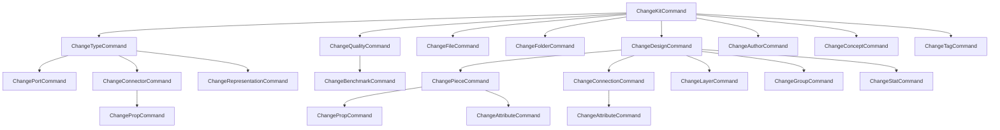

## Background

Today [`change_command`](semio/rs/lib.rs) covers only a handful of fields (`ChangeKitCommand::{Name, Description}`, `ChangeTypeCommand::Name`, `ChangeDesignCommand::Name`, `ChangePieceCommand::{Name, Fix}`) and reaches into `KitStore` setters directly; for `Piece::Name` it round-trips through a `DesignDiff`. Everything else (ports, connectors, representations, files, folders, qualities, benchmarks, authors, concepts, tags, layers, groups, stats, props, attributes, connections, sides, kit/type/design/piece metadata) has no command surface. `KitChange` still models forward/backward as `KitDiff` snapshots.

The goal: one command variant per setter on every entity store, plus Add/Remove variants for every entity and its child collections, with automatic inverse generation so the VCS layer can store `Vec<ChangeKitCommand>` forward + inverse.

Out of scope: changing `read_command`; touching `io`, `wasm`, `kit_draft`, `kit_transaction` beyond wiring in the new command/inverse shape; the schema "leak" warning is honored by naming variants after Rust struct fields, not GraphQL (`Code` not `name` for `Connector`, `Url` not `remote` for `File`, `Virtual` for Type, `View` for Design, etc.).

## Architecture



Each "child" command is routable either via a typed nested variant on the parent (e.g. `ChangeDesignCommand::ChangePieceCommands { piece_id, commands }`) or as standalone under `ChangeKitCommand` when the child is kit-scoped (file, folder, quality, author, concept, tag).

## Tasks

### 1. Audit + scaffolding

- In [semio/rs/lib.rs](semio/rs/lib.rs), rewrite `pub mod change_command` from scratch. Keep file structure (single crate file, `pub mod`).
- For each store listed below, inventory the existing `pub fn set_*` (already enumerated); one command variant per setter, named after the field (PascalCase), carrying exactly the setter argument type (Option stays Option). Example:

```rust
pub enum ChangeConnectionCommand {
    Gap { value: Option<f64> },
    Shift { value: Option<f64> },
    Rise { value: Option<f64> },
    Rotation { value: Option<f64> },
    Turn { value: Option<f64> },
    Tilt { value: Option<f64> },
    X { value: Option<f64> },
    Y { value: Option<f64> },
    Description { value: Option<String> },
    // collection + attribute + prop variants (see below)
    AddAttribute { attribute: AttributeFullDto },
    RemoveAttribute { id: AttributeIdDto },
    ChangeAttributeCommands { id: AttributeIdDto, commands: Vec<ChangeAttributeCommand> },
    ReplaceConnected { side: SideFullDto },
    ReplaceConnecting { side: SideFullDto },
    #[serde(other)] Other,
}
```

### 2. Command enums per entity

Create these enums with one variant per existing `set_*` (omit the per-store list in prose — use the audit in the conversation):

- Scalar-carrying stores: `ChangeAttributeCommand`, `ChangeAuthorCommand`, `ChangeBenchmarkCommand`, `ChangeConceptCommand`, `ChangeConnectionCommand`, `ChangeConnectorCommand`, `ChangeDesignCommand`, `ChangeFileCommand`, `ChangeFolderCommand`, `ChangeGroupCommand`, `ChangeKitCommand`, `ChangeLayerCommand`, `ChangePieceCommand`, `ChangePortCommand`, `ChangePropCommand`, `ChangeQualityCommand`, `ChangeRepresentationCommand`, `ChangeSideCommand`, `ChangeStatCommand`, `ChangeTagCommand`, `ChangeTypeCommand`.
- Field variants must exactly mirror setter signatures (e.g. `Piece::{Plane, Center, Color, Type, Name, Description, Scale, MirrorPlane, Hidden, Locked}`; `Port::{Id, Family, CompatibleFamilies, Mandatory, T, Description, Point, Direction}`; `Design::{Name, Description, Icon, Image, Variant, View, Location, Camera, Unit, Created, Updated}`; `Type::{Name, Description, Icon, Image, Variant, Stock, Virtual, Unit, Location, Created, Updated}`; `Kit::{Name, Description, Icon, Image, Preview, Version, Remote, Homepage, License, Uri, Created, Updated}`; etc. — full list in the audit).
- Add collection/lifecycle variants on each container command:
  - `ChangeKitCommand`: Add/Remove/ChangeXCommands for each of Type, Design, File, Folder, Quality, Author, Concept, Tag, plus top-level Attribute/Prop add/remove (the DTO has them).
  - `ChangeTypeCommand`: Add/Remove/ChangeXCommands for Port, Connector, Representation; plus Author/Concept/Tag/Quality/Prop/Attribute association-level variants (AddAuthorRef, RemoveAuthorRef, etc. since authors/concepts/tags/qualities are kit-scoped but referenced from a type).
  - `ChangeDesignCommand`: Add/Remove/ChangeXCommands for Piece, Connection, Layer, Group, Stat; plus Author/Concept/Tag/Quality/Prop/Attribute variants analogous to Type.
  - `ChangeQualityCommand`: Add/Remove/ChangeXCommands for Benchmark.
  - `ChangePieceCommand`: Add/Remove/ChangeXCommands for Prop, Attribute.
  - `ChangeConnectionCommand`: Add/Remove/ChangeXCommands for Attribute; ReplaceConnected / ReplaceConnecting carrying `SideFullDto`.
  - `ChangeConnectorCommand`, `ChangePortCommand`, `ChangeRepresentationCommand`, `ChangeLayerCommand`, `ChangeGroupCommand`, `ChangeFolderCommand`, `ChangeFileCommand`, `ChangeAuthorCommand`, `ChangeConceptCommand`, `ChangeTagCommand`, `ChangeBenchmarkCommand`: Add/Remove/ChangeXCommands for Attribute (plus qualities where present on the DTO).
- Every enum keeps `#[serde(other)] Other` for forward-compat. Use `#[serde(rename_all = "camelCase")]` like today.

### 3. `apply` with inverse

Change the `apply` contract from `fn apply(&self, kit: &mut KitStore, …) -> Result<()>` to:

```rust
pub fn apply(&self, kit: &mut KitStore, scope_ids: …) -> Result<Vec<Change{Entity}Command>>;
```

Returning the inverse command(s) for that single forward. Rules:

- Scalar field variant: read current value via the owning store (e.g. `piece.read()?.name.clone()`), call the corresponding `set_*`, return `vec![Self::Field { value: previous }]`.
- Add variant: call store constructor + kit/parent insertion, return `vec![Self::Remove { id }]`.
- Remove variant: snapshot the entity to its `*FullDto` before removing, return `vec![Self::Add { dto }]`.
- Nested `ChangeXCommands { id, commands }`: fold-apply each subcommand, concatenate inverses, return them in reverse order wrapped as `ChangeXCommands { id, commands: inverses }`.
- Replace variants (e.g. `Piece::Plane`, `Connection::ReplaceConnected`): snapshot old, set new, return Replace(old).
- Set-style collections (weak refs, e.g. `Group::Pieces`, `Port::CompatibleFamilies`): treat as atomic replace (whole-vector set) with previous vector as inverse.
- Associations (`Type::AddAuthorRef { author_id }`, etc.): store the weak-ref addition/removal, inverse is the opposite.

All field lookups go through the live `KitStore` pointers (Arc/Weak) so inverses read the actual current value at apply-time. No path through `DesignDiff` anymore: delete the `Piece::Name` detour at [lib.rs:556-588](semio/rs/lib.rs).

### 4. Generic dispatch helpers

Add on each container command:

```rust
impl ChangeKitCommand {
    pub fn apply(&self, kit: &mut KitStore) -> Result<Vec<ChangeKitCommand>>;
    pub fn apply_many(kit: &mut KitStore, cmds: &[ChangeKitCommand]) -> Result<Vec<ChangeKitCommand>>;
}
```

`apply_many` folds inverses in reverse order so replaying the inverse vec undoes the batch.

### 5. `KitChange` + `KitChangeKind` rework

In `pub mod kit_change` (around [lib.rs:5173-5230](semio/rs/lib.rs)):

- Replace `KitChange::{forward: KitDiff, backward: KitDiff}` with:

```rust
pub struct KitChange {
    pub forward: Vec<ChangeKitCommand>,
    pub inverse: Vec<ChangeKitCommand>,
    pub kind: KitChangeKind,
    pub author: Option<String>,
    pub time: Option<String>,
}
```

- Drop `before`/`after` DTO snapshots (materialization is now "replay from initial" per the VCS spec above at lines 793-799 of `.repo/💬/ueli.md`).
- Replace `KitChange::between` with a constructor that takes `forward: Vec<…>` and the inverse returned by `apply_many` at record time.
- `apply_forward`/`apply_backward` now call `ChangeKitCommand::apply_many` with `forward` / `inverse`.
- Retire `apply_forward_dto` / `apply_backward_dto` (or temporarily keep as `unimplemented!` shim marked deprecated, depending on caller audit below).
- Collapse `KitChangeKind` to a coarse label only (`SetKitMetadata`, `AddType`, `RemoveType`, `ModifyType`, `AddDesign`, `RemoveDesign`, `ModifyDesign`, `AddPiece`, `RemovePiece`, `Connect`, `Disconnect`, `Inferred`, `Other(String)`). Remove `ApplyDesignDiff`, `ApplyKitDiff`.

### 6. Caller updates

Update every call site of the old model:

- `apply_design_diff` (~14 call sites inside `lib.rs`): refactor all `DesignDiff`-based flows (`delete_change`, `flatten_change`, piece add/remove helpers in `kit_store_command`, etc.) to produce `Vec<ChangeDesignCommand>` and route via the new `apply`. The `diff` module can keep `DesignDiff` as a pure data shape for storage/round-trip, but `apply_design_diff` becomes a thin wrapper that translates the diff into an equivalent `Vec<ChangeDesignCommand>` and delegates — or is removed outright.
- `kit_transaction`, `kit_draft`, `kit_store_command`: update signatures so transaction entries record `Vec<ChangeKitCommand>` plus returned inverse.
- `io::sqlite` / `io::json` persistence of `KitChange`: update serde to new shape (breaking on-disk format; acceptable per the wider VCS redesign).
- `wasm` surface: regenerate the command enums (`ChangeKitCommand`, results, etc.) in the WASM section to match.

### 7. Validation

- Add unit tests in `lib.rs` under a new `#[cfg(test)] mod change_command_tests` covering, at minimum, one round-trip per entity: apply forward, apply returned inverse, assert the kit's `to_full_dto()` equals the pre-state. At least one test per command family (scalar, Add, Remove, nested).
- Fuzz-style: a randomized batch of 10-20 commands round-trip through forward then inverse and land on identity state.

## Key files

- [semio/rs/lib.rs](semio/rs/lib.rs) — sole edit target. Sections touched:
  - `pub mod change_command` (lines 472-703): rewrite.
  - `pub mod kit_change` (lines 5173-5230 area): reshape `KitChange` + `KitChangeKind`.
  - `pub mod diff` (line 5872): keep `DesignDiff` as a storage DTO; remove its role as primary change payload.
  - `pub mod kit_transaction`, `pub mod kit_draft`, `pub mod kit_store_command`, `pub mod kit_session`, `pub mod kit_checkpoint`, `pub mod kit_alternative`: signature/route updates.
  - `pub mod wasm` (line 18829): mirror the new enums.
  - `pub mod events`: no change required (setters already emit `FieldChanged`).
- [semio/rs/AGENTS.md](semio/rs/AGENTS.md): update the "Change flow" line to mention command-list forward + inverse.

## Notes / constraints

- Do not reference GraphQL field names in Rust. Variants use the Rust setter name: `Code` (not `name`) for Connector, `Url` (not `remote`) for File, `Virtual` for Type, `View` for Design, `MaxExcluded` etc. This keeps the schema advisory but not leaky.
- Keep `#[serde(rename_all = "camelCase")]` + `#[serde(other)] Other` on every command enum.
- Every new `apply` must emit events via the existing setters (they already do); do not bypass them.
- `apply` takes `&mut KitStore`, not a snapshot; inverses must be captured before mutation inside each arm.
