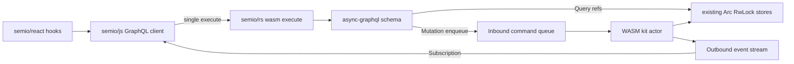

# GraphQL Kit Control Plane Migration

## Target Shape

- `semio/rs` owns the only kit control plane: `#[wasm_bindgen(js_name = execute)]` accepts a GraphQL request JSON/document and streams GraphQL responses.
- `async-graphql` is added directly to existing store types in `semio/rs/lib.rs`: `KitGraph`, `kit_store::KitStore`, `KitStoreHandle`, `DesignStore`, `PieceStore`, `TypeStore`, `ConnectionStore`, and child stores expose `#[Object]` resolver impls on the existing structs/refs.
- Public GraphQL read traversal uses in-memory store refs, not command IDs. Root starts at the live/current kit store, and nested fields return `Arc<RwLock<T>>`/existing `*StoreRef` wrappers resolved under short locks.
- Mutations enqueue typed command payloads into the WASM actor inbound channel. The actor applies them against the live `KitGraphRef`, then publishes typed events to the outbound subscription channel.
- `semio/js`, `semio/react`, `semio/sketchpad`, and `semio/algorithms` stop using `executeRead`, string commands, `KitStoreCommand` JSON, and local derived data. They call the same GraphQL `execute` boundary.

## Implementation Phases

1. **Replace the Rust control boundary in [semio/rs/lib.rs](semio/rs/lib.rs).**
   - Add `async-graphql`, `async-stream` if needed, and `console_error_panic_hook` for wasm.
   - Introduce one schema module/region inside the existing file, not a new file: schema root objects, `boot()`, `execute(request_json, on_message)`, dual `async_channel` queues, and the single actor spawn.
   - Remove/retire WASM exports that expose JSON command/read control (`executeReadKitCommands`, command-specific helpers) instead of layering GraphQL next to them.

2. **Put `#[Object]` on existing stores and resolve by pointer.**
   - Implement resolver impls on the existing `KitGraph`/`KitStore` and entity stores; expose every stored and computed field as GraphQL fields.
   - Replace selector inputs in [semio/graphql/schema.graphql](semio/graphql/schema.graphql) that currently use `EntityIdInput`/`Node` semantics with traversal-first fields and typed mutation inputs.
   - Where a mutation needs a target, resolve it inside the actor from the already traversed in-memory store path used by the JS store object, not by public entity ID selectors.
   - Keep internal IDs only as persisted entity data where the domain already owns them; they stop being the control mechanism.

3. **Convert commands into complete GraphQL fields.**
   - Map every `Read*Command` variant/output in [semio/rs/read_module.rs](semio/rs/read_module.rs) and [semio/rs/read_impl.rs](semio/rs/read_impl.rs) to a statically typed GraphQL field on the matching store.
   - Map `ChangeKitCommand` and VCS/session/backbone commands into root mutations that only validate/enqueue; heavy work runs in the actor.
   - Port the remaining `executeSemioKitCommand` string handlers from [semio/js/index.ts](semio/js/index.ts) into typed Rust mutations/events, then delete the string dispatcher.

4. **Make [semio/js](semio/js) a GraphQL-only client.**
   - Replace `KitStoreClient.executeRead`, command JSON helpers, `kitGraphLive.ts`, and worker RPC methods with a single `executeGraphql`/stream API over the WASM `execute` function.
   - Rewrite per-entity TS stores to issue typed GraphQL documents/fragments. They may hold typed pointer paths/store handles, but no domain logic, caches, or ID-based command construction.
   - Regenerate or replace [semio/js/readCommandTypes.ts](semio/js/readCommandTypes.ts) with GraphQL operation/result types sourced from [semio/graphql/schema.graphql](semio/graphql/schema.graphql).

5. **Align downstream packages.**
   - [semio/react/index.tsx](semio/react/index.tsx): hooks and Scopes call the JS GraphQL stores only; subscriptions update hook state from `eventStream`.
   - [semio/sketchpad/index.tsx](semio/sketchpad/index.tsx): remove local kit command strings and direct `@semio/js` control imports; use `@semio/react` hooks/Scopes.
   - [semio/algorithms](semio/algorithms): replace any direct command/client calls with the shared JS GraphQL client surface.

6. **Testing and verification.**
   - Extend existing Rust tests in [semio/rs/lib.rs](semio/rs/lib.rs) for GraphQL queries, queued mutations, subscription events, pointer traversal, and computed fields.
   - Extend existing JS/React/sketchpad tests rather than creating new test files: verify operation typing, no `executeRead`/string command imports, hook reads/writes, and event-driven updates.
   - Run `cargo test` in `semio/rs`, wasm tests where available, `pnpm -F @semio/js test`, `pnpm -F @semio/react test`, and relevant sketchpad/algorithm tests.

## Key Risks

- GraphQL object refs must avoid holding write locks across nested resolver awaits. Each resolver should clone child refs under a short read lock, then release before resolving deeper fields.
- Native `kit_store::KitStore` and WASM `KitStoreHandle` currently diverge; the migration should make the actor/schema the shared semantic boundary while native-only backbone I/O remains behind the same mutations.
- The existing SDL is ID/selector-heavy and must be replaced, not patched, to satisfy pointer-only control semantics.
