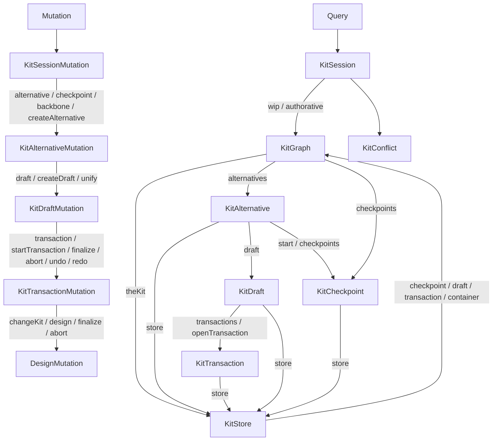

# GraphQL Session/Graph/Store Alignment

## Current vs target gap

The Rust domain model (Phase 1 of [.cursor/plans/rust_kit_session_graph_store_7cb85fcf.plan.md](.cursor/plans/rust_kit_session_graph_store_7cb85fcf.plan.md)) is already in place: `kit_session::Session` and `KitGraph.sessions` are gone; drafts live on `KitAlternative.draft` and `KitGraph.the_kit_draft`; `KitReadScope` no longer carries `sessionId`; `KitStoreCommand::{NewSession,EndSession,ExecuteSessionCommands}` are removed.

What is still on the old shape (mismatch with the target SDL the user posted):

- [semio/rs/lib.rs](semio/rs/lib.rs) `pub mod kit_graphql` still exposes:
  - `RootQuery::kit(scope: KitReadScopeInput!) -> KitStore!` (lines ~27662-27672)
  - `RootMutation::kit_store -> KitStoreMutation` with the `batch(KitStoreInput!)` dispatcher (~27674-27693, ~27717-27728)
  - `KitStoreGraphql` carrying `coloredConnectors`, `fullDto`, `theKitDto`, `materializeAt`, `state` (~28184+) instead of the new `container` / `checkpoint` / `draft` / `transaction` / `full` / `id` shape.
  - `StateDto.sessions: [SessionDto!]!` and the legacy `SessionDto`/`DraftDto` (~28230-28250 and around 28244+).
  - `KitStorePayload` / `KitStoreResult` / `KitStoreResultKind` and the entire batch input tree (`KitStoreCommandInput`, `SessionInput`, `DraftInput`, `TransactionInput`, ...).
- [semio/graphql/schema.graphql](semio/graphql/schema.graphql) and [semio/graphql/local.schema.graphql](semio/graphql/local.schema.graphql) reflect the legacy shape (see `Query` at line 904, `KitStore` at 622, `KitColoredConnectorDto` at 539, `KitStoreMutation/Payload/Result` at 650-711, `StateDto.sessions` at 1011, `KitReadScope*Input` at 569-594).
- [semio/js/index.ts](semio/js/index.ts) still has 57 occurrences of `kit(scope` / `kitStore.batch` / `sessionId` / `coloredConnectors`.
- [semio/react/index.tsx](semio/react/index.tsx), [semio/sketchpad/index.tsx](semio/sketchpad/index.tsx), [semio/algorithms/.storybook/stories/kit-store/commandSchema.ts](semio/algorithms/.storybook/stories/kit-store/commandSchema.ts) consume the legacy JS API.

## Target tree (authoritative)



Mutations exactly match the SDL shape in [.cursor/plans/rust_kit_session_graph_store_7cb85fcf.plan.md](.cursor/plans/rust_kit_session_graph_store_7cb85fcf.plan.md) lines 96-136.

## Phase A - Rust GraphQL layer ([semio/rs/lib.rs](semio/rs/lib.rs) `pub mod kit_graphql`)

1. Replace `RootQuery::kit(scope)` with `async fn session(&self, ctx) -> KitSessionGraphql`. Resolve `KitSession.id` from the master `KitStore` (Rust) stable id (extend `kit_store::KitStore` with a `pub id: Id` initialized in `KitStore::new` if not present), `wip` from the `KitGraphRef` in ctx, `authorative` from the backbone stub, `conflicts` from the conflict registry.
2. Add new wrapper structs (in the same `kit_graphql` mod, behind a `#region 🔖SessionGraph` marker per [AGENTS.md](AGENTS.md)):

   ```rust
   pub struct KitSessionGraphql { pub master: Arc<KitStore>, pub wip: KitGraphRef, pub authorative: Option<KitGraphRef> }
   pub struct KitGraphGraphql { pub session: Option<Arc<KitStore>>, pub kit: KitGraphRef }
   pub struct KitAlternativeGraphql { pub graph: KitGraphRef, pub id: Id }
   pub struct KitCheckpointGraphql { pub graph: KitGraphRef, pub id: Id }
   pub struct KitDraftGraphql { pub graph: KitGraphRef, pub alternative_id: Option<Id>, pub draft_id: Id }
   pub struct KitTransactionGraphql { pub graph: KitGraphRef, pub alternative_id: Option<Id>, pub draft_id: Id, pub transaction_id: Id }
   pub struct KitConflictGraphql(pub crate::kit_backbone_wire::KitConflict);
   ```

   Implement `#[Object(name = "KitSession" | "KitGraph" | ...)]` resolvers backing every field listed in the user's SDL. `KitGraph.theKit` returns `Some(KitStoreGraphql)` materialized at `the_kit_head`, else `None`. `KitGraph.alternative(id)` / `checkpoint(id)` look up by `Id`. `KitAlternative.store` materializes at `tip()` (or `start` when empty); `.draft` is the alternative's draft slot.

3. Reshape `KitStoreGraphql` to the target SDL (drop `coloredConnectors`, `fullDto`, `theKitDto`, `materializeAt`, `state`; add `container`, `checkpoint`, `draft`, `transaction`, `full`, `metadata`, `shallow`, `id`, `name`, `description`, the rest of the kit scalar fields). Carry the `KitStoreMaterializedKind` (Checkpoint{id} | Draft{...} | Transaction{...}) so `checkpoint`/`draft`/`transaction` resolvers return the right ancestor entity (per the standing connector-color refactor at [.cursor/plans/connector_color_store_f823838c.plan.md](.cursor/plans/connector_color_store_f823838c.plan.md), this also removes the kit-wide colored-connector rows; cache color on `ConnectorStore` already done in Rust).
4. Replace `RootMutation::kit_store -> KitStoreMutation` with `async fn session(&self, ctx) -> KitSessionMutation`. Implement the full nested mutation tree (`KitSessionMutation`, `KitAlternativeMutation`, `KitDraftMutation`, `KitTransactionMutation`, `KitCheckpointMutation`, `KitBackboneMutation`) by dispatching the existing `KitStoreCommand` variants through `KitShellCtx::run_command`. Each leaf returns the touched entity (e.g. `finalize` returns the new `KitCheckpointGraphql`).
5. Delete legacy GraphQL types and helpers: `RootQuery::kit`, `KitStoreMutation`, `execute_batch`, `execute_session_batch`, `execute_draft_batch`, `execute_transaction_batch`, `execute_alternative_batch`, `execute_checkpoint_batch`, `execute_backbone_batch`, `KitStoreInput`, `KitStoreCommandInput`, `SessionInput`, `DraftInput`, `TransactionInput`, `AlternativeInput`, `BackboneInput`, `KitStorePayload`, `KitStoreResult`, `KitStoreResultKind`, `KitColoredConnectorDto`, `KitReadScopeInput` and its sub-inputs.
6. Reshape `StateDto`: drop `sessions` and `SessionDto`; expose only `theKitHead`, `root`, `checkpoints`, `alternatives` (with each `AlternativeDto` carrying its draft if any), `theKitLine`. (Used by tooling; alternative is to delete `state` outright since the new graph supersedes it - choose deletion to keep the surface clean.)
7. Add the `*IdDto` input wrappers required by the SDL: `KitAlternativeIdDto`, `KitCheckpointIdDto`, `KitConflictIdDto` mirroring existing `*IdDto` shape.
8. Regenerate SDL with `npx nx build semio/graphql` (or the existing test that writes [semio/graphql/schema.graphql](semio/graphql/schema.graphql) / [semio/graphql/local.schema.graphql](semio/graphql/local.schema.graphql)) and commit both files.

## Phase B - JS/React/sketchpad/algorithms

- [semio/js/index.ts](semio/js/index.ts): replace every `kit(scope:...)` query with `session { wip { ...KitGraphFields } authorative { ... } conflicts { ... } }` plus targeted alternative/checkpoint/draft/transaction/store fragments. Replace `kitStore.batch(...)` with the nested `mutation { session { alternative(id) { draft { transaction { changeKit(commands) } } } } }` style and provide a fluent helper API (`store.alternative(id).draft.transaction.changeKit(...)`). Drop `sessionId` bookkeeping and any `coloredConnectors` paths (read color from `connector.color`). Update generated contract assertions.
- [semio/react/index.tsx](semio/react/index.tsx): rename hooks to `useKitSession`, `useKitGraph`, `useKitAlternative`, `useKitDraft`, `useKitTransaction`, `useKitStore`. Subscribe to `session.wip`. Remove sessionId state. Read connector color from `connector.color`.
- [semio/sketchpad/index.tsx](semio/sketchpad/index.tsx): rewire to `wipKitGraph.theKit` / `alternative(id).store` / `alternative(id).draft.transaction`. Remove sessionId state, prompts, URL params. Address drafts by alternativeId only.
- [semio/algorithms/.storybook/stories/kit-store/commandSchema.ts](semio/algorithms/.storybook/stories/kit-store/commandSchema.ts) and any `semio/ui` consumer: switch to the new mutation tree.

## Phase C - Tests & verify

- Extend (do not add) the `kit_graphql_smoke` and end-to-end tests in [semio/rs/lib.rs](semio/rs/lib.rs):
  - Assert presence of `Query.session: KitSession!`, `KitSession`, `KitGraph`, `KitAlternative`, `KitStore`, `KitCheckpoint`, `KitDraft`, `KitTransaction`, `KitConflict`, `KitSessionMutation`.
  - Assert absence of `Query.kit`, `KitStoreMutation`, `KitStorePayload`, `KitStoreResult*`, `KitColoredConnectorDto`, `KitReadScope*Input`, `sessions: [SessionDto!]!`.
  - Round-trip: `createAlternative -> createDraft -> startTransaction -> changeKit -> finalize -> checkpoint` via `Schema::execute` of the new tree.
  - Read-side: navigate `session.wip.alternative(id).store.full` / `session.wip.checkpoint(id).store.metadata` / draft+transaction store materialization including `connector.color`.
- Run `cargo check -p semio`, `cargo test -p semio`, `cargo test -p semio-store --bin semio-store`, `npx nx build semio/graphql`, `npx nx test semio-js`, `npx nx test semio-react`, plus a sketchpad typecheck.
- Add `[DEBUG]` logs in the new resolver tree for one create/finalize cycle, capture them, then strip before close.

## Ticket & rules

Reopen [.repo/🎫/26/04/27/RUST-GRAPH-QL-STORE-DTO-CLEANUP/ticket.json](.repo/%F0%9F%8E%AB/26/04/27/RUST-GRAPH-QL-STORE-DTO-CLEANUP/ticket.json) and continue (or open a new ticket under goal `r2603` after reading `repo://goals`). Roll the connector-color slice into this ticket (rule: fix unrelated problems if no other ticket is currently covering it). Close the ticket once `cargo`, `nx`, and runtime smoke logs all confirm the new tree.

## Out of scope

- No backwards-compat shims (greenfield rule from [AGENTS.md](AGENTS.md)).
- No new test files; only extend existing.
- No edits to `AGENTS.md` files.
