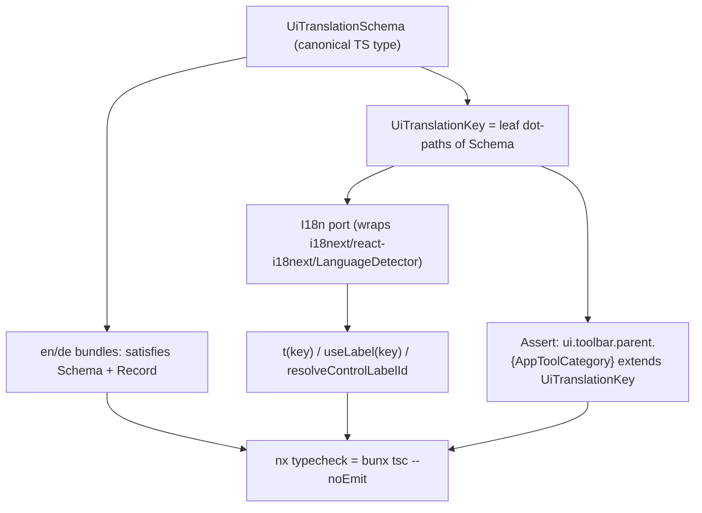

# Make Broken i18n Fail Compilation

The user explicitly asked to span all UIs (ui, framework, compose sketchpad, cad, coda), wrap the i18n external dependency behind an interface, and enforce with TypeScript. This is cross-technology by request.

## Mechanism overview

- Missing/wrong keys: bundle literal fails `satisfies UiTranslationSchema`; call sites fail because key not in `UiTranslationKey`.
- Extra keys: object-literal excess-property check against the schema.
- Misconfigured languages: bundles typed `Record<UiLocale, {translation: UiTranslationSchema}>` so any missing/typo locale fails.
- Toolbar gap (the cad play `ui.toolbar.parent.save` bug): add all category keys + a type-level `Expect` assertion tying `AppToolCategory` to keys.

## 1. Typed i18n port wrapping the dependency

In [ui/react/index.tsx](ui/react/index.tsx) `🪁I18n Resources` region:

- Define value types (`LabelValue = { label: { normal: string; beginner: string } }`, plus optional `manual`/`tutorial`/`hotkey`) and the canonical `UiTranslationSchema` tree type.
- Define `type UiLocale = "en" | "de"` and `type UiTranslationKey = DeepLeafPaths<UiTranslationSchema>` (recursive dot-path union helper).
- Add an `I18n` interface (typed `t<K extends UiTranslationKey>`, `useTranslation()` returning typed `t`, `changeLanguage`, `registerBundles`, `resolvedLanguage`) and an i18next-backed implementation. This is the single place importing `i18next` / `react-i18next` / `i18next-browser-languagedetector`.
- Stop re-exporting raw `i18next` / `initReactI18next` / `LanguageDetector`; expose the port instead.

## 2. Type the chrome bundles + key-checked consumers

- Replace `JSON.parse(String.raw\`...)`(lines 766-1147) with typed object literals:`{ en: { translation: {...} satisfies UiTranslationSchema }, de: {...} } satisfies Record<UiLocale, { translation: UiTranslationSchema }>`.
- Type `useLabel` (line 1223), `resolveControlLabelId` (line 728), `resolveTranslationLabel` (line 1260) inputs and `registerUiTranslationBundles` (line 1159) against `UiTranslationKey` / schema fragments.

## 3. Fix the toolbar/cad-play gap

- Add `ui.toolbar.parent.{history,hand,selection,lasso,filter,open,save,transfer,transform,create,view,actions,settings}` (en + de, proper names) to the schema and bundles.
- In [framework/product/platform/renderer/react/index.tsx](framework/product/platform/renderer/react/index.tsx) line 1240 keep `t(\`ui.toolbar.parent.${category})`but it is now type-checked; add`type _AssertToolbarCovered = Expect<ui.toolbar.parent.${AppToolCategory} extends UiTranslationKey ? true : false>`near`AppToolCategory` in [framework/core/index.ts](framework/core/index.ts) line 176 so a new category without a key fails to compile.

## 4. Type the compose sketchpad bundle + fix language parity

- In [compose/client/lib/sketchpad/js/index.ts](compose/client/lib/sketchpad/js/index.ts) `🪁ComposeUiI18n` region type `composeSketchpadTranslationBundles` with a `ComposeSketchpadTranslationSchema` (`satisfies Record<UiLocale, ...>`).
- Fix the en/de drift: the en `compose.sketchpad.toolbar.parent.*` entries are plain strings (line ~9996) while de uses `{ label: { normal, beginner } }` (line ~4960) — normalize both to the schema shape so parity is enforced.
- Type `sketchpadResolveControlLabelId` (line 10060) return and register through the typed port.

## 5. Fix coda misconfigured-language reinit

- In [coda/client/ui/desktop/renderer.tsx](coda/client/ui/desktop/renderer.tsx) lines 28-33 remove the `i18next...init({ resources: { en: { translation: {} } } })` that wipes translations; configure language through the typed port instead (this is the literal "misconfigured language" case).

## 6. Make broken i18n actually fail the build

- Add a `typecheck` target (`bunx tsc --noEmit`) via `script.ts` `ScriptRouter` + `project.json` for the i18n-consuming projects: `@semio-tech/ui-react`, `@semio-tech/framework-platform-renderer-react`, `@semio-tech/framework-playground-renderer-react`, `@semio-tech/compose-sketchpad`, `@semio-tech/cad-js-renderer`, `@semio-tech/coda-desktop` (mirroring `@semio-tech/compose-js`'s existing `bunx tsc --noEmit`).
- Register each `typecheck` in `.vscode/launch.json` following existing grouping/order.

## 7. Tests (extend existing files only)

- Add compile-time `Expect`/`Equal` type assertions in each touched file's existing `//#region` test area (en/de key-set equality, toolbar coverage, no extra keys).
- Extend the existing `import.meta.vitest` blocks (ui/react, framework react, sketchpad) with runtime parity/coverage checks. No new test files.

## 8. Repo workflow

- Open a ticket via repo MCP (`ticket_open`), after reading `repo://goals` to associate the right goal; close with `ticket_close` listing touched files. Temp artifacts only inside the ticket folder.
- Validate by running each `typecheck` target and the affected `test` targets before closing.

