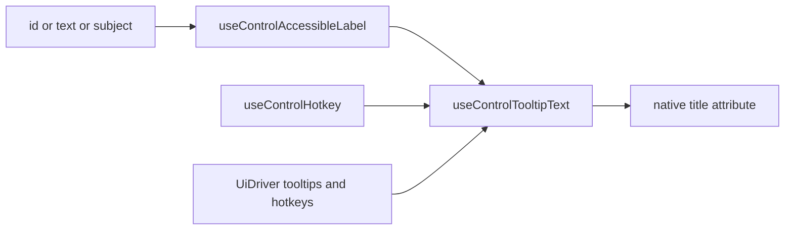

# Unlabeled Control Hover Tooltips

## Context

Hover hints today are **native `title` attributes**, not a Tooltip component (Radix Tooltip was dissolved with zero consumers). `[ChromeControlHint](🧰️framework/🔨️modules/🖱️ui/🧱️elements/💡️ChromeControlHint/🟦️component.tsx)` clones `title`/`aria-label` from `[useControlAccessibleLabel](🧰️framework/🔨️modules/🖱️ui/🎱️elements/🏷️Label/🟦️component.tsx)`. Most icon controls set `title` themselves; `[UiDriver.tooltips](🧰️framework/🔨️modules/🖱️ui/🎱️elements/🚗️UiDriver/🟦️component.tsx)` / `hotkeys` axes exist (`full|minimal|none`, `inline|tooltip|none`) but tip text is unwired. Drag grips always resolve generic `ui.tree.drag.sort` → “Reorder”, even on window tabs whose name is `tab.title` (e.g. “Perspective”).

**Chosen approach:** keep native `title` (avoids reintroducing Radix trigger-ref loops). Centralize tip composition, gate on `driver.tooltips`, append hotkeys when present, and give drag handles parameterized subject copy.




## Ticket / goals

Repo MCP is not connected in this session (same as prior tickets). Associate with `R26-02/RUNNING-SKETCHPAD`. Create local ticket folder `.🦑️repo/🎫️tickets/🎆️26/� combinemoon08/☀️17/UNLABELED-CONTROL-HOVER-TOOLTIPS/` with research notes; no existing open ticket covers this.

## Implementation

### 1. Central tooltip text hook

In `[🏷️Label/🟦️component.tsx](🧰️framework/🔨️modules/🖱️ui/🎱️elements/🏷️Label/🟦️component.tsx)` (next to `useControlAccessibleLabel`):

- Add `useControlTooltipText(id?, text?, options?)` that:
  - Returns `undefined` when `driver.tooltips === "none"`.
  - Base string = `useControlAccessibleLabel(id, text)` (or explicit `text`).
  - When a hotkey exists via `useControlHotkey(id)` and `driver.hotkeys !== "none"`, append  `(${hotkey})` — covers both `inline` and `tooltip` driver modes so tips always expose the chord when one exists.
  - Keep `aria-label` on the **name only** (no hotkey in aria) for screen readers; `title` gets the composed tip.
- Add a tiny pure helper `formatControlTooltipText({ label, hotkey })` in a new presentation module under `🔨️modules/` (e.g. `⌨️control-tooltip-presentation`) so formatting stays testable without React.

### 2. Upgrade `ChromeControlHint`

Update `[ChromeControlHint](🧰️framework/🔨️modules/🖱️ui/🎱️elements/💡️ChromeControlHint/🟦️component.tsx)` to use `useControlTooltipText` for `title`, and keep `aria-label` from `useControlAccessibleLabel` only. Respect existing child `title`/`aria-label` overrides.

### 3. Wire icon-only controls to the same tip text

Replace raw `title={accessibleLabel}` with `title={useControlTooltipText(...)}` (or wrap with `ChromeControlHint`) in:

- `[⚡️ActionGroup](�¸framework/🔨️modules/🖱️ui/🎱️elements/⚡️ActionGroup/🟦️component.tsx)` — `Action`, `ActionGroupItem` (also add missing `aria-label` on icon-only `ActionGroupItem`)
- `[🎛️ButtonGroup](�¸framework/🔨️modules/🖱️ui/🎱️elements/🎛️ButtonGroup/🟦️component.tsx)` — `ButtonGroupItem`
- `[🎛️ToggleGroup](�¸framework/🔨️modules/🖱️ui/🎱️elements/🎛️ToggleGroup/🟦️component.tsx)` / Toggle path
- Pane chrome toggle in Tree / Canvas call sites that already set `title`

Only set hover tips when there is **no visible inline label** (`useControlInlineText` empty / `driver.labels === "icons"`), except drag handles which are always unlabeled affordances.

`ControlHotkeyBadge` stays as-is for `hotkeys === "inline"`.

### 4. Contextual drag-handle tooltips

Extend `[DragHandle](�¸framework/🔨️modules/🖱️ui/🎱️elements/🧱️DragHandle/🟦️component.tsx)`:

```tsx
subject?: string  // e.g. tab.title / pane label
```

Add i18n keys (EN + DE) in schema (`[📚️I18n](�¸framework/🔨️modules/🖱️ui/🎱️elements/📚️I18n/🟦️component.tsx)`) and bundles in react index:

- `ui.tree.drag.sortTarget`: EN `"Click and hold left click to drag {{target}}"` / DE equivalent
- `ui.tree.drag.transferTarget`: EN `"Click and hold left click to drag {{target}}"` (transfer wording if distinct) / DE equivalent

When `subject` is set, resolve via `t(labelId + "Target" or dedicated key, { target: subject })` through `ChromeControlHint` `text=...`. When unset, keep existing generic `ui.tree.drag.sort` / `.transfer` labels (still with hotkey suffix if any — usually none).

Pass `subject` at call sites that know the name:

- `[🎨️Canvas` ModeDockTabBar](�¸framework/🔨️modules/🖱️ui/🎱️elements/🎨️Canvas/🟦️component.tsx) — `subject={tab.title}`
- `[📑️PanelTabBar](�¸framework/🔨️modules/🖱️ui/🎱️elements/📑️PanelTabBar/🟦️component.tsx)` — `subject={tab.name}`
- [`WindowPaneChromeToggle`](�¸framework/🔨️modules/🖱️ui/🎱️elements/📵️Tree/

