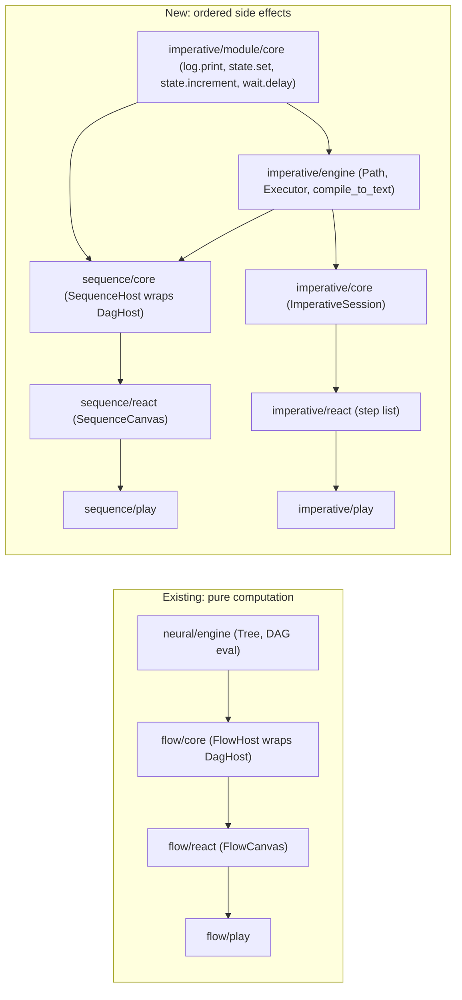

# Imperative and Sequence Technologies

## Architecture at a glance




Key distinction driving the whole design: `**imperative` has no edges at all** — a `Path` is just an ordered `Vec<Step>`, order = position, like statements in a script. `**sequence` has real execution-flow edges** on an infinite canvas (reusing `mathematical_graph_port_directed_dag`'s `DagHost`), but constrained so every node has at most one outgoing and one incoming "flow" connection. Because that constraint guarantees the visual graph is always reducible to a single total order, `sequence` can deterministically flatten itself into an `imperative::Path` and compile that into text, one line per node.

Both exist to **trigger side effects in a consistent, ordered sequence** (contrast with neural/flow, whose goal is pure computational logic). Concretely: `imperative/module/core` ships 4 real side-effecting actions — `log.print` (writes to an ordered effect log / console), `state.set`, `state.increment` (mutate a running scope dictionary threaded step-to-step), `wait.delay` (records a real timing gap). Rust stays synchronous and deterministic (it only decides *what* happens *in what order*); the React layer (`performImperativeEffects` in `imperative/core/index.ts`) actually *performs* the effects (console.log, real `await sleep(ms)`, state UI updates) by replaying the ordered effect log — a clean CQRS split, and it avoids needing async Rust/WASM.

## Why reuse `mathematical_graph_port_directed_dag` for sequence

`DagHost` already gives us, for free, an infinite pannable/zoomable canvas, boxes with left/right channel rows, bezier edge painting, `would_create_cycle`, and a `DagNodeKind::Computation { inputs, outputs }` kind whose channels already support `cardinality: "!"` metadata. A step node is just a `Computation` node with exactly one input channel (`prev`) and one output channel (`next`). The base port-graph engine (`mathematical/graph/lib.rs`) already replaces any existing incoming edge on a target handle (`try_connect_handles`, [mathematical/graph/lib.rs:1846](mathematical/graph/lib.rs)), so "at most one incoming" is free. The one thing `sequence/core` must add on top (mirroring `flow/core`'s `connect_ports`, [flow/core/lib.rs:1821](flow/core/lib.rs)) is a check that the *source* `next` port doesn't already have an outgoing edge, plus the existing `would_create_cycle` check — no changes to the shared `dag` crate are needed at all.

## New directories

```
imperative/
├── AGENTS.md                     # philosophy doc, mirrors neural/AGENTS.md
├── engine/                       # imperative_engine (pure Rust, like neural/engine)
│   ├── Cargo.toml
│   ├── AGENTS.md
│   └── lib.rs                    # Path, Step, Executor, EffectLogEntry, compile_to_text
├── module/
│   └── core/                     # imperative_module_core (pure Rust, no wasm)
│       ├── Cargo.toml
│       └── lib.rs                # LogPrint, StateSet, StateIncrement, WaitDelay + register()
├── core/                         # imperative_core (Rust+wasm) + TS
│   ├── Cargo.toml
│   ├── lib.rs                    # ImperativeSession (#[wasm_bindgen])
│   ├── index.ts                  # thin TS: types, VCS doc handler, performImperativeEffects()
│   ├── package.json / project.json / script.ts
├── react/                        # step-list UI pieces
│   ├── index.tsx
│   └── package.json / project.json / script.ts / vitest.config.ts
└── play/                         # PlaygroundImperative (step-list editor, no canvas)
    ├── index.ts / index.html / globals.css
    └── package.json / project.json / script.ts / vite.config.ts / vitest.config.ts

sequence/
├── AGENTS.md                     # mirrors flow/AGENTS.md
├── core/                         # sequence_core (Rust+wasm) + TS
│   ├── Cargo.toml
│   ├── lib.rs                    # SequenceFixtureV1, SequenceHost (wraps DagHost), SequenceSession
│   ├── index.ts
│   ├── package.json / project.json / script.ts
├── react/                        # SequenceCanvas
│   ├── index.tsx
│   └── package.json / project.json / script.ts / vitest.config.ts
└── play/                         # PlaygroundSequence (canvas + catalogue + compiled-text panel)
    ├── index.ts / index.html / globals.css
    └── package.json / project.json / script.ts / vite.config.ts / vitest.config.ts
```

## `imperative/engine` (Rust, depends on `neural_engine` for `Dictionary`/`Registry`/`Operation`)

```rust
pub struct Step { pub id: String, pub kind: String, pub params: Dictionary }
pub struct Path { pub steps: Vec<Step> }

pub struct EffectLogEntry {
    pub step_id: String,
    pub kind: String,
    pub input: Dictionary,
    pub output: Result<Dictionary, String>,
}

pub struct Executor<'a> { registry: &'a Registry }
impl<'a> Executor<'a> {
    pub fn new(registry: &'a Registry) -> Self { ... }
    /// Runs steps strictly in list order (never parallel/cached, unlike neural::Evaluator).
    /// Each step's input = merge(scope, step.params); step's output dictionary merges back into scope.
    /// Halts on the first error, returning the partial log.
    pub fn run(&self, path: &Path, seed: &Dictionary) -> (Dictionary, Vec<EffectLogEntry>) { ... }
}

/// Emits one line of source per step, e.g. `state.increment(by=5, key="counter");`
pub fn compile_to_text(path: &Path, registry: &Registry) -> String { ... }
```

## `imperative/module/core` (Rust, pure — single source of truth for actions, reused by both `imperative/core` and `sequence/core`)

Mirrors `flow/module/math`'s `Operation` + `register()` pattern ([flow/module/math/lib.rs:7](flow/module/math/lib.rs), [flow/module/math/lib.rs:511](flow/module/math/lib.rs)) but no wasm boilerplate needed (consumed as a plain Cargo path dependency, not a standalone loadable module):

- `LogPrint` — reads `key`/`message` from scope+params, output unchanged; the log entry itself is the effect.
- `StateSet` — `output = channel_output(key, value)`, merges into scope.
- `StateIncrement` — reads current scope value for `key`, outputs `key -> current + by`.
- `WaitDelay` — `params.ms`, pass-through dictionary; the delay is *performed* later by `performImperativeEffects` in TS.
- `pub fn register(registry: &mut Registry)` — registers schemas + all 4 operators + `registry.finalize()`.

## `imperative/core` (wasm binding + TS runtime)

`#[wasm_bindgen] pub struct ImperativeSession` (native-testable `ImperativeHost` inner, mirrors `FlowSession`'s `Rc<RefCell<...>>` pattern): `loadPathJson`, `pathJson`, `catalogueJson`, `addStep(kind, index)`, `removeStep(id)`, `moveStep(id, newIndex)`, `setStepParamsJson(id, json)`, `run() -> String` (JSON `{scope, effects}`), `compileText() -> String`.

`index.ts` — thin re-exports (like [flow/core/index.ts](flow/core/index.ts)) plus the shared effect-performing runtime used by both playgrounds:

```typescript
export interface EffectSink {
  readonly onLog?: (message: string) => void;
  readonly onStateChange?: (key: string, value: unknown) => void;
}
export async function performImperativeEffects(entries: readonly EffectLogEntry[], sink: EffectSink): Promise<void> {
  for (const entry of entries) {
    if (entry.kind === "log.print") sink.onLog?.(String(entry.output?.message ?? ""));
    else if (entry.kind === "wait.delay") await new Promise((r) => setTimeout(r, Number(entry.input.ms ?? 0)));
    else if (entry.kind.startsWith("state.")) sink.onStateChange?.(entry.step_id, entry.output);
  }
}
```

## `imperative/play` — step-list editor playground

A `PlaygroundImperative extends Playground` (mirrors [flow/play/index.ts:1172](flow/play/index.ts)'s `PlaygroundFlow`), rendering: an ordered list of steps (add from catalogue, drag-reorder, remove), a param form per selected step, a Run button (calls `session.run()` then `performImperativeEffects`), a live effect-log panel, and a compiled-text preview (`session.compileText()`) — no canvas.

## `sequence/core` (wasm binding wrapping `DagHost`, mirrors `FlowHost`/`FlowSession`)

```rust
pub struct SequenceFixtureV1 { pub schema: String, pub camera: DagCameraV1, pub steps: Vec<StepWidgetV1>, pub edges: Vec<SequenceEdgeV1> }
pub struct StepWidgetV1 { pub id: String, pub kind: String, pub params: Dictionary, pub x: f64, pub y: f64 }
pub struct SequenceEdgeV1 { pub id: String, pub from: String, pub to: String } // from.next -> to.prev

pub struct SequenceHost { pub fixture: SequenceFixtureV1, pub dag: DagHost, registry: Registry, ... }
impl SequenceHost {
    /// Maps each step to DagNodeKind::Computation with one "prev" input + one "next" output IoPortSpec (cardinality "!").
    fn build_dag_fixture(&self) -> DagFixtureV1 { ... }
    /// Mirrors flow's connect_ports: self-connect / cycle (would_create_cycle) / existing-outgoing-on-source checks.
    pub fn connect_steps(&mut self, from_id: &str, to_id: &str) -> Result<String, String> { ... }
    /// Walks edges from the head (no incoming edge) to build an ordered imperative::Path.
    fn build_path(&self) -> Path { ... }
    pub fn compile_text(&self) -> String { compile_to_text(&self.build_path(), &self.registry) }
    pub fn run(&mut self) -> String { /* Executor::run + JSON */ }
}

#[wasm_bindgen] pub struct SequenceSession { ... } // loadFixtureJson, addStep, connectSteps, disconnect,
  // setStepParamsJson, compileText, run, plus pass-through: attachCanvas, renderFrame, pointerDownScreen/
  // MoveScreen/UpScreen, setCamera, reorganize, selection — all delegate straight to self.dag (DagHost).
```

`registry` is built once via `neural_engine::Registry::new()` + `imperative_module_core::register(&mut registry)` — the identical function `imperative/core` uses, so action semantics never drift between the two technologies.

## `sequence/react` — `SequenceCanvas`

Small subset of `FlowCanvas` ([flow/react/index.tsx:2885](flow/react/index.tsx)): mount `SequenceSession`, `attachCanvas` + RAF `renderFrame` loop, `ResizeObserver`, pointer-event forwarding (`pointerDownScreen`/`Move`/`Up`), a catalogue palette (reuses the 4 actions from `imperative/module/core`'s catalogue JSON) for dragging new steps onto the canvas, an inspector panel (reuses `imperative/react`'s param-form component) for the selected step, a compiled-text panel, and a Run button wired through `performImperativeEffects` from `@semio-tech/imperative-core`.

## `sequence/play` — canvas playground

`PlaygroundSequence` mirrors `PlaygroundFlow`/`PlaygroundDag`: canvas + catalogue tree + inspection panel + compiled-text panel + effect-log panel.

## Root wiring

- `**Cargo.toml**` workspace `members`: add `"imperative/engine"`, `"imperative/module/core"`, `"imperative/core"`, `"sequence/core"`.
- `**package.json**` `workspaces`: add `"imperative/core"`, `"imperative/react"`, `"imperative/play"`, `"sequence/core"`, `"sequence/react"`, `"sequence/play"`. `scripts`: add `"dev:imperative": "bun ./script.ts dev imperative"`, `"dev:sequence": "bun ./script.ts dev sequence"`.
- `**script.ts**` `dev` dispatch: add `if (segments[0] === "imperative") { runCmd(..., "@semio-tech/imperative-play:dev", ...) }` and the same for `sequence`, alongside the existing `flow`/`dag` branches ([script.ts:223](script.ts)).
- `**.vscode/launch.json**`: add `🛠️dev⚙️imperative` (group `3_dev`, `IMPERATIVE_PLAY_PORT=6076`) and `🛠️dev📜sequence` (`SEQUENCE_PLAY_PORT=6077`) entries, following the exact shape of the `🛠️dev🌊flow` entry ([.vscode/launch.json:371](.vscode/launch.json)).
- `**ui/styling/vite-elements-assets.ts**`: extend `PlaygroundRendererPuzzleKind` union with `"imperative" | "sequence"` ([ui/styling/vite-elements-assets.ts:436](ui/styling/vite-elements-assets.ts)), add boot-subpath and host-marker entries (`//#region 🔖ImperativePlayHost` / `//#region 🔖SequencePlayHost`).
- `**framework/product/playground/renderer/react/index.tsx**`: add the two new host regions (registering surface hosts + `bootImperativePlay`/`bootSequencePlay`), extend the surface-type switch and the fixture-preview switch with `case "imperative"` / `case "sequence"` (mirroring the existing `flow`/`dag` cases).
- `**framework/product/playground/renderer/react/package.json**`: add `"./imperative"` and `"./sequence"` export subpaths plus `@semio-tech/imperative-play`, `@semio-tech/imperative-react`, `@semio-tech/sequence-play`, `@semio-tech/sequence-react` dependencies.
- Per-package `project.json`/`package.json`/`script.ts` follow the flow/dag template exactly (`wasm` target for Rust+wasm crates, `dev`/`build`/`test`/`validate` for play apps, `test` only for react packages) — all commands routed through each package's own `script.ts`.

## AGENTS.md docs

New `imperative/AGENTS.md` (mirrors [neural/AGENTS.md](neural/AGENTS.md)): headless, dictionary-in/dictionary-out, but **Path** not Tree — order is positional, no synapses, goal is ordered side effects not pure computation. New `sequence/AGENTS.md` (mirrors [flow/AGENTS.md](flow/AGENTS.md)): GUI for imperative; one execution-flow channel per step (`prev`/`next`), at most one connection each way; compiling the path yields text, one line per node. Plus crate-level `AGENTS.md` for `imperative/engine` and `sequence/core` mirroring [dag/AGENTS.md](mathematical/graph/port/directed/dag/AGENTS.md)'s terse concept-doc style.

## Testing

Inline `import.meta.vitest` blocks in every new TS/TSX file (per repo convention — no separate test files) covering: `Executor.run` ordering/scope-threading, `compile_to_text` output shape, `connect_steps` rejecting fan-out/cycles, `performImperativeEffects` ordering. Rust `#[cfg(test)] mod tests` inline in each `lib.rs` (`cargo test -p imperative_engine -p imperative_module_core -p imperative_core -p sequence_core`).