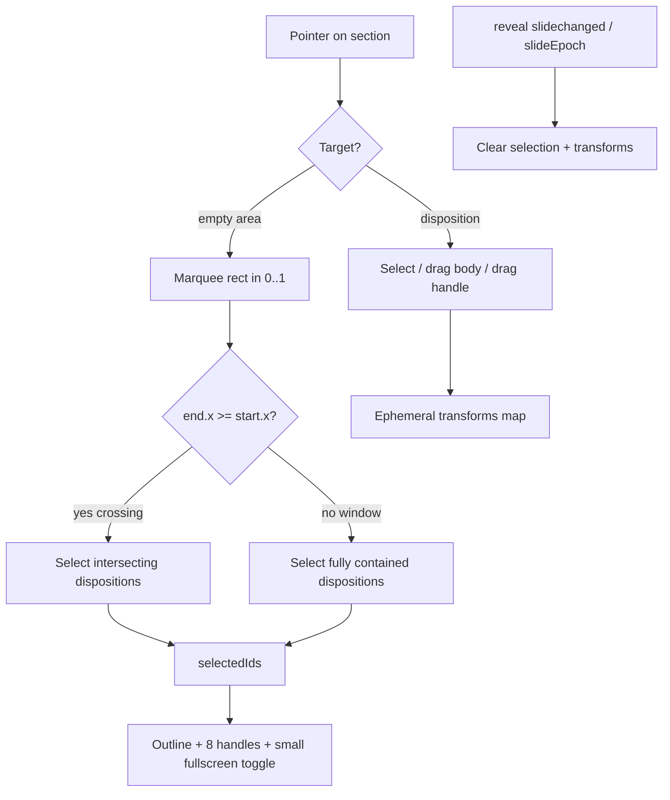

## Goal

Add an interactive manipulation layer to the React presentation renderer. All changes are confined to two existing files (per repo rules: extend existing files, in-source tests, no new files):

- [framework/product/presentation/renderer/react/index.tsx](framework/product/presentation/renderer/react/index.tsx)
- [framework/product/presentation/renderer/react/globals.css](framework/product/presentation/renderer/react/globals.css)

No changes to `core/index.ts` — interaction is a render concern. Confirmed decisions: ephemeral (resets on reload + slide change), fullscreen = fill the slide canvas per selected disposition, no Escape (reserved for reveal overview), empty-area click deselects.

## Coordinate model

The reveal `<section>` is sized to the logical slide dimensions, so it is the interaction root. Pointer math works in normalized 0..1 fractions relative to the section's `getBoundingClientRect()`, which matches `DispositionPosition`. Dragging/resizing/fullscreen pins a disposition by switching its wrapper to `position:absolute` with `left/top/width/height` as percentages relative to the section (reveal sections are positioned ancestors). Until first manipulated, a disposition stays in its declared flow/positioned layout (so the intro and positioned decks render exactly as today).

## Data flow

## index.tsx — new `#region 🔖Interaction`

1. Ephemeral types + pure geometry helpers (all unit-testable):

- `interface DispositionTransform` (reuse `DispositionPosition`).
- `rectsIntersect(a,b)`, `rectContains(a,b)`.
- `normalizeMarquee(start,end): DispositionPosition` and `marqueeSelectionRule(start,end): "crossing" | "window"` (crossing when dragged left-to-right, i.e. `end.x >= start.x`).
- `marqueeSelects(marquee, target, rule)` → intersection for crossing, containment for window.
- `translateDispositionRect(rect, dx, dy)` and `resizeDispositionRect(rect, handle, dx, dy)` (8 handles, clamped to [0,1], min size).
- `groupBoundingRect(rects)` + `scaleRectWithinGroup(rect, oldGroup, newGroup)` for multi-select drag/resize.
- `toggleFullscreenRect(current, stored)` → `{x:0,y:0,width:1,height:1}` or restore.
- `clientToSectionFraction(sectionEl, clientX, clientY)`.

2. `usePresentationInteraction(slideEpoch)` hook: holds `selectedIds: Set`, `transforms: Map<id, DispositionTransform>`, `fullscreenStash: Map<id, DispositionPosition>`; exposes select/toggle/marquee-apply/drag/resize/fullscreen/clear; `useEffect` clears all when `slideEpoch` changes (ephemeral reset).
3. `InteractiveDisposition` wrapper around the current `MorphDispositionView` output: owns a stable `data-disposition-id` (participant + embodiment + index), pointer handlers (hover, click-select with shift-toggle, body-drag, handle-resize), applies a transform override style when present (absolute pin), and `stopPropagation` so reveal doesn't treat drags as swipes. When selected, renders selection chrome as children: outline, 8 resize handles, and a small fullscreen toggle button (top-right) wired to `toggleFullscreenRect`.
4. `InteractionLayer`: an absolutely-positioned overlay child of the section that captures `pointerdown` on empty area to start a marquee (drawing a rectangle div), commits selection on `pointerup` via the crossing/window rule, and deselects on a plain empty click. Gated to the present slide (off-screen sections are `hidden`, so no events).

## index.tsx — integrate into `ArrangementSection` (~1107)

Wrap each placement in `InteractiveDisposition`, render the `InteractionLayer` as a section child, and pass the shared interaction state down. Keep the existing positioned-canvas vs flow-centered rendering intact.

## globals.css — new `/* #region 🔖Interaction */`

Hover outline, selected outline, 8 handle dots with directional cursors, marquee rectangle (crossing vs window styling via a class), the small fullscreen toggle button, `user-select:none`/`touch-action:none`/`cursor:move` on interactive frames, and raised `z-index` for fullscreened/selected dispositions.

## Tests — extend in-source vitest in both files

- Geometry/pure helpers: intersect/contain, marquee crossing vs window rule and selection, translate/resize clamping, group bounding + scale, fullscreen toggle. (Pure functions — robust in jsdom where `getBoundingClientRect` is zeroed.)
- DOM (jsdom via existing `mountPresentation`/`act` harness): every disposition renders a `data-disposition-id`; clicking selects and shows selection chrome + fullscreen toggle; clicking empty area deselects; fullscreen toggle pins the disposition to the full slide rect and back.
- Update the existing `centers intro flow slides without a positioned arrangement canvas` test to reflect that flow dispositions are now interactive (still visually centered) — this is an intended behavior change, not a test weakened to pass.

## Notes

- Pointer-driven drag/marquee distances can't be exercised in jsdom (no layout), so correctness is guaranteed by the pure geometry helpers plus state-based selection DOM tests; manual runtime verification of drag/resize/marquee in a browser will be done via the dev server.
- Work proceeds inside a repo ticket (open via repo MCP, associate with the most appropriate goal, close with summary on completion).
