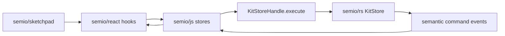

# Refactor Sketchpad Kit State Management

## Scope

- Work inside a new or reopened repo ticket under the `Running Sketchpad` goal before implementation.
- Primary files:
  - [semio/sketchpad/index.tsx](semio/sketchpad/index.tsx)
  - [semio/react/index.tsx](semio/react/index.tsx)
  - [semio/js/index.ts](semio/js/index.ts)
  - [semio/js/worker.ts](semio/js/worker.ts)
  - Existing embedded tests in those same files.

## Target Flow

## Implementation Steps

1. Remove sketchpad-owned kit authority.
   - Delete direct `@semio/js` kit imports from [semio/sketchpad/index.tsx](semio/sketchpad/index.tsx), including `executeSemioKitCommand`, `createKitCommandEngineExplicitOrigin`, concrete store constructors, local kit file state helpers, and direct DTO import/export helpers.
   - Replace `SketchpadStore` kit registry/shallow caches, browser persistence caches, `kitStore.getSnapshot()` reads, and direct `kitStore.subscribe()` reads with `semio/react` hooks.
   - Remove the window bridge `__SEMIO_EXECUTE_SEMIO_KIT_COMMAND__` and the legacy `sketchpadAttachKitReadShell` snapshot mutation path.

2. Promote missing hook APIs into `semio/react`.
   - Add narrow hooks for sketchpad needs that are currently implemented locally: open kit list, active kit, kit kind/source, kit shallow list, kit persistence/file URLs, command dispatchers, import/export/open/create, undo/redo, and backbone/conflict operations where UI needs them.
   - Keep hooks focused: each hook returns only the field or command surface needed, backed by `useSyncExternalStore` or existing store selectors.
   - Ensure `semio/react` imports only `@semio/js` plus React.

3. Collapse `semio/js` to the execute-only Rust boundary.
   - Refactor `kitGraphqlRun`, `kitGraphqlExecuteStoreCommand`, read helpers, and command shell helpers so all Rust interaction routes through one internal `execute` wrapper over `KitStoreHandle.execute`.
   - Remove or internalize public store `replace(kit)` escape hatches for authoritative mutation. Host stores may mirror snapshots, but consumers must not mutate kit state through `replace` or manual patch calls.
   - Replace string bridge commands like `semio.kit.patchTypes`, `patchDesigns`, and `__patch` field writes with typed semantic command calls that return request ids and reconcile through lifecycle events.

4. Convert sketchpad mutations to semantic commands.
   - Replace `kit.fixPiecesInDesignDiff`, `dragPiecesInDesignDiff`, `semio.kit.setField(..., "__patch", diff)`, `patchTypes`, `patchDesigns`, and `KitDiffAppStore` mutation paths with `semio/react` semantic command hooks.
   - Keep app UI state in sketchpad state machine/store dispatch, but every kit change must flow through a hook command and receive its result from the `semio/react`/`semio/js` event path.
   - Preserve preview-only UI state where needed, but do not apply manual kit diffs or mutate local kit snapshots in sketchpad.

5. Update tests in place.
   - Extend [semio/js/index.ts](semio/js/index.ts) embedded tests to assert all kit store operations use the execute wrapper and no public manual patch path remains.
   - Extend [semio/react/index.tsx](semio/react/index.tsx) embedded tests for new hook APIs, command lifecycle events, and error propagation.
   - Extend existing [semio/sketchpad/index.tsx](semio/sketchpad/index.tsx) Playwright/embedded coverage for import/open, kit list rendering, design drag/delete/undo, and details panel command edits.

## Verification

- Run the focused JS/react/sketchpad checks first, then the relevant Playwright slice.
- Run lints on touched files after edits.
- Close the repo ticket with changed files and a concise implementation summary.
