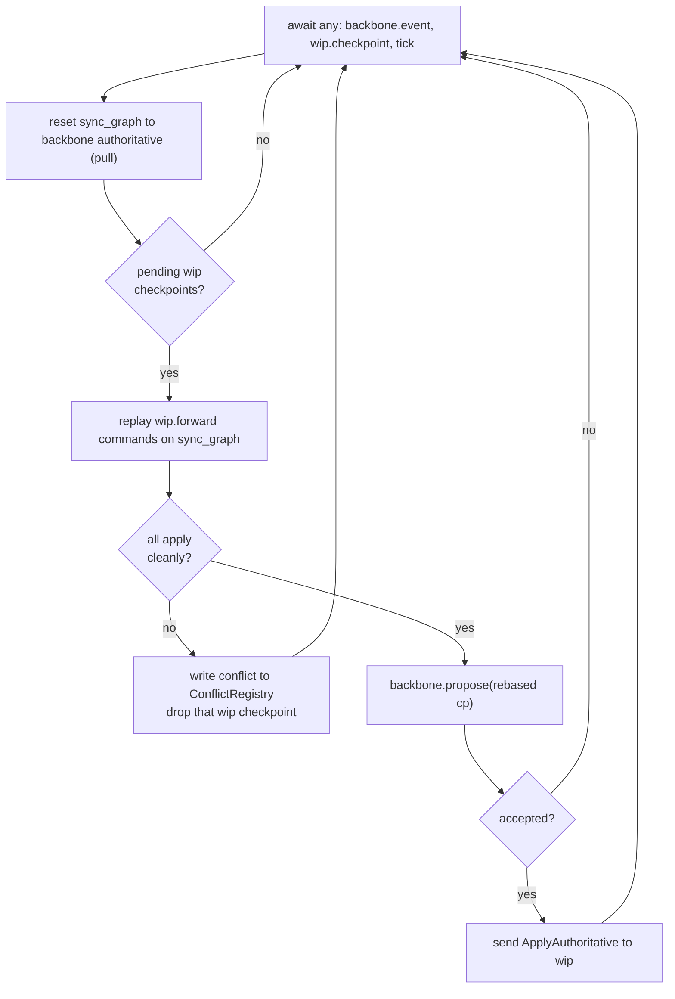

# Kit Store Backbone Generalization

## 1. Terminology rename inside `semio/rs`

The current `KitStore` conflates three roles (live graph, VCS state, control plane). Split them:

- Existing `KitStore` in [`semio/rs/lib.rs`](semio/rs/lib.rs) (line ~13998) is renamed `KitGraph` in a new `pub mod kit_graph`. Keeps the same fields (entity collections + VCS tables: `initial`, `checkpoints`, `alternatives`, `sessions`, `the_kit_head`, `children`) and event bus. `KitStoreRef` becomes `KitGraphRef`. All existing `impl KitStore` blocks (VCS, commands, wasm helpers, io) move to `impl KitGraph`. This is a mechanical rename; the internals keep working.
- Existing `pub mod kit_store_command` (line 4201) keeps its command enums (`KitStoreCommand`, `SessionCommand`, `KitDraftCommand`, `TransactionCommand`, `KitCheckpointCommand`, `KitAlternativeCommand`) but `.execute(kit: &KitGraphRef)` now runs against a `KitGraph`, not the new `KitStore`.
- A new `pub mod kit_store` holds the new control-plane `KitStore` described below.

No external bundle (py/net/js/react/go) talks to `KitStore` directly — they all go through `semio-store` JSON-RPC, so the rename is contained to `semio/rs` + `semio/store`.

## 2. New control plane: `pub mod kit_store`

```rust
pub struct KitStore {
    wip: WipHandle,                           // tx side of wip task
    backbone: ArcSwap<Option<BackboneHandle>>, // attach/detach at runtime
    coordinator: CoordinatorHandle,
    conflicts: Arc<ConflictRegistry>,
    executor: Arc<async_executor::Executor<'static>>,
}
```

- `WipHandle`, `BackboneHandle`, `CoordinatorHandle` = `async_channel::Sender<Msg>` pairs, each owning an executor task.
- Backbone is optional and hot-swappable (user requirement: "A store doesn't need to have a backbone (can be added or removed during runtime)").
- `KitStore::new() -> Self` spawns wip + coordinator immediately. `attach_backbone(cfg)` / `detach_backbone()` spawn / drop the backbone task.

## 3. Async runtime

Use `async-executor` (user-selected). Add to [`semio/rs/Cargo.toml`](semio/rs/Cargo.toml):

```toml
async-executor = "1"
async-channel = "2"
async-lock = "3"
async-task = "4"
```

- One shared `Executor<'static>` per `KitStore`. On native, a dedicated thread drives `executor.run(future::pending::<()>())`. On wasm, the same executor is driven via `wasm_bindgen_futures::spawn_local`.
- Nothing in the crate transitions to `tokio`. Existing `async-broadcast` stays for `KitEvent` fanout.

## 4. Three async tasks

### 4.1 `wip` task — `pub mod wip_kit`

Owns an `Arc<async_lock::RwLock<KitGraph>>` (async RwLock so a slow write doesn't block reads). Accepts:

```rust
enum WipMsg {
    Read(ReadKitCommand, oneshot::Sender<...>),
    Execute(KitStoreCommand, oneshot::Sender<KitStoreCommandResult>),   // existing commands
    ApplyAuthoritative { checkpoints: Vec<KitCheckpoint>, the_kit_head: Option<Id> },
    CheckpointFinalized { cp: KitCheckpoint, reply: oneshot::Sender<()> },
    Subscribe(async_broadcast::Receiver<KitEvent>, ...),
}
```

- `Execute(KitStoreCommand)` routes to the existing `KitStoreCommand::execute(&KitGraphRef)` dispatcher ([`lib.rs:4304`](semio/rs/lib.rs)).
- When a `FinalizeToKitCheckpoint` produces a new checkpoint, wip **also** sends it to the coordinator via `CoordinatorMsg::WipCheckpoint(cp)`.
- `ApplyAuthoritative` is how the coordinator flows pulled/rebased history back into wip (overwrites `initial` + `checkpoints` + `the_kit_head` on the wip `KitGraph`).

### 4.2 `backbone kit stub` task — `pub mod backbone`

A single actor that wraps one of three `Backbone` trait impls:

```rust
#[async_trait]
pub trait Backbone: Send + Sync {
    async fn pull(&self) -> Result<BackboneSnapshot>;
    async fn propose(&self, cp: KitCheckpoint) -> Result<ProposeOutcome>; // Accepted | Rejected { new_tip }
    async fn subscribe(&self) -> async_broadcast::Receiver<BackboneEvent>;
    async fn set_active_checkpoint(&self, id: Option<Id>) -> Result<()>;  // LocalBackbone only, no-op elsewhere
}

pub enum BackboneEvent { NewTip(Id), Checkpoints(Vec<KitCheckpoint>) }
pub enum ProposeOutcome { Accepted, Rejected { current_tip: Option<Id> } }
```

The stub task holds a local cache (`KitGraph`) of the authoritative state and forwards `pull` / `propose` to the concrete backbone. Backbone is single-writer; only the coordinator's synchronizer graph calls `propose`.

Three concrete impls in `pub mod backbone`:

- **`DevBackbone`** (`native`): reads/writes a single JSON file. Uses `notify` (or periodic poll, to keep deps minimal — periodic every 500ms via `Timer::after` from `async-io`) to detect external changes. On `propose`, checks `current_tip == cp.parent`; on match, appends + rewrites JSON atomically via tempfile swap; else rejects with new tip.
- **`LocalBackbone`** (`native`): owns `.semio/kit.db` (full kit graph via existing `io::sqlite`) and `.semio/files/BLOBHASH.EXT`. Tracks an `active_checkpoint`; `set_active_checkpoint(id)` materializes the files of that checkpoint onto disk (writing blobs from `.semio/files/` into their original relative paths and removing files not in that checkpoint). Same propose-or-reject semantics as Dev.
- **`RemoteBackbone`** (`native + wasm`): websocket to `semio/hub`. Uses `async-tungstenite` on native and `ws_stream_wasm` on wasm (behind cfg). Wire protocol is a minimal JSON envelope `{ kind: "pull" | "propose" | "accepted" | "rejected" | "newTip" | "checkpoints", ... }` with `KitCheckpoint` / `Id` payloads (same serde shape used everywhere else).

All three implement the same trait; `BackboneConfig` is a serde enum with variants `Dev { path }`, `Local { folder }`, `Remote { url, session_id }`, so `KitStore::attach_backbone(cfg)` can be driven purely from JSON-RPC.

### 4.3 `kit coordinator` task — `pub mod kit_coordinator`

Owns a **third** `KitGraph` (the "synchronizer graph", per the user requirement: _"Create a third graph which is owned by the synchronizer. That graph always starts on the authoritative graph and then it tries to apply the changes from wip. When it succeeds, then send it to the backbone."_).

Algorithm (non-blocking, single-task loop):



Key properties:

- Backbone is single-writer; only the coordinator calls `propose`.
- On any backbone `NewTip` event or `Rejected` response, sync_graph is reset and pending wip checkpoints are replayed again (no blocking on wip; wip can keep accepting drafts and transactions meanwhile).
- A "conflict" in `ConflictRegistry` is `{ wip_checkpoint: KitCheckpoint, backbone_tip: Option<Id>, reason: String }`. Registry exposes `list()`, `get(id)`, `resolve(id, strategy)` where strategy is `{ DropWip | ForceOverwriteBackbone | Rebase }` (future; initial version is `DropWip` + `ForceOverwriteBackbone`).
- When there is no backbone attached, coordinator skips everything except recording wip checkpoints as "orphan committed to wip only" — the wip's local VCS tree is the single source of truth.

### 4.4 `pub mod kit_conflict_registry`

```rust
pub struct ConflictRegistry { inner: async_lock::Mutex<HashMap<Id, KitConflict>> }
pub struct KitConflict { pub id: Id, pub wip_checkpoint: KitCheckpoint, pub backbone_tip: Option<Id>, pub reason: String, pub created_at: String }
```

Simple in-memory registry today; persistence piggybacks on whichever backbone is attached (e.g., LocalBackbone stores conflicts as a side-table in `.semio/kit.db`) — out of scope for this pass, left as a follow-up.

## 5. Command routing

`KitStoreCommand::execute` becomes the JSON-RPC boundary and routes via async channels:

- **Read / session / draft / transaction / alternative / checkpoint** → `wip` task.
- **Backbone + coordinator control** (new variants below) → `coordinator` or `KitStore` direct:

```rust
#[serde(rename_all = "camelCase")]
pub enum KitStoreCommand {
    // ... existing variants (ReadKitCommands, NewSession, NewAlternative, ExecuteSessionCommands, ...) ...
    AttachBackbone { config: BackboneConfig },
    DetachBackbone,
    SetActiveCheckpoint { id: Option<Id> },        // LocalBackbone
    ListConflicts,
    ResolveConflict { id: Id, strategy: ConflictResolution },
    BackboneStatus,                                  // current tip, sync state
    SyncNow,                                         // force the coordinator loop iteration
}
```

Matching `KitStoreCommandResult` variants. Existing variants keep their current behavior.

## 6. `semio/store` JSON-RPC surface

[`semio/store/jsonrpc.rs`](semio/store/jsonrpc.rs) changes:

- `install_k` now installs a `KitStore` (new) instead of the bare `KitStoreRef`/`KitGraphRef`.
- The event thread subscribes to `KitStore::subscribe_events()` which merges wip's `KitEvent` bus with coordinator events (`BackboneAttached`, `ConflictRecorded`, `CheckpointPushed`, etc., encoded as new `KitEvent::Sync(..)` variants to keep wire shape uniform).
- New methods added to `run_method` (mirroring section 5):
  - `backbone.attach` `{ config }`
  - `backbone.detach`
  - `backbone.status`
  - `backbone.setActiveCheckpoint` `{ id }`
  - `conflicts.list`
  - `conflicts.resolve` `{ id, strategy }`
  - `coordinator.syncNow`
- Existing methods (`kit.execute`, `kit.executeChangeKitCommands`, `kit.snapshot`, `kit.theKitDto`, `kit.materializeAt`, `vcs.undo/redo`, `design.*`, `query.*`, `io.*`) now go through `KitStore` → `wip` via channels but keep identical wire shape.
- Update [`semio/store/AGENTS.md`](semio/store/AGENTS.md) method catalog.
- Update [`semio/store/bin.rs`](semio/store/bin.rs): replace `OnceLock<KitStoreRef>` with `OnceLock<KitStore>` and spawn the executor-driver thread at startup.

## 7. WASM surface

`pub mod wasm` currently exposes `KitStoreHandle` backed by the single in-memory graph. Changes:

- `KitStoreHandle` now wraps the new `KitStore`. Its existing methods (`executeChangeKitCommands`, `executeReadKitCommands`, `snapshot`, `theKit`, session/draft/transaction/alternative/checkpoint ops) are unchanged in name + JS-visible shape but internally post to the wip channel.
- On wasm, Dev/LocalBackbone are unavailable (return an RPC error if selected). RemoteBackbone works (websocket via `ws_stream_wasm`).
- Only the existing JS surface in [`semio/js/index.ts`](semio/js/index.ts) + [`semio/js/worker.ts`](semio/js/worker.ts) is kept compatible; no new JS code in this plan — new methods surface via the existing `kitStoreHandle.execute(cmd)` path.

## 8. File layout

All inline modules inside [`semio/rs/lib.rs`](semio/rs/lib.rs) (per its AGENTS rule: single-file crate root). The module order:

```
pub mod kit_graph         // renamed from pub mod kit
pub mod wip_kit
pub mod backbone {
    pub mod dev;
    pub mod local;
    pub mod remote;
}
pub mod kit_coordinator
pub mod kit_conflict_registry
pub mod kit_store         // new control plane
```

`pub use kit_graph::*;` aliases are added so downstream `use semio::kit::*` keeps working during the transition (temporary; removed once `semio/store` is rewired).

## 9. Tests (extend existing files only)

- [`semio/rs/tests/`](semio/rs/tests/): add cases in the existing integration test file for:
  - Attach/detach DevBackbone round-trip (wip → coordinator → file → pull).
  - LocalBackbone active-checkpoint swap puts the right files on disk.
  - RemoteBackbone against a minimal in-test mock hub over a loopback websocket.
  - Conflict path: wip commits A, external writer advances backbone to B, coordinator rejects → registry has one entry.
  - No-backbone mode: wip commits compile, no coordinator propose.
- [`semio/store/tests/rpc.rs`](semio/store/tests/rpc.rs): add NDJSON coverage for `backbone.attach` (Dev variant on a temp file), `backbone.status`, `conflicts.list`, and a round-trip where two clients share a DevBackbone file.

## 10. Docs

- [`semio/rs/AGENTS.md`](semio/rs/AGENTS.md): add Systems section listing the four actors (`wip`, `backbone kit stub`, `coordinator`, `conflict registry`), and a small mermaid showing the data flow described in 4.3.
- [`semio/store/AGENTS.md`](semio/store/AGENTS.md): add the new method catalog entries (section 6) and note that `semio-store` is a full RPC interface over `KitStore` (not a backbone).
- [`AGENTS.md`](AGENTS.md) (repo root) and [`semio/AGENTS.md`](semio/AGENTS.md): one-paragraph entry in the version-control section on backbones.

## 11. Execution order (keeps the tree compilable)

1. Rename `KitStore` → `KitGraph` (mechanical) and add `pub use` alias. `cargo check` must pass after this step.
2. Add async-executor deps + minimal `kit_store` skeleton that just delegates `execute` to a wip task over a channel. `cargo test` still green (no behavior change).
3. Add coordinator + conflict registry + no-op pathway (no backbone attached). Still green.
4. Add `pub mod backbone` trait + `DevBackbone` + `AttachBackbone` / `DetachBackbone` commands, wire into coordinator. Extend Rust tests.
5. Add `LocalBackbone` (reuses existing sqlite io + new file-blob store), with active-checkpoint semantics. Extend tests.
6. Add `RemoteBackbone` + minimal mock hub for tests. Extend tests.
7. Update [`semio/store/jsonrpc.rs`](semio/store/jsonrpc.rs) method catalog and [`semio/store/bin.rs`](semio/store/bin.rs); add RPC-level tests in `rpc.rs`.
8. Remove the `pub use kit_graph::*` transitional alias once all intra-crate references are migrated.
9. Docs pass (section 10).
