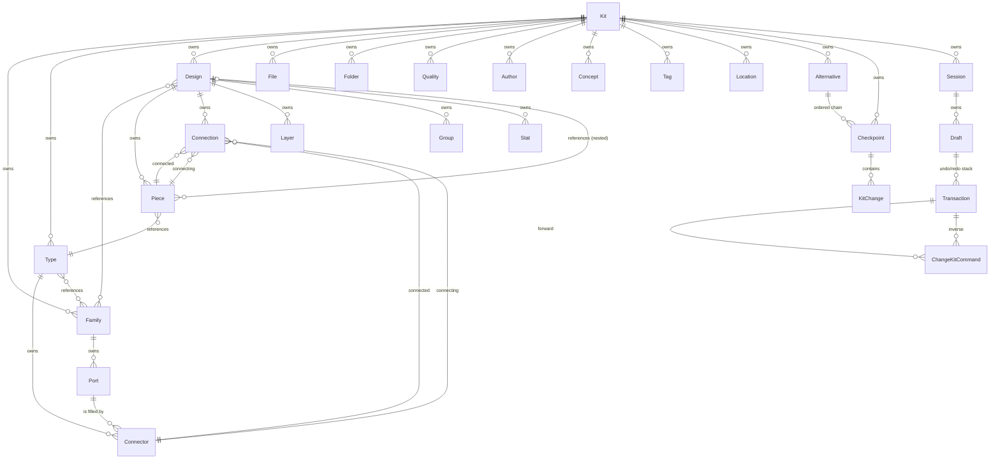

# Kit VCS Schema Consolidation

End-to-end alignment. No legacy / backwards compat. Every bundle converges on one schema + one API.

## 1. Canonical model (source of truth)

### 1.1 Entity shape (all ids are uuid-v7, read-only, never change)

Key shifts from today:

- **Kit**: drop `version`, `release`. Keep `id`, `name`, `uri`, `remote`, `homepage`, `license`, `icon`, `image`, `preview`, `description`, `createdAt`, `updatedAt`.
- **Family** (NEW, kit-level): `id`, `name`, `description`, `icon`, `ports[]`, `attributes`.
- **Port**: owned by Family (not Type). `id`, `name`, `description`, `icon`, `mandatory`, `t`, `point`, `direction`, `compatibleFamilies[]` (by id), `compatiblePorts[]` (by id), `attributes`.
- **Connector**: owned by Type, references Port by id (like Connection → Piece). Fields: `id`, `name`, `portId` (required — picks which family port is filled), `description`, `attributes`. Geometry now lives on Port.
- **Type**: drop `parent`, `variant`, `isAbstract`; replace with `families: FamilyId[]` (plural, matches metabolism DB). Keep `name`, `representations`, `connectors`, `props`, `stock`, `virtual`, `unit`, `location`, `authors`, `concepts`, `icon`, `image`, `description`, `attributes`, `createdAt`, `updatedAt`.
- **Design**: drop `parent`, `variant`, `view`, `isAbstract`; replace with `families: FamilyId[]`. Keep rest (pieces, connections, layers, groups, stats, etc.).
- **Alternative** (NEW): `id`, `name`, `description`, `branchFromCheckpointId?`, `checkpointIds: CheckpointId[]` (ordered). If `null` / default alternative = main line = "the kit".
- **Checkpoint** (NEW): `id` (content hash of `parentHash + changes`), `parentCheckpointId?`, `changes: KitChange`, `message?`, `time?`, `authorIds[]`, `isRelease: Boolean`, `materializedKitHash?` (set when release).
- **KitChange**: `forward: ChangeKitCommand[]`, `inverse: ChangeKitCommand[]`, `kind: KitChangeKind`, `authorId?`, `time?`.
- **Session** (NEW, persisted): `id`, `kitId`, `clientId`, `openedAt`, `lastSeenAt`, `drafts: Draft[]`.
- **Draft** (NEW, persisted): `id`, `sessionId`, `checkpointId` (base), `alternativeId?`, `transactions: Transaction[]`, `cursor: Int` (undo/redo cursor). Only allowed on tail checkpoint of an alternative or of "the kit".
- **Transaction** (NEW, persisted): `id`, `draftId`, `forward: ChangeKitCommand[]`, `inverse: ChangeKitCommand[]`, `time`, `committed: Boolean`.
- **KitSnapshot** is NOT an entity — it is a **query parameter**: `{ kitId, alternativeId?, checkpointId?, sessionId?, draftId?, transactionId? }` that materializes to a `KitFullDto`.
  - No `checkpointId` → root snapshot (initial kit).
  - No `alternativeId` → "the kit" (main line tail).
  - `sessionId/draftId/transactionId` → include uncommitted work on top of base.

### 1.2 `semio/AGENTS.md` and `semio/SPECS.md`

Rewrite the `SQL`, `Interface` (JSON), `InMemory` (mermaid classDiagram), and `📛 Entities` sections to mirror 1.1. Add a new `🧬 Version Control` section with the entities above and the snapshot-query rule. Remove every occurrence of `parent`, `variant`, `view`, `isAbstract`, `version`, `release` on Type/Design/Kit. Move `Port` fields from Type-scope to Family-scope; reshape `Connector` to carry only `id`, `name`, `portId`, `description`, `attributes`.

Update [`semio/DOCS.md`](semio/DOCS.md) to match.

## 2. Canonical schemas

### 2.1 [`semio/sqlite/schema.sql`](semio/sqlite/schema.sql)

- Add `family`, `type_family`, `design_family` tables.
- Rewrite `port`: move from `type` child to `family` child; add columns `name`, `description`, `icon`, `mandatory`, `t`, `point_*`, `direction_*`, `family_id`. Drop `family` TEXT column; drop `port_compatible_family`; add `port_compatible_port`.
- Rewrite `connector`: columns `id`, `ordinal`, `name`, `description`, `port_id` (required), `type_id`. Drop `t/point/direction/mandatory` (now on port).
- Drop columns `type.variant`, `type.parent_id`, `type.is_abstract`; `design.variant`, `design.view`, `design.parent_id`, `design.is_abstract`; `kit.version`; any `release` columns.
- Add `alternative`, `checkpoint`, `kit_change`, `change_kit_command` (serialized), `alternative_checkpoint` (order), `session`, `draft`, `transaction`, `transaction_forward_command`, `transaction_inverse_command` tables.
- `kit_change` stores JSON blobs `forward` and `inverse`; checkpoint `id` is TEXT (hash); `parent_checkpoint_id` nullable for root.
- Remove `semio.release` from `semio_schema` (keep `schema_version`, `engine`, `created_at`).

### 2.2 [`semio/graphql/schema.graphql`](semio/graphql/schema.graphql)

- Remove `parent`, `variant`, `view`, `isAbstract` from `Type`/`Design`. Remove `version`, `release` from `Kit`.
- Add `Family` type with `id`, `name`, `description`, `icon`, `ports`, `attributes`; add `families: [Family!]!` on `Type` and `Design`.
- Move port fields (`point`, `direction`, `t`, `mandatory`, `compatiblePorts`, `compatibleFamilies`) to `Port`; reshape `Connector` to `{ id, name, portId: ID!, description, attributes }`.
- Add `Alternative`, `Checkpoint`, `KitChange`, `ChangeKitCommand` (input union over per-entity command inputs), `ReadKitCommand`, `Session`, `Draft`, `Transaction`.
- Queries: `kitSnapshot(kitId, alternativeId, checkpointId, sessionId, draftId, transactionId): Kit`, `kit: Kit` (= "the kit"), `checkpoint(id)`, `alternative(id)`, `session(id)`, `kitTree(kitId): [Alternative!]!`.
- Mutations: `openSession`, `closeSession`, `openDraft`, `closeDraft`, `beginTransaction`, `commitTransaction`, `abortTransaction`, `executeChangeKitCommands(transactionId, commands): [ChangeKitCommand!]! /* inverse */`, `checkpoint(draftId, message, time, authors): Checkpoint`, `openAlternative(fromCheckpointId, name): Alternative`, `switchAlternative`, `promoteAlternative`, `markAsRelease(checkpointId)`.
- Subscriptions: `kitEvents(kitSnapshotRef)` forwarding `KitEvent` from the rust store.

### 2.3 [`semio/openapi/`](semio/openapi/) and [`semio/jsonschema/`](semio/jsonschema/)

Regenerate/rewrite to mirror the GraphQL/SQL shape. Every entity `X` exposes `XIdDto`, `XInputDto`, `XMetadataDto`, `XShallowDto`, `XFullDto` (as already established in `semio/AGENTS.md`'s `InMemory` section). Add DTOs for `Family`, `Alternative`, `Checkpoint`, `KitChange`, `ChangeKitCommand`, `ReadKitCommand`, `Session`, `Draft`, `Transaction`, `KitSnapshotRef`.

### 2.4 [`semio/rdf/`](semio/rdf/) / [`semio/owl/`](semio/owl/) / [`semio/xmi/`](semio/xmi/) / [`semio/peg/`](semio/peg/) / [`semio/antlr/`](semio/antlr/)

Update ontology + grammar sources to mirror the same entity graph.

## 3. Rust store ([`semio/rs/lib.rs`](semio/rs/lib.rs))

Single-file crate — edit in-place, using existing region structure.

### 3.1 Entity DTOs + stores

- Add `FamilyStore` + `Family{Id,Input,Metadata,Shallow,Full}Dto`; move port ownership: `FamilyStore` owns `Arc<RwLock<PortStore>>[]`.
- Rewrite `PortStore` fields to the new geometry-bearing shape; keep `Weak<FamilyStore>` back-ref.
- Rewrite `ConnectorStore`: drop geometry, add required `Weak<PortStore>` reference via `port_id`.
- Rewrite `TypeStore`: remove `parent_id`, `variant`, `is_abstract`; add `families: Vec<FamilyIdDto>` (weak refs resolved via `KitStore`).
- Rewrite `DesignStore`: remove `parent_id`, `variant`, `view`, `is_abstract`; add `families: Vec<FamilyIdDto>`.
- Rewrite `KitStore`: remove `version`, `release`; add child collection `families: Vec<Arc<RwLock<FamilyStore>>>`, plus VCS-owned children (see 3.2).

### 3.2 VCS entities

Add `pub mod alternative`, `pub mod checkpoint`, `pub mod session`, `pub mod draft`, `pub mod transaction`. Each with its own store + `*Dto` family. All persisted.

- `CheckpointStore { id: Hash, parent: Option<Hash>, changes: KitChange, message, time, authors, is_release, materialized_kit_hash? }`.
- `AlternativeStore { id, name, branch_from: Option<Hash>, checkpoint_ids: Vec<Hash> }`. Default alternative id = `ALTERNATIVE_MAIN`.
- `SessionStore { id, kit_id, client_id, opened_at, last_seen_at, drafts: Vec<Arc<DraftStore>> }`.
- `DraftStore { id, session: Weak<SessionStore>, checkpoint_id, alternative_id?, transactions: Vec<Arc<TransactionStore>>, cursor: usize }`.
- `TransactionStore { id, draft: Weak<DraftStore>, forward: Vec<ChangeKitCommand>, inverse: Vec<ChangeKitCommand>, time, committed: bool }`.

### 3.3 Commands

- `ChangeKitCommand` (existing): add variants for Family: `AddFamily`, `RemoveFamily`, `ChangeFamilyCommands { id, commands }`; `ChangeFamilyCommand` with `Name`, `Description`, `Icon`, `AddPort`, `RemovePort`, `ChangePortCommands`.
- Remove `ChangeTypeCommand::{Parent, Variant, IsAbstract}` / `ChangeDesignCommand::{Parent, Variant, View, IsAbstract}`. Add `ChangeTypeCommand::{AddFamilyRef, RemoveFamilyRef, SetFamilies}` and same on `ChangeDesignCommand`.
- Remove `ChangeConnectorCommand::{T, Point, Direction, Mandatory}` (moved to Port); add `ChangeConnectorCommand::Port { value: PortIdDto }`.
- Add `ChangePortCommand::{Name, Description, Icon, Mandatory, T, Point, Direction, CompatiblePorts, CompatibleFamilies, AddAttribute, RemoveAttribute, ChangeAttributeCommands}`.
- Remove `ChangeKitCommand::{Version, Release}`. Keep `Name, Description, Icon, Image, Preview, Remote, Homepage, License, Uri, Created, Updated`.

### 3.4 KitChange / materialization

- Keep `KitChange` as already reshaped in [commands return diffs plan](.cursor/plans/commands_return_diffs,_central_apply_08e68b1c.plan.md).
- Add `Checkpoint::compute_hash(parent: Option<Hash>, changes: &KitChange) -> Hash` (content-addressable, blake3 over canonical JSON).
- `KitStore::materialize(initial: &KitFullDto, checkpoints: &[&CheckpointStore]) -> KitFullDto`: apply each checkpoint's `forward` command-list starting from `initial`.
- `KitStore::the_kit()` = materialize from root over default (main) alternative tail.
- `KitStore::snapshot(ref: KitSnapshotRef) -> KitFullDto`: resolve (alt?, checkpoint?, session?, draft?, transaction?) and materialize accordingly; apply pending transaction inverses if still open.

### 3.5 `pub mod wasm`

Expose `executeChangeKitCommands`, `executeReadKitCommands`, `snapshot(ref)`, `theKit()`, `openSession/closeSession/openDraft/closeDraft/beginTx/commitTx/abortTx/undo/redo`, `checkpoint`, `openAlternative/switchAlternative/promoteAlternative`, `markAsRelease`, and `kitTree()`. All others (legacy `applyKitDiff`, `applyDesignDiff`, `setField`, `addChild`, `removeChild`) are removed.

## 4. Store sidecar ([`semio/store/`](semio/store/))

Update [`semio/store/jsonrpc.rs`](semio/store/jsonrpc.rs) and [`semio/store/AGENTS.md`](semio/store/AGENTS.md) method catalog to match 3.5 verbatim (same camelCase JS names). Event notification payload remains `KitEvent` from [`semio/rs/lib.rs`](semio/rs/lib.rs). Persist sessions/drafts/transactions through the existing sqlite io path (3.6).

## 5. Persistence (rust io + postgres + graphql resolvers)

### 5.1 [`semio/rs/lib.rs`](semio/rs/lib.rs) `pub mod io::sqlite`

Rewrite the readers/writers to match the new `semio/sqlite/schema.sql`. Include checkpoints, alternatives, sessions, drafts, transactions, and command blobs. Materialized kit is not stored unless `isRelease = true` (then in the `materialized_kit` table keyed by checkpoint hash).

### 5.2 [`semio/postgres/`](semio/postgres/) and [`semio/graphql/`](semio/graphql/)

Mirror the sqlite schema in postgres. GraphQL resolvers delegate to the semio-store sidecar (same method catalog as 4.).

### 5.3 [`semio/go/`](semio/go/)

Update go graphql server / REST surface to the new schema. Re-generate any schema-derived code.

## 6. Client bundles

Every client re-generates its DTOs from the canonical schema and routes mutations through `semio-store` (or the wasm `KitStoreHandle` in-browser).

- [`semio/py/`](semio/py/): regenerate DTOs; update `StoreClient` to new method names; update tests in-place (no new test files).
- [`semio/net/`](semio/net/): same; update `StoreClient`, `StoreKitIO`, `KitInPlaceDiff`. Remove Kit.version/Release.
- [`semio/rb/`](semio/rb/), [`semio/go/`](semio/go/): regenerate.
- [`semio/js/`](semio/js/) (see [`semio/js/index.ts`](semio/js/index.ts)): regenerate TS types from graphql/jsonschema; update the `Kit`, `Type`, `Design`, `Port`, `Connector`, `Family`, snapshot + VCS types.
- [`semio/react/`](semio/react/) (see [`semio/react/index.tsx`](semio/react/index.tsx)): update components and hooks that consumed `variant`/`view`/`parent`/`version`/`release` or type-owned ports.
- [`semio/liveblocks/`](semio/liveblocks/): update sync model to include alternative/checkpoint/session/draft/transaction ids.

## 7. UI + apps

- [`semio/sketchpad/index.tsx`](semio/sketchpad/index.tsx) and [`semio/sketchpad/`](semio/sketchpad/): replace variant/view selectors with family-set pickers; wire session/draft/transaction lifecycle to the store sidecar; materialized kit view uses `snapshot(ref)`.
- [`semio/desktop/`](semio/desktop/), [`semio/vscode/`](semio/vscode/), [`semio/hub/`](semio/hub/): same schema updates.
- [`semio/gh/`](semio/gh/) (Grasshopper): update `Semio/Store/*` bindings; Kit LoadKit/SaveKit components use the new snapshot-based API. Drop any version/release parameters.
- [`semio/3dm/`](semio/3dm/): reshape Rhino import/export to the new entity graph.
- [`elements/ui/`](elements/ui/) and [`semio/ui/`](semio/ui/): update generic UI atoms only if they referenced removed fields.

## 8. Assets + examples

- Regenerate [`semio/assets/semio/metabolism/.semio/kit.db`](semio/assets/semio/metabolism/.semio/kit.db) against the new [`semio/sqlite/schema.sql`](semio/sqlite/schema.sql). Remove all `variant`/`view`/`parent`/`version`/`release` columns.
- Regenerate [`semio/assets/semio/metabolism.zip`](semio/assets/semio/metabolism.zip) from the folder.
- Update [`semio/examples/`](semio/examples/) kits to the new schema.
- [`semio/assets/index.ts`](semio/assets/index.ts): update any exported asset helpers that assumed old fields.

## 9. Tests (extend existing files only — no new test files)

- [`semio/rs/tests/`](semio/rs/tests/): add cases for family add/remove/rename, connector-port binding, snapshot(ref) materialization, session/draft/transaction lifecycle, release marking, alternative branch/promote, checkpoint hash stability, forward+inverse round-trips including family commands.
- [`semio/store/tests/rpc.rs`](semio/store/tests/rpc.rs): VCS method coverage end-to-end over NDJSON.
- [`semio/py/`](semio/py/), [`semio/net/Semio.Tests/`](semio/net/Semio.Tests/), [`semio/js/`](semio/js/), [`semio/react/`](semio/react/), [`semio/sketchpad/`](semio/sketchpad/): extend existing test files to cover new DTO shapes + VCS flows.
- [`semio/algorithms/.storybook/stories/kit-store/`](semio/algorithms/.storybook/stories/kit-store/): the Kit/Store story dropdowns regenerate from the updated `commandSchema.ts`.

## 10. Docs + agent rules

- [`semio/AGENTS.md`](semio/AGENTS.md), [`semio/SPECS.md`](semio/SPECS.md), [`semio/DOCS.md`](semio/DOCS.md): rewritten to the new entity model (sections 1.1-1.2).
- [`semio/rs/AGENTS.md`](semio/rs/AGENTS.md), [`semio/store/AGENTS.md`](semio/store/AGENTS.md), [`semio/sqlite/AGENTS.md`](semio/sqlite/AGENTS.md), [`semio/graphql/AGENTS.md`](semio/graphql/AGENTS.md), [`semio/py/AGENTS.md`](semio/py/AGENTS.md), [`semio/net/AGENTS.md`](semio/net/AGENTS.md), [`semio/gh/AGENTS.md`](semio/gh/AGENTS.md), [`semio/js/AGENTS.md`](semio/js/AGENTS.md), [`semio/react/AGENTS.md`](semio/react/AGENTS.md), [`semio/sketchpad/AGENTS.md`](semio/sketchpad/AGENTS.md), [`semio/assets/AGENTS.md`](semio/assets/AGENTS.md): update each `Systems / Mechanisms / Entities` sections.
- [`.repo/💬/ueli.md`](.repo/💬/ueli.md): leave untouched (it is the spec source).

## Execution order (to keep the tree compilable)

1. Section 1-2: canonical shape lands in [`semio/AGENTS.md`](semio/AGENTS.md), [`semio/sqlite/schema.sql`](semio/sqlite/schema.sql), [`semio/graphql/schema.graphql`](semio/graphql/schema.graphql), [`semio/openapi/`](semio/openapi/), [`semio/jsonschema/`](semio/jsonschema/).
2. Section 3: [`semio/rs/lib.rs`](semio/rs/lib.rs) stores + commands + VCS + wasm + io::sqlite in one pass (single crate, must compile atomically).
3. Section 4: [`semio/store/jsonrpc.rs`](semio/store/jsonrpc.rs) method catalog + tests green.
4. Section 5.2-5.3: postgres + graphql resolvers + go green.
5. Section 6: clients — py, net, rb, js, react, liveblocks — in parallel subagents (each takes ~1h).
6. Section 7: sketchpad, desktop, vscode, hub, gh, 3dm — in parallel subagents.
7. Section 8: regenerate metabolism asset via the new sqlite writer.
8. Section 9: tests green in each bundle.
9. Section 10: docs.

Delegate sections 6 and 7 to parallel generalist subagents (one per bundle) because each is roughly independent once the canonical schema + rust store + sidecar are locked.
