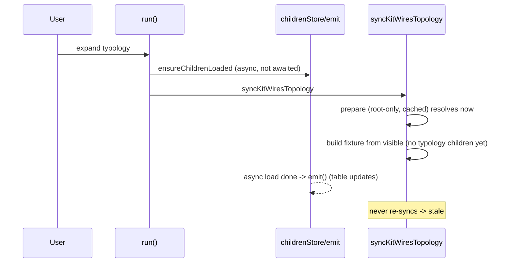

## Problem

In the sketchpad **Kit** app, the VFS rows (File System window) and the wires identities (Wires window) are meant to be derived from the exact same `visibleVirtualFileSystemNodes`. They diverge when a typology is unfolded: the typology's types/designs appear in the VFS table but not in the wires diagram.

## Root cause

The two panels rebuild on different triggers and with different data readiness:

- VFS table rebuilds on every controller `emit()`, including when an async child load finishes.
- Wires only rebuild via `syncKitWiresTopology`, which is invoked synchronously from `run()` right after a VFS command (`compose/client/lib/sketchpad/js/index.ts` around line 14799).

When a typology is expanded:

1. `toggleVirtualFileSystemExpand` adds the typology id to `expandedStore` and calls `ensureChildrenLoaded` (fire-and-forget async) in [framework/product/platform/core/index.ts](framework/product/platform/core/index.ts) (~line 1098 / 1013).
2. `run()` immediately calls `syncKitWiresTopology(kitId)`.
3. `syncKitWiresTopology` (line ~14325) awaits `prepareKitWiresVfsForTopology`, which only awaits the **kit root** children and is memoized per-kit (`kitWiresVfsPreparePromises`). It resolves immediately, so `visibleVirtualFileSystemNodes` is read **before** the typology's children are in `childrenStore`.
4. The wires fixture is built without the typology's types/designs.
5. When the async child load completes it calls `emit()` (refreshing the VFS table) but never re-runs `syncKitWiresTopology`, so wires stay stale.

## Fix

Make the wires sync await **all currently-expanded branches** (not just root) before reading visible nodes, so the visible set is fully materialized and matches the VFS table.

### 1. Rework `prepareKitWiresVfsForTopology`

In [compose/client/lib/sketchpad/js/index.ts](compose/client/lib/sketchpad/js/index.ts) (~lines 14290-14305), await root children plus every id in `expandedStore(scope)` via `ensureChildrenLoadedAsync` (which already de-dupes concurrent per-parent loads internally), e.g. `await Promise.all([rootId, ...expandedIds].map(id => this.ensureChildrenLoadedAsync(id, scope)))`. Remove the root-only `kitWiresVfsPreparePromises` memoization so each sync reflects the live expansion set; correctness/dedup is preserved by `ensureChildrenLoadedAsync`. Update the docstring.

### 2. Remove the now-unused memo plumbing

- Delete the `kitWiresVfsPreparePromises` field (~~line 14202) and the `clearKitWiresVfsPrepare` method (~~lines 14307-14309).
- Remove the `clearKitWiresVfsPrepare(...)` calls in `syncVirtualFileSystemRoute` (~~line 14690) and `invalidateKitVirtualFileSystem` (~~line 14706).

### 3. Resync wires on kit invalidation (parity hardening)

`invalidateKitVirtualFileSystem` (~line 14697) clears the cached VFS children and `emit()`s but does not resync wires. Add a `syncKitWiresTopology(kitId)` call there so kit mutations that drop the children cache also reflow into the wires diagram, keeping rows and identities equal.

### 4. Extend tests (no new test files)

In the embedded vitest `describe("SketchpadShellController topology", ...)` block in [compose/client/lib/sketchpad/js/index.ts](compose/client/lib/sketchpad/js/index.ts) (~line 16831), add a case using an `InMemoryComposeKitStore` with `typologies: [{ id, name, types: [...], designs: [...] }]`: navigate, `syncVirtualFileSystemRoute`, expand the typology, run the wires sync, await a tick, then assert the topology store's flat `identities` include the typology's type and design `nodeId`s and that they equal the VFS `visibleVirtualFileSystemNodes` ids. This guards the regression (existing wires tests only use flat root-level types).

## Workflow

- Open/reopen a repo ticket via the repo MCP before editing; place any scratch artifacts under the ticket folder; close it with a summary listing touched files.
- Validate by running the sketchpad js test suite via the registered nx task and confirming the new typology-parity test passes.

## Notes

- All edits stay within the `compose` technology (sketchpad js + the shared framework VFS controller is only read, not changed). No changes to `elements`/`coda`/`mit-bestand`.
