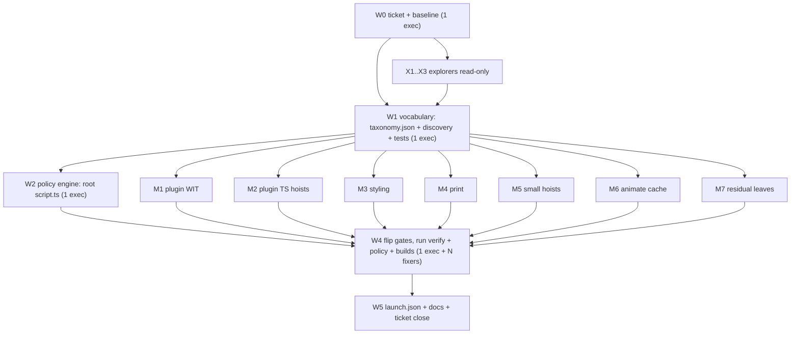

## Problem

The repo declares Shape V2 tree purity in [🔣️taxonomy.json](🧰️framework/🛍️products/🦑️repo/🔨️modules/📚️library/🔣️taxonomy.json) `_treePurityComment`: inside an owner tree only a per-language leaf file, the `📦️packages` folder, and plain component folders may exist, and `📦️packages/<lang>/` holds ONLY packaging code, never data. That rule is **declared but not enforced** — the check exists in [🔍️discovery/🟦️component.ts](🧰️framework/🛍️products/🦑️repo/🔨️modules/📚️library/🔍️discovery/🟦️component.ts) `collectPackagingViolations` (lines 1162-1169), but its output lands in `discoverBurndown().packagingViolations`, which no gate reads. Consequently 21 folders and ~95 files of language-neutral content sit inside language leaves.

The canonical example is WIT: 12 `.wit` files (827 lines) forming package `semio:framework@1.0.0` live at `🧰️framework/🛍️products/💻️os/🔨️modules/🔌️plugin/📦️packages/🦀️rust/📜️wit/`. WIT is a language-neutral IDL consumed by the Rust guest, the Rust host, and (indirectly, via jco's `--map semio:framework/host=./🟨️host-shim.js`) TypeScript. Its lowest common owner is the `🔌️plugin` module, not the Rust leaf.

## Mechanism design

### 1. Facet kind derived from the normative leaf

Adding `📜️wit` to `schemaFormats` naively is unsafe: `policySchemaFormatLeafBreaches` (📜️script.ts:11728), `policyArtifactSchemaFacetCompletenessBreaches` (:10208), `policyAppSchemaFacetCompletenessBreaches` (:10659), `policyOsConfigShapeBreaches` (:7406) and `policyInferenceFamilyRootCompletenessBreaches` (:9396) all iterate `Object.entries(taxonomy.schemaFormats)` and require every leaf. There is no per-facet subset mechanism.

So introduce one. A schema facet's **kind** is derived structurally from which normative leaf it carries — no marker file, no ambiguity:

```json
"schemaFormats": {
  "🔣️jsonschema": { "leafFilename": "🔣️component.json", "extension": ".json", "fieldCasing": "camel" },
  "🦀️rust": { ... }, "🟦️typescript": { ... }, "🔗️graphql": { ... }, "🛰️protobuf": { ... },
  "📜️wit": { "leafFilename": "📜️component.wit", "extension": ".wit", "fieldCasing": "kebab" }
},
"schemaFacetKinds": {
  "🧬️data": { "normativeFormat": "🔣️jsonschema", "formats": ["🔣️jsonschema", "🦀️rust", "🟦️typescript", "🔗️graphql", "🛰️protobuf"] },
  "📜️interface": { "normativeFormat": "📜️wit", "formats": ["📜️wit"] }
}
```

Every existing facet carries `🔣️component.json`, resolves to kind `🧬️data`, and its required format set is exactly today's five — **blast radius zero**. `validateTaxonomy()` gains a `SchemaFacetKindContract` region asserting: `normativeFormat` values are pairwise distinct, each kind's `formats` includes its own `normativeFormat`, every `formats` entry exists in `schemaFormats`, and every `schemaFormats` key is claimed by at least one kind. The `fieldCasing` enum in `validateTaxonomy()` (🟦️component.ts:684) must grow `"kebab"` for WIT identifiers.

Then a single shared helper `schemaFacetFormats(facetAbs)` replaces the five raw `Object.entries(schemaFormats)` loops. A facet carrying no normative leaf becomes a new breach ("undeclared schema facet kind") rather than silently unvalidated.

### 2. Package purity as a hard gate

Three statutes in one new `policyPackageLanguagePurityBreaches`, registered in `export const policy` (📜️script.ts:15180) and in `VerifyScript.runGate`, and mirrored as `buildSemanticCensus` problems so `verify taxonomy enforce` fails:

- **Children of `📦️packages/`** must be a declared `langs` key. Kills `📦️packages/fixtures/`, `📦️packages/🎚️options/`, `🎬️actions/`, `👥️presence/`, `🪛️utilities/`.
- **Files inside `📦️packages/<lang>[/🎯️targets/<t>]/`** must be packaging files — promote `collectPackagingViolations` from burndown to breach.
- **Directories inside `📦️packages/<lang>/`** must be `🎯️targets` or an ecosystem-declared packaging dir. New taxonomy keys: global `packagingDirNames: ["🎯️targets"]` plus per-ecosystem `ecosystems.<lang>.packagingDirNames` (`🦀️rust: ["benches"]`, `🐍️python` importable package dir).

The scanner must honour `.gitignore`, not walk the raw filesystem. `**/pkg/` and `**/🤖️generated/` are already ignored (`.gitignore:87,98`), so the four wasm-pack `pkg/` folders are ignored build output, not source violations — they need no migration, only exclusion. A raw walk also finds three phantom `📦️packages` roots inside build output that `git check-ignore` confirms are ignored (`storybook-static/asset/📦️packages`, `🧑️‍💻️dev/dist/asset/📦️packages`, `🧑️‍💻️dev/📦️packages/🟦️typescript/fixture/dist/asset/📦️packages`); the last one would otherwise be misread as a nested-packages violation. Reuse the existing `SEMANTIC_SKIP_DIRS` / `semanticWalk` skip discipline in `🔍️discovery/🟦️component.ts` rather than inventing a second exclusion list.

### 3. WIT lands as a neutral schema facet

New facet `🧰️framework/🛍️products/💻️os/🔨️modules/🔌️plugin/🧬️schema/📜️component.wit`, one file holding `package semio:framework@1.0.0;` plus all 11 interfaces and `world actor`. Rationale: WIT resolves a *directory* as one package and treats subdirectories as `deps`, so per-interface child folders would break bindgen; and the repo already precedents one spec file per facet covering many rules (`📖️component.grammar.semio`). WIT `interface` blocks are the region mechanism.

Both bindgen sites repoint:

- `🔌️plugin/🦀️component.rs:18-21` and `:324-327`: `path: "📜️wit"` → `path: "../🧬️schema"` (relative to crate root `📦️packages/🦀️rust/`)
- `🔌️plugin/🖥️host/🦀️component.rs:17-22` and `:3567-3574`: `path: "../../../📦️packages/🦀️rust/📜️wit"` → `path: "../../🧬️schema"`

Blocking pre-existing defect surfaced by this work: `📜️world.wit` defines only `world actor`, but Rust still requests `world: "plugin-world"` (host:18) and `world: "extension-world"` (guest:325, host:3568). Those worlds no longer exist, so the plugin crates cannot compile today. The WIT migration must reconcile this — the honest fix is deleting the dead `extension-world` guest/host bindgen blocks and repointing the host to `world: "actor"`, since `describe()` → `PackageDescriptor.role` already distinguishes plugin from extension at runtime per `📜️world.wit:6`.

## Migrations

Disjoint owner trees, each with its own reference updates.

- **M1 plugin WIT** — 12 files merged into `🔌️plugin/🧬️schema/📜️component.wit`; 4 bindgen sites; doc refs at `🔌️plugin/🦀️component.rs:9688,9907,9921,15817`, `🖥️host/🦀️component.rs:27`, `🎠️kernel/🦀️component.rs:242,772,886,900,921`, `🛂️manifest/🟦️component.ts:1064`; dead-world reconciliation.
- **M2 plugin TS** — `📦️packages/🟦️typescript/{📇️registry,🪟️window-kits,🏪️store}/` → `🔌️plugin/{📇️registry,🪟️window-kits,🏪️store}/`; registry generator `📇️registry/📜️script.ts` output paths and its `📋️project.json`; `🌐plugin-web-materialize.ts` and `🏪️store/📜️store.ts` imports; root `📜️script.ts` `runWorkspaceCodegen()` target path.
- **M3 styling** — `🔣️tokens.json`, `🎨️theme/`, `🎨️tailwind/`, `🤖️generated/`, `🤖️generated.rs`, `net/`, `🟦️vite-elements-assets.ts` → `🎨️styling/` root; `🟦️tokens.generated.ts` from the TS leaf; `generateStylingArtifacts()` in `🎨️styling/📦️packages/🦀️rust/📜️script.ts` plus the TS and Python wrappers.
- **M4 print** — `📦️packages/🟦️typescript/{asset,📄️template}/` → `📓️print/{🖼️assets,📄️template}/` (29 files); `📓️print/📦️packages/🟦️typescript/📜️script.ts` path constants.
- **M5 small hoists** — `🧩️vscode/📦️packages/🟦️typescript/🖼️assets/` → `🧩️vscode/🖼️assets/`; `💻️os/📦️packages/fixtures/` (20 tracked `.bin`) → `💻️os/🧫️fixtures/`; four `🪵️sourcing/🧩️extensions/🪟️windows/📦️packages/{🎚️options,🎬️actions,👥️presence,🪛️utilities}/📌️empty.md` → sibling dirs under `🪟️windows/`.
- **M6 animate cache** — `🎞️animate/📦️packages/🦀️rust/partial_movie_files/` is 19 tracked runtime `.mp4`/`.png`/`index.json`; delete from the worktree and add an ignore rule. No git commands — file deletion plus `.gitignore` edit only.
- **M7 residual leaf files** — `🔣️components.json` and `🔣️ui-axes.json` under `🎯️targets/`, `🔣️semio_logo.svg` under `🎯️targets/🧊️wgpu/`, the `🎨️*.css` files under styling and UI react targets, `🛂️manifest.jsonadapters.manifest.json` (malformed name), `🗣️dsl/🧬️schema/dsl_value_serde.rs` (non-component leaf). Each hoists to its owner root or folds into a `<folder>/component.<ext>`.

## Agent workforce

Roles are fixed by the request: this plan is the Opus 5 artifact; one **Cursor Grok 4.5 High** coordinator owns the DAG, the single-writer registry, and gate flipping; **Composer 2.5** executors do the work; **Composer 2.5** explorers do read-only reconnaissance.

### Single-writer registry (hard rule)

Files touched by more than one wave get exactly one owning agent for the whole run. Any other agent needing a change there files a request to the coordinator instead of editing.

- `📜️script.ts` (root, 15264 lines) → W2 agent only
- `🔣️taxonomy.json` → W1 agent only
- `🔍️discovery/🟦️component.ts` → W1 agent only
- `.vscode/launch.json` → W5 agent only
- `.gitignore` → M6 agent only
- `Cargo.toml` (root) and `Cargo.lock` → M1 agent only

### Wave DAG




W0, W1, W2, W4, W5 are strictly serial. X1-X3 and M1-M7 run fully parallel within their wave. Peak concurrency is 7 executors.

### Explorers (read-only, parallel, during W0)

- **X1** — enumerate every reference to each migrating path (Rust `#[path]`, `include_str!`, TS imports, `📜️script.ts` constants, `📋️project.json`, `package.json`, `tsconfig.json` paths, `.vscode/launch.json`) and emit a per-migration reference manifest into the ticket folder.
- **X2** — verify the `.gitignore` interaction: which violating paths are already ignored, which are tracked, so M6/M7 do not chase build output.
- **X3** — re-audit `📦️packages/` after the W1 vocabulary lands, using the new keys, to confirm the violation list is complete and that no legitimate packaging dir was mis-flagged.

### Executor briefs

Each executor gets: the ticket path, its exclusive file set, the single-writer registry, its acceptance command, and a mandate to write findings to a markdown file in the ticket folder rather than the chat.

- **W0** — open ticket `26/08/17/LANGUAGE-NEUTRAL-TAXONOMY-AND-PACKAGE-PURITY` (read `repo://goals` first and associate; if the repo MCP server is down, use the Go client `ticket open`, since `.cursor/mcp.json` shows the repo server is configured but was not connected). Capture baselines: `bun ./📜️script.ts verify taxonomy report`, `bun ./📜️script.ts policy`, and the current burndown packaging-violation list, all into the ticket folder.
- **W1** — `schemaFormats.📜️wit`, `schemaFacetKinds`, `packagingDirNames`, per-ecosystem `packagingDirNames`; `Taxonomy` interface fields; `validateTaxonomy()` `SchemaFacetKindContract` + `"kebab"` casing; `schemaFacetFormats()` helper; promote `collectPackagingViolations` into `discoverPackageProblems`/census problems; extend `🧪️index.test.ts` (`describe("validateTaxonomy")` ~1514) and the packaging burndown test (~2125). Acceptance: taxonomy tests green, `verify taxonomy report` shows zero new `taxonomy-schema` problems.
- **W2** — rewrite the five completeness policies to call `schemaFacetFormats()`; add a `📜️wit` case to `policyLoadSchemaFacetLeaves` so parity does not treat WIT as empty; add `policyPackageLanguagePurityBreaches`; register in `export const policy` and `runGate`; add nx targets in `📋️project.json`. Land the gate **reporting-only** first; W4 flips it to blocking.
- **M1-M7** — as scoped above. Each ends with its own targeted acceptance (M1: `cargo build -p semio-framework-plugin-host` and `cargo build -p semio-framework-plugin --target wasm32-wasip2 --features component-guest`; M2/M4: the owning nx `generate` target plus `bun nx run @semio-tech/framework-os-dev:plugin`; M3: styling `generate` across rust/ts/python wrappers).
- **W4** — flip `policyPackageLanguagePurityBreaches` to `priority: "high"` and wire census problems to fail `verify taxonomy enforce`. Run `bun ./📜️script.ts verify taxonomy enforce`, `bun ./📜️script.ts policy`, `bun nx run workspace:verify-gate`, `bun nx run-many -t lint`, full cargo build, and the plugin dev pipeline. Dispatch one Composer 2.5 fixer per independent failure cluster; iterate until zero breaches. Confirm runtime behaviour with logs, not inspection.
- **W5** — register the new commands in `.vscode/launch.json` following existing order/grouping/naming; update the `_treePurityComment` and add a `_languageNeutralityComment` to `🔣️taxonomy.json` documenting the ticket; close the ticket with the summary and full file list.

## Acceptance

1. No directory or non-packaging file exists under any `📦️packages/<lang>/` except `🎯️targets` and declared packaging dirs, and every `📦️packages/` child is a declared language.
2. `bun ./📜️script.ts verify taxonomy enforce` and `bun ./📜️script.ts policy` both exit zero.
3. `bun nx run workspace:verify-gate` passes; `nx run-many -t lint` clean.
4. Plugin guest and host crates compile, and the jco transpile pipeline still resolves `semio:framework/host`.
5. Adding `📜️wit` created zero new required leaves on any pre-existing schema facet — verified by diffing the W0 and W4 policy baselines.
6. Re-running the X3 audit against the new lint reports zero violations.

