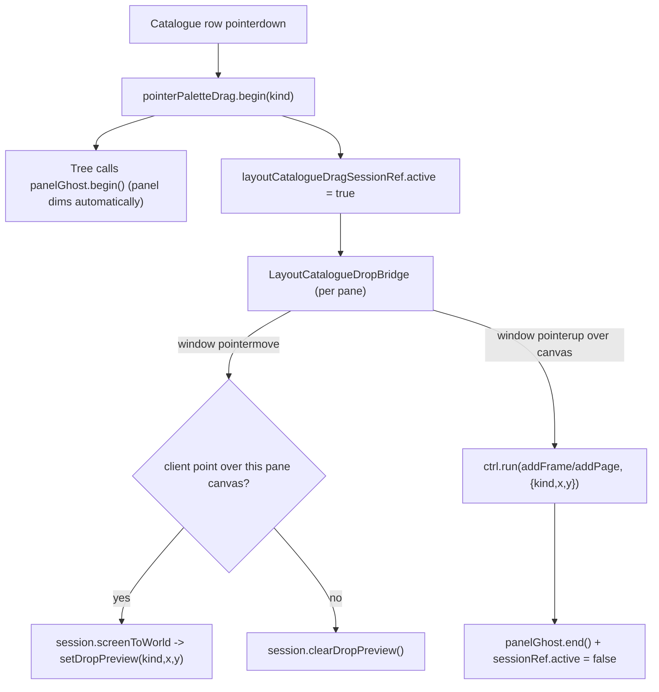

# Layout canvas: pan/zoom, drag-and-drop preview, panel hiding

## Root cause analysis

- **No camera interactivity.** `LayoutDocument.camera` / `previewCamera` (`x,y,zoom`) exist only as static fields baked into the document JSON. [layout/rs/engine.rs](layout/rs/engine.rs) reads them once per `render_frame` and applies `Affine::translate((-x,-y)) * Affine::scale(zoom)` (lines 259-261, 385-391). Nothing ever mutates them: [layout/react/index.tsx](layout/react/index.tsx) has no `wheel` handler and [infinite/canvas/react-renderer/index.tsx](infinite/canvas/react-renderer/index.tsx)'s `GraphWasmCanvas` has no `wheel` listener at all (only `pointerdown/move/up`, and it never forwards `event.button`). The preview pane also has `enablePointer={chromeMode === "blueprint"}` in `LayoutCanvas`, so it receives **no pointer events whatsoever** today.
- **Hit-testing ignores the camera.** `hit_test_document_json` (`layout/rs/engine.rs:394`) compares raw screen `(x,y)` against untransformed page-space bounds. Since the default camera zoom is `0.5` ([layout/core/js/internal.ts:236](layout/core/js/internal.ts)), selection is already subtly wrong today and will get worse once pan/zoom is interactive — must be fixed together.
- **Drag-and-drop is native-HTML5-only and one-directional.** The catalogue tree (`buildLayoutPlayCatalogueTree`, [layout/core/js/index.ts:337](layout/core/js/index.ts)) marks items `draggable: true` with `dragData`. The only consumer is `createLayoutPlayDocumentTreeDragController` ([layout/core/js/index.ts:365](layout/core/js/index.ts)), wired solely onto the **document** panel ([framework/product/playground/renderer/react/index.tsx:7814](framework/product/playground/renderer/react/index.tsx)) — you can only drop a catalogue item onto a document row, never onto the canvas. Native HTML5 DnD can't expose `dataTransfer` payload during `dragover`, so there is no way to render a live ghost preview with this mechanism, and — critically — **native drag suppresses the ordinary `pointermove`/`pointerup` events that the global ghost/dim controller relies on**, which is exactly why the side panel does not hide while dragging.
- **The fix for "preview" and "panel hides on interaction" is the same fix.** Every other technology that needs a canvas-drop preview (puzzle 2d, puzzle 3d, flow, compose window templates) uses `TreeDragAndDropController.pointerPaletteDrag` (`ui/react/index.tsx:10013`) instead of relying on native DnD. The `Tree` component's own pointer-drag plumbing ([ui/react/index.tsx:12291-12309](ui/react/index.tsx)) already calls `panelGhost.begin()` / `panelGhost.end()` for us — so adding `pointerPaletteDrag` to the catalogue's drag controller fixes panel-hiding with **zero extra code**, and also gives us continuous `pointermove` client coordinates we can turn into a canvas-space ghost (mirrors `puzzle2dFixturePaletteTreeDragController`, [puzzle/2d/react/index.tsx:2820](puzzle/2d/react/index.tsx), and its `Puzzle2dFixtureDropPointerBridge`, [puzzle/2d/react/index.tsx:13199](puzzle/2d/react/index.tsx)).

## 1. Camera: real pan (middle-drag) + zoom (wheel), matching gis/2d & puzzle/2d conventions

Reuse `infinite_canvas::camera` (already a dependency of `layout_rs`, see [layout/rs/Cargo.toml:15](layout/rs/Cargo.toml)) instead of inventing new math — same primitives `gis/2d/rs/lib.rs` and other 2D apps already use: `Camera{x,y,zoom}`, `Viewport{width,height,dpr}`, `camera_content_affine`, `screen_to_world`, `wheel_screen`.

- **[layout/rs/wasm_session.rs](layout/rs/wasm_session.rs)**: add `camera: infinite_canvas::camera::Camera`, `viewport: infinite_canvas::camera::Viewport`, and a small `LayoutInteraction { Idle, Pan { origin, start_screen } }` to `LayoutSessionInner`. Add:
  - `setCamera(x, y, zoom)` — seeds camera once (called by JS right after session creation).
  - `setSize` extended to also call `viewport.set_size(width, height, dpr)` (logical px, matching the existing gis/2d/puzzle2d convention).
  - `pointerDownScreen(sx, sy, button)` — button `1` (middle) starts `Interaction::Pan`; other buttons no-operation (left-button hit test stays on the existing button-less `pointerDown`/`pointerMove` pair).
  - `pointerMoveScreen(sx, sy)` — updates `camera.x/y` while panning.
  - `pointerUpScreen(sx, sy)` — ends the pan.
  - `wheelScreen(sx, sy, deltaY)` — delegates to `infinite_canvas::camera::wheel_screen` (cursor-anchored zoom, same feel as gis/2d).
  - `screenToWorld(sx, sy) -> JsValue` (`{x,y}`) — needed by the drop-preview bridge (section 2).
- **[layout/rs/engine.rs](layout/rs/engine.rs)**: `display_list_to_scene`/`build_scene_from_document_json` stop reading `doc.camera`/`doc.preview_camera`; they take the session's live `(camera, viewport)` and use `infinite_canvas::camera::camera_content_affine` instead of the current ad-hoc `Affine::translate * Affine::scale`. `hit_test_document_json` gains a `camera`/`viewport` param and converts screen → world via `screen_to_world` before hit-testing, fixing the current camera/hit-test mismatch.
- `LayoutDocument.camera` / `previewCamera` stay in the schema purely as the **persisted initial viewport** (unchanged shape) — `LayoutEngineSession` reads the right one (based on chrome mode) once and calls `setCamera`, but never again on subsequent `setDocumentJson` calls (so panning survives edits/undo/selection changes).
- **[layout/react/index.tsx](layout/react/index.tsx)** (`LayoutEngineSession`):
  - `ensureSession()`: after constructing `LayoutSession`, seed the camera once from the pending document JSON's `camera`/`previewCamera` field (picked by `chromeBlueprint`).
  - `pointerDown(x, y, button, extend)`: button `0` keeps today's hit-test behavior; button `1` calls `session.pointerDownScreen(x, y, 1)` and flips a local `isPanning` flag.
  - `pointerMove(x, y)`: if `isPanning`, forward to `pointerMoveScreen`; else keep existing hover hit-test.
  - `pointerUp(x, y)`: if `isPanning`, forward to `pointerUpScreen` and clear the flag; else existing no-operation.
  - New `wheel(x, y, deltaY)` → `session.wheelScreen(...)`.
  - New `screenToWorld(x, y)` → thin wrapper over the wasm call, used by the drop bridge.
  - `LayoutCanvas`: change `enablePointer={chromeMode === "blueprint"}` to always-on (`enablePointer` default `true`) so the **preview** pane can also pan/zoom — selection/hover stay blueprint-only because `onHit`/`onHover` are already `undefined` for preview at the call site ([framework/product/playground/renderer/react/index.tsx:7778](framework/product/playground/renderer/react/index.tsx)).
- **[infinite/canvas/react-renderer/index.tsx](infinite/canvas/react-renderer/index.tsx)** (`GraphWasmCanvas`, only real consumer is layout, safe to change directly — no back-compat shims):
  - `GraphWasmSession.pointerDown` gains a `button: number` param; add optional `wheel?(x, y, deltaY): void`.
  - Add a non-passive `wheel` listener (`preventDefault()` so the page doesn't scroll) calling `session.wheel?.(...)`; forward `ev.button` into `pointerDown`.

## 2. Catalogue drag: live canvas preview + drop-to-place, panel hides automatically

- **[layout/core/js/index.ts](layout/core/js/index.ts)**:
  - Delete `createLayoutPlayDocumentTreeDragController` (dead end once native drag is superseded — dropping onto a document row is no longer reachable and puzzle 2d/3d don't support that path either, only canvas-drop) and its vitest coverage.
  - Extend `createDefaultFrame(kind, layerId, position?)` to accept an optional `{x, y}` override for `bounds.x/y` (default stays `{72,120}` when omitted, e.g. for document-driven or command-palette adds).
  - Extend the `addFrame` command handler to read optional `x`/`y` args and pass them through to `createDefaultFrame`.
- **[layout/react/index.tsx](layout/react/index.tsx)** — add (co-located with the WASM bridge, mirrors where puzzle 2d/3d keep their equivalent drag-session state):
  - `layoutCatalogueDragSessionRef = { active: boolean; kind: LayoutCatalogueKind | null }` + `LAYOUT_CATALOGUE_DRAG_SESSION_EVENT` window `CustomEvent` name, `beginLayoutCatalogueDrag(kind)` / `endLayoutCatalogueDrag()` helpers that flip the ref and dispatch the event (mirrors `puzzle2d-fixture-drag-session`, [puzzle/2d/react/index.tsx:2680](puzzle/2d/react/index.tsx)).
  - `createLayoutPlayCatalogueTreeDragController(): TreeDragAndDropController` with `pointerPaletteDrag: { readEncodedDragPayload, begin: beginLayoutCatalogueDrag, cancel: endLayoutCatalogueDrag }` and `onDragEnd: endLayoutCatalogueDrag` (mirrors `puzzle2dFixturePaletteTreeDragController`, [puzzle/2d/react/index.tsx:2821](puzzle/2d/react/index.tsx)).
  - `LayoutEngineSession.setDropPreview(kind, worldX, worldY)` / `clearDropPreview()` wrapping new `LayoutSession.setDropPreview`/`clearDropPreview` wasm calls.
  - New `LayoutCatalogueDropBridge` component (rendered by `LayoutCanvas` internally, one instance per pane): while `layoutCatalogueDragSessionRef.active`, listens on `window` for `pointermove` — if the client point is inside this pane's container, calls `session.screenToWorld` → `session.setDropPreview(kind, x, y)`; otherwise `session.clearDropPreview()`. On `window pointerup` while active and over this pane, calls a new `onCatalogueDrop(kind, worldX, worldY)` prop, then clears the preview. Mirrors `Puzzle2dFixtureDropPointerBridge` ([puzzle/2d/react/index.tsx:13199](puzzle/2d/react/index.tsx)) scoped down to layout's single-canvas-per-pane case (no multi-peer mirroring needed).
- **[layout/rs/wasm_session.rs](layout/rs/wasm_session.rs) + [layout/rs/engine.rs**](layout/rs/engine.rs): add `drop_preview: Option<{kind, x, y}>` to session state; `setDropPreview(kind, x, y)` / `clearDropPreview()`; `render_frame` draws a translucent dashed ghost rect at `(x,y)` sized `200x120` (matching `createDefaultFrame`'s bounds) for `rect`/`text`/`image` kinds; `page` kind draws no positional ghost (adding a page isn't spatial).
- **[framework/product/playground/renderer/react/index.tsx](framework/product/playground/renderer/react/index.tsx)** (`LayoutPlayHost` region):
  - `LayoutPlayCataloguePanelDefinition.buildTab()`: attach `dragAndDropController: createLayoutPlayCatalogueTreeDragController()` (imported from `@semio-tech/layout-react`) to the tree config it returns — this alone restores panel-hide-on-interaction for the catalogue drag.
  - `LayoutPlayPaneSurfaceHost`: pass `onCatalogueDrop={(kind, x, y) => kind === "page" ? ctrl?.run("addPage", {spreadId: ...}) : ctrl?.run("addFrame", {kind, pageId: ctrl?.getActivePageId(), layerId: <first layer>, x, y})}` down to `LayoutCanvas`.
  - Remove the now-unused `createLayoutPlayDocumentTreeDragController` import/usage on the document panel.

## Files touched

- [layout/rs/wasm_session.rs](layout/rs/wasm_session.rs) — camera + pan/zoom + drop-preview WASM API
- [layout/rs/engine.rs](layout/rs/engine.rs) — camera-aware scene transform, camera-aware hit test, ghost rendering
- [layout/react/index.tsx](layout/react/index.tsx) — `LayoutEngineSession` pan/zoom/drop-preview wiring, catalogue drag-session refs/controller, `LayoutCatalogueDropBridge`, always-on pointer/wheel
- [infinite/canvas/react-renderer/index.tsx](infinite/canvas/react-renderer/index.tsx) — generic `wheel` support + `button` on `pointerDown`
- [layout/core/js/index.ts](layout/core/js/index.ts) — `addFrame` x/y passthrough, `createDefaultFrame` position override, removal of the dead document drag controller
- [framework/product/playground/renderer/react/index.tsx](framework/product/playground/renderer/react/index.tsx) — wire catalogue drag controller + canvas drop callback, drop dead document wiring

## Verification

- Extend existing vitest blocks in `layout/rs` (Rust `#[cfg(test)]` in `engine.rs`), `layout/react/index.tsx`, and `layout/core/js/index.ts` to cover: camera seeding/pan/zoom math, camera-aware hit test, `createDefaultFrame` position override, and the catalogue pointer-drag controller (mirrors the existing `puzzle2dFixturePaletteTreeDragController toggles palette drag ref and drag session` test).
- Manually verify in the layout playground dev server: wheel-zoom and middle-drag-pan on both blueprint and preview panes; dragging a catalogue item shows a live ghost that follows the cursor over the canvas and disappears off-canvas; dropping commits a frame/page at the cursor; the side panel visibly dims/hides for the whole duration of the catalogue drag, same as it does today for other apps.
