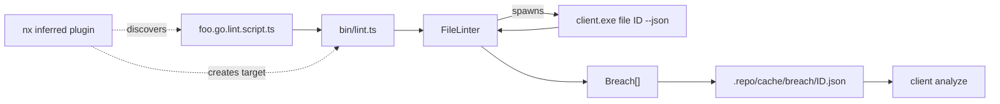

## 1. New bundle `repo/lib/js`

Create the JS sibling of [repo/lib/go](repo/lib/go):

- `repo/lib/js/package.json` — name `@semio-tech/repo-lib`, type `module`, exports `./index.ts`, deps: just `typescript`/`@types/node`. Bun runs `.ts` directly so no build step needed.
- `repo/lib/js/project.json` — nx project `@semio-tech/repo-lib`, with `lint`, `test` targets.
- `repo/lib/js/tsconfig.json` — strict, `module: ESNext`, `moduleResolution: Bundler`.
- `repo/lib/js/src/`:
  - `cli.ts` — single `runCli(args: string[]): Promise<unknown>` helper that spawns `repo/client/client.exe` (or `client` on unix) with `--json`, captures stdout, parses JSON, throws on non-zero exit. Resolves binary via `REPO_CLI_BIN` env or relative to monorepo root. Stateless: every call = new process.
  - `breach.ts` — `Breach` type matching the Go `Breach` struct in [repo/client/cli/main.go](repo/client/cli/main.go) (`id, summary, kind, scope, line?, column?, excerpt?, priority, autofixable`).
  - `linter.ts` — abstract `Linter<TEntity>` base with: `entityId`, `entityKind`, `breach(partial)` helper that auto-fills `scope`/`id`, `cwd()` (entity root), and `fetch<T>(args)` shortcut to `runCli`.
  - Six concrete subclasses, one per region in `linter.ts`:
    - `TechnologyLinter` — `client technology <id> --json`; exposes `bundles()`, `loc()`, `name`, `kind`.
    - `BundleLinter` — `client bundle <id> --json`; exposes `folders()`, `files()`, `kind`, `root`.
    - `FolderLinter` — `client folder <id> --json`; exposes `files()`, `subfolders()`, `path`.
    - `FileLinter` — `client file <id> --json`; exposes `content()` (reads file via `fs`), `lines()`, `sections()`, `definitions()`, `ext`, `kind`.
    - `SectionLinter` — `client section <id> --json`; exposes `content()`, `definitions()`, `startLine`, `endLine`.
    - `DefinitionLinter` — `client definition <id> --json`; exposes `content()`, `kind`, `startLine`, `endLine`.
  - `script.ts` — `defineLint<T extends Linter>(fn: (linter: T) => Breach[] | Promise<Breach[]>)` returns the function unchanged but tags it for the runner. Default export pattern.
  - `runner.ts` — `runLintScript(scriptPath, entityId)`: dynamic-imports the script, instantiates the right linter subclass based on script filename suffix (file vs folder vs bundle vs technology), invokes default export, writes results to `.repo/cache/breach/<flat-entity-id>.json`. Exits non-zero if any breach has `priority: high`.
  - `index.ts` — re-exports everything.
  - `bin/lint.ts` — CLI entry: `bun repo/lib/js/bin/lint.ts <script-path>` used by nx targets.

## 2. Lint script convention & resolution rules

In the runner:

- File `<path>/<name>.<ext>.lint.script.ts` lints the file `<path>/<name>.<ext>` → `FileLinter`.
- File `<path>/lint.script.ts` lints the folder `<path>` → resolves to nearest enclosing `BundleLinter` if `<path>` is a bundle root, `TechnologyLinter` if technology root, otherwise `FolderLinter`. Resolution uses the same logic as `client folder <path> --json` (kind field tells us).
- A script may also live next to a `*.section.<ext>` or `*.definition.<ext>` declarative anchor — out of scope for v1.

## 3. nx inferred plugin

`repo/lib/js/src/nx-plugin.ts` exporting `createNodes`:

- Glob: `**/*.lint.script.ts` and `**/lint.script.ts`, excluding `node_modules`, `.repo`, `dist`.
- For each match, create a project (or inject targets onto the enclosing bundle project) with target `lint:<entity-id-flat>`:

```json
{
 "executor": "nx:run-commands",
 "options": {
  "command": "bun repo/lib/js/bin/lint.ts <scriptPath>",
  "cwd": "{workspaceRoot}"
 },
 "inputs": ["{projectRoot}/<scriptPath>", "<targetEntityFiles>", "sharedGlobals"],
 "outputs": ["{workspaceRoot}/.repo/cache/breach/<entity-id>.json"],
 "cache": true
}
```

Register the plugin in [nx.json](nx.json) `plugins` as `"@semio-tech/repo-lib/nx-plugin"`. nx caching handles the "automatic" part — if neither the script nor the target entity files changed, the cached breach JSON is restored.

## 4. Remove legacy Go breach machinery

In [repo/client/cli/main.go](repo/client/cli/main.go):

- Delete the entire policy/statute/breach detection: `Statute`, `StatuteMeta`, `Policy`, `Territory`, `statuteInfoTable`, `CheckPolicies`, `applyAutofixes`, `applySystemAutofixes`, `policyCommand`, `auditCommand`, all `BreachXxx` statute kinds, the `LanguagePlugin.ScanComments` method, `PolicyContext`, etc. Per `CLAUDE.md` — no backwards compat.
- Keep `Breach` struct (used as I/O envelope) and `BreachPriority`, `AnalyzeResult`, `FixResult`.
- Rewrite `repoContext.Analyze(scope)` to read `.repo/cache/breach/*.json`, filter by scope, and return them. `Fix` is removed (autofix is a per-script concern now; out of scope for v1).
- Drop `analyzeCmd`/`autofixCmd` cobra wrappers; the `analyze` cobra command stays but only reads cached breaches.
- Update [repo/client/cli/main_test.go](repo/client/cli/main_test.go) — remove tests for deleted policy machinery, add tests asserting `analyze` reads from `.repo/cache/breach/`.

## 5. Worked-example lint scripts

To prove the pipeline end-to-end, add (these are the only new lint scripts; one per Linter kind):

- `repo/client/cli/main.go.lint.script.ts` — `FileLinter`: breach if `lines() > 10000`.
- `repo/lib/lint.script.ts` — `FolderLinter`: breach if any direct child file has size > 1 MB.
- `repo/client/lint.script.ts` — `BundleLinter`: breach if no `package.json`.
- `repo/lint.script.ts` — `TechnologyLinter`: breach if technology has 0 bundles.

(Section/Definition linters: included as runnable but no example breach yet.)

## 6. Wiring & docs

- Add `repo/lib/js` to [package.json](package.json) `workspaces` (already covered by `repo/lib/*`).
- Add npm scripts `lint:repo` → `bun nx run-many -t lint -p '@repo/*'`.
- `repo/lib/js/README.md` documenting the script signature and cache layout.

## 7. Data flow


