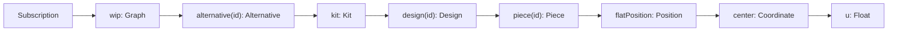

# Live Subscription Field Tree

## Goal

Make `subscription { wip { alternative(id: $alt) { kit { design(id: $des) { piece(id: $piece) { flatPosition { center { u } } } } } } } }` valid SDL and emit-on-change. Generally: any leaf reachable via `Query` must be subscribable. Subscription becomes a live-query mirror of Query — same root fields, same return types — so the _selection set_ alone determines what is tracked. Drop `event: Json!`.

## Design

### Semantics

- Each Subscription field returns the same type as the equivalent Query field (`Session`, `Graph`, `Node`, `Entity`, `ConflictConnection`).
- The server emits the resolved selection once on subscribe (initial value), then again whenever any reachable field changes (live-query). Granularity is fully driven by the client's selection set: select one scalar → emit only when that scalar changes.
- Errors propagate per emission; the stream stays open until the client unsubscribes.

### Schema replacement (`compose/graphql/target.schema.graphql` lines 8256-8259)

```graphql
# 🔴 Live subscription. Each field mirrors `Query`. The server emits the
# resolved selection on subscribe and re-emits whenever any field within
# the selection changes (live-query). Subscribe to a single leaf scalar to
# receive only that scalar's updates.
type Subscription {
 session: Session!
 wip: Graph!
 authoritative: Graph
 conflicts: ConflictConnection!
 node(id: ID!): Node
 entity(hash: ID!): Entity
}
```

`event: Json!` is removed (the new typed tree subsumes it; clients select what they want). The two prior subscription plans (`subscription_tree_mirrors_mutation_270e731b` and `single_subscription_endpoint_9d8dfb86`, both event-stream shaped) are superseded by this design.

### Required id-accessor additions on existing types

The example path requires `design(id: ID!)` on `Kit` and `piece(id: ID!)` on `Design`, but the convention should be uniform across the navigation. Add `<entity>(id: ID!): <Entity>` everywhere a `<entities>: <Entity>Connection` exists, replacing the current bare singular accessors (which today silently return "the first" or similar).

Concrete edits to `compose/graphql/target.schema.graphql`:

- `Kit` (~L7511): replace `design: Design` / `type: Type` with `design(id: ID!): Design` / `type(id: ID!): Type`; add `family(id: ID!)`, `file(id: ID!)`, `folder(id: ID!)`, `author(id: ID!)`, `concept(id: ID!)`, `tag(id: ID!)`, `quality(id: ID!)`, `prop(id: ID!)`, `attribute(id: ID!)`, `stat(id: ID!)`.
- `Design` (~L7013): replace `piece: Piece` / `connection: Connection` with id-based variants; add `layer(id: ID!)`, `group(id: ID!)`, `author(id: ID!)`, `quality(id: ID!)`, `prop(id: ID!)`, `attribute(id: ID!)`, `stat(id: ID!)`.
- `Type` (~L4694): replace `connector: Connector` / `representation: Representation` with id-based; add `port(id: ID!)`, `concept(id: ID!)`, `tag(id: ID!)`, `quality(id: ID!)`, `prop(id: ID!)`, `attribute(id: ID!)`, `stat(id: ID!)`, `author(id: ID!)`. (Keep `bestRepresentation: Representation` — it's not a lookup.)
- `Folder` (~L1507): add `file(id: ID!)`, `subFolder(id: ID!)`, `family(id: ID!)`, `type(id: ID!)`, `design(id: ID!)`.
- `Piece` (~L5801): add `prop(id: ID!)`, `attribute(id: ID!)`, `childConnection(id: ID!)`, `childPiece(id: ID!)`.
- `Connection` (~L5941): add `attribute(id: ID!)`.
- `Connector` (~L4439): add `attribute(id: ID!)`, `quality(id: ID!)`.
- `Port` (~L3909): add `attribute(id: ID!)`, `quality(id: ID!)`.
- `File` (~L1642): add `tag(id: ID!)`, `quality(id: ID!)`, `attribute(id: ID!)`.
- `Tag` / `Concept` / `Quality` / `Prop` / `Stat` artifact regions: add `attribute(id: ID!)`.
- `Group` (~L5653): add `piece(id: ID!)`.
- `Session` (~L7980): add `alternative(id: ID!): Alternative` and `theKit: Version` (mirrors `SessionCommandInput.alternative(id)` and `SessionCommandInput.theKit`).
- `Checkpoint` already has `change(id: ID): Change` / `edit(id: ID): Edit` — make these `id: ID!` for consistency with the rest of the navigation (drop the optional id semantics; there is no current call site that relies on omitting the id).

After this, the user's example resolves through:



### What this plan does NOT change

- Operation/Modification/Diff trees and `Event` enum stay as they are. Subscriptions track _state_, not events.
- Mutation tree (`session → theKit | alternative(id) → unsavedChange(id) → kit → …`) is unchanged.
- Rust resolvers (`compose/rs/lib.rs::gql::Subscription`) are not rewritten by this ticket — schema-only. A follow-up ticket wires `EventBus` updates into the new live-query tree (the existing bus already broadcasts the typed events needed to invalidate selections). The schema change is the contract; the resolver is the implementation.

## Verification

- Re-run the schema export script (`compose/graphql/scripts/export-schema.ts`) — must still parse.
- `rg "^  (design|type|piece|connection|port|connector|representation|attribute|file|folder|family|author|concept|tag|quality|prop|stat|childPiece|childConnection|layer|group|alternative|change|edit): \w+( |$)" compose/graphql/target.schema.graphql` — every match should be either a Connection-returning plural OR an `(id: ID!)`-taking singular; no bare singular accessors left.
- `rg "^\s+event: Json!" compose/graphql/target.schema.graphql` → 0 matches.
- Author a smoke `subscription` document with the full example path and run it through `graphql-js` `validate` (script in ticket folder).

## Ticket

Open ticket `🎫 Live Subscription Field Tree` under goal `🎯r2602🎯runningsketchpad` (sketchpad apps need fine-grained reactive selections). Files touched: `compose/graphql/target.schema.graphql`. Plan id: this plan's id.
