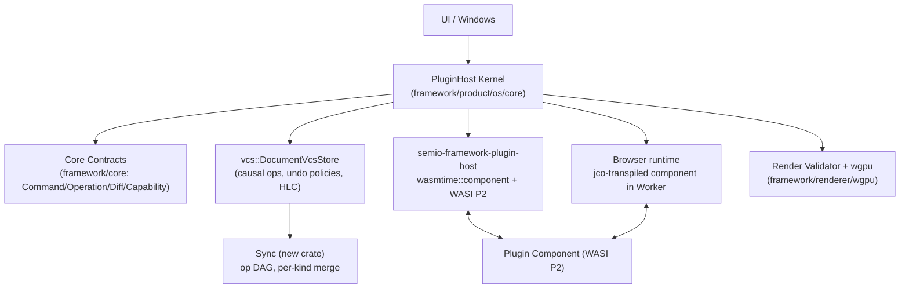

# Local-First Command Kernel: Sandboxed WASI Plugin Architecture

## Starting point (confirmed by exploration)

- Plugin ABI today is a hand-rolled `extern "C"` + JSON transport over `wasm32-unknown-unknown` (`native_plugin_exports!` in [framework/plugin/rs/lib.rs](framework/plugin/rs/lib.rs)), loaded natively via classic `wasmtime::{Module,Instance,Linker}` in [framework/plugin/host/rs/lib.rs](framework/plugin/host/rs/lib.rs) and in-browser via a `wasm-bindgen` JS wrapper. No WASI, no component model, no fuel/epoch/timeouts, no supervisor.
- An **orphan WIT file already sketches the right shape**: [framework/wit/world.wit](framework/wit/world.wit) declares `plugin-api`/`host`/`ui`/`types` interfaces mirroring the current (old) ABI. It is unused by any build today — it becomes the seed for the new contract.
- `vcs/rs` ([vcs/rs/lib.rs](vcs/rs/lib.rs)) is already a real command→operation→diff→edit→checkpoint engine (`Operation`, `OperationDiff`, `DocumentVcsStore`, `Checkpoint`, `Alternative`) with linear undo/redo and `dev://`/`local://`/`sqlite://` backbones. It has **no** causal deps, HLC, undo policies, payload hashing, or CRDT merge — these are additive, not a replacement.
- `UiNode`/`ComponentScene` ([framework/core/rs/lib.rs:2465-2485](framework/core/rs/lib.rs)) is already a declarative, host-walked render tree — plugins never touch `wgpu`. The gap versus a "validated render plan" is **validation** (bounds/size/resource caps), not the tree shape itself.
- `Capability` ([framework/core/rs/lib.rs:2930-2934](framework/core/rs/lib.rs)) has exactly one variant (`LocalBackboneStorage`) gating two host imports. `PluginHost::hot_swap_plugin` ([framework/product/os/core/rs/lib.rs:74-115](framework/product/os/core/rs/lib.rs)) is non-transactional (register + bump generation, no validate/migrate/rebind/rollback).
- `wasm32-wasip2` is available in the pinned nightly toolchain (`rustc --print target-list`); it is not yet in [rust-toolchain.toml](rust-toolchain.toml).
- 21 plugin crates use `plugin_exports!()` today (`cad`, `dag`, `draw`, `flow`, `forms`, `gis`, `imperative`, `layout`, `lowpoly`, `note`, `presentation`, `procedural`, `puzzle`, `raster`, `reasoning-mindmap`, `s`, `sequence`, `shooting`, `trinity`, `vcs`, `writer`) — all must migrate to the new contract.

## Decisions locked in for this pass

- **Full scope, executed end-to-end in this session** (per your answer), tracked as one ticket with the todos below, mirroring the pattern of the prior plugin-OS refactor.
- **Full WASI Preview 2 component model migration** (per your answer): plugins compile to `wasm32-wasip2` components; host uses `wasmtime::component::{Linker, bindgen!}` with `ResourceTable`-backed opaque handles; browser hosting uses `jco` (Bytecode Alliance's component→JS transpiler) instead of hand-rolled `wasm-bindgen` wrappers.
- **Reuse, don't discard, working abstractions**: `UiNode` stays as the render-plan representation (it already satisfies "rendering is host-mediated"); we add a validation pass rather than inventing a parallel `RenderCommand` enum. `vcs/rs` stays as the operation/diff/checkpoint engine; we extend its traits in place (region-based, per repo convention) rather than forking a new store crate.
- **Schemas are derived, not hand-authored per file**: command/operation/diff/inverse/window-kind schemas are generated from the existing strongly-typed Rust op/document types via `schemars` (external crate, used behind a `framework/schema` interface) so 21 plugins don't need hundreds of hand-written JSON files duplicating their own type definitions.
- **No external CRDT library.** Per-model-kind merge/conflict strategies are built entirely on the existing `vcs::Operation`/`OperationDiff`/`Edit`/`Checkpoint`/`Alternative` machinery: `LwwRegister` (HLC-timestamped field ops, highest-HLC wins via `absorb()`), `OrderedSequence` (stable order-key items on top of the existing `CollectionDiff`, concurrent inserts interleave deterministically by key), `TextSequence` (same order-key approach at span/character granularity — a small CRDT-lite built from ordinary `Operation`s, not a full RGA library), `TombstonedGraphSet` (add/remove-wins nodes/edges via tombstone + HLC tie-break in the projection), `ContentAddressedBlob` (Blake3 hash + metadata ops). Genuinely divergent histories that need plugin-semantic help are represented as competing `Alternative`s and reconciled into a new `Checkpoint` via a `SemanticUndo`/`CompensatingCommand`-style plugin callback — reusing branch/checkpoint machinery that already exists instead of bolting on a vector-clock DAG.

## Architecture

## Phases and todos

### Phase 1 — Core kernel contracts (`framework/core/rs`)
Add, alongside existing types (new `#region`s), without breaking `UiNode`/`AppDefinition`:
- `Capability` enum expanded to object-capability shape: `Capability { subject: PluginInstanceId, resource: ResourceId, rights: Rights, scope: Scope }`, plus opaque handle newtypes `ModelHandle(u128)`, `WindowHandle(u128)`, `AssetHandle(u128)`, `CapabilityToken(u128)`.
- `CommandDef`, `CommandInvocation`, `CommandResult`, `UndoGroup` per the spec; `Operation`, `InverseOperation { target_operation, inverse_diff, base_version, dependencies, undo_policy }`, `UndoPolicy` enum (`ExactBaseOnly`/`TransformAgainstConcurrent`/`SemanticUndo`/`CompensatingCommand`).
- `WindowKindDef` gains `input_event_schema`/`output_schema`/`capabilities: Vec<RequiredCapability>` fields (extends existing `WindowKindDefinition`); `WindowInput`/`WindowOutput` structs.
- `OpEnvelope { id, actor, model, schema_version, deps, payload_hash, diff, inverse }`.

### Phase 2 — Shared utilities behind interfaces
- New small crate for hybrid logical timestamps (`HybridLogicalTimestamp`) — actor id + physical ms + logical counter, monotonic merge on receipt.
- Extract compose's Blake3 hash/Merkle module ([compose/client/lib/rs/lib.rs:3195-3256](compose/client/lib/rs/lib.rs)) into a shared `framework` content-hash utility, reexported explicitly for `payload_hash`/content-addressed assets.
- New `framework/schema` module wrapping `schemars` (schema derivation) + `jsonschema` (validation) behind an interface; add a `SchemaRegistry` the kernel uses to validate command input/output, operation diffs/inverses, and window params/projections at every boundary call.

### Phase 3 — `vcs/rs` causal/undo extension (in place)
- Extend `Operation`/`OperationDiff` traits with causal `dependencies: Vec<OperationId>`, `base_version`, and `author`/`timestamp: HybridLogicalTimestamp`.
- Implement the 4 `UndoPolicy` resolutions in `DocumentVcsStore::dispatch` for `Undo`: exact-base check, rebase-over-concurrent, plugin-callback semantic undo, compensating-command issuance.
- Add `MergeStrategy` trait (`LwwRegister`, `OrderedSequence`, `TextSequence`, `TombstonedGraphSet`, `ContentAddressedBlob`) selected per `ModelKind`, each implemented purely as `Operation`/`OperationDiff`/`CollectionDiff` impls; wire `absorb()` (already defined, currently unused) into concurrent-operation coalescing, and use `Alternative`/`Checkpoint` to represent and reconcile divergent branches that need plugin-semantic merge.

### Phase 4 — Sync crate (new)
- New crate implementing the append-only operation DAG (`OpEnvelope` exchange, causal ordering): incoming remote operations are inserted into the local `vcs::Edit` timeline once their `deps` are satisfied, then resolved through the owning model's vcs-native `MergeStrategy` (Phase 3) — `absorb()` for coalescable diffs, a new `Alternative` + reconciling `Checkpoint` when a plugin-semantic merge is required.
- Wire into [framework/product/os/hub/rs/bin.rs](framework/product/os/hub/rs/bin.rs) (the existing OS/S collab MVP — not compose-hub) as the transport for envelope broadcast/replay, replacing its current raw JSON-patch op list.

### Phase 5 — WIT contract rewrite
- Rewrite [framework/wit/world.wit](framework/wit/world.wit): new `plugin` interface (`manifest`, `instantiate-app`, `handle-command`, `instantiate-window`, `update-window`, `migrate-model`), `resource` types for `model-handle`/`window-handle`/`asset-handle`/`capability-token`, `command-invocation`/`command-context`/`command-response`/`plugin-error` records, retire the old `plugin-api`/`create-app`/`render`-only shape.

### Phase 6 — WASI P2 component runtime
- Add `wasm32-wasip2` to [rust-toolchain.toml](rust-toolchain.toml).
- Replace `native_plugin_exports!` in [framework/plugin/rs/lib.rs](framework/plugin/rs/lib.rs) with `wit-bindgen::generate!` guest bindings implementing the new `plugin` world.
- Rewrite [framework/plugin/host/rs/lib.rs](framework/plugin/host/rs/lib.rs) (`semio-framework-plugin-host`) on `wasmtime::component::{Linker, bindgen!}`, `ResourceTable` for opaque handles, capability-gated host imports (`read-model`/`write-model`/`open-window`/`invoke-command`/`read-asset`/`network` per declared `Rights`), `StoreLimits` memory caps, fuel consumption + epoch-interruption call timeouts, trap catching that never panics across the boundary.
- Update [framework/product/os/dev/script.ts](framework/product/os/dev/script.ts) and [framework/renderer/wgpu/script.ts](framework/renderer/wgpu/script.ts) to build `--target wasm32-wasip2` and drop the `wasm-bindgen` glue step.

### Phase 7 — Browser runtime (Web Worker isolation)
- Introduce `jco` (via `bunx jco`) to transpile each plugin `.wasm` component to browser ES modules; replace the current C-ABI JS wrapper in [framework/product/os/dev/script.ts](framework/product/os/dev/script.ts).
- Load each plugin instance inside a dedicated Web Worker; main thread ([framework/renderer/wgpu/js/boot.ts](framework/renderer/wgpu/js/boot.ts)) owns the canvas/window and exchanges bounded structured messages (transferable buffers for render plans/large payloads); add worker kill/restart on hang.

### Phase 8 — Host kernel command router
- Rework `PluginHost` in [framework/product/os/core/rs/lib.rs](framework/product/os/core/rs/lib.rs) into the real router: validate `CommandInvocation` schema + capability, build a model projection, call the plugin's `handle-command` component export, validate the returned `CommandResult` (operations/diffs/inverses/output) against schemas and permitted `HostEffect`s, commit atomically via the extended `vcs` store, publish via `sync`, return updated window projections.
- Retire the ad hoc `apply_ops`/`apply_document_op` JSON-patch path once the router replaces it.

### Phase 9 — Window/render validation
- Formalize `instantiate-window`/`update-window` calls through the component boundary using `WindowInput`/`WindowOutput` (Phase 1); host resolves `WindowHandle`s, never gives plugins raw `winit` handles (already true, now made explicit/typed).
- Add a render-plan validator in [framework/renderer/wgpu/rs/lib.rs](framework/renderer/wgpu/rs/lib.rs) that runs before `render_ui_node`/`render_component_scene`: bounds tree depth/node count, JSON payload size caps, texture/mesh dimension caps, reject/clip out-of-policy scenes instead of trusting them silently.

### Phase 10 — Supervisor and crash containment
- Add the `Loaded -> Running -> Crashed/TimedOut -> Restarting -> Running/Quarantined -> Unloaded` state machine to `PluginHost`; wasmtime traps/timeouts (from Phase 6's fuel/epoch) route here instead of propagating.
- On quarantine, render a host-owned recovery `UiNode` ("This app stopped responding. Restart app | Disable plugin | Show diagnostics") instead of the plugin's window body.

### Phase 11 — Transactional hot-swap
- Rewrite `PluginHost::hot_swap_plugin` ([framework/product/os/core/rs/lib.rs:74-115](framework/product/os/core/rs/lib.rs)) as the 9-step flow: load new component in a fresh runtime -> validate ABI/manifest/schemas -> instantiate new app instances -> `migrate-model` for changed schema versions -> replay recent op context -> rebind window controllers -> validate first window outputs -> commit swap -> retire old runtime; any failed step keeps the old plugin running (add the matching test alongside the existing hot-swap test).

### Phase 12 — Migrate all 21 plugins
- For each plugin crate: implement the new `plugin` world exports (`instantiate-app`/`handle-command` returning `operations`+`diffs`+`inverses`/`instantiate-window`/`update-window`/`migrate-model`), derive schemas from existing op/document types via `schemars`, declare real `Capability` requirements (replacing the single `LocalBackboneStorage` blanket case), declare `UndoPolicy` per operation kind.
- Update [framework/plugin/registry/script.ts](framework/plugin/registry/script.ts) generated registry consumers if the artifact shape changes (component vs. module).

### Phase 13 — Verify and close
- `cargo test` workspace-wide, `bun run` vitest suite, capability lint, boot every plugin in studio mode and `bun run dev:lowpoly`, exercise undo/redo across all 4 `UndoPolicy` kinds, force a plugin panic to confirm supervisor quarantine + recovery surface, force a hot-swap failure to confirm rollback, confirm browser Worker isolation restarts a hung plugin.
- Close the ticket with a summary of every file touched.

## Suggested crate/module mapping (existing paths, not the generic `crates/` layout from the spec)

- core -> `framework/core/rs` (extend)
- host/kernel -> `framework/product/os/core/rs` (extend `PluginHost`)
- store -> `vcs/rs` (extend)
- sync -> new crate, wired into `framework/product/os/hub/rs`
- runtime (native) -> `framework/plugin/host/rs` (rewrite on component model)
- runtime (web) -> `framework/renderer/wgpu/js` + `jco` output, Worker-hosted
- window/render -> `framework/renderer/wgpu/rs` (add validator)
- schema -> new `framework/schema` module (`schemars` + `jsonschema` behind interface)
- plugin-api (WIT) -> `framework/wit/world.wit` (rewrite)
</plan>
<todos>[{"id": "ticket", "content": "Read repo://goals, open a ticket for the command-kernel refactor"}, {"id": "phase1-core-contracts", "content": "Add Command/Operation/Diff/InverseOperation/UndoPolicy/UndoGroup/Capability-token/opaque-handle types to framework/core/rs"}, {"id": "phase2-utilities", "content": "Add HLC crate, extract shared content-hash utility, add framework/schema (schemars+jsonschema) module"}, {"id": "phase3-vcs-causal", "content": "Extend vcs/rs Operation/OperationDiff with causal deps/HLC/undo-policy resolution and per-model MergeStrategy built on vcs's own Edit/Checkpoint/Alternative machinery (no external CRDT library)"}, {"id": "phase4-sync-crate", "content": "Build new sync crate (op DAG + envelope exchange), wire into framework/product/os/hub"}, {"id": "phase5-wit-contract", "content": "Rewrite framework/wit/world.wit with the new plugin/host/capability/window WIT interfaces"}, {"id": "phase6-wasi-component-runtime", "content": "Migrate plugin ABI to wasm32-wasip2 + wit-bindgen; rewrite semio-framework-plugin-host on wasmtime::component with ResourceTable capability tokens, fuel/epoch, StoreLimits"}, {"id": "phase7-browser-runtime", "content": "Adopt jco for browser component hosting; isolate plugin instances in Web Workers with structured message protocol"}, {"id": "phase8-kernel-router", "content": "Rework PluginHost into the validate->dispatch->validate->commit->sync->render command router, retire ad hoc JSON-patch apply_ops"}, {"id": "phase9-window-render-validation", "content": "Formalize instantiate-window/update-window typed I/O; add render-plan validator (bounds/resource caps) in wgpu renderer"}, {"id": "phase10-supervisor", "content": "Add plugin supervisor state machine (crash/timeout/quarantine) and host-rendered recovery surface"}, {"id": "phase11-transactional-hotswap", "content": "Rewrite PluginHost::hot_swap_plugin as the 9-step validate/migrate/rebind/commit/rollback transaction"}, {"id": "phase12-migrate-plugins", "content": "Migrate all 21 plugin crates to the new WIT contract, schemars-derived schemas, real capability declarations"}, {"id": "phase13-verify", "content": "Full cargo/vitest run, boot all plugins + dev:lowpoly, verify undo policies/supervisor/hot-swap/worker isolation, close ticket"}]</todos>
