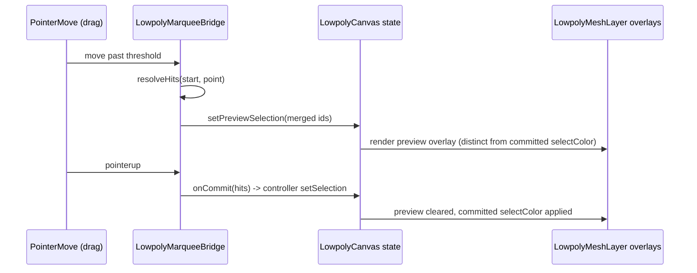

# Lowpoly Feature Completeness

## Root causes (confirmed by code inspection)

### 1. Paint mode shows nothing in 3D

Multiple compounding bugs in `[lowpoly/react/index.tsx](lowpoly/react/index.tsx)` and `[lowpoly/core/lib.rs](lowpoly/core/lib.rs)`:

- **Degenerate UVs.** Every primitive (`box_prim`, `ico_sphere_prim`, etc. in `[kernel/3d/mesh/lib.rs](kernel/3d/mesh/lib.rs)`) builds half-edges via `from_faces`, which hardcodes `uv: [0.0, 0.0]` on every corner. `default_fixture()` and `add_primitive()` in `[lowpoly/core/lib.rs](lowpoly/core/lib.rs)` never call `unwrap_uv()`. Result: the whole mesh samples one texel of the paint texture until the user manually presses "Unwrap".
- **Transparent-black base texture.** `empty_paint_pixels()` (`lowpoly/core/lib.rs:68`) initializes every layer as `RGBA(0,0,0,0)`. `composite_layers` skips near-zero-alpha pixels, so a fresh object's composite is fully transparent. That gets bound straight to `meshStandardMaterial.map` (`lowpoly/react/index.tsx:574-581`), and an all-zero-alpha `map` multiplies the mesh color to black — the object looks like it "shows nothing."
- **Only the active object gets textured.** `paintTexture={interactionMode === "paint" && object.active ? ... : null}` (`lowpoly/react/index.tsx:1134`) — every other object in the scene keeps flat `meshColor`, even in Paint mode.
- **Two independent WASM sessions.** `LowpolyPlaySurfaceHost` and `LowpolyUvSurfaceHost` (`framework/product/playground/renderer/react/index.tsx`) each call `createLowpolySession()` separately. Paint pixel buffers now live only in WASM memory (per the recent perf fix), not in fixture JSON, so the 3D viewport and the UV window hold two independently-mutated pixel buffers that only reconcile through VCS on stroke-end in the 3D host — painting in the UV window does not reliably show up in the 3D viewport and vice versa.

### 2. UV editor has no mapping helpers

`LowpolyUvCanvas.draw()` (`lowpoly/react/index.tsx:1186-1228`) only draws: solid background, the composited paint texture, and a per-triangle wireframe outline (rebuilt by looping `tess.indices`, which duplicates internal triangulation edges and has no seam awareness). Missing entirely:

- Checker/grid background so texel density and stretching are visible even before painting
- The 0–1 UV unit-square boundary
- Seam highlighting — `HalfedgeMesh` already tracks `uv_seams` (`kernel/3d/mesh/lib.rs:161`, `mark_uv_seam`/`is_uv_seam`) but this is never surfaced to the frontend at all

### 3. Hover/selection colors are broken, not just inconsistent

`LowpolyCanvas` resolves colors via `resolveSemanticColorHex("--accent-8")`, `("--dark-4")`, `("--primary-9")`, `("--primary-6")`, and the UV canvas uses `("--dark-6")` (`lowpoly/react/index.tsx:858-862, 901-905, 1209`). `resolveSemanticColorHex(cssVar, fallback)` does a literal `var(--accent-8)` lookup — **none of these custom properties exist anywhere in `[ui/styling](ui/styling)`**. They silently resolve to the fallback (`"gray"`, since no fallback key is passed), meaning mesh/edge/select/hover currently render as the same flat gray rather than visually distinct, and don't track theme changes the way the rest of the app does.

The rest of the app uses a consistent, real pair for interaction states:

- Selected: `--active-base` (resolves to `--color-primary`) — used by `ui/react`'s `Geometry`/`DiagramNode`, `draw/react`, and matches `SelectionMarquee`'s CSS (`stroke: var(--color-primary)` in `ui/styling/js/ui.css:1547-1558`), which lowpoly already renders for its marquee rectangle.
- Hovered: `--hover-base` (gray) — same `Geometry`/`DiagramNode` pattern, visually distinct from selection.
- Neutral surface/edge: `--panel` and `--border-normal-color` both exist and are used this way elsewhere (`ui/styling/js/ui.css:59,83`).

### 4. No live preview during marquee/box-select

`LowpolyMarqueeBridge.onPointerMove` (`lowpoly/react/index.tsx:808-819`) only updates the 2D `SelectionMarquee` overlay rect — it never calls `resolveHits` or exposes a pending-selection set. Hit-testing and `onCommit` happen exclusively in `onPointerUp` (`lowpoly/react/index.tsx:821-832`). `procedural/3d/react/index.tsx`'s `ProceduralPreviewMarqueeBridge` (~lines 1033-1058) is the reference pattern already used elsewhere in the codebase: on every `pointermove` past the drag threshold it re-runs the hit test, merges with the ids present at drag-start via `selectionMergeIds`, and pushes the result into local `livePreselect` state that renders with distinct chrome — separately from the final committed selection, which is still only written on `pointerup`.

## Fix plan

### A. Make Paint mode actually paint (3D + UV)

- `[kernel/3d/mesh/lib.rs](kernel/3d/mesh/lib.rs)`: no change to primitives themselves; instead ensure every newly-created mesh gets real UVs (see below).
- `[lowpoly/core/lib.rs](lowpoly/core/lib.rs)`:
  - `default_fixture()` and `add_primitive()`: call `mesh.unwrap_uv()` (best-effort, ignore errors like the existing `extrude_faces` call) right after construction, so every object always has a real 0-1 UV mapping before the user ever touches paint tools.
  - `empty_paint_pixels()`: initialize the base layer as opaque neutral (e.g. white `RGBA(255,255,255,255)`) instead of fully transparent, so a fresh object's composite is a paintable opaque canvas rather than all-zero-alpha.
- `[lowpoly/react/index.tsx](lowpoly/react/index.tsx)`: extend the `paintTexture` prop to every scene object while `interactionMode === "paint"`, not just `object.active`, so the whole scene reflects paint state.
- `[framework/product/playground/renderer/react/index.tsx](framework/product/playground/renderer/react/index.tsx)`: lift session creation so `LowpolyPlaySurfaceHost` (3D) and `LowpolyUvSurfaceHost` (UV window) share one `LowpolySessionWasm` instance instead of each calling `createLowpolySession()` independently — eliminates the two-independent-pixel-buffers desync between the 3D viewport and the UV window.

### B. Add UV mapping helpers

- `[kernel/3d/mesh/lib.rs](kernel/3d/mesh/lib.rs)`: extend `MeshTransfer`/`tessellate()` (the existing per-edge loop at `~line 1428-1441` that already builds `edge_positions`/`edge_ids`) to also emit `edge_uvs: Vec<f32>` (the two halfedge UVs for each edge's endpoints) and expose seam membership per edge id (either a parallel `edge_is_seam: Vec<u8>` or a small WASM getter returning the current seam edge id set, since `is_uv_seam`/`uv_seams` already exist).
- `[lowpoly/core/lib.rs](lowpoly/core/lib.rs)` / `[lowpoly/core/index.ts](lowpoly/core/index.ts)`: thread the new `edgeUvs`/seam data through `tessellate_transfer_json` and `LowpolyTessellation`.
- `[lowpoly/react/index.tsx](lowpoly/react/index.tsx)` `LowpolyUvCanvas.draw()`:
  - Draw a checker/grid background under the composite texture at a fixed texel density.
  - Draw the 0-1 UV unit-square border distinctly.
  - Replace the per-triangle-loop wireframe with a draw pass over `edgeIds`/`edgeUvs` (one line per topological edge, no duplicate internal edges), rendering seam edges in a distinct highlight color/dash versus normal edges.

### C. Fix hover/selection/edge colors to use real, consistent tokens

In `[lowpoly/react/index.tsx](lowpoly/react/index.tsx)` (the `useState`/`resolveSemanticColorHex` block around lines 858-862 and its `sync()` refresh around 901-905, plus the UV canvas stroke at line 1209):

- `meshColor`: `--accent-8` to `--panel`
- `edgeColor`: `--dark-4` to `--border-normal-color`
- `selectColor`: `--primary-9` to `--active-base` (now matches `SelectionMarquee`'s primary stroke and the `Geometry`/`DiagramNode`/`draw` convention)
- `hoverColor`: `--primary-6` to `--hover-base` (neutral, visually distinct from selection)
- UV wireframe stroke: `--dark-6` to `--border-normal-color`; seam highlight uses a new distinct token (`--accent-secondary`, already used for the equivalent "changed/hover" distinction elsewhere)

### D. Live preview during marquee drag

- `[lowpoly/react/index.tsx](lowpoly/react/index.tsx)` `LowpolyMarqueeBridge`: in `onPointerMove`, once past the drag threshold, call `resolveHits(start, point, crossing)` and merge with the ids captured at drag-start (`marqueeRef.current.initial`) via `selectionMergeIds`, then report the merged (add) and removed id sets through a new `onLivePreview` callback (mirroring `ProceduralPreviewMarqueeBridge`'s `onLivePreselect`).
- `LowpolyCanvas`: add local `previewSelection` state (ids being added / ids being removed) fed by `onLivePreview`, cleared on commit (`onCommit`) or drag cancel.
- `LowpolyMeshLayer` overlay builders (`buildFaceOverlayGeometry`/`buildEdgeOverlayGeometry`/`buildVertexOverlayGeometry` call sites): extend the "selected" id set fed into these with the live preview-add ids (rendered with `selectColor`, same as committed, for immediate feedback) and render preview-remove ids with `hoverColor` (or a lower-opacity variant) to signal they'll be deselected on release — matching the add/remove distinction procedural 3D already uses.
- Keep final selection commit unchanged (still only applied on `pointerup` via `onCommit`/`commitSelection`).

## Verification

- Rust: `cargo test` / `bun nx run lowpoly-core:test` for `unwrap_uv` auto-invocation, opaque base layer, and the new `edge_uvs`/seam transfer fields.
- TS: `bun nx run lowpoly-react:test`, `lowpoly-play:test` updated for the new tessellation fields and any new canvas props.
- Manual (`bun run dev:lowpoly`):
  - Enter Paint mode on the default object: mesh shows an opaque paintable surface (not black/invisible) in the 3D viewport; painting a stroke in the 3D view immediately shows in the UV window and vice versa.
  - UV window shows a checker/grid backdrop and real (non-collapsed) wireframe; marking a seam and re-opening highlights it distinctly.
  - Hover and selected states are visually distinct (gray vs primary) in Model and Paint modes, and match the marquee rectangle's primary color.
  - Dragging a marquee box over vertices/edges/faces/objects highlights the pending hits live, before mouse-up; releasing commits exactly what was previewed.
