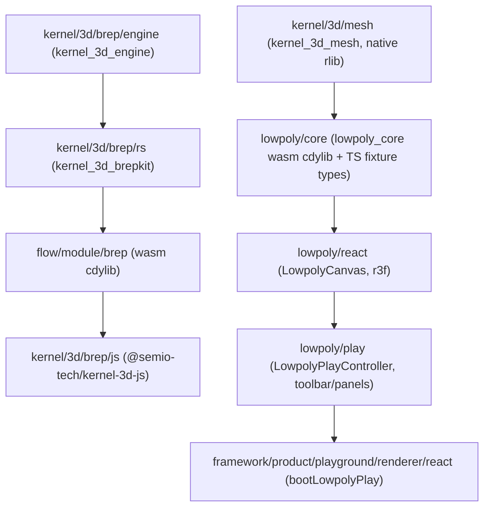

# Lowpoly Mesh Kernel Technology

## Architecture overview




This mirrors the existing brep/flow split: `kernel/3d/mesh` is a pure-Rust geometry crate (no wasm-bindgen), consumed as a Cargo path dependency by `lowpoly/core`, which is the wasm-bindgen cdylib (same pattern as `puzzle/3d/rs` and `sequence/core`). `lowpoly/react` loads `../core/pkg/lowpoly_core.js` directly (like puzzle/3d does with `puzzle_3d.js`), no separate JS bridge module needed.

## Phase 1 — Reorganize `kernel/3d` into `kernel/3d/brep`

Move (`git mv`-equivalent via file tools, since these must stay edits not deletions+creates where possible) the current subfolders into a `brep/` subdirectory:

- `kernel/3d/engine/*` → `kernel/3d/brep/engine/*`
- `kernel/3d/rs/*` → `kernel/3d/brep/rs/*`
- `kernel/3d/js/*` → `kernel/3d/brep/js/*`
- `kernel/3d/AGENTS.md` content moves to `kernel/3d/brep/AGENTS.md`; a new minimal `kernel/3d/AGENTS.md` is written describing both `Brep` and `Mesh` sub-technologies (same style as [framework/product/playground/AGENTS.md](framework/product/playground/AGENTS.md)).

Crate names (`kernel_3d_brepkit`, `kernel_3d_engine`) and package names (`@semio-tech/kernel-3d-js`) stay unchanged — only directory paths move — to avoid unnecessary churn in every consumer's import specifier, but all **relative path** references must be updated:

- [Cargo.toml](Cargo.toml) workspace members line 53: `"kernel/3d/engine", "kernel/3d/rs"` → `"kernel/3d/brep/engine", "kernel/3d/brep/rs"`.
- [flow/module/brep/Cargo.toml](flow/module/brep/Cargo.toml) path deps `../../../kernel/3d/rs` / `../../../kernel/3d/engine` → `../../../kernel/3d/brep/rs` / `../../../kernel/3d/brep/engine`.
- `kernel/3d/brep/rs/script.ts`, `kernel/3d/brep/engine/script.ts`, `kernel/3d/brep/js/script.ts`/`project.json` — update any `../../../` relative imports of `repo/lib/js` (depth increases by one level).
- [ui/styling/vite-elements-assets.ts](ui/styling/vite-elements-assets.ts) — update the `@semio-tech/kernel-3d-js` alias path.
- Root `package.json` workspaces glob (uses `*/**` broadly — verify no hardcoded `kernel/3d/*` entries need updates).
- Any other `kernel/3d/engine`, `kernel/3d/rs`, `kernel/3d/js` path references found via search (procedural/puzzle vitest configs, tsconfig paths) get updated to `kernel/3d/brep/...`.

## Phase 2 — `kernel/3d/mesh` geometry kernel (native Rust)

New crate `kernel_3d_mesh` at `kernel/3d/mesh/{Cargo.toml,lib.rs,project.json,script.ts}` (native `rlib` only, no wasm-bindgen — mirrors [kernel/3d/rs/Cargo.toml](kernel/3d/rs/Cargo.toml) / [kernel/3d/rs/script.ts](kernel/3d/rs/script.ts) pattern: `cargo test -p kernel_3d_mesh`).

Core data structure: an indexed half-edge mesh supporting n-gon faces:

```rust
pub struct HalfedgeMesh {
    vertices: Vec<MeshVertex>,   // position: Vec3, normal: Option<Vec3>
    halfedges: Vec<HalfEdge>,    // origin, twin, next, prev, face
    faces: Vec<MeshFace>,        // start halfedge, smooth: bool
}
pub struct VertexId(u32); pub struct HalfEdgeId(u32); pub struct FaceId(u32); pub struct EdgeId(u32);
```

Operations, one per requested tool, each with unit tests validating vertex/edge/face count invariants and geometry (extrude increases volume, triangulate yields only 3-loops, mirror doubles-then-welds, etc.):

- Primitives: `box_prim`, `plane_prim`, `cylinder_prim`, `cone_prim`, `ico_sphere_prim`.
- Transform: `translate`, `rotate`, `scale` (object-level), `move_vertices` / `move_vertices_proportional` (with falloff for Proportional Editing), `snap_vertices_to_grid`.
- Editing: `extrude_faces`, `inset_faces`, `bevel_edges`, `loop_cut`, `knife_cut` (face split by a polyline of points), `merge_vertices` (weld modes: center/first/by-distance), `dissolve_edges`, `dissolve_vertices`, `subdivide_faces`, `triangulate`, `mirror` (axis + weld threshold), `decimate` (greedy shortest-edge collapse to a target ratio).
- Shading/export: `set_shading` (flat/smooth per-face), `recompute_normals`, `tessellate` → a `MeshTransfer`-like struct (`positions`, `normals`, `indices`, `edge_positions` — normals/verts duplicated per-face when flat-shaded), `to_obj`.

All operations return `Result<_, MeshKernelError>` (`enum MeshKernelError { InvalidHandle, NonManifold, DegenerateOperation, ... }`), no panics on bad input.

## Phase 3 — `lowpoly/core`

Same dual-nature folder as [sequence/core](sequence/core) (TS package **and** Rust wasm crate share one directory):

- `lowpoly/core/index.ts` (`@semio-tech/lowpoly-core`): `LOWPOLY_FIXTURE_SCHEMA = "lowpoly.fixture/v1"`, `LowpolyObjectV1` (`id`, `name`, `transform`, `smoothShading`, `meshJson`), `LowpolyFixtureV1` (`objects`, `activeObjectId`, `selection: { mode: "object"|"vertex"|"edge"|"face"; ids: number[] }`), `DEFAULT_LOWPOLY_FIXTURE` (one cube), `lowpolyFixtureToJson` / `parseLowpolyFixtureJson`.
- `lowpoly/core/Cargo.toml` + `lib.rs`: crate `lowpoly_core`, `crate-type = ["rlib", "cdylib"]`, wasm-bindgen (mirrors [sequence/core/Cargo.toml](sequence/core/Cargo.toml)), depends on `kernel_3d_mesh = { path = "../../kernel/3d/mesh" }`. Exposes `#[wasm_bindgen] pub struct LowpolySession` holding a `LowpolyDocument` (`Vec` of mesh objects + active id + selection), with one method per tool from Phase 2 operating on the active object/selection, plus `fixtureJson()/loadFixtureJson()`, `addPrimitive(kind)`, `tessellateActive()` (typed arrays), `exportObjActive()`.
- `project.json`/`script.ts` with `wasm` (wasm-pack build → `pkg/lowpoly_core.js`, via the shared `runWasmPackWebBuild` helper from [repo/lib/js/index.ts](repo/lib/js/index.ts)) and `test` (vitest for TS + `cargo test -p lowpoly_core`) targets.
- Root [Cargo.toml](Cargo.toml) workspace members gains `"kernel/3d/mesh", "lowpoly/core"`.

## Phase 4 — `lowpoly/react`

Single-file bundle `lowpoly/react/index.tsx` (`@semio-tech/lowpoly-react`), following [procedural/3d/react/index.tsx](procedural/3d/react/index.tsx) for the viewport shell and [puzzle/3d/react/index.tsx](puzzle/3d/react/index.tsx) for direct wasm consumption:

- Load `../core/pkg/lowpoly_core.js` directly (no separate bridge package).
- `LowpolyCanvas` composes `WorldCanvas` → `WorldLodBridge` → `WorldOrbitCameraViewRig`/`WorldOrbitGated`/`WorldOrbitViewControls` from `@semio-tech/infinite-world-r3f`, plus a `WorldLayer` rendering the active object's tessellated buffers as a `THREE.BufferGeometry` (position/normal/index from `tessellateActive()`, mirroring `buildMeshBuffers` in procedural/3d/react) with overlay `Points` (vertices) and `LineSegments` (edges) shown per selection mode.
- Sub-object picking: raycast against the position/index buffers directly (three.js raycaster against the mesh for faces, against `Points`/`LineSegments` with a pixel threshold for vertex/edge picking) — implemented locally in lowpoly/react; no changes to `infinite-world-r3f` itself.
- Gumball: `UnifiedGumball` from `@semio-tech/ui-react` targeting a proxy `Object3D` at the selection centroid; `onDrag`/`onDragEnd` call back through props (`onMoveSelection`, `onRotateSelection`, `onScaleSelection`) — mirrors the `ProceduralPreviewGumball` → `ProceduralGumballTransformRequest` pattern.
- Marquee selection reusing `SelectionMarquee` from `ui/react`, screen-projecting vertex/edge/face centroids like `ProceduralPreviewMarqueeBridge`.

## Phase 5 — `lowpoly/play`

Single-file `lowpoly/play/index.ts` (`@semio-tech/lowpoly-play`), directly modeled on [sequence/play/index.ts](sequence/play/index.ts):

- IDs/consts: `LOWPOLY_PLAY_APP_ID`, `_CONTROLLER_ID`, `_WINDOW_KIND_ID = "lowpoly-main"`, `_SURFACE_ID`, `_HIERARCHY_TAB_ID`, `_CATALOGUE_TAB_ID`, `_INSPECTION_TAB_ID`, `LOWPOLY_PLAY_DEFAULT_FIXTURE_JSON`.
- `buildLowpolyPlayToolbarTools`: tool groups for Selection mode (Object/Vertex/Edge/Face), Transform (Move/Rotate/Scale), Edit (Extrude, Inset, Bevel, Loop Cut, Knife, Merge, Dissolve, Subdivide, Triangulate, Mirror, Decimate), and toggles (Snap, Proportional Editing, Smooth Shading) — each a `ToolLeaf` dispatching a `LowpolyPlayController` command.
- `buildLowpolyPlayHierarchyTree` (object list + click-to-select), `buildLowpolyPlayCatalogueTree` (primitives: Cube/Plane/Cylinder/Cone/IcoSphere, click/drag-to-add), `buildLowpolyPlayInspectorTree` (active tool's numeric params: extrude distance, inset amount, bevel amount/segments, loop-cut count, mirror axis, decimate ratio, snap grid size, proportional radius; plus transform fields for the active object/selection).
- `LowpolyPlayController extends Controller`: owns a `LowpolySession` wasm instance (or fixture JSON if state stays fully in TS and only tessellation goes through wasm — decide based on Phase 3 API; state ownership lives in the Rust `LowpolySession` since geometry operations are non-trivial, TS just holds `fixtureJson` synced from `session.fixtureJson()` after each command, matching how `SequencePlayController` treats `fixtureJson` as the single source of truth), `run(command, args)` dispatches to session methods and calls `commitFixture`.
- One window kind `lowpoly-main` with a canvas-only declarative body (`buildLowpolyWindowBody`-equivalent) rendering `LowpolyCanvas`.
- `PlaygroundLowpoly extends Playground`, `registerLowpolyPlayDeclarativeBodies`.
- Default fixture: a single low-poly rock made from an ico-sphere with a couple of extrudes (hand-authored via the session API in a small script, or literal mesh JSON), used as `DEFAULT_LOWPOLY_FIXTURE`.

## Phase 6 — Wire into shared shell and tooling

- [framework/product/playground/renderer/react/index.tsx](framework/product/playground/renderer/react/index.tsx): new `//#region 🔖LowpolyPlayHost` block (copy of `SequencePlayHost` region, ~220 lines) with `LowpolyPlaySurfaceHost`, panel definitions, `registerLowpolyPlaySurfaceHosts`, `bootLowpolyPlay`.
- [framework/product/playground/renderer/react/package.json](framework/product/playground/renderer/react/package.json): add `"./lowpoly": "./index.tsx"` export and `@semio-tech/lowpoly-core|react|play` deps.
- [ui/styling/vite-elements-assets.ts](ui/styling/vite-elements-assets.ts): add `"lowpoly"` to `PlaygroundRendererPuzzleKind`, alias `@semio-tech/framework-playground-renderer-react/lowpoly`, region markers, and resolve aliases for `@semio-tech/lowpoly-play|react|core` (+ `pkg/lowpoly_core.js`).
- Root [package.json](package.json): workspaces `"lowpoly/core"`, `"lowpoly/react"`, `"lowpoly/play"`; script `"dev:lowpoly": "bun ./script.ts dev lowpoly"`.
- [script.ts](script.ts) dev router: `if (segments[0] === "lowpoly") { runCmd(...,"@semio-tech/lowpoly-play:dev",...) }`.
- [.vscode/launch.json](.vscode/launch.json): new `"🛠️dev📜lowpoly"` entry, `LOWPOLY_PLAY_PORT: "6078"`, inserted in the existing alphabetical/grouped ordering.
- `bun install` to regenerate `bun.lock` after adding the new workspace packages.
- New top-level `lowpoly/AGENTS.md` technology doc (short, matching the style of [puzzle/AGENTS.md](puzzle/AGENTS.md) / `procedural/AGENTS.md`).

## Phase 7 — Verify

- `cargo test -p kernel_3d_mesh` and `-p lowpoly_core`.
- `bun nx run @semio-tech/lowpoly-core:wasm` builds the wasm package.
- `bun nx run @semio-tech/lowpoly-play:test` / relevant vitest suites for core/react/play.
- Manually boot `bun run dev:lowpoly` and confirm the playground loads with a visible low-poly object, toolbar, hierarchy/catalogue/inspector panels.

## Notes / scope boundaries

- Full tool coverage from the feature list is implemented in the kernel (Phase 2); UI polish (custom cursors/icons per tool, Playwright e2e) is out of scope for this pass.
- No changes to `@semio-tech/infinite-world-r3f` itself — sub-object (vertex/edge/face) picking is implemented locally in `lowpoly/react` to avoid leaking mesh-editing concerns into the shared world-canvas library.
- Rig/Bones and UV/texel-density workflows from the concept list are modeled as data fields (`smoothShading`, per-face material slot placeholder) but authoring tools for UVs/bones are deferred — flagged explicitly as a follow-up rather than half-implemented.

