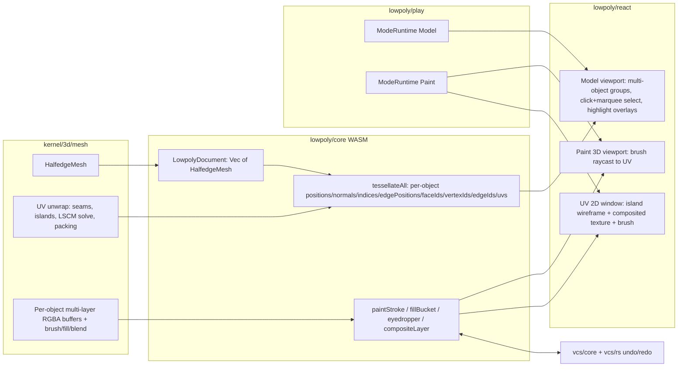

# Lowpoly Model/Paint Overhaul

## Root causes confirmed

- **Camera dead**: in [lowpoly/react/index.tsx](lowpoly/react/index.tsx) `WorldOrbitGated` receives `controlsGate={!gumballPointerConsumesCanvasEventRef.current}`. `WorldOrbitGated` disables controls when the gate is `true` (`enabled={!gate && !snapGate}` in [infinite/world/r3f/index.tsx](infinite/world/r3f/index.tsx)); the ref defaults to `false`, so the gate is always `true` and OrbitControls are permanently off. The component already tracks a reactive `gumballDragActive` state that is never used for this.
- **Selection is a stub**: face-click uses the draw-call `event.faceIndex` (not a topological `FaceId`), vertex-click uses tessellated point index (not `VertexId`), edge-click has no handler at all, `selectedIds` is never rendered as a highlight, and `marquee`/`setMarquee` in the same file is fully dead code (never invoked, never wired to pointer events).
- **Single-object viewport**: `LowpolySession.tessellateActive()` in [lowpoly/core/lib.rs](lowpoly/core/lib.rs) only tessellates the _active_ object; `LowpolyDocument` (same file) already stores `Vec<HalfedgeMesh>` for every object, but only one is ever shown/selectable — adding a primitive from the catalogue swaps what's visible instead of adding to the scene.
- **No Model/Paint modes**: `lowpoly/play/index.ts` defines a single `ModeRuntime("main", "Edit", ...)`. The existing repo pattern for switchable modes with different toolbars/layouts is `flow`/`procedural`'s `mainMode` + `generateMode`, registered via `createPlayAppRuntime(..., controller.mainMode)` + `app.addMode(controller.generateMode)`; the platform shell auto-renders a mode-switch button group in the navbar once `app.modes.length > 1`.
- **No UV/paint infrastructure exists anywhere in the repo** (confirmed by full-repo search) — this is new from-scratch work, closest conceptual reference is `raster/`'s layer/blend-mode/VCS architecture and the generic `vcs/core` + `vcs/rs` engine already reused by ~15 other technologies (writer, forms, flow, cad, draw, procedural, puzzle, shooting, gis, presentation, s, mindmap, trinity, raster).

Per your answers: Paint = real UV texture painting, unwrap = advanced seam-based (LSCM-style), paint toolset = full raster-style layers + VCS undo, Model mode = true multi-object scene.

All work stays inside the existing files (`kernel/3d/mesh/lib.rs`, `lowpoly/core/lib.rs`, `lowpoly/core/index.ts`, `lowpoly/react/index.tsx`, `lowpoly/play/index.ts`, `framework/product/playground/renderer/react/index.tsx`) using new `#region`s, per repo convention — no new files/packages.

## Architecture overview

## Phase 1 — Camera fix (small, do first)

In [lowpoly/react/index.tsx](lowpoly/react/index.tsx) `LowpolyCanvas`:

- Replace `controlsGate={!gumballPointerConsumesCanvasEventRef.current}` with `controlsGate={gumballDragActive}` (the state already exists and is already fed by `LowpolyGumballLayer.onDraggingChanged`).
- Add `onCameraChange={(next) => setCameraState(next)}` to `WorldOrbitViewControls` so the view-axis gizmo snaps stay in sync with React camera state (matches `procedural/3d/react`'s pattern).
- No other camera changes needed — default mouse bindings (middle-drag pan, wheel zoom, alt+right-drag orbit; left button reserved for selection) match the rest of the repo's `WorldOrbitGated` convention and require no code change, just needs to actually be enabled.

## Phase 2 — Multi-object scene + object-level selection

**Kernel (no changes needed)** — `LowpolyDocument.meshes: Vec<HalfedgeMesh>` already holds every object.

`**lowpoly/core/lib.rs**`:

- Add `#[wasm_bindgen(js_name = tessellateAll)] pub fn tessellate_all(&self) -> Result<String, JsValue>` returning a JSON array, one entry per object: `{ id, name, transform, smoothShading, active: bool, tessellation: {...} }` (reuses the per-object `LowpolyTransform` already stored on `LowpolyObject`).
- Keep `tessellateActive` for backward use inside edit-tool flows if convenient, but the canvas will primarily consume `tessellateAll`.

`**lowpoly/react/index.tsx**`:

- Replace the single `tessellation` prop with an array of per-object tessellations; render one `<group position rotation scale>` (from each object's transform) containing its own `LowpolyMeshLayer`, so every object is visible simultaneously — mirrors how `procedural/3d/react` renders multiple scene items as separate `WorldLayer`s.
- Object-mode click selects/multi-selects **objects** (click = replace selection + set active object; shift-click = add; ctrl-click = remove; ctrl+shift = toggle), using `marqueeModeFromModifiers`/`selectionMergeIds` from `@semio-tech/ui-react` (already used by `procedural/3d/react`).
- Vertex/edge/face modes continue to operate on the single **active object** only (standard DCC convention: object mode = multi-select across the scene, component modes = edit one object at a time) — clicking a component on a non-active object while in a component mode makes that object active first.
- Gumball centroid becomes either the multi-object selection centroid (object mode) or the active object's component-selection centroid (component modes).

## Phase 3 — Topological ID-mapped selection + highlighting

`**kernel/3d/mesh/lib.rs**` — extend `MeshTransfer` (and `tessellate()`) to also emit, aligned with the existing buffers:

- `face_ids: Vec<u32>` — one entry per **output triangle**, mapping to `FaceId.0` (a source face can span multiple triangles after fan/ear-clip triangulation).
- `vertex_ids: Vec<u32>` — one entry per **emitted position**, mapping to `VertexId.0` (positions are duplicated per face-corner for flat shading).
- `edge_ids: Vec<u32>` — one entry per **edge segment pair** in `edge_positions`, mapping to `EdgeId.0`.
- Update `active_mesh_tessellates` test to assert the new arrays are non-empty and length-consistent with their sibling buffers.

`**lowpoly/core/lib.rs**`: thread the three new arrays through `tessellate_active`/`tessellate_all` JSON payloads.

`**lowpoly/react/index.tsx**`:

- Face click: `faceIds[event.faceIndex]` → topological id (fixes wrong-face bevel/extrude bugs from before).
- Vertex click: `points` raycast `index` → `vertexIds[index]`.
- Edge click: raise `raycaster.params.Line.threshold` (small helper component using `useThree`) so `lineSegments` click raycasts reliably; intersection index → `edgeIds[segmentIndex]`.
- Selection highlighting: build small overlay geometries filtered to `selectedIds` — a translucent overlay mesh for selected faces, a distinct point color/size for selected vertices, a distinct line color for selected edges, and an outline/tint for selected/active objects.
- Modifier-key merge (`marqueeModeFromModifiers`/`selectionMergeIds`) applied uniformly to every click handler, not just object mode.

## Phase 4 — Marquee/box selection

`**lowpoly/react/index.tsx**`: implement a `LowpolyMarqueeBridge` modeled directly on `ProceduralPreviewMarqueeBridge` ([procedural/3d/react/index.tsx](procedural/3d/react/index.tsx) lines ~961-1088):

- Capture `pointerdown` on `gl.domElement`, `pointermove`/`pointerup` on `window`; 4px activation threshold; drag-direction determines full-containment vs crossing coverage.
- Screen-space hit test per current selection mode: object → world AABB corners; face → triangle centroid; edge → midpoint; vertex → position — all projected via `camera.project()`.
- Wire the already-declared (but currently dead) `marquee`/`setMarquee` state and the existing `<SelectionMarquee>` render branch to real coverage + rect data instead of the hardcoded zero rect.
- Respect `gumballPointerConsumesCanvasEventRef`/`gumballDragActive` to avoid marquee starting during a gumball drag (same guard procedural uses).

## Phase 5 — Model/Paint ModeRuntime split

`**lowpoly/play/index.ts**`:

- Rename `mainMode` label from `"Edit"` to `"Model"` (keep id `"main"`).
- Add `readonly paintMode = new ModeRuntime("paint", "Paint", undefined);`
- Add `rebuildPaintMode()` alongside the existing `rebuildShellMode()`, assigning `paintMode.tools` (brush/eraser/fill/eyedropper toggles + unwrap/seam buttons, built in Phase 9) and `paintMode.windowKinds` (two window kinds: the existing `LOWPOLY_PLAY_WINDOW_KIND_ID` reused in a "paint" viewport variant, plus a new `LOWPOLY_PLAY_UV_WINDOW_KIND_ID`).
- Set `paintMode.defaultLayout = createDefaultLayout([LOWPOLY_PLAY_WINDOW_KIND_ID, LOWPOLY_PLAY_UV_WINDOW_KIND_ID], "row", [60, 40], ["Paint", "UV"])`, following `sequence/play`'s two-window layout pattern.
- In `buildLowpolyPlayAppRuntime`: `const app = createPlayAppRuntime(..., controller.mainMode); app.addMode(controller.paintMode); return app;` (exact `flow/play` pattern) — the navbar mode-switch buttons appear automatically once `app.modes.length > 1`.
- Add a new body builder + `LOWPOLY_PLAY_UV_SURFACE_ID`, registered the same way `SEQUENCE_PLAY_SCRIPT_SURFACE_ID` is registered for the second sequence window.

`**framework/product/playground/renderer/react/index.tsx**`:

- Register a new surface host for `LOWPOLY_PLAY_UV_SURFACE_ID` (new `LowpolyUvSurfaceHost`, added as a new region near the existing `LowpolyPlaySurfaceHost`) rendering the new UV canvas component from `lowpoly/react`.
- Existing `LowpolyPlaySurfaceHost` gains an `isPaintMode` flag (from window kind/mode context) to switch the 3D viewport between edit tools (Model) and brush cursor/raycast (Paint).

## Phase 6 — UV data model + seam-based unwrap

`**kernel/3d/mesh/lib.rs**`:

- Add per-face-corner UV storage: extend `HalfEdge { vertex, twin, next, face, uv: [f32; 2] }` (a halfedge already represents exactly one face corner, so this is the correct place for seam-aware UVs — a vertex on a seam legitimately has different UVs on either side).
- Add `is_uv_seam: bool` to the edge-adjacent halfedge pair (or a parallel `HashSet<EdgeId>` on `HalfedgeMesh`), plus `mark_uv_seam(edges: &[EdgeId], seam: bool)`.
- Implement `unwrap_uv(&mut self) -> MeshResult<()>`:
  1. **Island detection** — flood-fill faces via non-seam shared edges to find connected UV islands.
  2. **LSCM solve per island** — assemble the least-squares conformal mapping linear system (real/imaginary energy terms per triangle), pin two vertices per island to remove the rotation/translation degeneracy, solve via hand-rolled Conjugate Gradient on the normal equations (keeps the "no external dependency without an interface" rule — no external sparse-linalg crate).
  3. **Normalize** each island's UVs into its own 0-1 bounding box.
  4. **Pack** islands into a shared 0-1 UV atlas via simple shelf/row packing sorted by island height.
- Extend `tessellate()`/`MeshTransfer` with a `uvs: Vec<f32>` buffer (2 per emitted position), sourced from the owning halfedge's `uv`.
- Extend `to_obj()` to emit `vt` lines and `f v/vt/vn` faces when UVs are present.
- Unit tests: unwrap of a box/ico-sphere fixture with at least one seam produces finite UVs bounded in [0,1], island count matches expected seam cuts, `tessellate()` UV buffer length matches position buffer length.

`**lowpoly/core/lib.rs**`: expose `markUvSeam(edgeIds, seam)` and `unwrapActive()` WASM methods; thread `uvs` through `tessellate_active`/`tessellate_all`.

## Phase 7 — Layered texture-painting engine

`**lowpoly/core/lib.rs**` (mirrors `raster/`'s layer/blend-mode concepts, kept as independent lowpoly code per the "don't mix technologies" rule):

- Add `PaintLayer { name, visible, opacity, blend_mode, pixels: Vec<u8> }` and `Vec<PaintLayer>` per `LowpolyObject`, fixed resolution (e.g. 1024x1024 RGBA8).
- `composite_layers(object_id) -> Vec<u8>` — top-to-bottom compositing respecting visibility/opacity/blend mode.
- `paint_stroke(object_id, layer_index, u, v, radius, color, hardness, opacity, tool)` — circular brush stamp with hardness falloff; `tool` selects Brush (paint color) vs Eraser (reduce alpha).
- `fill_bucket(object_id, layer_index, u, v, color)` — flood-fill contiguous same-color/alpha region in UV pixel space.
- `sample_pixel(object_id, u, v) -> [u8;4]` — eyedropper read from the composited buffer.
- Expose `addPaintLayer`, `removePaintLayer`, `reorderPaintLayer`, `setLayerVisible`, `setLayerOpacity`, `setLayerBlendMode` for the Layers panel.

## Phase 8 — VCS-backed undo/redo for paint

- Adopt the shared `vcs/core` + `vcs/rs` engine (already the generic undo/redo backbone for `raster`, `writer`, `forms`, `flow`, `cad`, `draw`, `s`, and others — this is core infra, not a "technology" to avoid mixing).
- Define a reversible paint operation (before/after layer snapshot or dirty-rect diff) following the same `DocumentVcsEnvelope`/backwards-operation pattern `raster/core/index.ts` uses (`backwardsRasterEditOp`), scoped per-object per-layer.
- Wire Undo/Redo toolbar buttons in Paint mode to the VCS store, and commit a VCS entry at stroke/fill end (not per brush-stamp frame).

## Phase 9 — Paint mode UI

`**lowpoly/react/index.tsx**`:

- **Paint 3D viewport**: reuse `LowpolyCanvas`'s multi-object rendering, but in paint mode the active object's mesh gets `map={paintTexture}` (a `THREE.DataTexture` built from `composite_layers()`, `needsUpdate = true` after each stroke) on its `meshStandardMaterial`; pointer drag raycasts onto the mesh, barycentric-interpolates the hit triangle's per-corner UVs (from the `uvs` tessellation buffer) to get `(u, v)`, and calls `paintStroke`/`fillBucket`/`samplePixel` depending on the active brush tool. A brush-radius cursor ring renders at the raycast hit point.
- **New UV 2D window** (new component + region in the same file, e.g. `LowpolyUvCanvas`): a plain 2D canvas (no orbit/r3f needed) that renders the UV island wireframe (from per-corner UVs) over the composited texture image, supports simple pan/zoom, and lets the same brush tools paint directly by using cursor position as `(u, v)` — both viewports write to the same WASM texture buffer so strokes in either window are reflected in both.
- Brush size/opacity/color/hardness live in the Inspector panel via the existing numeric/color `toolParams` field pattern already used for bevel/loop-cut/etc in `buildLowpolyPlayInspectorTree`.

`**lowpoly/play/index.ts**`:

- Paint toolbar (`buildLowpolyPlayPaintToolbarTools`): Brush / Eraser / Fill / Eyedropper toggles, "Unwrap Active Object", "Mark Seam" / "Clear Seam" (enabled when in edge-select with a selection), Undo/Redo.
- New Layers panel tree builder (`buildLowpolyPlayLayersTree`) listing paint layers with visibility/opacity/reorder/add/remove, following the existing panel-builder pattern used for Document/Catalogue/Inspector.

## Phase 10 — Tests and verification

- Rust: unwrap correctness (finite/bounded UVs, island count), tessellate() buffer-length invariants for `faceIds`/`vertexIds`/`edgeIds`/`uvs`, paint stroke/fill/composite pixel correctness, VCS undo/redo round-trip.
- Vitest: marquee screen-rect math, `tessellationFromWasm`/`parseLowpolyTessellationJson` updated for new buffers, mode-runtime tests (`paintMode.tools`/`windowKinds` populated, `app.modes.length === 2`).
- Manual verification via browser automation: boot `dev:lowpoly`; confirm middle-drag pan / wheel zoom / alt-right orbit now work; confirm click + shift/ctrl-click + marquee selection and highlighting across vertex/edge/face/object modes on a multi-object scene; switch to Paint mode; confirm UV window shows an unwrap after marking a seam and unwrapping; paint a stroke in the 3D viewport and confirm it appears in the UV window (and vice versa); confirm undo removes the stroke.

## Execution note

Per repo workflow, implementation will start by checking for an existing open ticket covering the lowpoly playground (reopening it if found, per `ticket_reopen`) rather than opening a new one, since this continues the same feature area.
