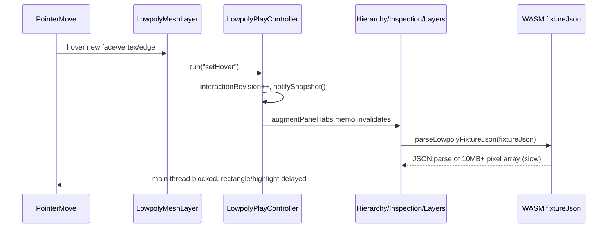

# Lowpoly Performance Fix

## Root causes (confirmed by code inspection)

1. **Paint pixel arrays ride on the general fixture JSON.** `LowpolyPaintLayer.pixels: Vec<u8>` (`lowpoly/core/lib.rs:48-54`) stores a full 1024×1024×4 = 4,194,304-byte RGBA buffer *per layer, per object*, embedded inside `LowpolyObject`/`LowpolyFixture`. `serde_json` serializes `Vec<u8>` as a comma-separated JSON number array (not base64), producing 10+ MB of text per layer. This is the *same* JSON returned by `fixtureJson()` / consumed by `loadFixtureJson()` and mirrored on the TS side by `lowpolyFixtureToJson`/`parseLowpolyFixtureJson` (`lowpoly/core/index.ts:62-68,104-116`) — the payload used for **every** selection/hover/mesh-op sync, not just painting.
2. **Side panels re-parse that giant JSON on every `interactionRevision` bump.** `LowpolyPlayInner.augmentPanelTabs` is memoized on `interactionRevision` (`framework/product/playground/renderer/react/index.tsx:7868-7878`), and the Hierarchy/Inspection/Layers `CallbackTreePanelDefinition`s each independently call `parseLowpolyFixtureJson(ctrl.getFixtureJson())` (`framework/product/playground/renderer/react/index.tsx:7799,7842,7859`) whenever they rebuild — a full `JSON.parse` of the multi-megabyte pixel-laden string, up to 3× per bump.
3. **Hover fires that same bump continuously.** `setHover` (`lowpoly/play/index.ts:719-731`) increments `interactionRevision` and calls `notifySnapshot()`/`emit()` every time the hovered id changes — which happens on essentially every pointer-move pixel while the mouse crosses mesh vertices/edges/faces. Critically, `pickEnabled` on `LowpolyMeshLayer` is gated only by `gumballDragActive`, **not** by an in-flight marquee drag (`lowpoly/react/index.tsx:1078`), so starting a marquee drag over the mesh keeps firing hover events (and the panel-reparse storm) throughout the drag.
4. **The marquee bridge wastes a synchronous hit-test on every move.** `LowpolyMarqueeBridge.onPointerMove` calls `void resolveHits(start, point, crossing)` (`lowpoly/react/index.tsx:784`) and discards the result — it's never used (only the `pointerup` call's result feeds `onCommit`). This is a full O(all vertices/faces/edges of all objects) loop with per-element `THREE.Vector3`/matrix/projection allocation, run synchronously in the same tick that just set the `marquee` overlay state, delaying the browser's paint of the rectangle.
5. **Redundant full-document reload after every mesh op.** After a mesh command, `syncLowpolyControllerFromSession` reads `session.fixtureJson()` and pushes it back through `ctrl.run("setFixtureJson", ...)`; `LowpolyCanvas`'s effect (`lowpoly/react/index.tsx:866-870`) then sees `props.fixtureJson` changed and calls `safeLoadLowpolyFixture(session, json)` → `session.loadFixtureJson(json)` → `LowpolyDocument::new(fixture)`, fully rebuilding the *same* session's document from data it just emitted.

## Fix plan

### 1. Stop paint pixel bytes from riding the general fixture JSON (primary fix)

- `[lowpoly/core/lib.rs](lowpoly/core/lib.rs)`: keep `LowpolyPaintLayer` metadata (`name`, `visible`, `opacity`, `blend_mode`) serializable, but move the `pixels: Vec<u8>` buffers out of the serialized `LowpolyFixture`/`LowpolyObject` graph (`#[serde(skip)]` plus a side table in `LowpolyDocument` keyed by object id + layer index, or a parallel non-serialized struct). `fixture_json()`/`load_fixture_json()` become cheap (small JSON) for every sync path.
- On `load_fixture_json`, since pixels no longer travel through JSON, merge/preserve existing in-memory pixel buffers for objects that persist across the reload (match by object id) instead of re-zeroing them, so painted textures survive mesh ops, selection syncs, and undo.
- `[lowpoly/core/index.ts](lowpoly/core/index.ts)`: drop `pixels` from the `LowpolyPaintLayer` TS type (metadata only); `compositePaintTexture`/`samplePixel` remain the only way to fetch actual pixel bytes (already used by the Paint viewport/UV canvas). No consumer other than these needs raw pixels today (`buildLowpolyPlayLayersTree` only reads name/visible/opacity).
- Update Rust/TS tests that assumed `pixels` was part of the parsed fixture; add a test asserting `fixture_json()` stays small/pixel-free and that painted pixels survive a `load_fixture_json(self.fixture_json())` round trip.
- This also fixes the (separate) per-brush-stamp cost in `applyPaintAt`/`onPaintStrokeBegin`/`onPaintStrokeEnd`, which currently call `session.fixtureJson()`/`parseLowpolyFixtureJson()` on every paint stroke sample.

### 2. Decouple hover updates from panel-rebuild triggers

- `[lowpoly/play/index.ts](lowpoly/play/index.ts)`: give hover its own revision/listener channel (e.g. `hoverRevision` + `hoverListeners`) so `setHover` no longer bumps `interactionRevision`/`notifySnapshot()` (which drives `augmentPanelTabs` and the Hierarchy/Inspection/Layers tree rebuilds).
- `[framework/product/playground/renderer/react/index.tsx](framework/product/playground/renderer/react/index.tsx)`: have `LowpolyPlaySurfaceHost` subscribe directly to the new hover-only channel (small `useSyncExternalStore`) so the 3D canvas still updates its hover highlight immediately, without touching the side panels.

### 3. Fix the marquee bridge's wasted hit-test and hover interference

- `[lowpoly/react/index.tsx](lowpoly/react/index.tsx)` `LowpolyMarqueeBridge.onPointerMove` (~line 772-785): remove the discarded `void resolveHits(...)` call; `resolveHits` should only run once, on `pointerup`, where its result is actually consumed.
- Gate `pickEnabled` on `LowpolyMeshLayer` by "marquee in-flight" as well as `gumballDragActive` (the existing `marquee` state already signals this) so hover/click handling doesn't fire while dragging a box.

### 4. Remove the redundant session reload round-trip

- `[lowpoly/react/index.tsx](lowpoly/react/index.tsx)` `LowpolyCanvas`'s fixture-sync effect (~line 866-870): track the last JSON this session itself produced (ref) and skip `safeLoadLowpolyFixture`/document reconstruction when `props.fixtureJson` is that same string, avoiding a full rebuild of the WASM document on every mesh op merely to reload data it already has.

### 5. Secondary: shrink vertex-mode picking geometry

- `[lowpoly/react/index.tsx](lowpoly/react/index.tsx)` `LowpolyMeshLayer`'s vertex `points` cloud renders one point per tessellated corner (duplicated per adjacent face) instead of per unique vertex id, inflating raycast/hover cost in vertex-selection mode. Dedupe to unique vertex ids (mirroring `buildVertexOverlayGeometry`).

## Verification

- Rust: `cargo test` for `lowpoly_core` — new assertions that `fixture_json()` excludes pixel payloads and that painted pixels survive a fixture round-trip; existing paint/tessellation tests still pass.
- TS: `bun nx run lowpoly-core:test`, `lowpoly-react:test`, `lowpoly-play:test` updated for the trimmed `LowpolyPaintLayer` type.
- Manual browser check: marquee rectangle appears instantly while dragging over a mesh; hovering/selecting vertices, edges, and faces is smooth with no multi-second stalls; switching Model/Paint modes and selection-mode toolbar buttons is instant; painted strokes still persist correctly through mesh ops, undo/redo, and mode switches.

